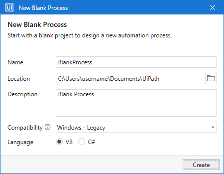
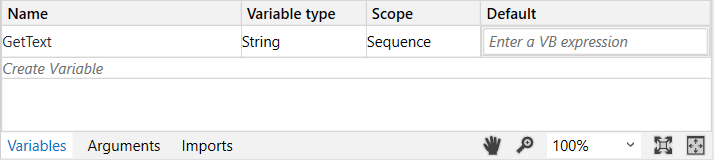
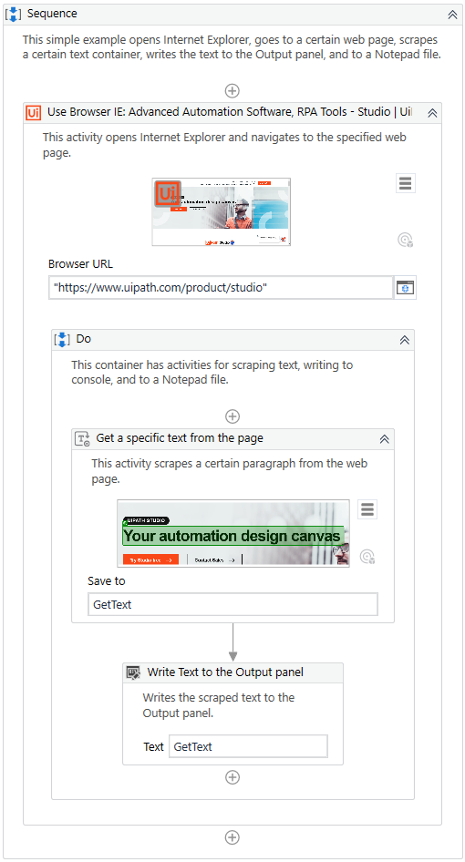
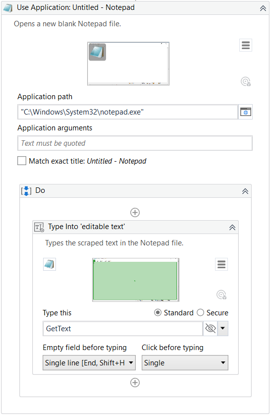

Lab 1: Creating a Basic Process
===============================

This tutorial teaches you how to create a basic process in Studio in 10
minutes and run it on your machine. The example opens a browser, loads a
certain web page, scrapes information, and writes it to the
**Output** panel, and in a Notepad file.

Let’s begin.

1.  Launch Studio. In the HOME Backstage view, click **Process** to
    create a new project. The **New Blank Process** window is displayed.

2.  In the New Blank Process window:
    -   Enter a name for the new project and a description that
        summaries what you are aiming to do with this automation
        project.\
         **Note:** The project name cannot exceed 128 characters, and
        the description cannot exceed 500 characters.
    -   Select the location where to create the project.
    -   Select **Windows - Legacy** for the **Compatibility** option and
        **VB** for **Language**.

3.  Click **Create**. The new project is opened in Studio.
4.  Open Internet Explorer and navigate to
    [https://www.uipath.com/product/studio](https://www.uipath.com/product/studio).
    You can use any supported browser, but make sure the required
    [UiPath
    extension](https://docs.uipath.com/installation-and-upgrade/docs/studio-extensions)
    is installed.
5.  In the **Activities** panel, search for [**Use Application/Browser**](https://docs.uipath.com/activities/docs/n-application-card)
    and drag it to the **Designer** panel. Notice that the activity is
    automatically added inside a **Sequence**.
6.  In Use Application/Browser, click **Indicate application to automate**, and then move the mouse pointer to the browser page you
    just opened. When the window is highlighted, click anywhere in the
    browser page.\
     The Use Application/Browser activity is updated, the URL is added
    to the **Browser URL** field, and a screenshot of the window appears
    inside the activity.
7.  From the **Activities** panel, add a [**Get Text**](https://docs.uipath.com/activities/docs/n-get-text) activity
    to the **Do** container of the **Use Application/Browser** activity.
    Click **Indicate in IE**, and click on the text that you want to
    scrape from the previously loaded web page.
8.  In the [**Variables**](https://docs.uipath.com/studio/docs/managing-variables)
    panel, create a new
    string variable called
    GetText, and set its scope to
    Sequence. The purpose of this variable is to store the scraped
    information.

9.  In the **Get Text** activity, insert the 
    GetText variable in the **Save to** field.
10. From the **Activities** panel, drag a [**Write Line**] activity. In
    the input text field, add the previously created variable. This
    activity writes the scraped data to the **Output** panel.

11. Add another **Use Application/Browser** activity to the project.
    Open a Notepad instance, click **Indicate application to automate**,
    and then move the mouse pointer to the Notepad window you just
    opened. When the window is highlighted, click anywhere inside it.\
     The Use Application/Browser activity is updated, the path is added
    to the **Application path** field, and a screenshot of the window
    appears inside the activity.
12. Add a [**Type Into**] activity in
    the **Use Application/Browser** activity’s **Do** container. Click
    **Indicate in App** to select the Notepad window, and add the
    GetText variable to the **Type this** field. This activity writes
    the scraped text to a Notepad window.

13. In the ribbon, click **Run File** or use the **Ctrl + F6** shortcut
    to execute the project.

When the execution is completed, notice that the scraped text is written
to the [**Output**] panel, and in the Notepad file.
