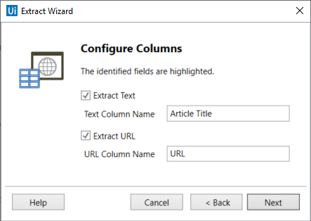
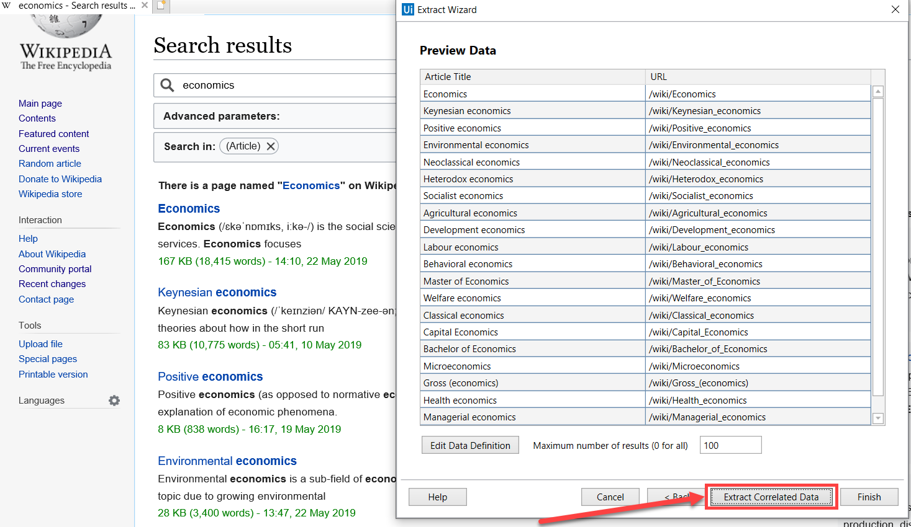
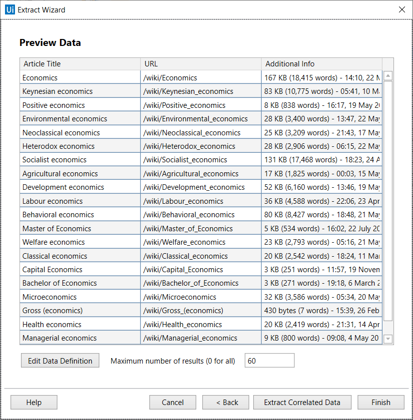
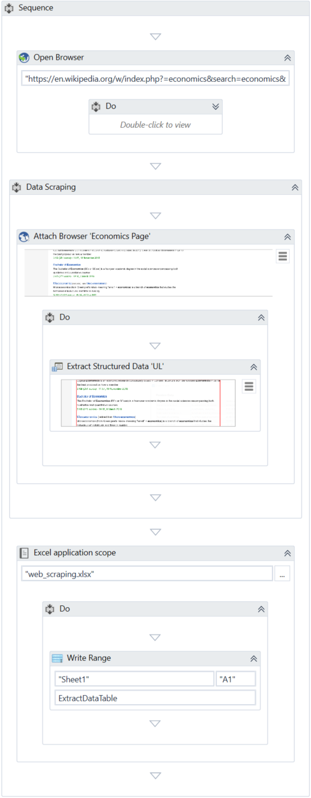
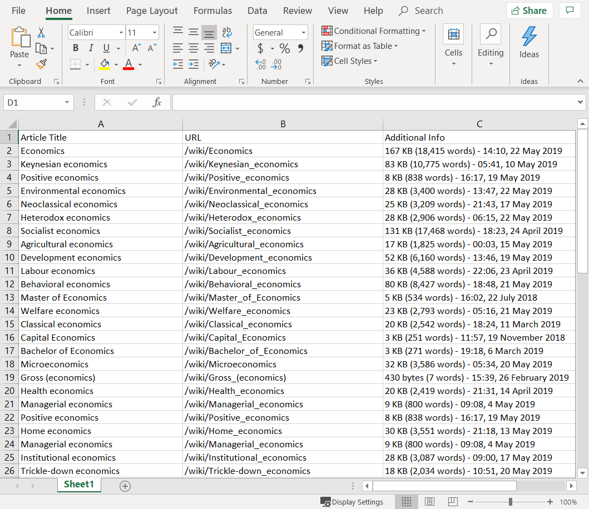

Lab 5: Data Scraping
====================

To better understand how you can take advantage of the data scraping
functionality, let's create an automation project that extracts some
specific information from Wikipedia and writes it to an Excel
spreadsheet. You can use this type of automation in different scenarios,
such as extracting lists of products and their prices from e-commerce
websites.

> Note:
>
> It is recommended to run your web automations on Internet Explorer 11
> and above, Mozilla Firefox 50 or above, or the latest version of
> Google Chrome.

Let’s say you want to start reading up on economics and you want to get
a list of Wikipedia articles on the subject, together with their URLs,
and the additional information that is provided in the search results
for each article. You can do the following:

1.  Open Internet Explorer and navigate to
    [en.wikipedia.org](https://en.wikipedia.org/).
2.  In the **Search Wikipedia** box, type "economics", then click
    "containing... *economics*" in the drop-down that appears. A web
    page opens displaying the search results.
3.  In Studio, create a **New Blank Process**.
4.  From the **Activities**panel, add an [**Open Browser**] activity
    to the **Designer** panel and, in the **Url** field, paste the URL
    of the web page with the search results. In our example, the URL is:
    
    "https://en.wikipedia.org/w/index.php?search=economics%20&title=Special%3ASearch&fulltext=1&ns0=1".
5.  In the **Design** ribbon tab, in the **Wizards** group, click **Data Scraping**. The **Extract Wizard** is displayed.
6.  Following the wizard, select the first and last items on the web
    page. The **Configure Columns** wizard step is displayed and the
    fields you selected are highlighted in the web browser.
7.  Select the **Extract URL** check box and change the name of the
    column headers to something relevant, for example "Article Title"
    and "URL".

8.  Click **Next**. A preview of the data is displayed in the **Preview
    Data** wizard step. Note that because the Wikipedia page uses
    relative URLs, the URL column contains relative URLs as well. You
    can correct this in the Excel output after the project is executed
    by adding the string
    "[https://en.wikipedia.org](https://en.wikipedia.org/)" at the
    beginning of each cell in the URL column.

9.  Click the **Extract Correlated Data** button to extract additional
    information about the articles. The **Extract Wizard** starts again.
10. Following the wizard again, indicate the information about the size
    and date of the last edit that is available for each article. The
    **Configure Columns** step is reached again.
11. Change the name of the new column header to "Additional Information"
    and click **Next**. The data is displayed in the **Preview Data**
    wizard step. Optionally, you can change the order of the columns by
    dragging them in place.
12. In the **Maximum number of results** type 60. The Wikipedia search
    lists 20 results per page and, for our example, we want to extract
    the first three pages of search results.

13. Click **Finish**. The **Indicate Next Link** window is displayed
    prompting you to indicate the **Next** button or arrow to click if
    the data spans more than one page.
14. Click **Yes** and select the **next 20** button below the search
    results in Wikipedia. The project is updated and a **Data Scraping**
    sequence is displayed in the **Designer** panel. A **DataTable**
    variable, 
    ExtractDataTable has been automatically generated.
15. In the **Variables** panel, change the scope of the automatically
    generated 
    ExtractDataTable variable to **Sequence**. Do this to make the
    variable available outside of its current scope, the **Data Scraping** sequence.
16. Add an [**Excel Application Scope**]
    activity under the **Data Scraping** sequence.
17. In the **Properties** panel of the Excel Application Scope activity,
    in the **WorkbookPath** field, type 
    "web\_scraping.xlsx". Upon project execution, a file with this name
    is created in the project folder to store data from the scraping.
    Alternatively, you can specify a file that already exists on your
    machine.
18. In the **Do** sequence of the **Excel Application Scope** activity,
    add a [**Write Range**]
    activity and in the **Properties** panel:

-   In the **DataTable** field, add the 
    ExtractDataTable variable.
-   Select the **AddHeaders** check box to include the column names in
    the output.

The final project should look as in the following screenshot:

19. Press **F5** to execute the project.
20. Open the Excel file you defined in step 17. Note that all columns
    are populated correctly.

