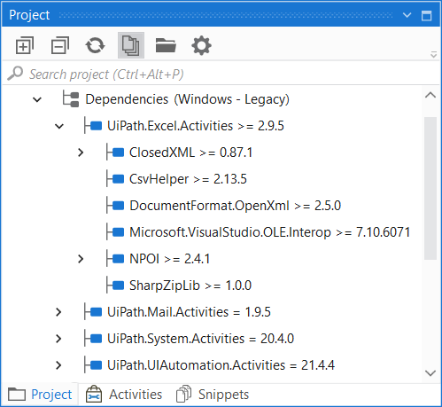
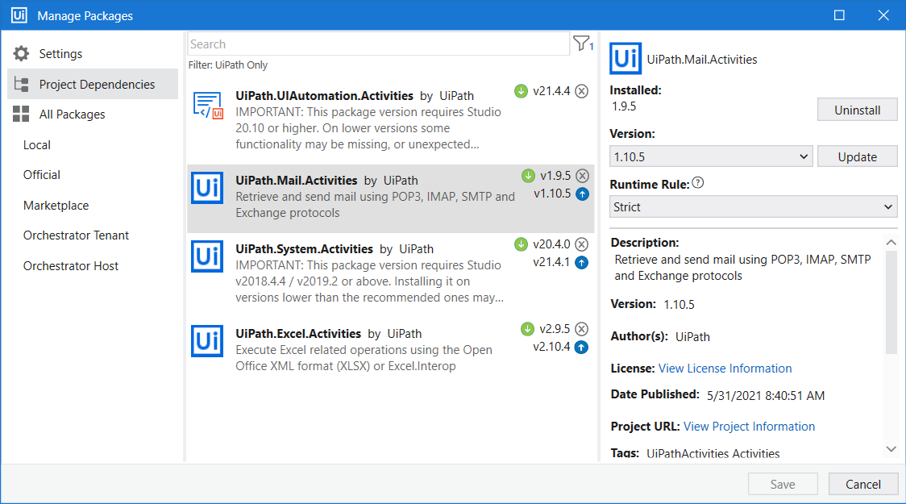
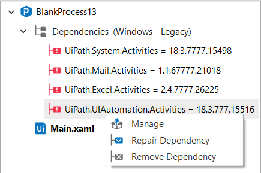
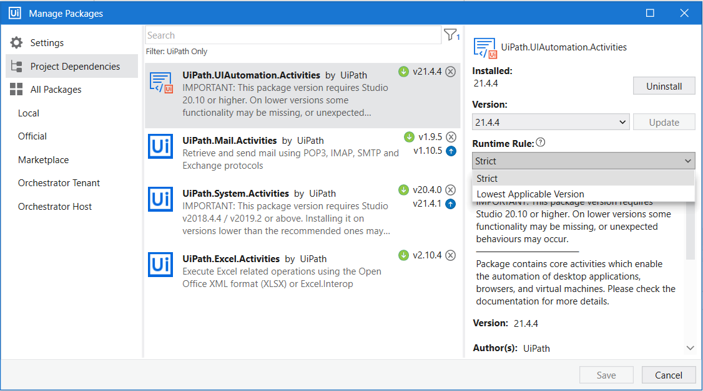
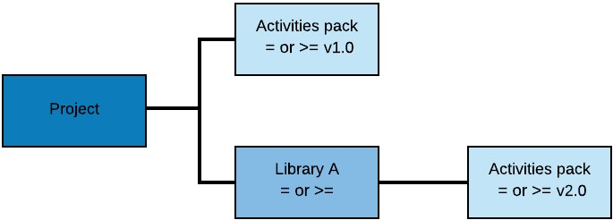
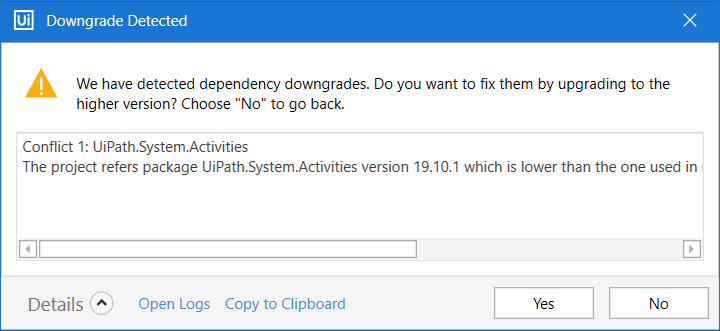
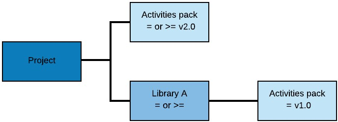
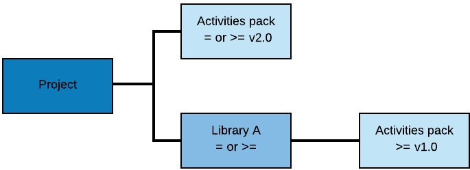
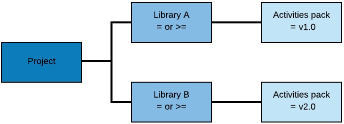
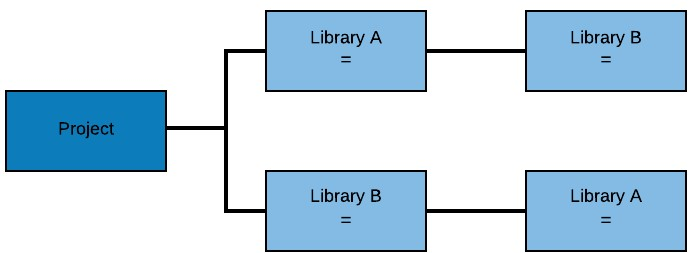

Lab 7: Managing Dependencies
============================

Project dependencies in Studio refer to packages linked into a specific
project, containing activities, either default or custom. Dependencies
are contextual and take into consideration each project's definition,
including the activities that it uses, variables, input/output
arguments. Therefore, a dependency is set only if it has at least one
reference in the project's definition.

All project templates available in Studio come with their own default
dependencies packages.

In StudioX, all projects come with the following default packages:

UiPath.System.Activities,

UiPath.ComplexScenarios.Activities, 

UiPath.Excel.Activities,

UiPath.Mail.Activities,

UiPath.Presentations.Activities,

UiPath.UIAutomation.Activities, and 

UiPath.Word.Activities.

If more need to be added, click on the **Manage Packages** button and
install them. Installed dependencies are available only for the current
project, and the list of dependencies per project is visible in the

project.json file.

The **Project** panel displays the activities packages installed in the
automation project, together with their sub dependencies, runtime rules,
requested, and resolved versions. The project compatibility is displayed
in the **Dependencies** node.

Hover over a dependency to view requested and resolved versions.
Contextual actions like **Manage**, **Repair** or **Remove Dependency**
are available only for dependencies and not their subpackages.
Unresolved dependencies are marked with grey in the tree, not found
dependencies with red, while resolved and exact match dependencies with
faded and strong blue.

Adding and Updating Dependencies

Whenever new versions are available for the current project
dependencies, the **Manage Packages** button from the ribbon gets an
update icon .

1.  To manage dependencies in a project, simply right-click on the
    **Dependencies** category in the **Project** panel, and then click
    on **Manage**. This opens the **Manage Packages** window, with the
    **Project Dependencies** category. The 
    icon shows which packages are currently installed.

2.  Default dependencies are displayed, together with the versions that
    are currently linked to the project. To update a package, simply
    click on the update icon ,
    next to the available version number. The 
    icon is shown next to the package, meaning that dependencies are
    ready to be installed.
3.  Dependencies are installed in the project only after you click
    **Save**. Simultaneously, the versions of dependencies are updated
    in the 
    project.json file belonging to the project.

To add dependencies to a project, simply search and install them as you
would any activity package. Please note that the available packages
differ depend on the [project compatibility](https://docs.uipath.com/studio/docs/about-automation-projects#setting-the-project-compatibility).
For more information, check the [**Manage Packages**](https://docs.uipath.com/studio/docs/managing-activities-packages)
page.

Removing Dependencies

-   To remove a project dependency, right-click the dependency in the
    **Project** panel, and then select **Remove Dependency**. The
    dependency is removed from the **Project** panel and
    project.json file.\
     Alternatively, you can go to **Manage Packages** \> **Project
    Dependencies**, select the dependency to remove, and then click
    **Uninstall**.
-   To remove all unused dependencies in the project, select **Remove  Unused** \> **Dependencies** in the Studio ribbon, or use the **Ctrl + Shift + R** keyboard shortcut. All the installed packages that
    have no references in the current project are removed from the
    **Project** panel and 
    project.json file.

Repairing Dependencies

If a workflow opened in Studio has references to packages with versions
that aren’t available in current Studio feeds, said dependencies are
marked as broken in the **Project** panel and details are made available
in the **Output** panel.

Studio allows for all dependencies to be repaired in bulk or
individually. To repair all broken dependencies, right-click on the
**Dependency** node in the **Project** panel, and click on **Repair
Dependencies**.

Right-click on a broken dependency and select **Resolve Dependency** to
repair it individually. Alternatively, you can select **Manage** to open
the **Manage Packages** window and update packages.

NuGet resolves broken dependencies by applying the **Lowest Applicable
Version** 
runtime rule, meaning that it searches for the first applicable package
version, higher than the one previously set.

> Note:
>
> Missing or invalid activities are marked in the **Designer** panel,
> while an error banner provides additional information regarding the
> workflow and its unresolved dependency conflicts.

Setting Dependency Rules

Activity packages are available in multiple versions, which is why upon
installing or updating them using the **Manage Packages**, you can set
dependency runtime rules for each of them.

The **Runtime Rule** specifies which package version to install at
runtime. It features two available options.

The **Strict** runtime rule is the default state for dependencies added
upon process creation, and for activities packages installed from the
**Manage Packages** window. It means that only the specified version of
the package is used at runtime to execute the parent process. The
**Strict** rule is marked in the **Project** panel, under
**Dependencies** by the  sign
next to the package version.

The Lowest Applicable Version runtime rule means that if the target
package isn’t found, the next higher version is searched in order to
resolve dependencies. The **Lowest Applicable Version** rule is marked
in the **Project** panel, under **Dependencies** by the 
sign next to the package version.

When executing an automation project from Studio, the Robot downloads
the specified or indicated package version it needs to execute the
project, in accordance to the previously set runtime rules for each
project. If the dependency used during execution has a **Strict**
runtime rule and the exact package version was not found, an error is
thrown. For more information on setting runtime rules for project
dependencies check the [**Managing
Dependencies**](https://docs.uipath.com/studio/docs/managing-dependencies)
page.

Resolving Dependency Conflicts

The installation of activities packages takes into consideration
dependency runtime rules previously set for said packages, but some
conflicts between versions might occur when automating the projects.
Both the automation project and the library it contains might have the
same activities package, but with different versions and runtime rules.
At design time, NuGet resolves such conflicts by choosing the top level
dependency, which is the closest to the project in the hierarchy.

The resolution of conflicts that might occur is explained below:

The project contains an activities package with version 1.0. The library
is referenced to the project and uses the same pack, but with a higher
version. The top-level dependency v1.0 is used at runtime. A warning is
given, mentioning that a downgrade was detected.

The resolution of this scenario is applicable regardless of the runtime
rule (**Strict**  or
**Lowest Applicable Version** )
previously set for the activities packages.

-   If you choose **Yes**, the activities package referenced in the
    project is upgraded to the version used in the library.
-   If you choose **No**, the **Manage Packages** window is opened with
    the **Project Dependencies** window.

The project contains an activities package with the version 2.0. The
library uses the same pack, but with a lower version and the **Strict**
 runtime
rule. The top level dependency used in this case is v2.0 and a warning
is given when the package is installed in the project.

The project contains an activities package with the version 2.0. The
library uses the same pack, but with a lower version and the **Lowest
Applicable Version** 
runtime rule. The top level dependency used in this case is v2.0 and a
warning is given when the package is installed in the project.

The project references a library with an activities package version 1.0
and **Strict**  runtime
rule. The project references another library, but with an activities
package version 2.0. The top level dependency in this case is the pack
with v2.0, since it has the highest version. A warning is given when the
activities package is installed.

In this conflict the project references two libraries, which in turn
have **Strict** 
dependencies referenced among them. This scenario isn't supported. For
detailed information, check the [Dependency
Resolution](https://docs.microsoft.com/en-us/nuget/consume-packages/dependency-resolution)
page.

Dependency cycles are types of conflicts that occur when a package
references itself. If you name your project **UiPath**, Studio detects a
dependency conflict. This happens because the **UiPath** package already
exists and is a dependency to 

UiPath.UIAutomation.Activities. It is recommended to avoid naming your
project with the name of an already existing package that you intend to
add as a dependency.

The same dependency cycle occurs if you open a .xaml file from a folder named **UiPath** or any name of an existing
package that you intend to add as a dependency, and there is no

project.json in that folder. When you open a .xaml file that doesn’t have an associated project.json file, Studio creates one and the "name" tag is populated with the name of the parent folder.

