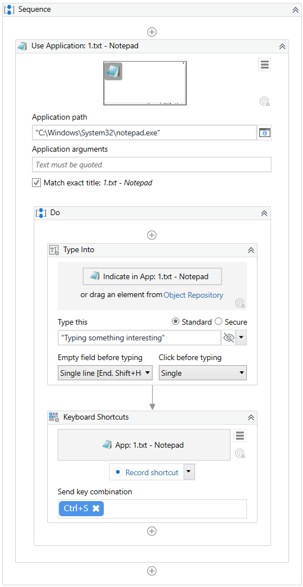
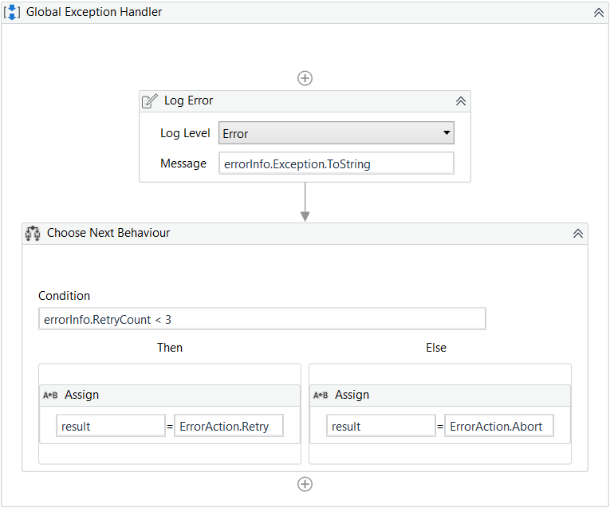

Lab 9: Global Exception Handler
===============================

The **Global Exception Handler** is a type of workflow designed to
determine the project’s behavior when encountering an execution error.
Only one **Global Exception Handler** can be set per automation project.

> Note:
>
> The **Global Exception Handler** is not available for library
> projects, only processes.

The **Global Exception Handler** has two
[arguments](https://docs.uipath.com/studio/docs/managing-arguments),
that should **not** be removed.

The first argument is

errorInfo with the **In** direction and it stores information about the
error that was thrown and the workflow that failed. The level of the
error to be logged can be set in the [**Log
Message**] activity.

> Note:
>
> Use the ActivityInfo property for
> errorInfo to get the name of the activity which threw the exception
> and view it in the **Output** panel.

The second argument,

result has the **Out** direction and it is used for determining the next
behavior of the process when it encounters an error. The following
values can be assigned to the 

result argument:

-   **Continue** - The exception is re-thrown.
-   **Ignore** - The exception is ignored, and the execution continues
    from the next activity.
-   **Retry** - The activity which threw the exception is retried. Use
    the 
    RetryCount method for 
    errorInfo to count the number of times the activity is retried.
-   **Abort** - The execution stops after running the current **Global
    Exception Handler**.

> Note:
>
> Any workflow may be flagged as a **Global Exception Handler** in
> Studio, except for library projects.

To control the workflow’s behavior in case of an error, the **Global
Exception Handler** retries the activity three times and then aborts
with an error message.

Handling Errors During Debugging

When an exception is detected during debugging, the activity which
faulted is highlighted, the execution is paused, and the exception's
type and details are mentioned in the **Locals** and **Call Stack**
panels.

[Debugging
actions](https://docs.uipath.com/studio/docs/debugging-actions) like
**Continue**, **Stop**, **Retry**, **Ignore**, **Restart** and **Slow
Step** are available in the ribbon. **Ignore** is used for continuing
the execution from the next activity.

The **Retry** button retries to execute the current activity, without
the Global Exception Handler stepping in. The **Continue** action runs
the Global Exception Handler, taking into consideration the previously
chosen values for the

result argument, either **Continue**, **Ignore**, **Retry** or
**Abort**.

> Note:
>
> When using the **Global Exception Handler** with a project that
> includes a [**Try
> Catch**], make sure to
> group activities into a **Sequence** inside the **Try** container.
> Otherwise, the **Global Exception Handler** does not execute.
>
> In the case of nested activities, the **Global Exception Handler**
> executes for each activity in the call stack. However, it does not
> execute for activities directly encapsulated in a **Try Catch**,
> unless they're contained in an activity.

##### Example of Using the Global Exception Handler

The following example showcases the project’s behavior when an exception
is thrown during execution.

The automation project is set to type some text in a Notepad file and
then close the application, but not before saving the file.

Creating the Workflow

1.  Create a **Blank Process** by following the steps in the [**Creating
    a Basic
    Process**](https://docs.uipath.com/studio/docs/creating-basic-process)
    page.
2.  Open Notepad and save a document on your machine. You can name the
    file 
    1.txt.
3.  In the Activities panel, search for [Use
    Application/Browser](https://docs.uipath.com/activities/docs/n-application-card) and
    drag it to the Designer panel.
4.  In Use Application/Browser:
    -   Click **Indicate application to automate**, and then move the
        mouse pointer to the Notepad window. When the window is
        highlighted, click anywhere inside it.\
         The Use Application/Browser activity is updated, the path is
        added to the **Application path** field, and a screenshot of the
        window appears inside the activity.
    -   In the **Properties** panel, select the **Always** option for
        the **Close** property. This ensures Notepad is closed after the
        automation runs.

5.  Add a [**Type Into**] activity in
    the **Use Application/Browser** activity’s **Do** container. Click
    **Indicate in App** to select the Notepad window, and add enter a
    text between quotation marks in the **Type this** field. This
    activity writes the text into Notepad.
6.  From the **Activities** panel, add a [**Keyboard
    Shortcuts**](https://docs.uipath.com/activities/docs/n-keyboard-shortcuts)
    activity to the workflow. Indicate the Notepad window, then select
    **Record shortcut** and press **Ctrl + S** to record the key
    combination that saves the file after the text was typed in.\
     The resulted workflow should look like this:

Adding a Global Exception Handler

1.  In the **Design** tab part of the **Ribbon**, select **New \> Global
    Handler**. The **New Global Handler** window opens. Type in a
    **Name** for the handler and save it in the project path. Click
    **Create**, a **Global Exception Handler** is added to the
    automation project.

2.  Go back to the workflow you created earlier and modify it so that an
    activity fails to execute. For example, in the Use
    Application/Browser activity, select the **Match exact title**
    option and make sure the file is closed before you click **Run
    File** in the ribbon.

When the **Global Exception Handler** encounters an exception, it logs
the name of the activity which faulted and starts retrying the activity
three times. If it encounters the same exception each time and the
number of retries reaches 3, the execution is aborted at the level of
the activity which threw the exception.

If during one of the retries an exception isn’t encountered, the
execution of the workflow continues and the **Global Exception Handler**
doesn’t step in.

