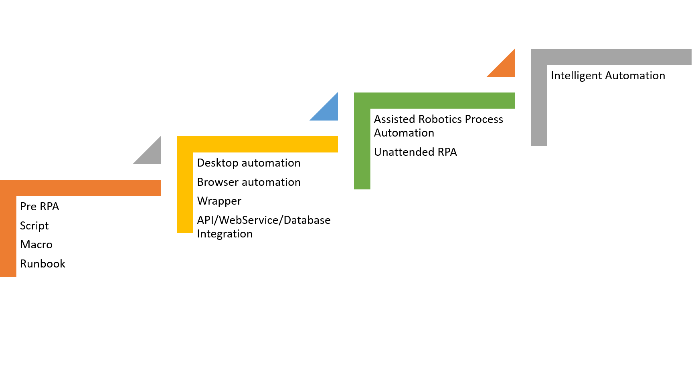
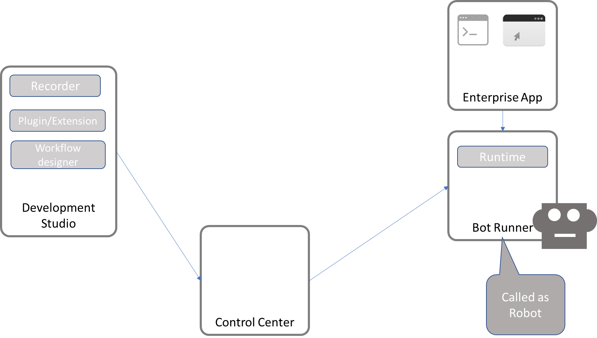

Lab 1. What is Robotic Process Automation?
-------------------------------------------------------

Nowadays, there is almost no aspect of our lives that is unaffected by
automation. Some examples include washing machines, microwave ovens,
autopilot mode for automobiles and airplanes, Nestlé using Robots to
sell coffee pods in stores in Japan, Walmart testing drones to deliver products in the US, our bank checks being
sorted using **Optical Character Recognition **(**OCR**), and ATMs.

The term automation is derived from the Greek words [*autos*]
meaning self, and [*motos*], meaning moving. It is believed
to have been coined in the 1940s when there was an increased use of
automated devices in mechanized production lines in the Ford Motor
Company.

Automation, in simple words, is technology that deals with the
application of machines and computers to the production of goods and
services. This helps in getting work done with little or no human
assistance.

With the advent of computers, many software systems were developed to
accomplish tasks that were previously done on paper to manage
businesses, or not being done at all due to the lack of tools. Some of
these are bookkeeping, inventory management, and communications
management.

There is also a type of software that ties these systems and people
together in workflows, known as **Business
Process Management** (**BPM**) tools. This software
has been developed for areas such as record systems, engagement systems,
insight systems, and innovation systems. These mostly replicate
processes in real-life scenarios.

In the digital world, automation and software development are two
different terms. Very often, however, one is confused with the other. If
some portion of a workflow can be programmed to be done without human
intervention, it can be called automation. For example, in order to pass
any invoice in a payment system, Ms. Julia at ABC organization needs to
check that goods have been delivered and recorded in an inventory
management system. This is a cumbersome job, as it has to be done for
each and every invoice. Also, for larger organizations, more people are
needed to do this check on computers. However, Jack, an application
developer, proposes that he can integrate those two systems using
database integration techniques. He will write a procedure that will
fetch data from the inventory management system and automate the check
of receivables.

Developing an inventory management software system is called software
development, while programming a step so that no more human intervention
is required is called automation.

In this lab, you will learn about the basic concepts of automation
and Robotic process automation.

Scope and techniques of automation
----------------------------------------------------

There are various techniques used and available to automate steps and processes in an organization where
software systems are being used to accomplish certain tasks. Before we
look at these techniques however, let us see what [*can*] be
automated and what [*should*] be automated.

### What should be automated?

There are a few aspects that have to be taken
into consideration for choosing automation candidates. The following
processes should be automated:

-   Repetitive steps
-   Time-consuming steps
-   High-risk tasks
-   Tasks with a low-quality yield
-   Tasks involving multiple people and multiple steps
-   And everything else!

We have found out what should be automated. Now the question arises what
[*can*] be automated?

### What can be automated?

In order to automate something, it needs to have the following characteristics:

-   Well defined and rule-based steps
-   Logical
-   An input to the task can be diverted to the software system
-   Input can be deciphered by software systems with available
    techniques
-   The output system is accessible
-   Benefits are more than the cost

### Techniques of automation 

There are various techniques available for automation and programmers
have been using them for years to increase
efficiency in enterprises:

-   **Custom software**: Developing new
    software to perform repetitive tasks.
-   **Runbook**: Runbooks are typically used for IT-based operations. They are a compilation of
    a set of commands or tasks that are performed for maintenance and
    other types of activities. Runbooks can be offline as well, often
    referred to as run commands for performing sets of tasks. 
-   **Batch**: Batch files used to very popular. They used to compile a sequence of commands
    that could be run by a single click or command. They can also be
    scheduled to be run at a specific time using the scheduler.
-   **Wrapper**: Wraps around existing
    software or hosts client
    applications. The wrapper monitors activities in a client app and
    performs actions based on rules.

For example:

-   
    -   Putting validation on top of a mainframe application using
        hummingbird
    -   Hosting a website inside a shell, navigation, and actions
    

-   **Browser automation**: Greasemonkey and many other web
    macro software helped in browser-based
    automation. It can be used to read from a website and save to a
    database. It can also write to fields based on rules. Using this
    technique, a whole website can be changed, and components can be
    added or removed from the website. Sometimes, it is also referred to
    as web scripting or web injections.

-   **Desktop automation**: Traditionally, desktop automation
    used to mean that multiple screens on a
    desktop were woven together to present a single screen, and if there
    was some data transfer from one screen to another, it could be done
    automatically. Recently, assisted Robotics process automation has
    also been considered for desktop automation by some companies. 

-   **Database**/**web service integration**: In
    database integration, we read/write to a
    client database directly. In web service
    integration, we communicate with the client system using a web
    service:

Robotic process automation
--------------------------------------------

Today, automation has reached a stage of maturity where a number of
other technologies have developed from it. **Robotic process
automation** (**RPA**) is one such transformational burgeoning area. [*Robot*] in
Robotic process automation means software programs that mimic human
actions. 

In simple words, RPA involves the use of software
that [*mimics*] human actions while interacting with
applications in a computer and accomplishing [*rule-based
tasks*]. This often requires reading from and typing, or
clicking on existing applications that are used to perform the given
tasks.

In addition, these software Robots also perform complex calculations and
decision making on the basis of the data and predefined rules. With the
rapid progress of technology and renewed efforts in the area of
artificial intelligence, it has become possible to use
**`State`** activity: Transitions contain three
sections---**`Trigger`**, **`Condition`**, and **`Action`**, which
enable you to add a trigger for the next state or a condition under
which an activity is to be executed. with RPA to accomplish tasks that
were not possible earlier. Some of the technologies being adopted with
RPA are as follows:

-   Machine learning
-   Natural language processing
-   Natural language generation
-   Computer vision

With the inclusion of the preceding technologies, sometimes it is also
referred to as intelligent automation.

With the advent of RPA, it has become much
easier to automate tasks. Now, we need to know only the steps taken by
humans and make the Robots mimic the action on a computer screen using
mouse and keyboard. This is a big deal because in most cases, the
process is already defined and the steps documented. Humans also follow
the same operating procedures, which define the steps taken to
accomplish the task. Business logic, validation of data, transformation,
and use of data is already coded in existing systems that humans use to
accomplish a task, a simple example being invoice data entry.

RPA platforms allow the program, called Robots, to interact with any
application in the same way a human would do, hence, automating
rule-based work by recording those steps for later playback.

An important point that distinguishes RPA from traditional automation is
that the software Robot is [*trained*] using steps that are
illustrative rather than using instructions based on code. Thus, a
person with little programming experience can be trained on these
platforms to automate simple to complex processes.

Also, RPA software, unlike traditional automation, is capable of
adapting to dynamic circumstances, for example, when checking an
electronic form of new employees in a company. If the pin code is
missing in a form, in traditional automation the software would point
out the blank field as an exception, and then a human being would search
for the relevant pin code and correct the form. In RPA however, the
software is capable of performing all the tasks mentioned previously
with no human assistance.

From tedious, repetitive, and high volume tasks, to diverse, complicated
systems that need to work together lucidly, RPA can handle it all. There
is consistency in quality, accuracy, productivity and efficiency, faster
delivery of services, and of course, lower operation costs.

With the constant development and integration of RPA with industries,
people previously engaged in mundane, repetitive tasks can now move on
to engaging themselves in higher value, better quality activities,
leaving the tedious tasks to the software Robots.

### What can RPA do?

Today, RPA has matured beyond doing mundane
repetitive tasks, and is seen as a transformational technology that can
bring tremendous value to the organization adopting it. The ability to
create full audit trails is significant for improving the quality of
work being done and eliminating human error. Once trained, these Robots
will perform tasks with the same precision over and over again. These
Robots can interact with applications irrespective of the technologies
on which the applications are built. They can work with popular ERP
applications such as SAP, Oracle, or Microsoft Dynamics, and BPMs such
as Pega systems and Appian.

Custom applications built on .NET, Java, the command-line, or mainframe
terminal are easy to use with RPA.

With the inclusion of AI technologies, RPA now has the capability to
read from images or scanned documents, and it can interpret unstructured
data and formats as well. However, most of the implementation is
happening with structured and digital data. 

### Benefits of RPA

Today, RPA is being widely accepted across
industries and across the world. The following industries can benefit a
lot from RPA:

-   **Business process outsourcing** (**BPO**):
    With RPA and its benefits of reduced costs, the BPO sector can now
    depend less on outsourced labor.
-   **Insurance**: The complexity and number of tasks that
    must be managed in the insurance sector, from managing policies, to
    filing and processing claims across multiple platforms, provides an
    ideal environment for the use of RPA technology.
-   **Financial sector**: From day-to-day activities and
    handling an enormous amount of data, to performing complex
    workflows, RPA has been helping to transform this sector into an
    efficient and reliable one.
-   **Utility companies**: These companies (such as gas,
    electricity, and water) deal with a lot of monetary transactions and
    can leverage RPA to automate tasks such as meter reading, billing,
    and processing customer payments.
-   **Healthcare:** Data entry, patient scheduling, and more
    importantly billing and claims processing, are important areas where
    RPA can be used. RPA will help in optimizing patient appointments,
    sending them automatic reminders of their appointments and
    eliminating human error in patient records. This leaves workers to
    focus more on the needs of the patients, and also leads to improved
    patient experience.

The following are the benefits of RPA:

-   **Higher quality services, greater accuracy**: With
    reduced human error and greater
    compliance, the quality of work is much better. Also, while it is
    difficult to trace the point at which the human error occurred, the
    detection of errors is much simpler in RPA. This is because every
    step in the automation process is recorded, making it faster to
    pinpoint errors with ease. A reduction, or removal of, errors also
    means greater accuracy of data, leading to better quality analytics
    and hence better decision making.

-   **Improved analytics**:** **Since these
    software Robots can log each action taken with the appropriate tag
    and metadata, it is very easy to get business insights
    and other analytical data. Using
    analytics on the collected data such as transaction received time,
    transaction complete time, and predictions can be made for the
    incoming volume and ability to complete the tasks on time.

-   **Reduced costs**: Nowadays, it is commonplace to
    hear that one Robot is equivalent to
    three human **full-time
    executives** (**FTE**). This is based on the
    simple fact that one FTE works for eight hours a day, while a Robot
    can work for 24 hours without a break. Increased availability and
    productivity means the cost of operations is reduced tremendously.
    The speed of the work being performed coupled with multitasking
    results in further reductions in cost.

-   **Increased speed**: Robots are very fast and sometimes the speed of execution has to be reduced
    to match the speed and latency of the application on which these
    Robots work. Increased speed can result in better response times and
    an increase in the volume of the tasks being performed.

-   **Greater compliance**: As mentioned earlier, a full
    audit trail is one of the highlights of
    RPA and can result in greater compliance. These Robots do not
    deviate from the defined set of steps to be taken while doing a task
    and hence it will certainly result in better compliance..

-   **Agility**: Reducing and increasing the
    number of Robot resources requires
    managing the volume of the business process. This is just a click
    away. More Robots can be deployed to perform the same task easily.
    Redeployment of resources does not require any kind of coding or
    reconfiguration.

-   **Comprehensive insights**: In addition to the
    audit trail and time stamping, Robots can
    tag transactions to use them later, in reports for business insight.
    By using these business insights, better decisions can be made for
    the improvement of the business. This recorded data can also be used
    for forecasting.

-   **Versatility**: RPA is applicable across
    industries performing a wide range of
    tasks---from small to large businesses, simple to complex processes.

-   **Simplicity**: RPA does not need prior programming knowledge. Most platforms provide designs in
    the form of flowcharts. This simplicity enables easy automation of
    business processes, leaving the IT professionals relatively free to
    carry out higher value work. Also, since automation is carried out
    by people from within the department or area of work, no
    requirements are lost in translation between the business unit and
    the development team, which may have happened otherwise in
    traditional automation.

-   ** ****Scalability**: RPA is
    highly scalable, up as well as down.
    Whether one requires an increase or reduction in the virtual
    workforce, Robots can be quickly deployed at zero or minimum costs
    while maintaining consistency in the quality of work.

-   ** ****Time savings**: Not only
    does the virtual workforce complete large
    volumes of work in a shorter span of time with precision, but they
    help save time in another way too. If there is any change---say, a
    technology upgrade it is much easier and faster for the virtual
    workforce to adapt to the changes. This can be done by bringing
    about modifications in the programming or introducing new processes.
    For humans, it is difficult for them to learn and get trained in
    something new---breaking from the old habit of performing repetitive
    tasks.

-   ** ****Non- invasive**: RPA, as we know, works
    at the user interface just like a human
    would. This ensures that it can be implemented without bringing
    changes to the existing computer systems. This helps in reducing
    risks and complexities that would arise in the case of traditional
    IT deployments.

-   **Better management**: RPA allows for managing, deploying, and monitoring Robots through a
    centralized platform. This also lessens the need for governance.

-   **Better customer service**: Since Robots can
    work around the clock, capacity
    increases. This leaves humans to focus on customer service and
    satisfaction. Also, better quality of services delivered to
    customers at faster speeds greatly boosts customer satisfaction.

-   **Increased employee satisfaction**: With repetitive,
    dreary tasks now being taken over by the
    virtual workforce, employees are not just relieved of their
    workload, but can also engage in better quality work that requires
    the use of human capabilities and strengths such as emotional
    intelligence, reasoning, or tending to customers. Thus, RPA doesn\'t
    take away work, it just frees humans from tedious, mind-numbing
    work, giving us an opportunity to engage in much more satisfying
    jobs.

The applicability of RPA is across industries such as banking and
financial services, insurance, healthcare, manufacturing, telecom,
travel, and logistics. There is also penetration in industries such as
consumer products, food and beverages, and entertainment.

There are horizontals irrespective of industries\' domain that have seen
a higher adoption, such as in finance and accounting, human resources,
and procurement.  

Most successful implementations are observed in what is being called
[*industry-specific processes*] or [*domain-specific
processes*], for example, [*claims processing*] in
the insurance industry.

### Components of RPA

Any Robotics process automation platform provides some basic components, which together build the platform.

The following are the basic or core components of RPA:

-   **Recorder**
-   **Development Studio**
-   **Plugin/Extension**
-   **Bot Runner**
-   **Control Center**:

[]

****

#### Recorder

The recorder is the part of the development studio that developers use to configure the Robots. It is like the
macro recorder in Excel, the bot recorder in any platform, records
steps. It records mouse and keyboard movements on the UI and this
recording can be replayed to do the same steps again and again. This
enables rapid automation. This component has played a very big role in
the popularity of RPA. We will see the application and usefulness of
this component in lab 2.

#### Development studio

The development studio is used by developers
to create Robot configuration or train the Robots. Using the development
studio, a set of instructions and decision-making logic is coded for
Robots to execute. Some platforms provide flow-charting capabilities
such as Visio, so it becomes very easy to plot steps in a process,
whereas some other platforms require coding. In most studios, in order
to do commercial development, developers need to have a fair amount of
knowledge of programming, for example, loops, if else, variable
assignment, and so on. We will study the UiPath Development Studio in
detail in Lab 2.

#### Extensions and plugins

Most platforms offer many plugins and
extensions to ease the development and running of bots. In many
applications, such as Java SAP, it is not easy to individually identify controls of the UI through
traditional techniques. RPA vendors have developed plugins and
extensions to help with these issues. We will get to understand
importance of plugins and extensions of the UiPath platform later in the
course.

#### Bot runner

This is also referred to as the Robot, other
components make it run.

#### Control center

The objective of the control room is to provide Robot management
capabilities. It monitors and controls a Robot\'s operation in a
network. It can be used to start/stop Robots,
make schedules for them, maintain and publish code, redeploy Robots to
different tasks, and manage licenses and credentials.

### RPA platforms

The burgeoning RPA vendor market has been
showing continual and steady growth. While the largest market is the US,
followed by the UK, the market in **Asia Pacific Countries**
(**APAC**) is also showing
considerable progress. Successful pilot projects and increased customer
satisfaction among the early adopters of RPA will encourage new players
to adopt this technology. There is growing demand for RPA, especially in
industries that need large-scale deployments. The major markets for RPA
are banking and finance, healthcare and pharmaceuticals, telecom and
media, and retail.

A few key vendors, their client market, and company specifications are
mentioned in the following sections.

#### Automation Anywhere

Automation Anywhere helps to automate
business processes for companies. They focus on RPA, cognitive data
(machine learning and natural language processing), and business
analytics. Their bots are capable of handling both structured as well as
unstructured data. The system has three basic components:

1.  [*A*][*development client*] for the creation
    of a bot
2.  [*A runtime environment*] for the deployment of a bot
3.  [*A*][*centralized command system*] for
    handling multiple bots, analyzing their performance:
    
    -   **HQ**: San Jose, California, USA
    -   **Est**: 2003
    -   **CEO**: Mihir Shukla
    -   **Some key clients**: Deloitte, Accenture, AT&T, GM,
        J P Morgan Chase
    -   **Source of revenue by region**: Its highest source
        of revenue is the USA, which accounts for more than half its
        revenue, followed by APAC, then UK and continental Europe
    -   **Source of revenue by industry**: The **Banking,
        Financial services, and
        Insurance** (**BFSI**) accounts for more
        than half of its revenue, followed by
        healthcare, telecom, media, and others
    

#### UiPath

UiPath is an RPA technology vendor who designs and delivers software that helps automate businesses. The
RPA platform consists of three parts:

-   [*UiPath Studio*] to design the processes
-   [*UiPath Robot*] to automate tasks designed in UiPath
    Studio
-   [*UiPath Orchestrator*] to run and manage the processes:
    
    -   **HQ**: Bucharest, Romania
    -   **CEO**: Daniel Dines
    -   **Key Clients**: Atos, AXA, BBC, Capgemini,
        CenturyLink, Cognizant, Middlesea, OpusCapita, and SAP
    -   **Source of revenue by region**: North America,
        Continental Europe, the UK, and APAC
    -   **Source of revenue by industry**: BFSI, healthcare,
        telecom and media, and retail
    

#### Blue Prism

Blue Prism aims to provide automation that enterprises
can use according to their needs. Blue Prism
aims to do this by providing automation that is scalable, configurable,
and centrally managed. It sells its software through its partners, some
of which are Accenture, Capgemini, Deloitte, Digital Workforce Nordic,
HPE, HCL, IBM, TCS, Tech Mahindra, Thoughtonomy, and Wipro:

-   **HQ**: United Kingdom
-   **Est**: 2001
-   **CEO**: Alastair Bathgate
-   **Key Clients**: BNY Mellon, RWE npower, and Telefonica
    O2
-   **Source of revenue by region**: More than half of its
    revenue source comes from the UK, followed by North America,
    Continental Europe, and APAC
-   **Source of revenue by industry**: BFSI, health, and
    pharmaceuticals, retail and consumer, telecom and media,
    manufacturing, public sector, travel, and transportation

#### WorkFusion

**WorkFusion** offers automation that is based on RPA and machine learning. It delivers software
as a solution for automating high volume
data. WorkFusion enables man and machine to work in tandem while
managing, optimizing, or automating tasks:

-   **HQ**: New York, USA
-   **Est**: 2011
-   **CEO**: Max Yangkelivich, Andrew Volkov
-   **Key Clients**: Thomson Reuters, Infogroup, Citi, and
    Standard Bank
-   **Source of revenue by region**: North America provides
    more than 80% of WorkFusion\'s revenue, followed by Europe, APAC,
    and MEA
-   **Source of revenue by industry**: Around 90% of its
    revenue comes from the BFSI sector, followed by the retail and
    consumer sectors

#### Thoughtonomy

Thoughtonomy delivers software that helps
automate business and IT processes. It uses Blue Prism and other
automation software and customizes it:

-   **HQ**: London, UK
-   **Est**: 2013
-   **CEO**: Terry Walby
-   **Key Clients**: Atos, Fujitsu, CGI, Unite BT, and
    Business Systems
-   **Sources of Revenue by region**: Around 70% of revenue
    comes solely from the UK. The rest comes from Continental Europe,
    North America, APAC, and the **Middle East and Africa**
    (**MEA**)
-   **Sources of Revenue by industry**: A major part of its
    revenue comes from third-party clients,
    followed by BFSI, public sector, telecom, healthcare, retail, and
    consumer sectors

#### KOFAX

Kofax\'s Kapow RPA platform is capable of
automating and delivering processes that are repetitive and rule-based.
It uses Robots for extracting and consolidating information. The
software platform consists of a management console to deploy and manage
bots, Robot performance, and a monitoring system. This software can also
group together high priority tasks that should be completed first by the
Robot during times of high workload. Kofax\'s software, however,
doesn\'t have machine learning:

-   **HQ:** Irvine, California
-   **CEO:** Paul Rooke
-   **Key Clients:** Arrow Electronics, Delta Dental of
    Colorado, Pitt Ohio, Audi
-   **Sources of revenue by region:** North America accounts
    for almost half of its revenue, followed by Continental Europe,
    APAC, and LATAM (Latin America)
-   **Sources of revenue by industry:** BFSI, retail,
    consumer, travel, transportation, public sector, manufacturing,
    and healthcare

About UiPath
------------------------------

Headquartered in Bucharest, UiPath is an RPA vendor that provides software to help organizations automate their
business processes. The company aims to do away with repetitive and
tedious tasks, allowing humans to engage in more creative and inspiring
activities.

UiPath was founded by Daniel Dines, who is the CEO. It has offices in
London, Bucharest, Tokyo, Paris, Singapore, Melbourne, Hong Kong, and
Bengaluru. With clients spread across the world, from North America to
the United Kingdom, Continental Europe to Asia Pacific countries, the
company has shown remarkable growth in the last year, both in terms of
revenue and its workforce.

Today, its software is being widely used to automate business processes.
However, the IT sector is also gradually embracing UiPath\'s software.
Major clients of UiPath in the industry include BFSI, Telecom and media,
healthcare, retail and consumer, and manufacturing.

With UiPath automation software, one can configure software Robots to
mimic human action on the user interface of computer systems. The basic
components of the UiPath RPA platform are in line with what was
explained in [*Components of RPA*], these components are
necessary for enterprise deployment. The components of the UiPath
platform are UiPath Studio, UiPath Robot, and UiPath Orchestrator, see
the following sections.

### UiPath Studio

UiPath Studio helps users with no coding skills to design Robotic
processes in a visual interface. It is a flowchart-based modeling tool.
Thus, automation is faster and more convenient. Multiple people can
contribute to the same workflow. The presence of a visual signal
that points out errors in the model, and a
recorder that performs what the user executes, make modeling much
easier.

### UiPath Robot

UiPath Robot runs the processes designed in
UiPath Studio. It works in both attended (working only on human trigger)
and unattended environments (self-trigger and work on their own).

### UiPath Orchestrator

UiPath Orchestrator is a web-based platform that runs and manages Robots. It is capable of deploying multiple
Robots, and monitoring and inspecting their activities.

The future of automation
------------------------------------------

Throughout the history of human civilization,
there has been many major turning points in innovation and discoveries
that have instilled awe as well as fear in the minds of people, so much
so that the word [*Luddite*] (used for people who were
strongly opposed to the introduction of textile mills during the [*First
Industrial Revolution*] for fear of losing their livelihoods)
has now become synonymous with all people who are against new
technologies, be it industrialization, automation, or computerization.

The buzzword today is the **Fourth Industrial
Revolution**---the current age where technology is embedded
within societies and even the human body---be
it Robotics, 3D printing, nanotechnology, Internet of Things, or
autonomous vehicles. This will fundamentally change the way we live,
work, and interact with one another.

Technological changes and innovations are taking place today at
an unprecedented pace and scope and are having an impact on many
disciplines. Technological innovation has reached a stage where machines
have now entered the realm of what was once considered exclusively
human. For these reasons, there is a wide section of people who fear
this age of Robots. While the arguments over how much of our lives will
be taken over by Robots are endless, what cannot be denied is that
Robots are here to stay.

There are various advantages of automation today; there are also fears
surrounding its advancement, which are not completely unfounded.

As mentioned earlier, this time automation is capable of impacting a
wide range of disciplines. Thus, unlike in the past where only blue
collar jobs were at risk of being replaced by machines, this time even
white collar jobs are believed to be at risk. While this is not untrue,
reports suggest that only around 5% of the total jobs may be
[*totally*] replaced by automation. For other jobs,
automation will only replace a part of the job and not completely take
over.

There are, of course, those jobs in the 5% category that run the risk of
being completely automated. These are the jobs that are routine,
repetitive, and predictable. A few examples are telemarketing, data
entry operation, clerical work, retail sales, cashiers, toll booth
operators, and fast food jobs.

However, like in the past, people should be able to find a way to adapt
to the changes. With each generation, humans become smarter, more
adaptable to change, and also progressive. Also, with automation mostly
taking over routine and tedious tasks, humans are provided the
opportunity to make better use of their capabilities---be it reasoning,
emotional intelligence, or their creativity. What we can do is not fret
over the inevitable rather prepare for it. One way of doing so is to
start changing the pattern of education. The next generation should be
taught how to recognize and adapt to changes quickly. An important
aspect of their education should be to [*learn how to
learn*].

Summary
-------------------------

In this lab, we acquired a basic understanding of RPA and the
ability to differentiate it from other types of automation. We have also
learned globally about the benefits of RPA and various platforms
available on the market. In the next lab, we will start learning
UiPath and the recording tool, which is a quick and efficient way of
implementing RPA. 
