Lab 1: Creating a Basic Process
===============================

This tutorial teaches you how to create a basic process in Studio and run it on your machine. 
The example opens a browser, loads a certain web page and refreshes the browser.

#### Create UiPath Account & Install Studio Desktop

#### Step 1: Create a UiPath Account
1. **Go to UiPath's Website**: Open your browser and navigate to [https://www.uipath.com](https://www.uipath.com).
2. **Try UiPath Free**: Click on **"Try UiPath Free"** at the top right of the page and select **"Sign up"** if you don’t already have an account.
3. **Fill Out the Sign-Up Form**: You can sign up with an email, Google account, or Microsoft account. Provide the required information and verify your email, if prompted.
4. **Confirm Account**: Check your email for a verification link from UiPath. Click the link to confirm and activate your account.

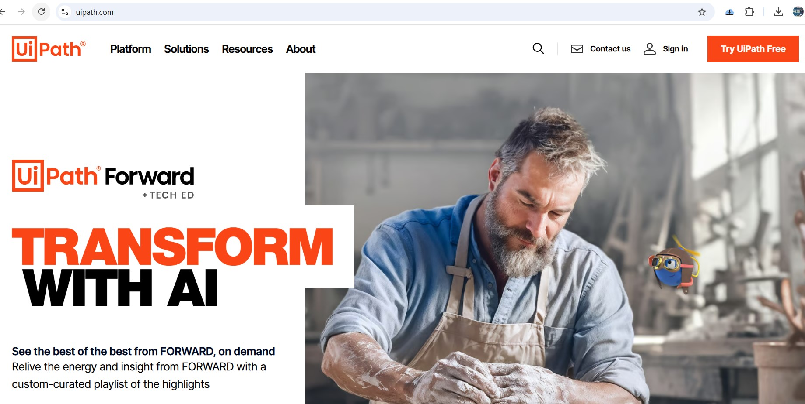

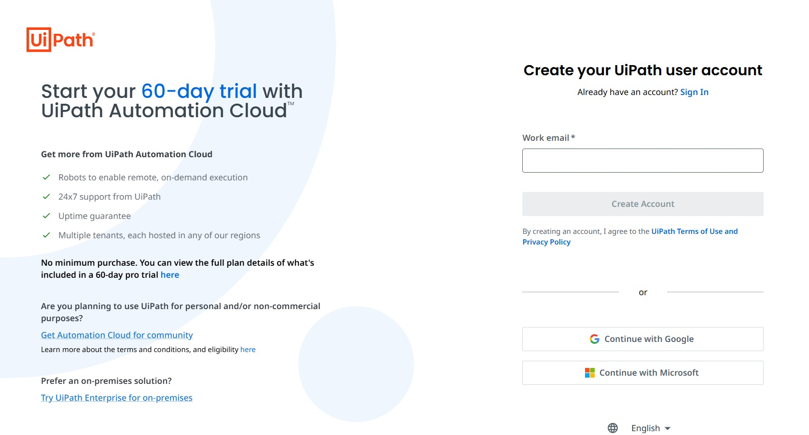

#### Step 2: Download UiPath Studio Desktop

**Download UiPath Studio**: Find the download link for **UiPath Studio** and click **"Download"**.

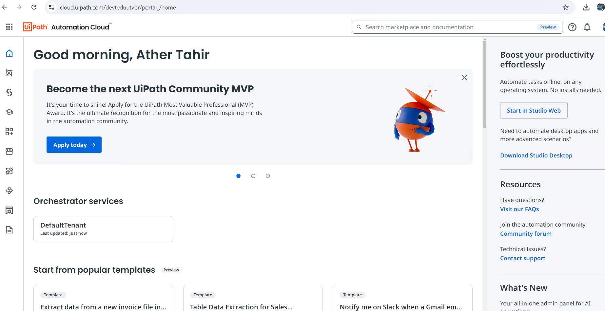

##### Step 3: Install UiPath Studio Desktop
1. **Open the Installer**: Once the download is complete, locate the installer file (usually in your **Downloads** folder) and double-click it to start the installation.
2. **Choose the Installation Type**: Select **"Community Edition"** if you're using a free account. Follow the prompts to complete the installation.
3. **Sign in to UiPath Studio**: After installation, launch UiPath Studio. You'll be prompted to sign in using your UiPath Cloud account.
4. **Select the Profile**: Choose **Studio** profile if prompted, which is suited for developing automations.

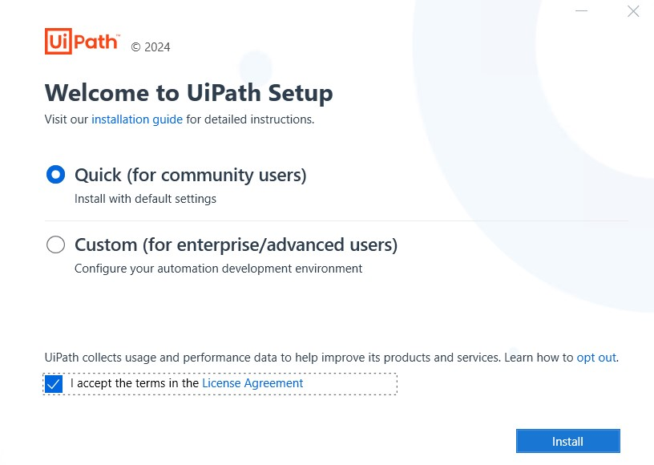

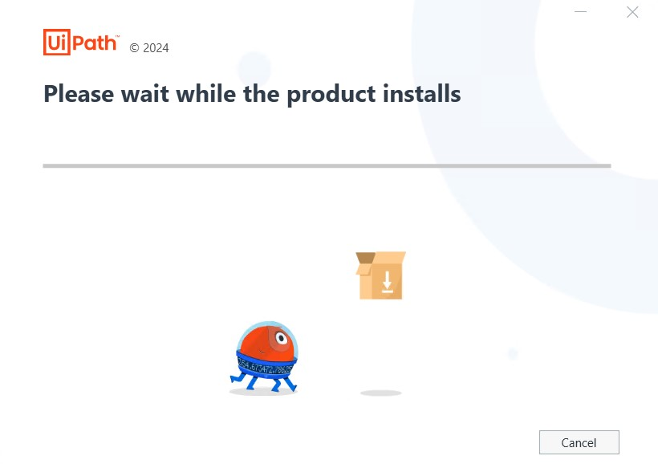

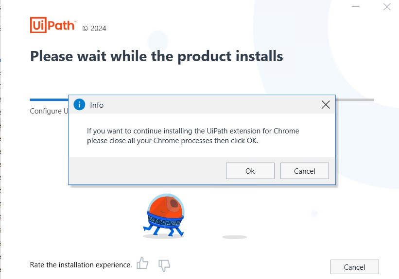

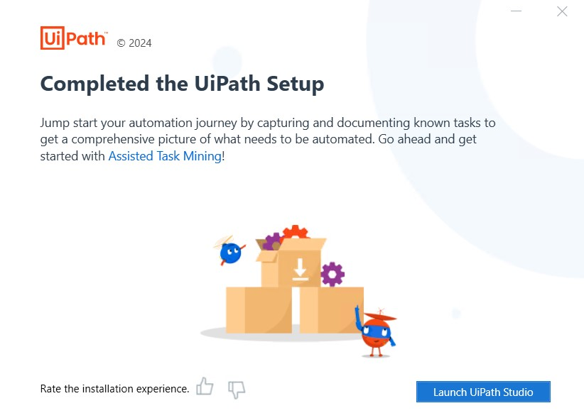

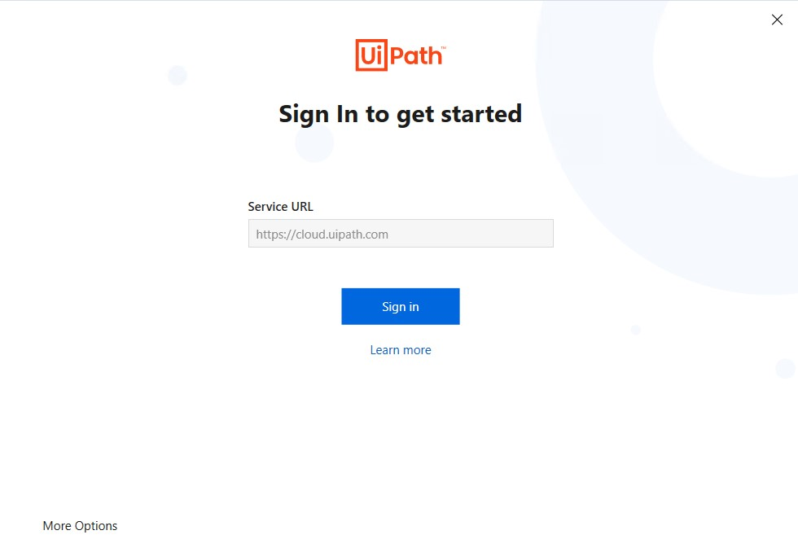

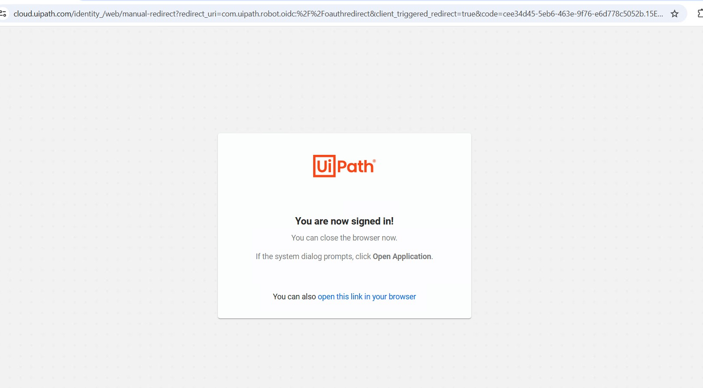

Select **UiPath Sudio** option when prompted:

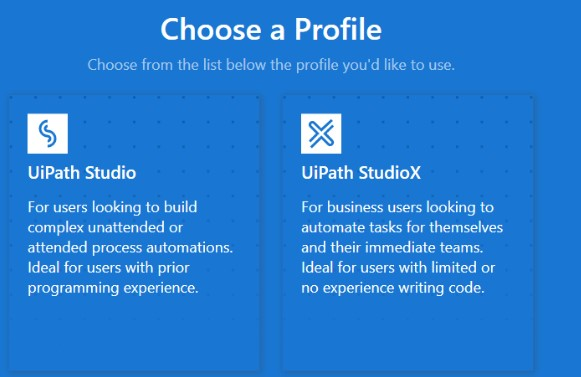

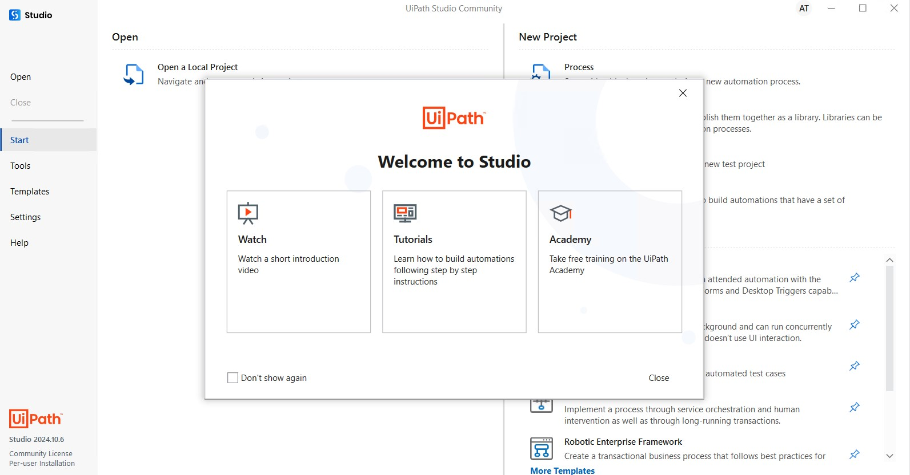

#### Lab Solutions
Lab solution(s) are present in `Solution\Lab01` folder.

#### Projects
The main types of project supported by UiPath Studio are as follows:

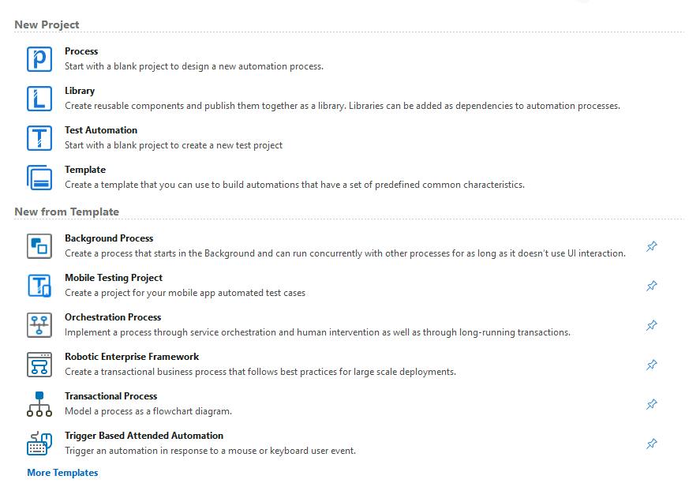

#### The user interface
When you first open UiPath Studio, you are directed to the page shown in the following screenshot:

Let’s begin.

1.  In the HOME Backstage view, click **Process** to
    create a new project. The **New Blank Process** window is displayed.

2.  In the New Blank Process window:
    -   Enter a name for the new project and a description that
        summaries what you are aiming to do with this automation
        project.
        **Note:** The project name cannot exceed 128 characters, and the description cannot exceed 500 characters.
    -   Select the location where to create the project.
    -   Select **Windows - Legacy** for the **Compatibility** option and **VB** for **Language**.

3.  Click **Create**. The new project is opened in Studio.

4.  Click on `Main.xaml` file to open Designer UI.

5. Open `Google Chrome` and navigate to `https://www.uipath.com/product/studio`. You can use any supported browser, but make sure the required UiPath extension is installed.

6.  In the **Activities** panel, search for **Use Application/Browser**
    and drag it to the **Designer** panel. Notice that the activity is
    automatically added inside a **Sequence**.

7. In `Use Application/Browser`, click **Indicate application to automate**, and then move the mouse pointer to the browser page you just opened. When the window is highlighted, click anywhere in the browser page.

8. The `Use Application/Browser` activity is updated, the URL is added to the Browser URL field, and a screenshot of the window appears inside the activity.

9.  From the **Activities** panel, add a **Navigate browser** > **Refresh** to the **Do** container of the **Use Application/Browser** activity.

10. Close the chrome tab where uipath URL was opened before starting the next step.

11. In the ribbon, click **Run File** or use the **Ctrl + F6** shortcut to execute the project.

**Note:** When the execution is completed, notice that the URL was displayed in browser and webpage was refreshed as well.

