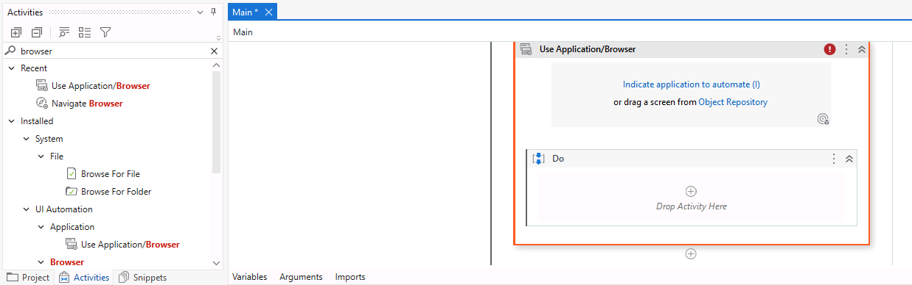
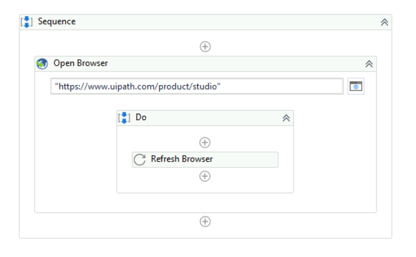

Lab 1: Creating a Basic Process
===============================

This tutorial teaches you how to create a basic process in Studio and run it on your machine. 
The example opens a browser, loads a
certain web page, scrapes information, and writes it to the
**Output** panel, and in a Notepad file.

#### Lab Solutions
Lab solution(s) are present in `Solution\Lab01` folder.

#### Projects
The main types of project supported by UiPath Studio are as follows:

#### The user interface
When you first open UiPath Studio, you are directed to the page shown in the following screenshot:

Let’s begin.

1.  In the HOME Backstage view, click **Process** to
    create a new project. The **New Blank Process** window is displayed.

2.  In the New Blank Process window:
    -   Enter a name for the new project and a description that
        summaries what you are aiming to do with this automation
        project.
        **Note:** The project name cannot exceed 128 characters, and the description cannot exceed 500 characters.
    -   Select the location where to create the project.
    -   Select **Windows - Legacy** for the **Compatibility** option and **VB** for **Language**.

3.  Click **Create**. The new project is opened in Studio.
4.  Click on `Main.xaml` file to open Designer UI.
5.  In the **Activities** panel, search for [**Open Browser**]
    and drag it to the **Designer** panel. Notice that the activity is
    automatically added inside a **Sequence**.

6.  In Use Open Browser, enter following URL:
`"https://www.uipath.com/product/studio"`

7.  From the **Activities** panel, add a **Refresh Browser** to the **Do** container of the **Use Application/Browser** activity.

8. In the ribbon, click **Run File** or use the **Ctrl + F6** shortcut to execute the project.

**Note:** When the execution is completed, notice that the URL was displayed in browser and webpage was refreshed as well.

