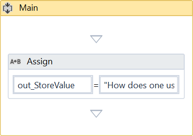
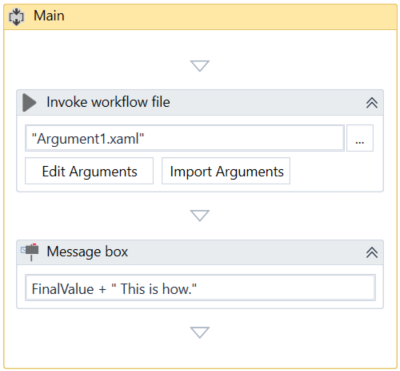
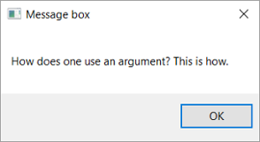

Lab 10: Using Arguments
=======================

Due to the nature of arguments, you are going to use them a lot in
relation with the **Invoke Workflow File** and **Launch Workflow
Interactive** activities. They can be found in the **Activities** panel,
under **Workflow \> Invoke** and they enable you to browse for a
project, and import and edit their arguments.

#### Lab Solutions
Lab solution(s) are present in `Solution\Lab10` folder.

**Using an Argument**

To exemplify how to use an argument in an automation with an **Invoke Workflow File** activity, we are going to create two separate sequences.
A very simple one in which to assign a value to an argument, and a
second that invokes it and displays the value in a message box.

1.  Create a new sequence.
2.  In the **Arguments** panel, create an argument,
    `out_StoreValue`.
3.  From the **Direction** list, select **Out**, and do not change the
    **Argument Type** from **String**.
4.  Add an [**Assign**]
    activity to the **Designer** panel.
5.  In the **Properties** panel, in the **To** field, add the
    `out_StoreValue` argument.
6.  In the **Value** field, type a string, such as "How does one use an
    argument?".\
     The first project should look like in the screenshot below.

7.  Create a new sequence.
8.  Create a string variable,
    FinalValue.
9.  Add an [**Invoke Workflow File**]
    activity to the **Designer** panel.
10. On the activity, click the **Browse (…)** button and browse for the
    previously created sequence.
11. Click **Import Arguments**. The **Invoked Workflow’s Arguments**
    window is displayed. Note that the argument of the first sequence is
    displayed here.
12. In the **Value** field, add the
    FinalValue variable and click **Ok**. The argument is imported and
    the value from it is going to be stored in the current project
    through the
    FinalValue variable.
13. Add a [**Message Box**] activity
    under the **Invoke Workflow File**.
14. In the **Properties** panel, in the **Text** field, type
    FinalValue + " This is how", for example.\
     The second automation should look like in the screenshot below.

15. Press Ctrl + F6 in the second sequence. The automation is executed
    correctly and the message box displays the desired text.

