Lab 10. Deploying and Maintaining the Bot
------------------------------------------------------

On completion of an automation project design, we make use of the
Orchestrator to manage our bots. Before that, we publish our workflow
first using the publish utility. Once we publish the project, the
package is uploaded to the server. Then we use Orchestrator to manage
any number of bots for any number of tasks. The Orchestrator Server also
provides the facility for scheduling bots and specifying the time
intervals that they work in according to the user\'s needs.

To understand more, let\'s see an overview of the topics to be covered
in this lab:

-   Publishing using publish utility
-   Overview of Orchestration Server
-   Using Orchestration Server to control bots
-   Using Orchestration Server to deploy bots
-   License management
-   Publishing and managing updates

Publishing using publish utility
--------------------------------------------------

We design a workflow for some functionality
so that it reduces our effort and time. When the workflow is
successfully completed, we cannot afford to open UiPath time and again
to run our workflow. So to use a workflow directly from the UiPath
Robot, we have to publish our workflow first and then schedule it
through Orchestrator. As soon as our workflow is published, we can
directly run our workflow using a UiPath Robot from Orchestrator.

### How to publish a workflow in UiPath

The following are the steps to be
followed to publish a workflow in UiPath:

1.  First, open UiPath Studio, create a new project, and give it an
    appropriate name.
2.  Go to the **`SETUP`** Ribbon and click on the **`Publish`** button.
    Now check whether the project has been published successfully or
    not:

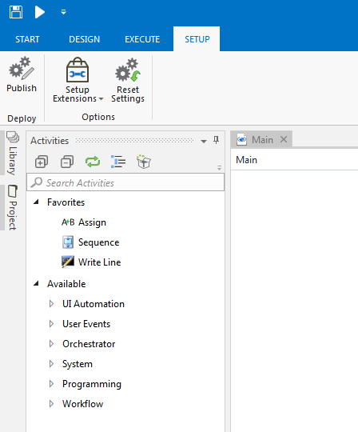

If the workflow has been published successfully, then a dialog box will
appear containing all the necessary data required to run that workflow
from Orchestrator:

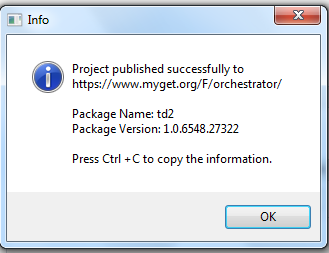

The **`Info``dialog`**box displays all
the information as mentioned in the following list:

1.  The URL of the Orchestrator where the project is published.
2.  The name of the package that has been published by you from UiPath
    Studio.
3.  The version of the package that is published to Orchestrator. When
    we create any project in UiPath Studio then by default the path is
    saved in `C:\Users\username\Documents\UiPath` or it can be
    changed manually by the user. On creating a project, a folder is
    created that contains the following types of file: 
    
    -   The`.screenshot` folder
    -   The`.xaml` file that is automatically created during
        automation
    -   `project.json`; this project file holds information
        about the project
    

When we publish the package to Orchestrator Server then it automatically
reaches the server and can be viewed on the **`Packages`** page.
However, if somehow the package is not found on the Orchestrator Server
then we can add a package manually as well, as shown in the following
steps:

1.  Click on the **`Upload Package`** option:

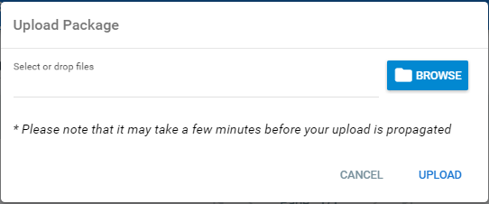

2.  Click on **`BROWSE`** and navigate to the location to which your
    package was published in the first step.
3.  Click on **`UPLOAD`**.
4.  Now search for your package by clicking
    on **`Processes`** and then typing your
    package name in the empty Search box on
    the **`Packages`** page.

#### Writing/editing the published package info into the .json file

The `.json` file can be found
inside the project. To edit the `.json` file in the project,
we should follow the given steps:

1.  Go to the project directory
2.  Open the `.json` file in any editor, such as Notepad++

3.  Now edit the main parameter of the automation project that you want to execute when the Orchestrator
    starts:

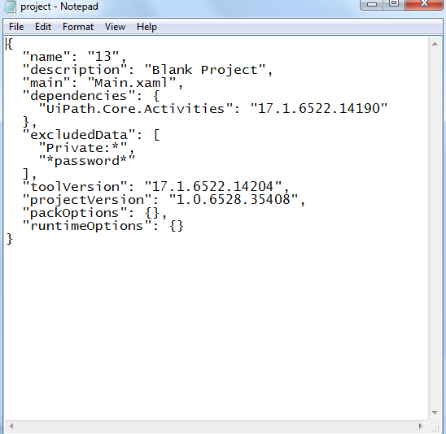

4.  Now save the `.json` file
5.  Go to Orchestrator\'s **`Processes`** page and click on
    the **`Packages`** button

Overview of Orchestration Server
--------------------------------------------------

Using of Robots was not as popular as it is now. In other words, we can
say that Robots worked within a limited
environment. But today, due to **Robotic Process
Automation** (**RPA**), Robots can work in
different environments. Nowadays, their performance is not limited. They
are now playing a big role in terms of automation, working as assistant
bots to fully potential Robots. They can work 24/7 and their
operations can be managed and scheduled
through the Orchestrator Server. UiPath Orchestrator is a web server
that provides you with an environment for maintaining and scheduling
your bots. Orchestrator is a highly accessible web server platform for
fast deployment from one Robot to many Robots.

In autonomous automation techniques, one Robot can automate another
Robot. This means a Robot can manage all the activities of another
Robot-like process; scheduling, and so on.

Robots are of two types:

-   Front office Robot (assistant Robot)
-   Back office Robot

1.  **Front office Robot** (**assistant
    Robot**): Front office Robots
    act as a helping hand to its user. These
    are the Robots that require user interactions during the process. A
    Front office Robot is an agent assistant, which means the user is
    required to interact with the process. For example, the Robot
    requires the user to provide credentials or displays some message or
    dialog to which the user is required to respond otherwise further
    processes will not work. Some business processes are required to be
    performed by the trigger activity, in which once a task is
    triggered, the Robot is capable of running automation processes
    behind the lock screen.
2.  **Back office Robot**: Back office Robots can log in to window sessions and run the automated
    process in unattended mode. They can be started with the help of
    Orchestrator. We can schedule these Robots or we can also run them manually using UiPath Robot or
    UiPath Studio.

UiPath Orchestrator has some logical components, which are given as
follows:

1.  User Interface Layer:
    
    -   Web Application
    
2.  Web Services Layer:
    
    -   Monitoring Service
    -   Logging Service
    -   Deployment Service
    -   Configuration Service
    -   Queues Service
    
3.  Persistence Layer:
    
    -   SQL Server
    -   ElasticSearch
    

### Queues

Queues work as a container that stores tasks
that need to be implemented. Simply imagine a group of boys standing in
a queue in front of a ticketing counter. The logic is that the
person who goes in first gets out first. **First In First Out**
(**FIFO**).

Similarly, in the case of Robots, when we have a number of operations
that are to be performed and when the server is busy, then tasks are
moved in a queue and they are implemented on the same logic **First In First Out** (**FIFO**).

To create a new queues, search for the Queue option in the Orchestrator
Server listed on the left-hand side and then inside the Queue page, you
can add one. It also allows you to access all those **`Queues`** that
have already been created. It contains some information about the task
such as the remaining time, progress time, average time, description,
and so on, as listed in the following screenshot:

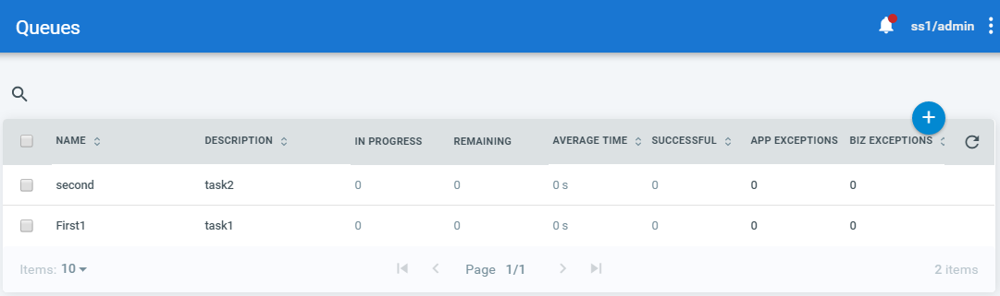

We can also add queue items from UiPath Studio and there are
various activities that support this feature,
which are listed as follows:

-   **Add Queue Item**: This activity is used to add a new
    item to the queue in Orchestrator. The status of the item will
    be New.
-   **Add Transaction Item**: This activity is used to add an item to the queue to begin transaction
    and set the status as In Progress. Here we can add custom reference
    for each respective transaction.
-   **Get Transaction Item**: This activity is used to get an item from the queue to process it and
    set its status as In Progress.
-   **Postpone Transaction Item**: This
    activity is used to define time
    parameters between which transaction should be processed. Here,
    basically, we will specify the time interval after which a process
    will start.
-   **Set Transaction Progress**: Used to assist and
    create custom progress statuses for In
    Progress transactions. To notify its progress if the process
    crashes. This activity plays a significant role in tackling
    troubleshooting processes.
-   **Set Transaction Status**: Used to modify the
    status of the transaction item; whether
    it fails or is successful.

### Assets

Assets work as variables or credentials and
can be used in distinct automation projects.
Assets provides the opportunity to hold specific information. This
information can be easily accessed by the Robot. The Assets activity can
be found from the **`Activities`** panel, as given in the following
screenshot:

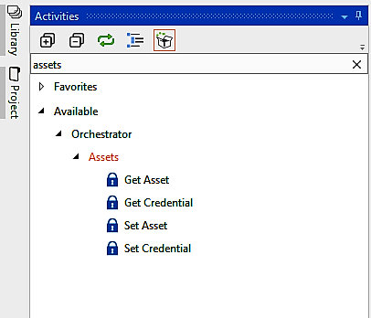

In addition, assets can also be used for
security purposes to store credentials. As we know, all credentials are
stored in encrypted format by the AES 256 algorithm. When an RPA
developer is designing a process, it can be invoked by the developer,
but its value is still hidden.

To create a new asset in Orchestrator, we are required to open the **`Assets`** page. It also shows all the
previously created assets that can be removed or edited:

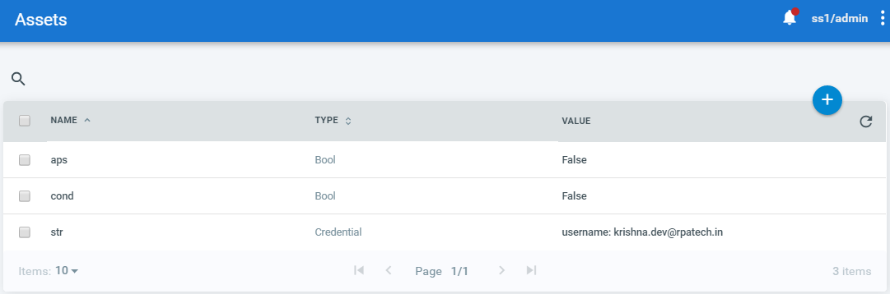

Assets are of two types:

1.  Get Asset
2.  Get Credential

The **`Get Asset`** and **`Get Credential`** activities are
used in Studio to request information from Orchestrator about a specific asset,
according to a provided `AssetName`.

The `AssetName` is required for an
already stored asset in the Orchestrator database so that the Robot can
access the information stored in Asset. To do so, the Robot needs
permission to retrieve information from that particular asset to be used
in the automation project. We can get assets using the **`Get Asset`**
activity in the **`Activities`** panel of UiPath Studio as explained
earlier.

There are four types of asset values:

1.  **Text**: This holds string
    values.
2.  **Boolean**: This supports only true or false values.
3.  **Integer**: This stores integer values.
4.  **Credential**: This holds usernames and
    passwords that are needed by the Robot to
    execute specific processes, such as login details.

Furthermore, we also have the following types of Asset:

-   **Global**: This can be accessed and used by all available Robots
-   **Per Robot**: This can be accessed only by a specified
    Robot

### Process

The process is responsible for
deploying and uploading the package to the
Orchestrator environment, and for deploying already created packages. In
UiPath Studio, we can search for `Process` inside the
**`Orchestrator`** option available in the **`Activities`** panel. It
contains a **`Should Stop`** activity that can be used to stop a process
whenever required:

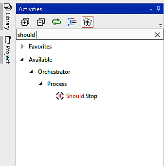

Processes assist in distributing all
**`Packages`**over the Robot machine, which
makes execution faster. We can assign jobs to these processes from the
jobs panel available in the left corner in Orchestrator:

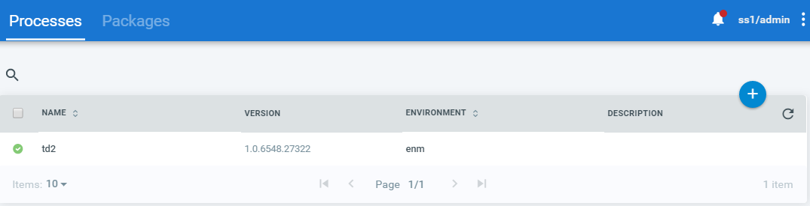

At every stage a package is linked to the environment and it is
automatically distributed with each Robot machine that belongs to a
particular environment. Whenever you make changes in the package you
created earlier and upload those changes, it creates a new version of
that package. Thus, in order to update your package, you can go to
the **`Manage versions`** option available on that package and select
the version of that package that you want to use:

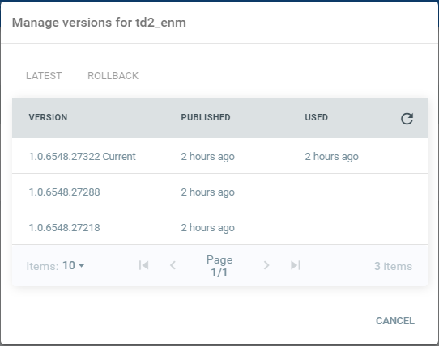

If a new update to a certain package is available then an icon is displayed on that
package.

When we are using the latest available version of a package with a
specific process, then the icon 

 will show next to the process. All activities that we are using in
Studio are stored in the NuGet feed that Orchestrator has access to.
While we add a new process, the name of the environment should be the
same as that of the Robot. This allows the execution of processes using
respective Robots.

#### Deploying a process

Deploying a process basically refers to the distribution of the packages to the Robots
available.

After successfully publishing your project from UiPath Studio, as
explained earlier, we can follow these following steps to deploy a
process:

1.  Open the Orchestrator web page.
2.  Click the **`Processes`** option on the left side.
3.  **`Processes`** windows will appear on the web page.
4.  Now click the **`+`** button to add a package. The
    **`Deploy Process`** windows will be displayed.
5.  Now choose the desired package name from the drop-down list (package
    here corresponds to the project you have published from UiPath
    Studio).

6.  Here, the description option is optional.

7.  Finally, click the **`CREATE`** button to deploy the process:

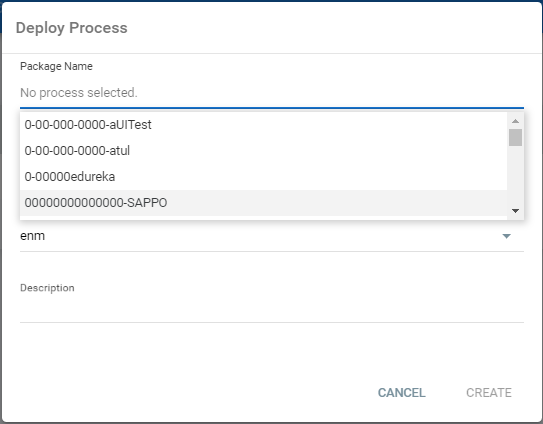

Using Orchestration Server to control bots
------------------------------------------------------------

When it comes to controlling a Robot Orchestrator is the best option. Orchestration Server can be used to
schedule bots so that Robots can execute their jobs within the time
interval specified on the server.
Orchestrator can control an unlimited number of Robots and we can very
easily assign various tasks to the Robots as per the user\'s needs.
Also, a specific task can be assigned to multiple Robots. Orchestrator
also gives us the facility to maintain all logs generated by the Robot.

### Robot statuses

The status of a Robot tells us about its availability and connectivity. We get to know whether the Robot is
available, busy, or disconnected. The following are the statuses that a
Robot can have:

-   **Available**: This status of the Robot shows that the
    Robot is not working on any other task and is freely available to
    take tasks
-   **Busy**: This type of status will be shown when a
    Robot is currently executing some task
    and is not available
-   **Disconnected**: This status of Robot shows that your
    Robot is no longer connected to
    Orchestrator Server

### Editing the Robot

Sometimes we may have to edit the Robot in
Orchestrator in case the Robot is either not
functioning properly or we want to assign some other tasks to the Robot.

To edit the Robot, click on the Edit button from the Edit window and
change the name or the necessary fields as given:

-   Name
-   Username
-   Password
-   Type
-   Description:

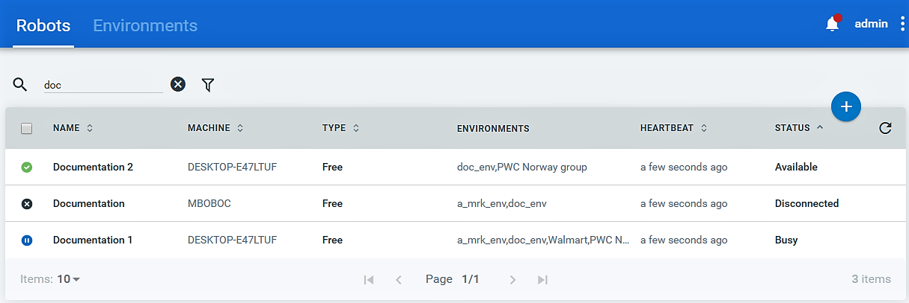

### Deleting the Robot

When a Robot is not working at all, it is
necessary to remove it, and we can use either of the following:

-   To delete the desired Robot, select that Robot and go to the admin screen by clicking on the Admin tag
    on the top of the Orchestrator Server window. Then select the
    ****`More Action`**** button and delete the Robot.

-   If you want to delete one or more Robots from the page, we can
    select them or remove them from the page.

### Displaying logs for a Robot

To view logs of a Robot, go to the Robots
page and search for your desired Robot, click
on **`More``Actions`**, and then click on **`View logs`** to view log
messages from your Robot:

Using Orchestration Server to deploy bots
-----------------------------------------------------------

To deploy Robots to Orchestrator, we need to
configure the machine with Orchestrator. To
do this, we first have to create a provisioning Robot from the
Orchestrator
URL: [http://platform.uipath.com](http://platform.uipath.com/)[*.*]

### Creating a provision Robot from the Orchestrator

The user needs; permissions to register the
new Robot and they must have the following
information:

-   The name of the machine and the key required to connect to
    Orchestrator. They can be found through the **`Control Panel`** \|
    **`System`**, for the key, log on to the Orchestrator URL, click on
    the **`ROBOTS`** page, then click on the + button. A pop up window
    appears where your key is visible.
    **`Security`**\|**`System`**and **`User`**\|**`Settings`**\|**`Deployment`**,
    which provides us the Robot API Key. 
-   The username and password of the specified machine to access it.
-   To create the provision Robot, go to the Orchestrator. Click on the
    Robot option on the left side of the Orchestrator page.
-   After displaying the Robot page, click on the + button. It will
    display a small window to create a provision Robot:

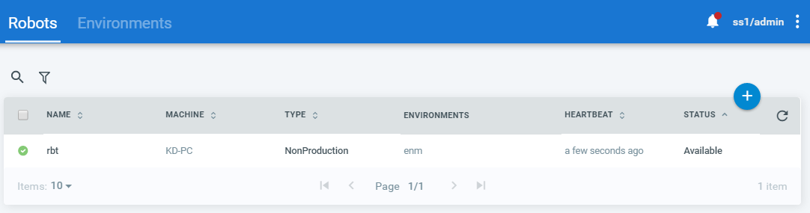

-   After the window is displayed, fill in all the mandatory information
    that is required to connect the Robot---machine name, Robot name,
    username/domain name, password, type, and description, as given in
    the following screenshot:

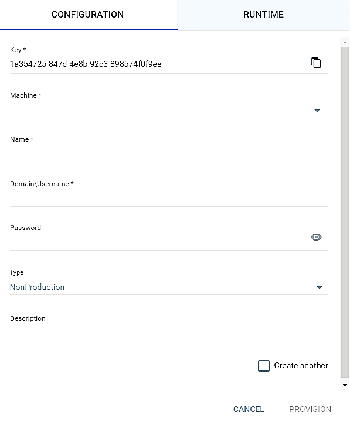

-   In the **`Machine *`** field section, enter the **`machine`** name
    that is required to connect to Orchestrator.
-   From the **`Name *`** field enter the desired name of the Robot.
-   Now in the **`Domain\Username *`** field, type the
    name that will be used to log in to the
    defined machine. Here, we need to define the format
    ****`Domain/Username *`**** if the user is in the domain.
    It is compulsory to choose a short domain
    name.
-   **`Password`** field is optional; it can be skipped.
-   We can choose the type of Robot from the drop-down list.
-   **`The description`** field is also optional. You can give a short
    summary describing your Robot.
-   Now copy the Robot **`Key *`** and paste the key in UiPath Robot
    while configuring your Robot.
-   Click the **`PROVISION`** button and the Robot will be displayed on
    the Robot page.

####  Connecting a Robot to Orchestrator

When we deploy a Robot to Orchestrator, we must have the machine
name and the key for each Robot. To keep the
value of these fields, we can create another Robot from the
**`Provisional Robot`** windows. 

If we want to create a new Robot, we have to take authentication from
administrator. By default, the administrator has the right to register a
new Robot.

To connect the Robot machine to Orchestrator, follow the given steps:

1.  From the system taskbar, click on UiPath Robot. The **`Robots`**
    windows will be displayed:

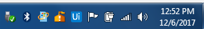

2.  Now go to **`Options`** and choose **`Settings...`**; the Robot
    Settings will be displayed:

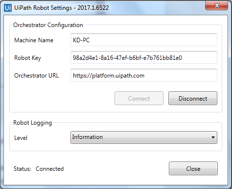

3.  In the **`Robot Key`** field, paste the received key of provision
    Robot to Orchestrator.
4.   In the **`Orchestrator URL`** field, enter the address of the
    Orchestrator.
5.   Now click the **`Connect`** button. After clicking the
    **`Connect`** button, the Robot will connect to the Orchestrator.

#### Deploy the Robot to Orchestrator

To deploy our Robot, first of all, it must be connected to Orchestrator. Ensure that our bot is
connected to Orchestrator then follow the
given steps to deploy it:

1.  First of all, install UiPath on the machine.
2.  Provision the Robot machine and take the Robot key from
    Orchestrator.

3.  After receiving the key go to the Robot configuration panel and
    enter the key here.
4.  Also, you need to enter the Robot key into the configuration URL,
    which can be found from the admin section of Orchestrator.
5.  Publish the project with publish utility from UiPath. When it is
    published successfully, it will display the information shown in the
    following screenshot:

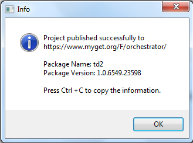

6.  The project has been published in the Orchestrator.

7.  To create the environment, go to the home page, click on the
    **`ROBOTS`** option, and click on the **`Environments`** Tab. Then
    click on the **`+`** button:

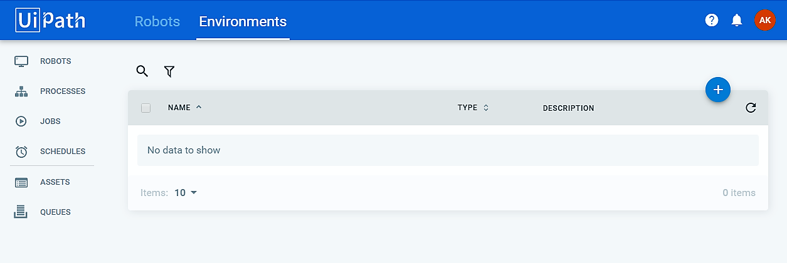

8.  Once the details are
    filled in, click on **`Create`**:

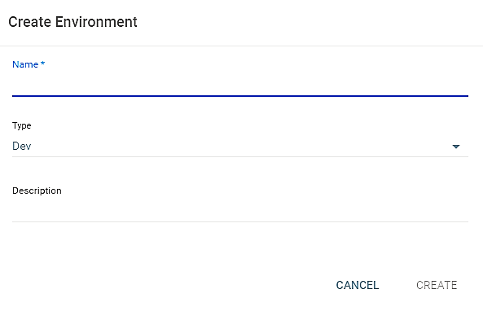

9.  After creating the environment, a small window will appear as shown
    in the following screenshot, where we can manage the Robot within
    the environment:

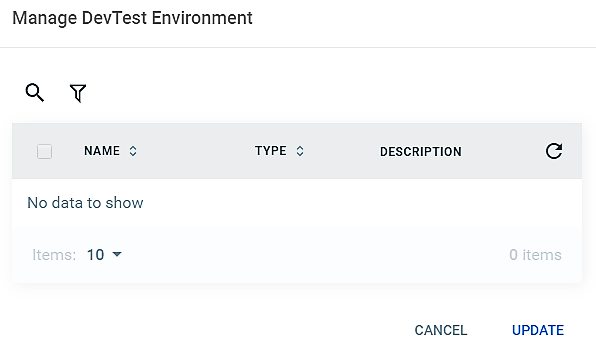

10. After clicking on the + button, a will window pop-up where we can
    choose the Published package, as shown in the following screenshot,
    and then click on the **`CREATE`** button:

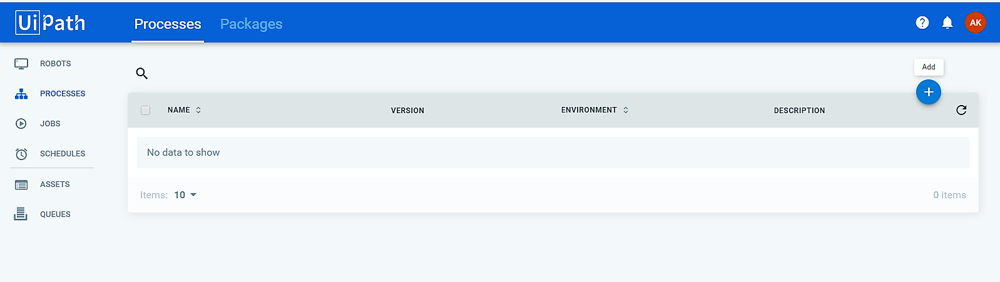

11. After clicking the **`Deploy Process`** button, a window popup will
    appear where we can choose the published package, as shown in the
    following screenshot, and then
    click on the **`CREATE`** button.

OR

12. Packages can be manually uploaded from the local directory after
    clicking the **`View Packages`** option and then clicking
    the **`Upload`** button as given in the following
    screenshot: **`PROCESS`** \| **`View Packages`** \|
    **`Upload Packages`**:

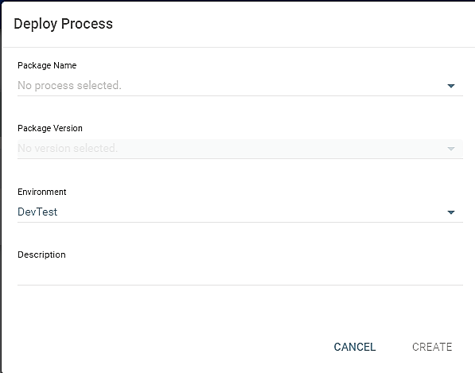

13. Now the package has been deployed to the Orchestrator and is ready
    to be executed through the web.
14. Next, click the **`JOBS`** option for execution and click on the
    **`Start`** icon as shown:

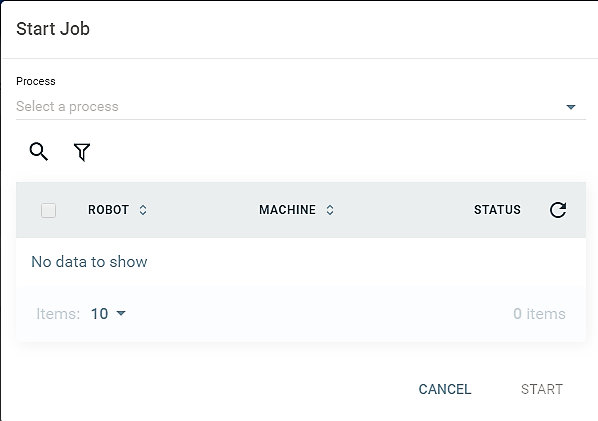

15. After clicking the **`Start Job`**
    button, the Robot will execute over
    Orchestrator.

License management
------------------------------------

To manage and deploy bots, we are required to register the license on their server. Once you have received the
license, the deployment and maintenance processes become faster.

### Activating and uploading a license to Orchestrator

After getting the license code from the sales
support team or any
centralized location, we need to follow the
given steps to activate the license and upload it to Orchestrator:

1.  It is mandatory to have the UiPath Platform installed on the local
    machine.
2.  If the UiPath Platform is not available then install it.
3.  Now open the Command Prompt as an administrator account from the
    local machine.

4.  Here we can change the directory for installing the path manually
    with the command
    `cd C:\Program Files (x86)\UiPath Platform\UiPath`.
5.  To activate a license, we need the Regutil tool. If this tool is
    available, then type the following command to activate it through
    the command
    line: `regutil activate /email=emailaddress /code=licensecode`.
6.  Now export the license information to the file using the command
    `regutil export-info /out_file=D:\license.txt`[*.*]
7.  Go to Orchestrator and click the **`Admin`** option. Then select
    the** ****`Settings`** page from the drop-down list:

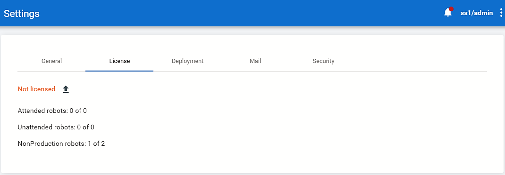

8.  As the **`Settings`** page becomes visible, we can see
    the **`License`** tab, as shown in the preceding screenshot. Click
    on **`License`**. Then under the **`License`** portion of the page,
    we can see our available license with an option for uploading it.
    Click on the **`Upload`** option.

After successfully uploading the license, navigate to the license
information, which is created by using the Regutil tool and the
uploading methodology. Here, the license expiry date of each Robot can
be checked. Whenever we connect a new Robot to Orchestrator, it consumes
a new license.

Publishing and managing updates
-------------------------------------------------

When we successfully create a workflow that
can be used to perform certain automation, it
should be published. This is necessary because, if we open UiPath Studio
and run the workflow each time we require it, then it will consume a lot
of time and also require human involvement to do it. This is not the
right approach while automating. Hence, we publish our workflow so that
it can run very easily using UiPath Robot or Orchestrator. Sometimes, we
may want to make some changes to the workflow that we published earlier.
For that, we have to make changes and publish it again so that the
latest workflow is available on Orchestrator. This workflow is also
updated to the latest version.

 In this
section, we will understand how to publish a project and how to update it. 

### Packages

When projects are published to Orchestrator
from UiPath Studio, they become packages. These packages can be found on
the **`Process`** page after clicking on the **`Packages`** option.

Published packages are shown in the following screenshot:

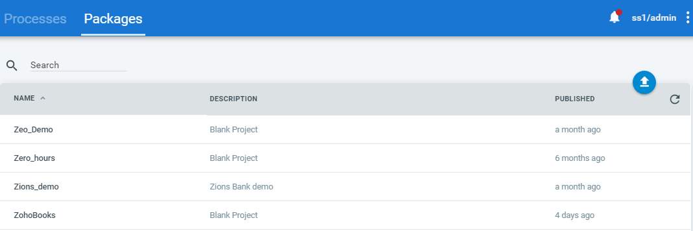

Orchestrator provides the facility to update, view, or delete your
packages from the **`Packages`** page. Every package in Orchestrator
contains a version, its published date, and its description. Suppose we
have a package and we want to make changes to that package, say, we have
added some new functionality to that package from UiPath Studio and
publish it again. In order to use the newest version of that uploaded
package, we can view that package from the **`Packages`** page, as shown
in the preceding screenshot, and then it will display all the available
package versions for that package. In order to update the version,
either select the version of your choice or click on
**`Get the latest version`** to use the latest uploaded version of that
package:

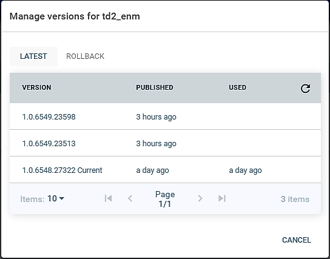

In the preceding screenshot, the user can view and delete all
published packages that were published to
Orchestrator.

Package versions can have two statuses:

-   **Active**: When a package version is in active mode then
    it means that the version is currently in use
-   **Inactive**: If a package version is inactive then it means that this version is not in
    use

### Managing packages

After a package has been created on the
Orchestrator Server, we can easily view them in the **`Packages`** tab
on the **`Processes`** page. Here, we can upload or remove packages.

#### Uploading packages

When we publish our project to the Orchestration server, it will
automatically send the package to the server.
If we want, we can upload the package manually as well. For that,
Orchestrator provides the facility to upload a project manually from the
local machine. To upload packages, we need to follow the given steps:

1.  Navigate to the **`Processes`** page, select the **`Packages`**
    option, and then click on Upload packages. A dialog will appear in
    the window like in the following screenshot:

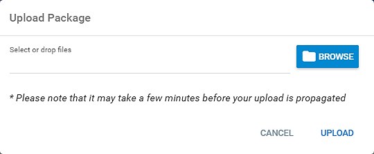

2.  Now click the **`BROWSE`** button and select the packages from the
    local machine with a name for the uploaded file.
3.  After selecting the proper package click on the **`UPLOAD`** button
    so that the package becomes available with the currently existing
    packages on the **`Packages`** page.

#### Deleting packages

When we no longer require a package then we
can easily delete it. Make sure that the process is not in active mode.
We can just select our package and click on the **`Remove`** button. We
may also remove multiple packages at the same time by checking one or
more packages from the list or by clicking on
the **`REMOVE ALL INACTIVE`** tab to remove all packages that are
inactive:

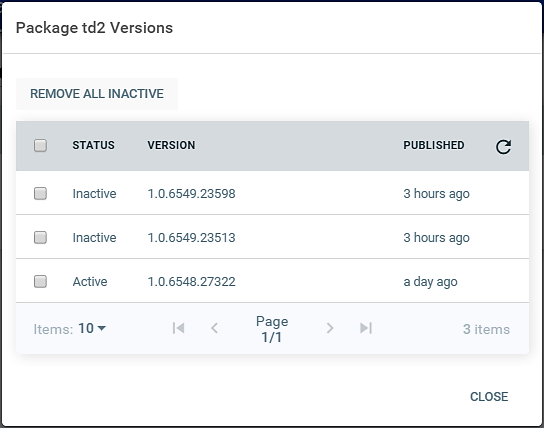

Summary
-------------------------

As we approach towards the end of the course, let us quickly go through
what we learnt. We started off by learning about RPA, its scope, and
some tools available for RPA. Then we delved into more details about
UiPath, its components, and setting up UiPath Studio to train your own
bot. You also got to know about the user interface for UiPath Studio
before beginning to design your first Robot. Once comfortable enough, we
explored a fascinating aspect of UiPath, that is, recording. In Lab 3, we saw how a
workflow was structured and the different types of project available in
UiPath---when they are used and how to use them. Lab 3 also introduced you to
activities and how to manually drag and drop activities to make our
workflow, all this in the user-friendly interface provided by UiPath
Studio!

In Labs 4 through 7, we went deeper into UiPath: we learned more
about recording, about data manipulation, the various controls in
UiPath, about extraction, selectors, OCR data scraping, and screen
scraping. We also read about the various plugins available and about
assistant bots.

That\'s not all; an important aspect of your automation journey is
properly organizing your project, as well as being prepared for handling
exceptions. All of these were dealt with in detail in Lab 8 and Lab 9. 

Finally, you were taught how to deploy your bot.

From being a novice at the beginning of the course, you are now skilled
enough to develop and deploy a bot! Your automation journey has begun!
