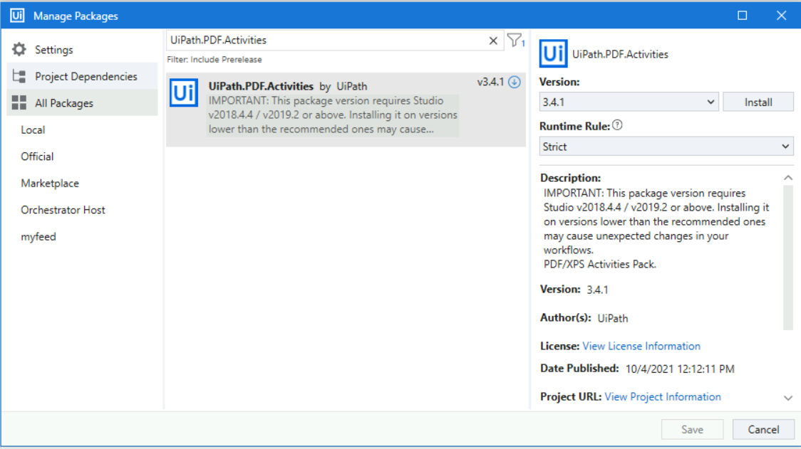
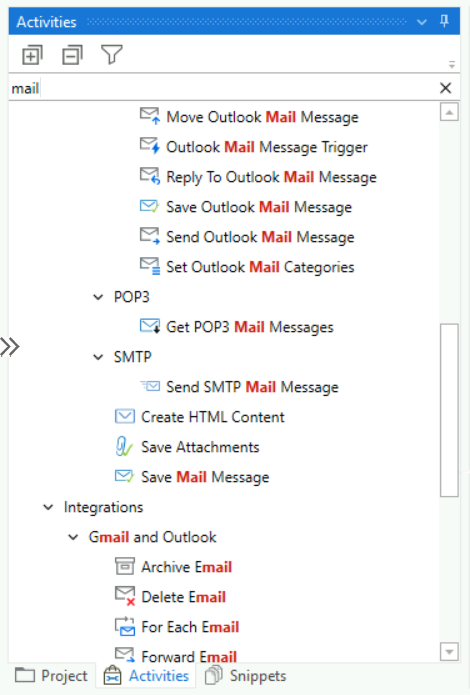
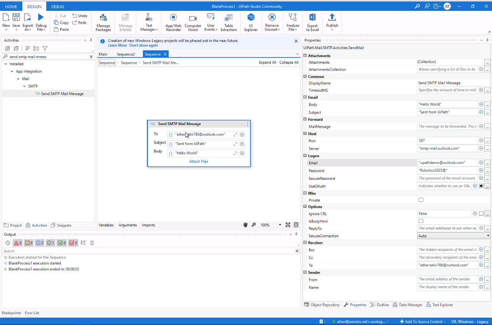
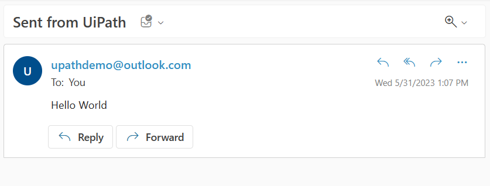

Using Mail plugin
-----------------

In this lab, we will use Mail activities. To check whether the Mail package is installed
or not, simply search for `Mail` in the **`Activities`**
panel. It will list all the mail activities. If the activities are not
listed in the **`Activities`** panel then you have to install
the `UiPath.Mail.Activities` package.

To install the Mail NuGet package, click on the **`Manage Package`**
icon at the top of the **`Activity`** panel. The **`Manage Packages`**
window will appear. Search for `mail` in the search bar. As
shown in the following screenshot, there is an **`Uninstall`** button
next to **`UiPath.Mail.Activities`**. This is because the Mail activity is already installed in UiPath Studio. If
it is not installed, an **`Install`** button will appear next to the
**`UiPath.Mail.Activities`**:



There are various mail activities that are used when working with UiPath Studio:




#### Lab Solutions
Lab solution(s) are present in `Solution\Lab11` folder.

In this lab, we will send email using following activity:

**SMTP**: It is used to send mail messages:
    -  **Send SMTP Mail messages** activity: This activity
        is used to send a mail to another mail.
    

Steps:

1) Create a blank prcoess and add above activity

2) Enter all details as shown in below screenshot:

```
Gmail SMTP Server:	"smtp.gmail.com"
SMTP port:			587
SMTP username:		"upathdemo@gmail.com"
SMTP password:		"Robotics2021@"
```



3) You can use you email and run the activity. Verify that email is received in you inbox.

**E-mail**


