Lab 11. Help Desk Ticket Generation
===========================

Let\'s get started with our first project -- a simple help desk
automation with UiPath.

Help desk agents get inputs from a variety of channels, including phone,
email, and spreadsheets, to create and update support tickets. Support
tickets are the requests that you raise by calling help desk agents to
get your issues resolved; for example, your laptop is not working, or
you have internet issues.

For this project, we will only be covering the automation of inputting
tickets from spreadsheets that a requester places in a certain folder.
We are assuming a very simple use case of ticket creation for this first
project. All you have to do in this project is to input support ticket
data in a spreadsheet and place it in a folder. The bot, once invoked,
automatically creates a support ticket within the help desk system for
you.

If you noticed, we are invoking this bot. This means that we will be
building an attended automation that behaves like an assistant -- an
assistant that raises tickets automatically!

This project will help you understand the following topics:

-   Attended RPA concepts
-   UiPath Excel automation
-   UiPath automation for web-based apps
-   Creating automation workflows and invoking them
-   Using Try and Catch for exceptions

Technical requirements
======================

The hardware and software that will be required for this project are as
follows:

-   A PC with UiPath Community edition version 19+ installed.
-   A Chrome browser with a UiPath add-on.
-   A Zoho Desk SaaS application. You can sign up for free
    at [https://desk.zoho.com](https://desk.zoho.com/).
-   Microsoft Excel 2007 and later.

Project overview
================

We will automate the creation of help desk tickets using data from an
Excel sheet. 

In this project, once the bot is invoked, it will check whether there
are new request files available to process. If available, the bot will
read the ticket data from this spreadsheet. The data is then used to
create support tickets in the Zoho Desk application.

Here is the high-level workflow for the project:

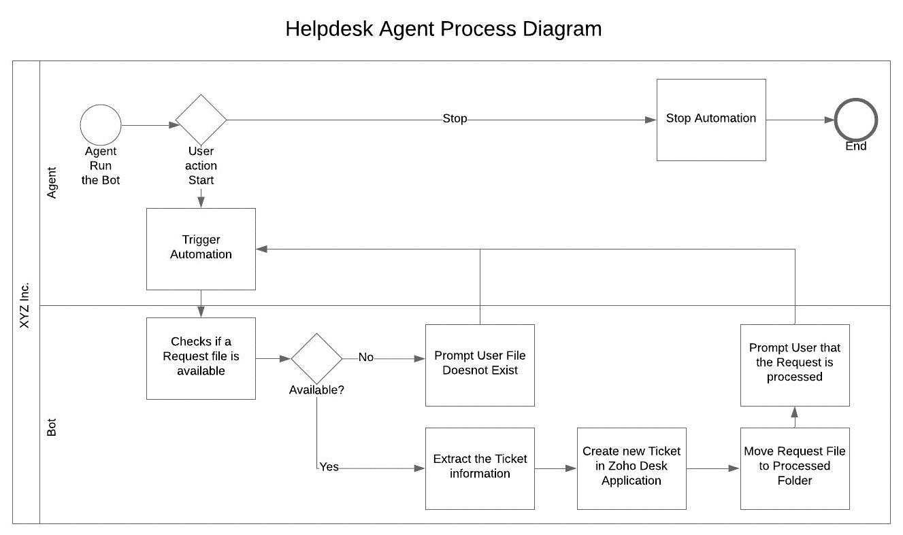

We believe it should take you around **1 hour** to build and run this
first project. Obviously, the amount of time it will take will vary
depending on your background. 

Now, let\'s dive into the details and step through the creation of the
automation. 

Project detail
==============

Let\'s now look at the overall flow for this project in terms of the
components we will be building and their interaction.

We will have a main workflow called Main.xaml, which will invoke
other workflows and orchestrate the automation. Within this workflow, we
will keep checking for the trigger *Alt *+ *S*. Once triggered, we will
check whether the Request.xlsx file is available. If the file is
available, then we will invoke ReadRequestExcel.xaml from
Main.xaml.

Within ReadRequestExcel.xaml, we will use the file path as an
input argument to open the Excel file, read the content, and store it in
three output arguments -- Name, Email, and
Subject.

Next, Main.xaml invokes ZohoAutomation.xaml with these
three arguments (Name, Email, and Subject) to
create the ticket in the Zoho desk. If all goes well, a
Successful message is returned.

Finally, once the Successful message is
received, request.xlsx is moved to the Processed folder
and the bot is ready to process new requests:

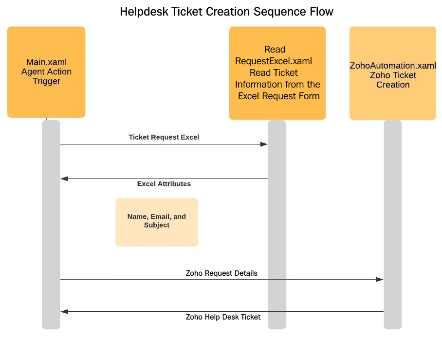

This was an overall flow to give you a high-level view of what we will
be doing to create this automation.

Before we configure our main workflow, let\'s undertake some groundwork
that is required for the project. 

Project groundwork
------------------

As part of the project groundwork, we will create the project folders,
along with a spreadsheet for the ticket data, and also log in to the
Zoho SaaS application.

Creating project folders
------------------------

Let\'s create two folders, one to accommodate the spreadsheet containing
the data to process, and the other to accommodate the processed
spreadsheets:

1.  Open Windows Explorer on your machine and create a folder for the
    project.
2.  Within this project folder, create two folders, called
    Requests and Processed, as shown in the following
    screenshot:

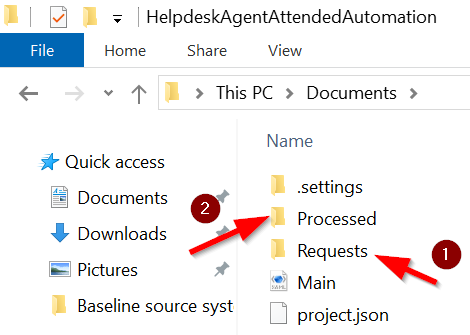

We will place the spreadsheet in Requests, and then the bot will
move the processed sheets to the Processed folder.

Next, let\'s create the requests spreadsheet. 

Creating an Excel sheet with ticket data
----------------------------------------

Now, let\'s create a simple spreadsheet with ticket data:

1.  Open Excel and create a sheet with three rows and two columns, as
    shown in the following screenshot:

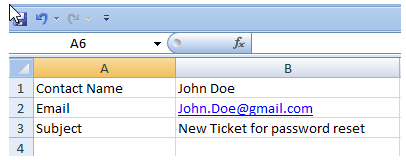

The first column contains the data labels, and the second column
contains the data you like for your support ticket.

2.  Save this file as Request.xlsx in the Requests
    folder that we created in the previous section. 

Let\'s now log in to the Zoho application. 

Registering and logging in to Zoho Desk
---------------------------------------

Perform the following steps:

1.  Go to desk.zoho.com](http://desk.zoho.com/) and choose the option
    to log in. You should be directed to a page to log in or sign up if
    you do not have an ID. Create a free desk account by filling in the
    details if you do not have one:

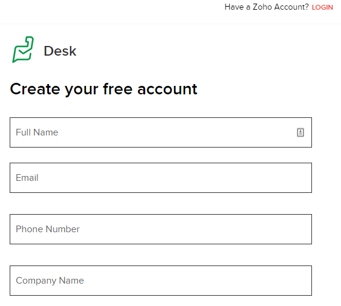

2.  Once you register with your details and company name, you will be
    walked through the steps to get started. You should eventually end
    up on the Zoho Desk view with the current tickets: 

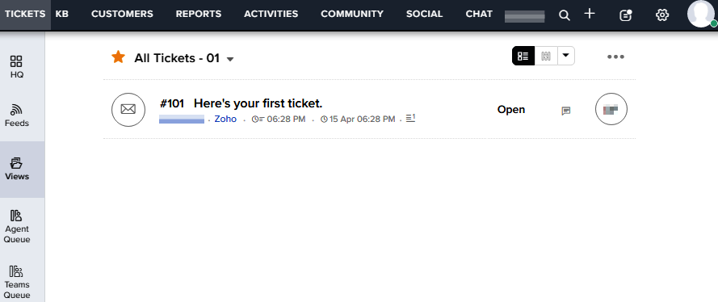

Leave the tab open with the application logged in for the automation.

That was all the project groundwork we needed to implement.

Now, as mentioned in the *Project detail* section, we will create the
workflows for the automation. Let\'s start with the main workflow.

Main workflow
-------------

Let\'s start by opening the UiPath Studio. On your Windows machine, you can go to
Start and then select UiPath Studio.

Project setup
-------------

Let\'s create a new project for our automation using the UiPath
template:

1.  On the first UiPath studio screen that pops up, select the project
    called Trigger Based Attended Automation. This will
    use a predefined UiPath template to create an attended automation
    project:

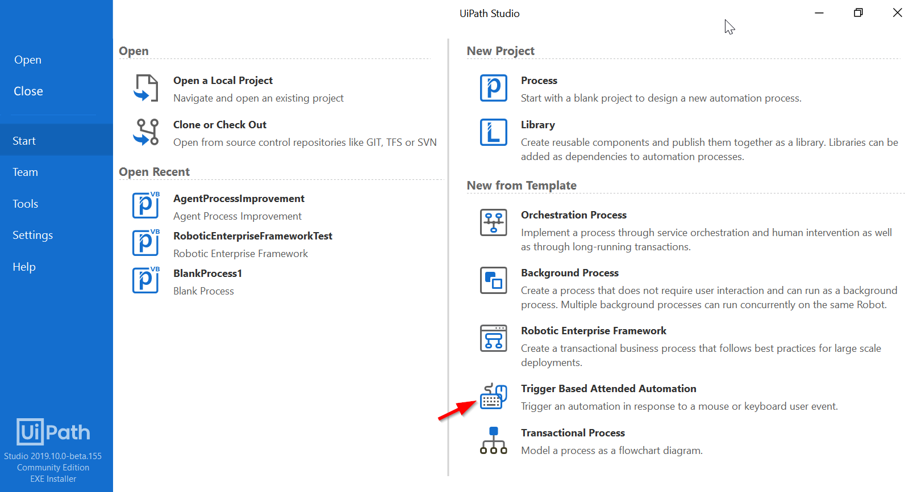

2.  Next up, provide a name for your project and an optional description
    and click on Create:

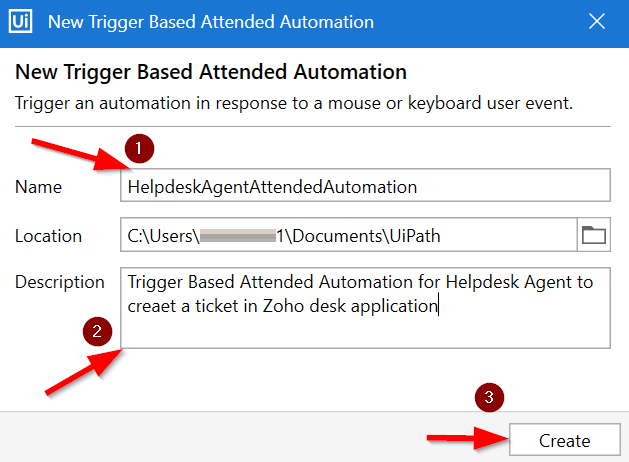

3.  On the Studio main screen, click Open Main
    Workflow to get to the main workflow.
4.  Your initial workflow should look like the following. Go ahead and
    remove the five unwanted activities highlighted in the following
    screenshot by right-clicking and selecting Delete:

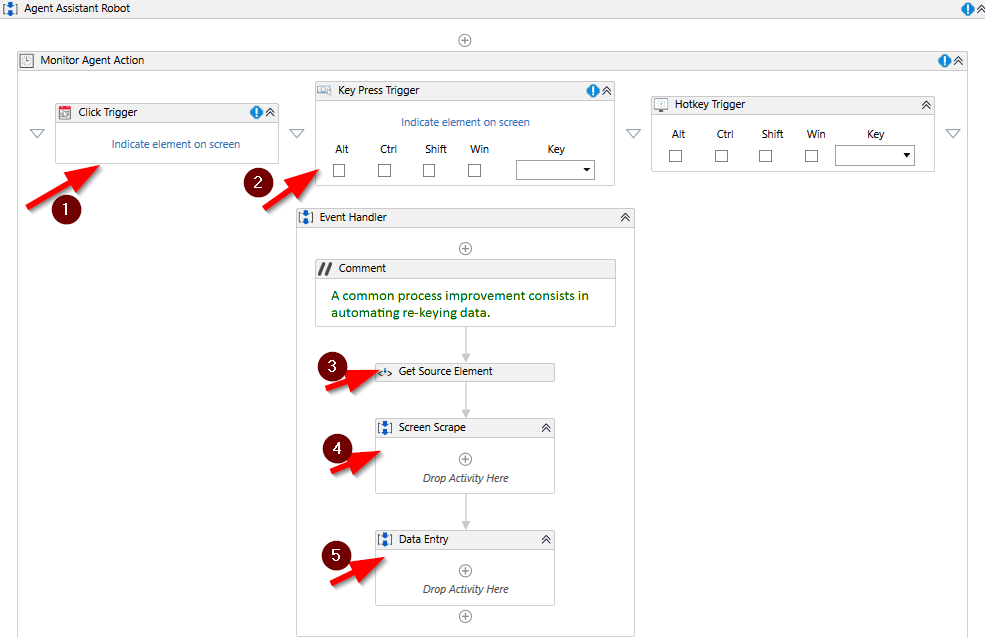

5.  Once done, ensure that you save the project and keep doing so
    periodically.

The project is now set up. We are now ready to configure the initial
part of the automation.

Configuring the initial part of the main workflow
-------------------------------------------------

We will add a few UiPath activities to initiate the attended
automation. 

UiPath activities are puzzle pieces that we use to create any UiPath
automation. The activities are automation actions, such as clicking,
typing, and message box. We can use these activities to create with
Excel, email, and the web. 

Let\'s now look at the steps to add the activities:

1.  We\'ll start by adding a message box. To do this, go to the
    Activities panel and search for message
    box: 

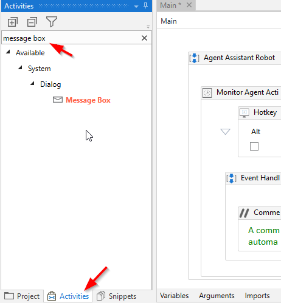

You can then drag and drop the activity to where you want it in the
workflow.

2.  Once added, click on the box for the message and type \"Agent
    Ready. Please use *ALT* + *s* to trigger the Automation\".
    Note that you must keep the quotes as you input the message. Please
    refer to the image in step 4.
3.  Next, let\'s tell UiPath which hotkey we will use to trigger the
    automation. Luckily, UiPath has provided the activity within the
    template to do just that. In the Hotkey
    Trigger activity, choose Alt and
    type in *s* for the key, as shown in the screenshot in *Step
    4*.
4.  It is always a good idea to add adequate comments for people to
    facilitate understanding of your workflow \"code\". Within Event
    Handler, let\'s start by adding a
    Comment to say Create a Zoho desk Ticket from the
    Request excel file.:

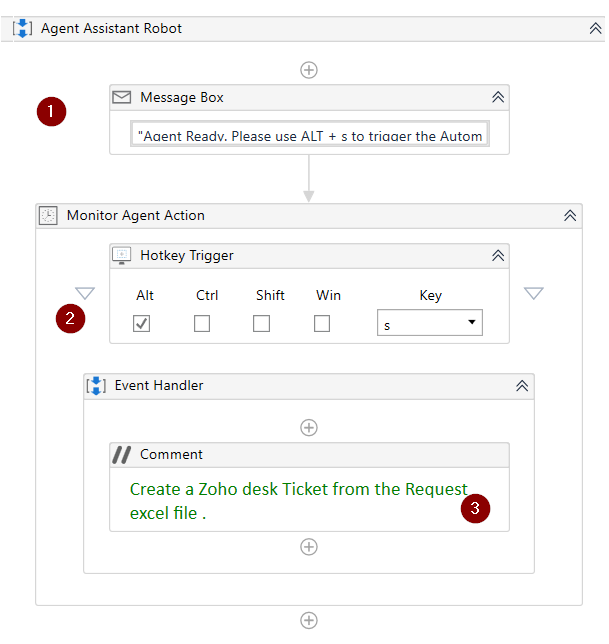

5.  As the first activity in Event Handler, we will be
    checking the Requests folder to see whether there are any
    new requests. For that, we will use the Path Exists
    activity. Follow the same steps as before to find the activity in
    the left-hand panel and drag and drop to the main workflow.

6.  Now, for this and all activities, there are UiPath properties that
    are displayed on the right pane. Let\'s use the following
    Properties for the Path
    Exists activity we added:
    -   Path:
        Environment.CurrentDirectory+\"\\Requests\\Request.xlsx\"
    -   PathType: File
    -   Exists: Create a boolean variable (use
        *Ctrl *+ *K* or right-click) and create a new variable called
        boolFileExists.

UiPath properties are the parameters and settings for the selected
activity. The properties pop up on the right panel of your Studio
interface. You can go to the panel and add or update properties for the
selected activity. 

Your sequence and properties should look like this:

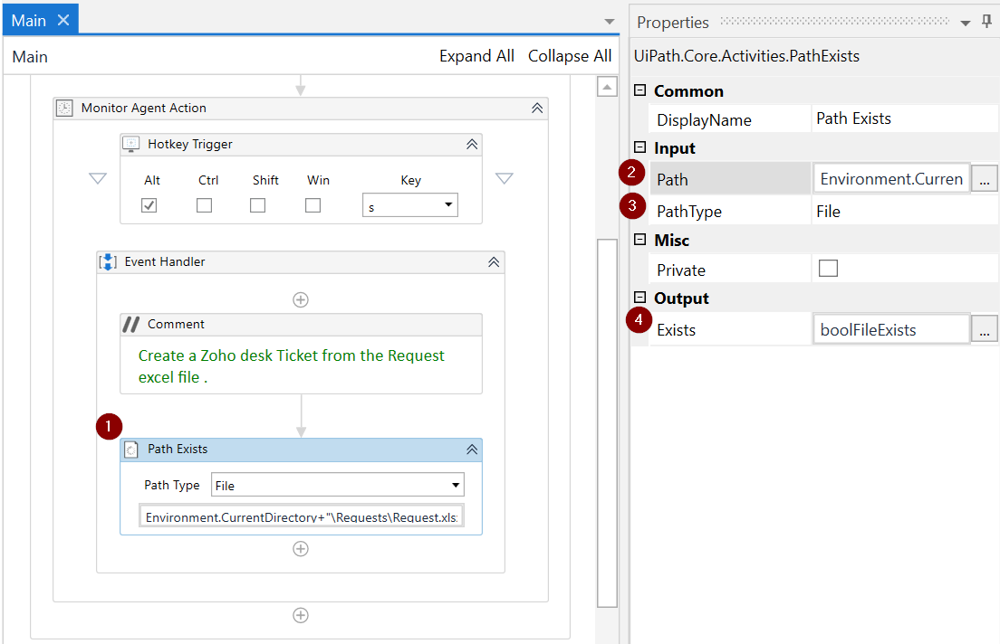

7.  Next, let\'s display a message to let the user know whether the bot
    found a request and whether it will process this request. We will
    use an If activity from the activities
    panel to do that. Add the If activity below
    the Path Exists activity.
8.  Let\'s use boolFileExists, which we created in the earlier
    step as the condition to check. Within this If
    control, add two messages boxes with messages as per the following
    screenshot to display an appropriate message to the agent:

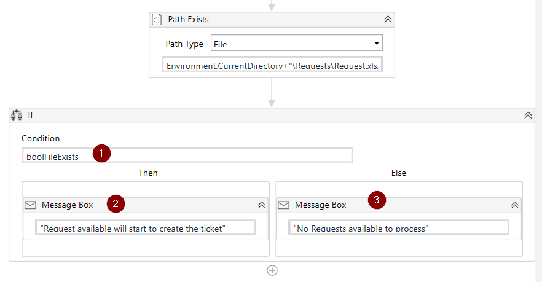

This is all for the main workflow for now. We will revisit the workflow
later to call the ReadExcelRequest and ZOHOAutomation
workflows, which we will create in the next two sections.

Reading from Excel
------------------

In this next workflow, we will pick up the Request Excel file
from the folder we created, read the ticket data, and incorporate them
in variables for the next workflow to process. This will help you get
your feet wet with Excel-based automation:

1.  Let\'s start by creating a new Sequence in the
    project. This will create a new workflow for us to work on:

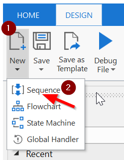

2.  Let\'s name it ReadExcelRequest and click
    Create. The studio will create a default sequence
    for you:

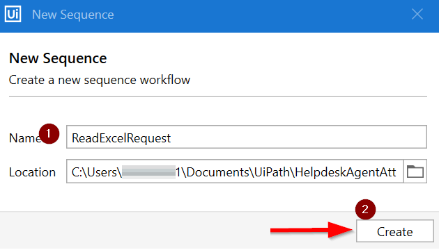

3.  Within the workflow, let\'s first add the arguments using the
    Arguments tab at the bottom of Studio (refer to the
    following information box). Arguments will enable
    us to input and output data from this workflow to the main workflow.
    Proceed and create four arguments, as shown in the following
    screenshot: 

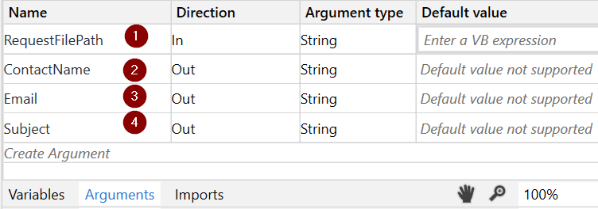

Note Direction and Argument type.

The difference between a variable and an argument is that variables pass
data to other activities, while arguments pass data to other workflows.
The Arguments tab is next to the
Variables tab at the bottom of the Studio screen.

4.  We will always use a Try-Catch block to handle any
    exceptions gracefully. So, let\'s add the Try Catch
    activity to this sequence. Then, within the Try
    block, add the Read Range activity under Workbook
    to read the specified Excel file. The Read
    Range activity reads the value of
    a specified Excel range and stores it in a
    DataTable variable.

5.  For the WorkbookPath, specify the
    RequestFilePath argument that we added in step 2. This
    argument should be populated with the path
    to Requests.xlsx when we invoke this workflow from
    Main. Your sequence and properties should look like
    this:

In the properties for the Read Range activities,
perform the following steps:

-   -   Remove the range to cover the entire sheet. To do that, add
        "" to the Range property on the right
        pane.
    -   While there, uncheck the AddHeaders property as
        we don't have header in our input file.
    -   Add an Output variable to store the data table.
        Use *Ctrl *+ *K* to add the dtRequest variable within
        the DataTable property.

6.  Next, we will use three Assign activities in the
    workflow to read from Excel and store the data for
    ContactName, Email, and Subject in
    respective arguments.
7.  Use the arguments we just created on the left-hand side of the
    activity. You can start typing the argument names and the argument
    names should pop up for you to select:

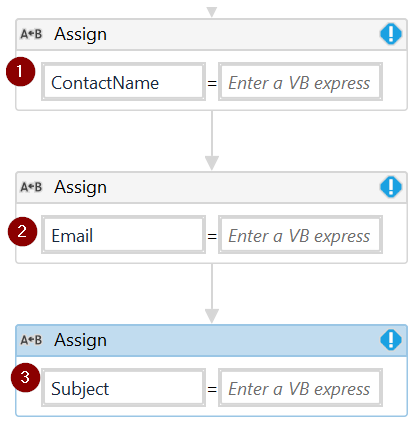

8.  We will use the dtRequest.Rows(row)(column) data table to
    read Excel values and map them to the arguments. For
    example, dtRequest.Rows(0)(1) means the first row and second
    column value in Excel. Since the output variable only accepts the
    values of the String type, we have to add
    .tostring at the end of this formula; for
    example, dtRequest.Rows(0)(1).ToString:

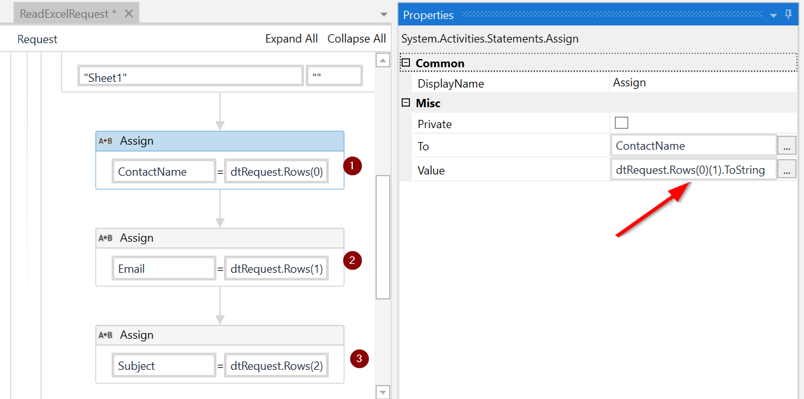

9.  After the Assign activities, add a Log
    Message activity to update the Excel read options in
    the system logs. This will help us to debug the workflow if needed:

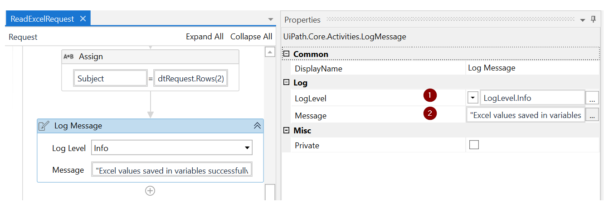

That completes our Try block sequence. We will now add
exception handling to the Catches block.

Exception handling
------------------

Let\'s handle any exceptions for this Excel automation:

1.  For this, click on Add a new Catch in the
    Catches block beneath the Try
    block.
2.  Choose exception as System.Exception and
    click the box next to it.

3.  Also, add a Log Message activity to the catch block
    and add the following:
    -   Error as the Log Level
    -   \"Error in Excel read operation with following exception:
        \"+exception.Message\" as the Message: 

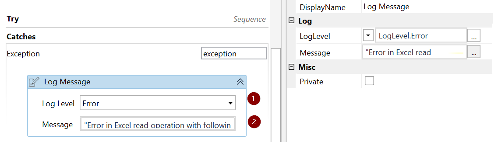

4.  Finally, within the Catches block, add a Terminate
    Workflow activity to stop the automation if there
    are any exceptions:

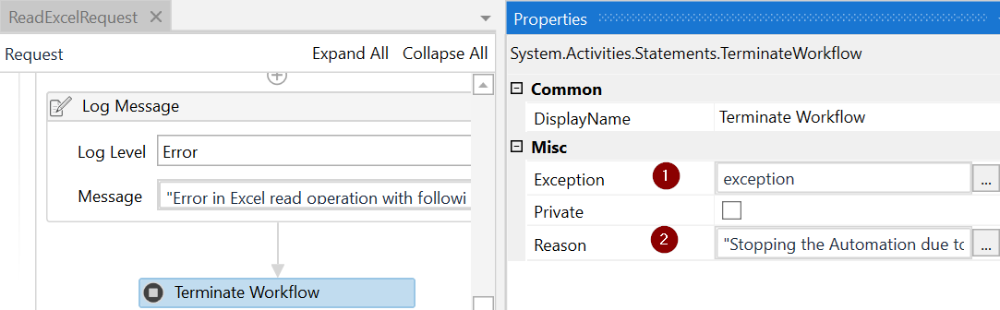

Great! This completes the ReadExcelRequest workflow where we
read the Excel and stored the request data as arguments. Now, we will
invoke this from the main workflow. 

Invoking the Excel workflow from Main
-------------------------------------

Let\'s now go back to the Main sequence to invoke this newly created
ReadExcelRequest workflow. If you recall, we added a message
within the main workflow if there are requests available to process.
Let\'s invoke the read Excel workflow right after that:

1.  Let\'s add the Invoke Workflow
    File UiPath activity in the
    Then block of the If control:

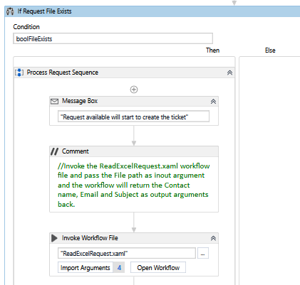

2.  Let\'s populate this new activity with the ReadExcelRequest
    workflow path. To do that, click on the three dots on the right of
    the first parameter. Select the ReadExcelRequest.xaml file
    in your project folder:

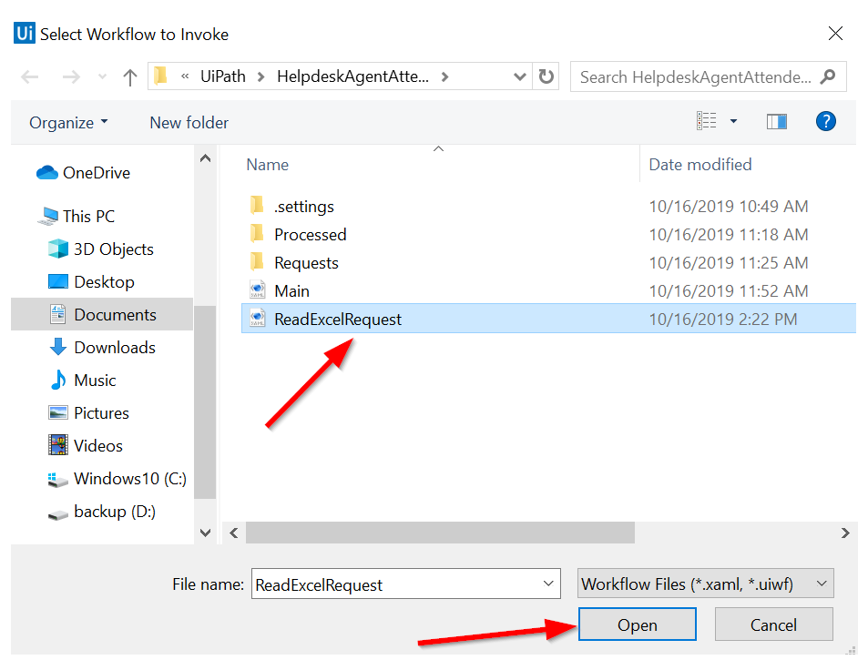

3.  Now, let\'s create three new variables to store the data that we
    would get from the ReadExcelRequest workflow. Go to the
    Variables pane at the bottom of Studio and add
    variables for contact name, email, and subject, as shown in the
    following screenshot:

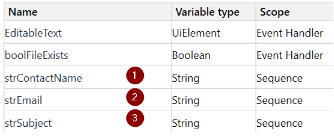

Note Variable type and Scope and
ensure that you match what is shown.

Naming convention: Please use descriptive names for variables and
arguments to enable easy understanding. We recommend that variables
follow camel case, with the standard prefixed with the type of variable,
for example, boolFileExists. Arguments can follow Pascal case;
for example, ContactName.

4.  If you recall, we had a few arguments in the
    ReadExcelRequest workflow to pass data back to
    Main. Let\'s now pass data by clicking on Import
    Arguments and mapping the data. For that, within the
    Invoked workflow\'s arguments window, let\'s
    perform the following steps: 
    -   Populate RequestFilePath with the path to the
        file: Environment.CurrentDirectory+\"\\Requests\\Request.xlsx\":

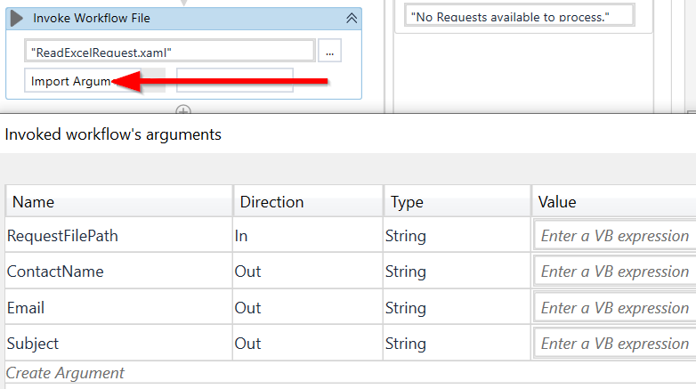

-   -   Map the new variables we added previously to the respective
        argument value:

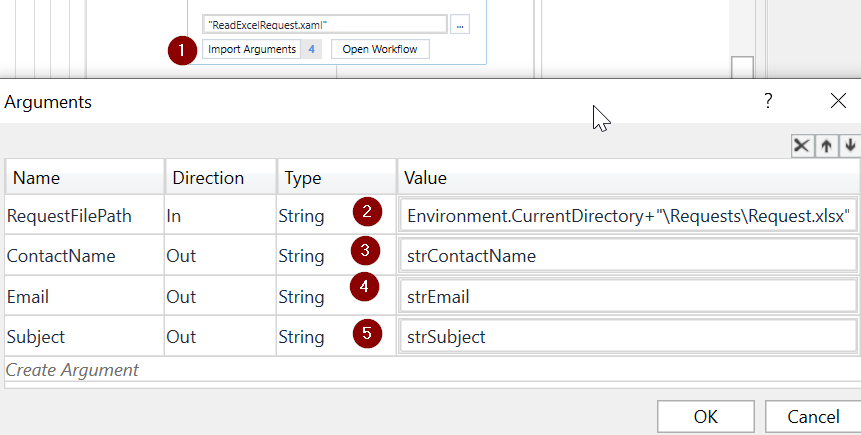

5.  Since this is a learning exercise, let\'s add a message box to
    display ContactName, Email, and
    Subject for us to establish whether the bot got it
    right:

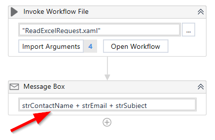

6.  Let\'s now perform a quick test of the workflow so far. Click on
    Run to run this main workflow. Please ensure that
    your Excel file is closed before you run the workflow:

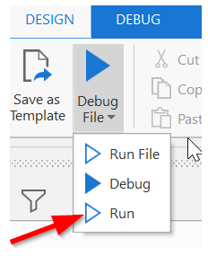

You should get the initial message that we added: Agent Ready. Press
*Alt* + *s* to trigger Automation. Click OK on
this message box to acknowledge and press *Alt* + *S* to start the bot.
Next, you should get the second message that there is a Request
file to process and so to proceed with ticket creation. Finally, when it
runs successfully, we can expect the message box with the name, email,
and subject content that we added in the steps we just completed. 

Automation will always continue to run by default. Therefore, please
click on the Studio Stop button to stop the bot. 

We have now completed the part where we read the data from the Request
spreadsheet and are now ready to take this data and create our support
ticket. Let\'s go!

Creating a support ticket in the Zoho Desk ticketing system
-----------------------------------------------------------

In this final workflow that we will create for this project, we will use
the data read from the Requests file to create the support
ticket within Zoho Desk. This will help us understand how we can
automatically input data into web applications through web application
screens. Let\'s perform the following steps:

1.  We\'ll start by creating another sequence for Zoho web app
    automation. You can call it ZOHOAutomation:

2.  Within the UiPath default workflow, let\'s add a Try
    Catch activity. Let\'s also add four arguments, as
    shown in the following screenshot, to pass the data around: 

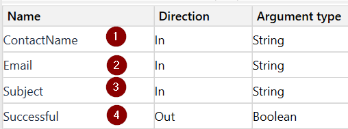

Ensure that you match Direction and Argument
type.

3.  Next, we will use the UiPath web recorder to record the steps to
    enter the Ticket data in Zoho and create a new ticket. First, go to
    your Chrome browser and ensure that the Zoho Desk home page is open
    in one of the tabs. Also, ensure that you have installed the UiPath
    add-on for Chrome in your Chrome browser. It is available on the
    Chrome App store. 

UiPath has a recorder that allows you to record mouse clicks and
keyboard sequences to automatically generate UiPath scripts. You can
also add these activities by yourself, but the recorder is a much faster
way to create these sequences. Hence, we like to show you how you can do
it. 

4.  Click within the Try block and activate the web
    recorder by clicking on the Web recorder option
    within Recording:

5.  UiPath opens a web recording panel to control the recording. Click
    on the Record button with the Zoho Desk browser tab
    open:

Now that we have the recording set up and ready, let\'s record the
actions to create a ticket in Zoho. 

Recording ticket creation activities
------------------------------------

On the Zoho desk browser tab, perform the following actions to enable
the UiPath recorder to record:

1.  Click on the + symbol to create a new ticket (at the top right of
    the Zoho desk screen):

2.  On the new TICKETS screen, type a contact name
    followed by the *Enter* key on your keyboard:

3.  Similarly, type an email followed by the *Enter* key.
4.  Type a subject followed by the *Enter* key.
5.  Click on the Submit button on the Zoho Add
    Ticket screen.
6.  Once you perform all the preceding steps, use the Windows *Esc* key
    to stop the recording. Then, click on Save &
    Exit on the UiPath web recording panel.

7.  You may occasionally find the recorded steps outside the
    Try block. Move the recorded activity into the
    Try block if that is the case. Your workflow should
    look like the following:

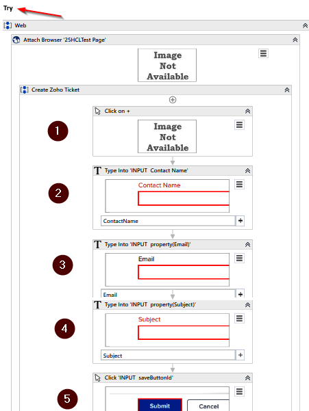

Now that we have the recorded activities, let\'s configure them for our
automation.

Configuring the recorded activities
-----------------------------------

We will now update the recorded activities as required to complete the
ticket data input. Let\'s start with the browser title name: 

1.  You can see that the recorder has created an Attach
    Browser activity. This uses the browser title to
    attach to the browser tab and perform the recorded actions. 

In our case here, the browser title is dynamic because there is a ticket
number in it. So, we will need to use wildcards to attach to the browser
tab. If your browser tab for the Zoho desk is \"123zyx\", we will just
use \"\*xyz\*\" with wildcards on both sides.

Wild characters: It is good practice to use wild characters such as
\* (one or more characters) or ? (any single character)
in the browser selectors if we know that the index, prefix, or postfix
will dynamically change during execution.

Since we may need the browser title in other activities, let\'s define a
variable called strBrowserTitle and add this as a default value,
as shown in the following screenshot:

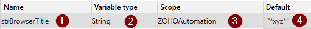

2.  Now, let\'s update the Attach Browser activity that
    the recorder added for us with the browser title variable. Click on
    the Attach Browser activity within the
    Try block. In the properties panel on the right,
    click on the option to update the Selector:

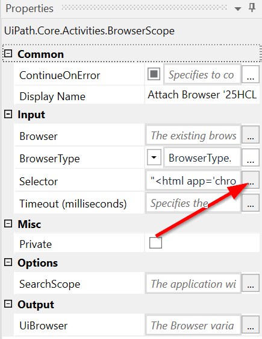

3.  In the Selector Editor window that pops up, click
    on title to update with the newly
    created strBrowserTitle variable, as shown in the following
    screenshot:

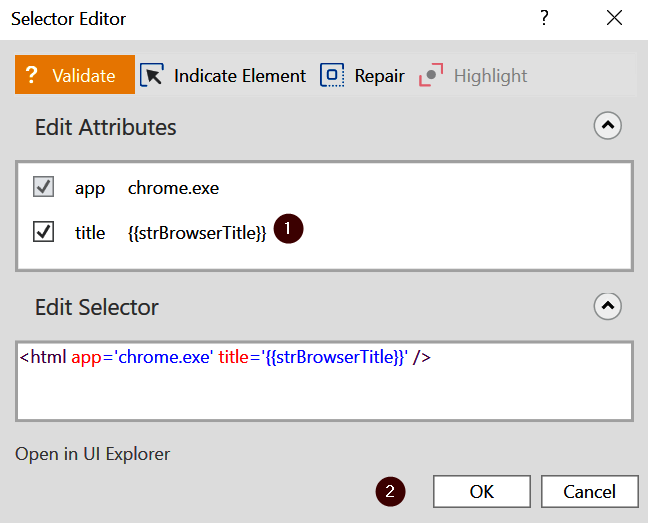

4.  Let\'s also add a new variable within the
    UiBrowser output property for the Attach
    Browser activity. We will call it
    ZohoBrowser and set its scope to
    ZOHOAutomation. We will use this variable to handle
    exceptions later in the workflow. You can use *Ctrl* + *K* to add
    the variable and set the scope, or you can add it directly to the
    variables pane in Studio:

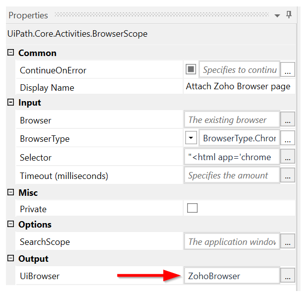

It is best practice to use a Browser variable when you attach
the browser, so as to pass the control around during web automation. In
our case, we will use this variable in the error handling sequence, as
we will use the same browser session to perform error handling.

5.  Next, let\'s activate the specific browser window by using the
    Activate UiPath activity. Add the
    Activate activity, click on Indicate element
    inside browser, and then click on the Chrome browser
    title. Let\'s also maximize the browser window if it\'s not already
    maximized. For that, let\'s use the Maximize
    Window UiPath activity:

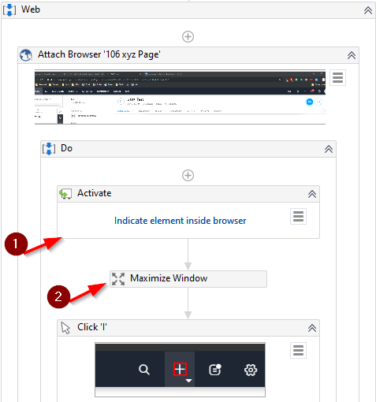

6.  To pass the ticket data to the Zoho desk fields that we recorded,
    let\'s replace the recorded text here with argument variables for
    Contact Name, Email, and
    Subject:

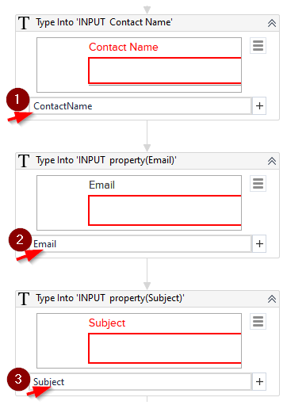

7.  Let\'s also set the ContinueOnError flag to
    False in the Properties panel for these
    three activities so that we can stop execution and handle them if
    there are errors:

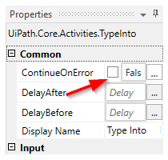

That is all the updates we require in order to make to the recording.
Let\'s now check whether the ticket was created successfully.

Validating successful ticket creation
-------------------------------------

By way of a final step in this ticket creation automation, let\'s ensure
that the ticket was added successfully:

1.  To do this, let\'s check whether Zoho Desk moved to the next page by
    checking whether the Close Ticket option is on
    screen.
2.  Since our ticket is already created (during our record sequence), go
    back to the Zoho ticket application in Chrome and click on the newly
    created ticket. You should now see the Close Ticket
    option at the bottom of the screen: 

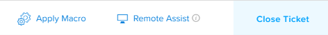

3.  To check for the element, let\'s add an Element
    Exists activity within the ZohoAutomation workflow.
    Within the added activity, click on Indicate element in the
    browser and choose Close Ticket in
    the bottom-right corner of the Zoho ticket details screen:

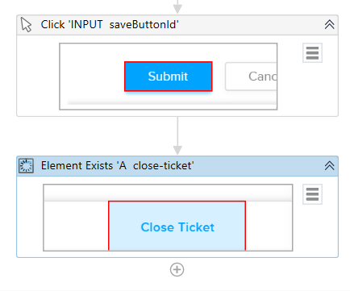

4.  Also, go to the Properties window (on the right
    pane) of this Element Exists activity and add
    the Successful argument as output:

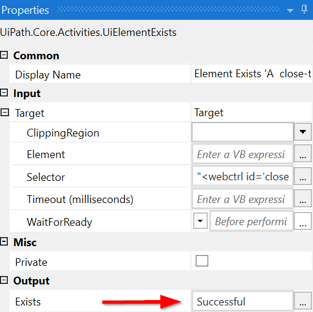

5.  Let\'s now check whether the ticket was added successfully. Let\'s
    add an If activity to check for the Close
    Ticket element.
6.  If the element exists, we will log a message to say Ticket was
    created in Zoho desk. Use the Log
    Message activity for that.
7.  If the element does not exist, this means that we have a functional
    error (for example, there was no data in the sheet) and the ticket
    could not be created. In this scenario, let\'s log an error message
    indicating that the ticket could not be created. For that, add a new
    Sequence activity within the Else
    part. Within Sequence, add a Log
    Message activity with the Log
    Level Error and a Message box with
    a \"Ticket Not created in Zoho desk\" message:

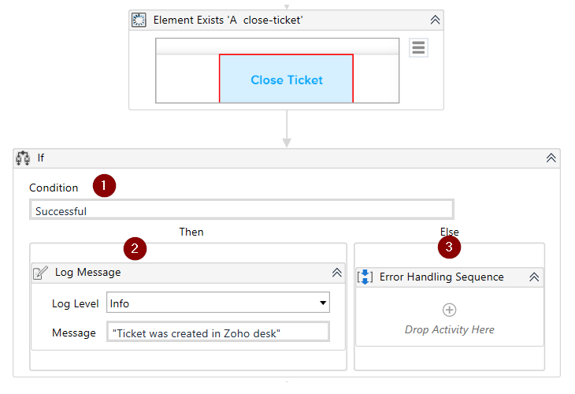

We checked for the successful creation of the ticket. Let\'s now handle
any exception scenarios. 

Handling exceptions
-------------------

If there is an unexpected exception or error, then the bot should ensure
that we bring the target application to a stable state where it can
proceed with the next transactions. The following few steps guarantee
this:

1.  Within the Else block, to ensure that the target
    application is in a stable state, we will attach an element on the
    screen to the browser. Let\'s add a new Attach
    Browser activity to handle the error handling
    activity in the already opened Chrome browser:

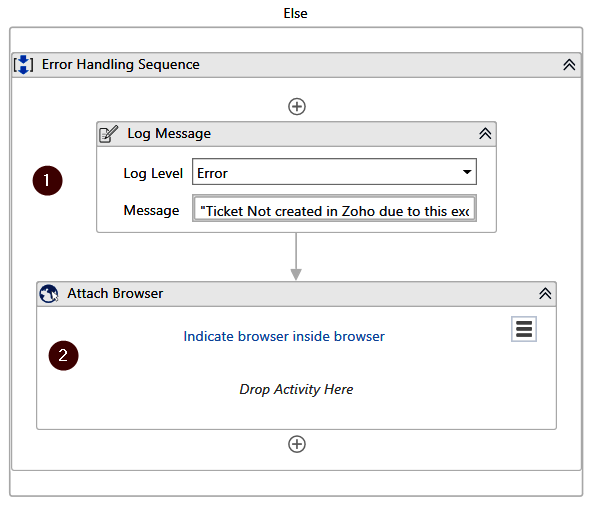

2.  On the properties side of Attach Browser,
    update Browser with the ZohoBrowser
    variable and set the BrowserType as Chrome to
    continue to use the same browser session:

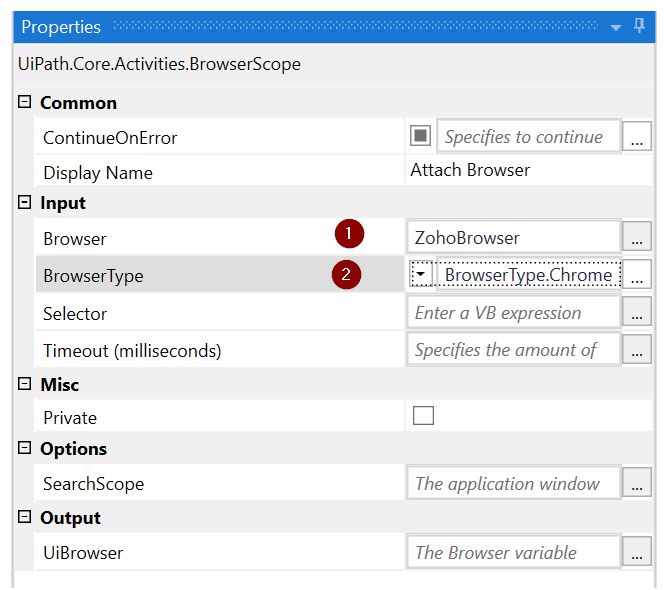

3.  Add a Mouse Click activity to the newly created
    sequence and click on Indicate element inside the
    browser. Then, go to the browser, and click on the
    TICKETS menu option in the top left-hand corner of
    the Zoho desk screen:

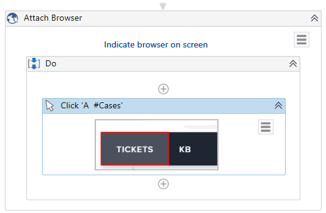

This step will enable automation to get control of the home page of the
web application if a ticket has not been created.

This completes the Try block. Now, let\'s handle any
system exceptions. 

4.  Moving out of the overall Try block, let\'s update
    the Catches block. Add a new catch of
    the System.exception type to the
    Catches block. Copy the error
    handling sequence that we added in the Else block
    and paste it into this Catches block:

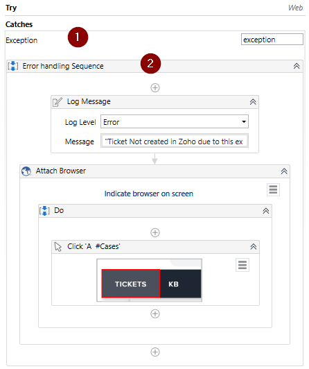

So we have now completed the web (Zoho Desk) automation as well. Here,
we took the request data and incorporated it into Zoho Desk. Finally, we
will go to the main workflow, invoke this workflow, and finalize the
automation.

Putting it all together
-----------------------

It is time to finish up the main workflow so that it reads the requests,
creates the tickets, and then moves the Request spreadsheet out
once processed. In order to do this, perform the following steps:

1.  Go back to Main.xaml, create a new variable called
    boolTicketCreated of the Boolean type, set the scope to
    Event Handler sequence, and set the default value
    as False:

We will use this to check whether the ticket was created successfully.

2.  To invoke the Zoho Desk workflow that we just added, let\'s add a
    new Invoke Workflow File activity and browse to the
    ZOHOAtuomation.xaml file:

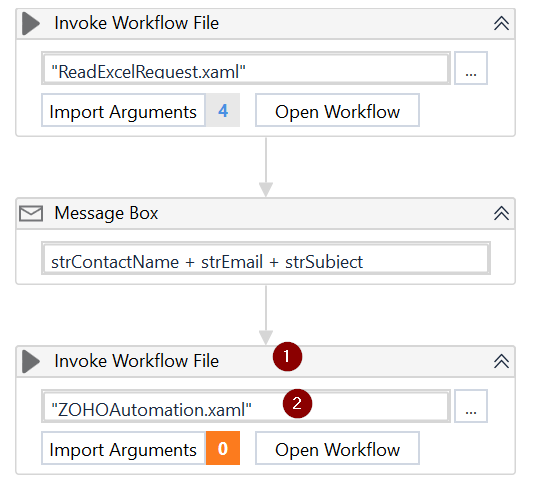

Note that we are adding this to the Then part of
the If control we last added in Main.

3.  Let\'s import the arguments by clicking on Import
    Arguments within the Invoke activity. On the
    popup, map the arguments to the strContactName,
    strEmail, strSubject, and
    boolTicketCreated variables:

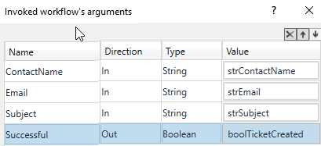

4.  Next, let\'s use this last variable, boolTicketCreated, and
    add an If control:

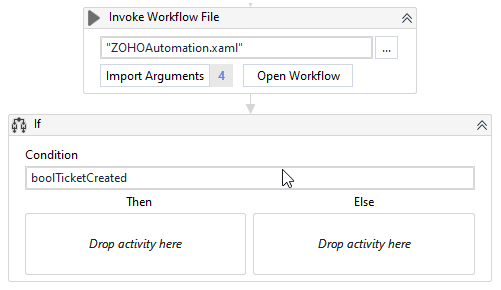

5.  If the ticket was created, then we will move
    Request.xlsx from the Requests folder to
    the Processed folder. For that, let\'s add a Move
    File activity within the Then block
    with the following inputs:
    -   From:
        Environment.CurrentDirectory+\"\\Requests\\Request.xlsx\".
    -   To:
        Environment.CurrentDirectory+\"\\Processed\\Request.xlsx\".
    -   Check the Overwrite checkbox.
6.  Finally, add a Message Box with the message \"Zoho
    Ticket Created and File Moved to the Processed Folder. Use *ALT*+*S*
    to check for new requests to process.\". Also, add a Log
    Message activity with the same message and a Log
    Level of Info.

7.  Next, in the Else branch, let\'s add a Message
    Box saying \"Zoho Ticket not created and file is
    not processed yet. Please check the input request file and Use ALT+s
    to reprocess the same request\". Also, add a Log
    Message activity with the same message and a Log
    Level of Error:

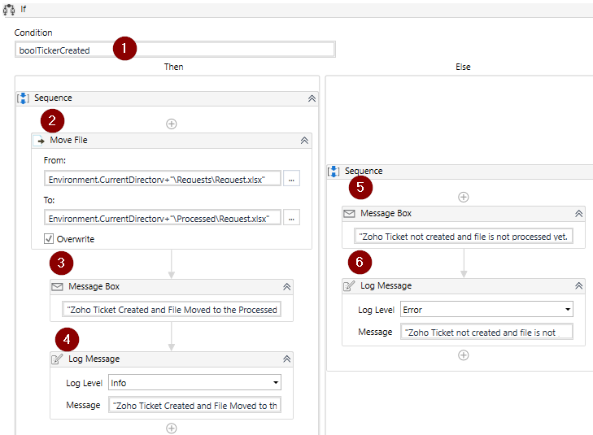

8.  Let\'s save the project. Go to Remove Unused
    Variables in Studio and click on Validate
    Project:

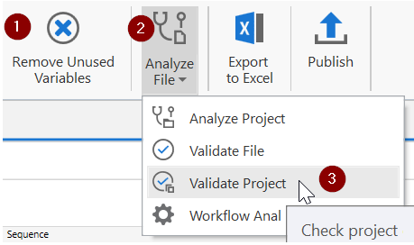

You should get a message from Studio saying No errors
found. Now, we are ready to test the project.

Testing the automation
----------------------

Let\'s now test the automation with all the workflows end to end:

1.  Go to the main workflow and click on Run, as shown
    in the following screenshot:

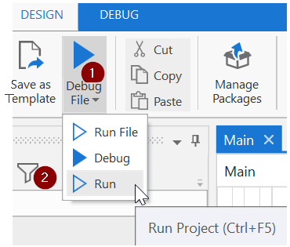

2.  Once you get the first message box, click OK and
    then use *ALT* + *S* to trigger the automation. Click
    OK on the next few message box prompts. Remember
    that we added these message boxes to bring visibility to the
    workflow execution:

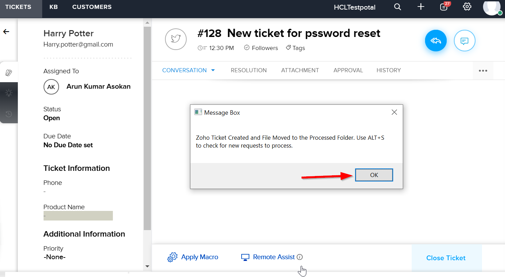

3.  Go to the Processed folder and check whether the
    Request.xlsx file has been moved there:

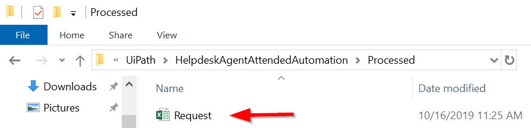

If you encounter issues, you can use the Debug option
to run through the steps and ascertain where the issues are. 

4.  Before you go, do not forget to stop the automation by clicking on
    the STOP button on UiPath Studio.

That\'s it! We have completed our first project in UiPath that automated
the process of creating a support ticket.

We can implement a few enhancements and make things a little more
interesting by trying out the following suggested enhancements. 

Project enhancements 
---------------------

Here are a few simple, but interesting, things you can try out to
enhance the project and learn more:

1.  After processing, try to rename the Request file as
    Request + Date Timestamp before moving it to the
    Requests folders.
2.  Try to capture all the fields (not just the mandatory three) to
    create the ticket in Zoho.
3.  Enhance attended automation to include the option to Stop
    Automation by using a hotkey.

Summary
=======

We have completed an attended automation project with UiPath! We
explored Excel and web app (Zoho Desk) automation. We broke the
automation down into logical parts, including Excel, Zoho, and the main
workflow, to keep it clean and separate. 

We used arguments to pass data around and variables to store them within
a workflow. You also got a sense of how you can use
Try-Catch blocks to handle exceptions and the If control
to handle true-false conditions. 
