Read PDF Files
==============

You can read and separately extract the content of
.pdf files using activities that can read all characters included in the
document.

Depending on your needs, you can use a simple activity that can
recognize the characters, or use one with an OCR engine. The benefits of
using an OCR engine are that the document reading can be applied even on
scanned, signed, or handwritten documents.

The example below presents two situations of reading a .pdf file:

-   The first one explains how to read the
    .pdf file while using the **Read PDF Text** activity.
-   The second one explains how to read the
    .pdf file while using the **Read PDF with OCR**
    activity.
    
    The main difference between the two scenarios is that the second
    one is also using OCR engines, meaning that the details of extracted
    information are more accurate than in the first case if the analyzed
    file is an image, scanned, or includes signed or handwritten fields.
    You can find both activities in the **UiPath.PDF.Activities**
    package.

Only one workflow is required for both scenarios, common until the point
of asking the user to choose the desired reading method.

This is how the automation process can be built:

1.  Open Studio and create a new **Process** and install PDF Plugin:

PDF plugin
----------------------------

To use any PDF activities, you have to install the PDF NuGet package. To
check whether the PDF package is installed or not simply search for
PDF activities in the **`Activity`** panel. It will list all PDF
activities. If PDF activities are listed in the **`Activities`** panel,
you have to install the `UiPath.PDF.Activities` package.

To install the PDF NuGet package, click on the **`Manage Package`**
icon at the top of the **`Activities`** panel.

The **`Manage Packages`** window will appear. Search for
`PDF` in the search bar. As shown in the following screenshot,
there is an **`Uninstall`** button next to
**`UiPath.PDF.Activities`**. This is because PDF activity is already
installed in UiPath Studio. If it is not installed, an
**`Install`** button will appear next to **`UiPath.PDF.Activities`**:

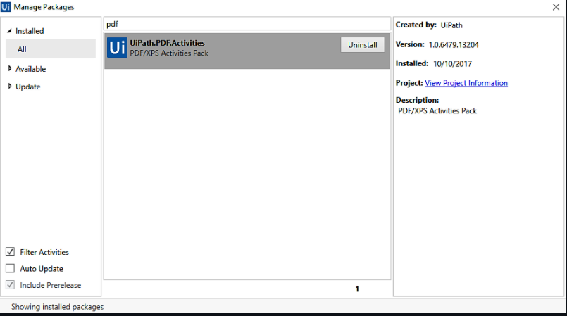

2.  Drag a **Flowchart** container in the **Workflow Designer**.

- Create the following variable:

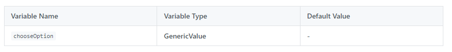

**Note:** Copy following pdf files in the folder where you project is created. These files are present in are present in `Solution\Lab12` folder.

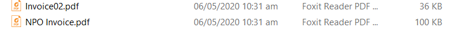

3.  Drag an **Input Dialog** activity and connect it to the **Start Node**.

-   In the **Properties** panel, add the expression
    "Choose one option below:" in the **Label** field.
-   Add the expression
    {"Read PDF Text", "Read PDF With OCR"} in the **Options** field.
-   Add the value
    "Options" in the **Title** field.
-   Add the variable
    chooseOption in the **Result** field.

4.  Place a **Flow Decision** activity below the **Input Dialog**
    activity and connect it to it.

-   In the **Properties** panel, add the expression
    chooseOption = "Read PDF Text" in the **Condition** field.

5.  Drag a **Sequence** container and connect it to the **True** branch
    of the **Flow Decision** activity. The name of the **Sequence**
    should be **Read PDF Text**. This activity extracts information by
    using regular expressions.

-   Create the following variables:

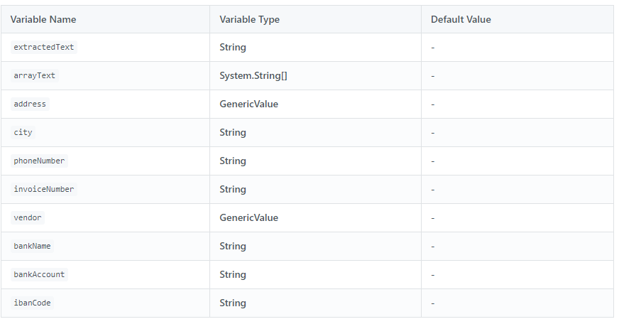

6.  Drag a **Sequence** container and connect it to the **False** branch
    of the **Flow Decision** activity. The name of the **Sequence**
    should be **Read PDF With OCR**. This activity extracts information
    by using an OCR engine (Microsoft OCR and Tesseract OCR).

-   Create the following variable:

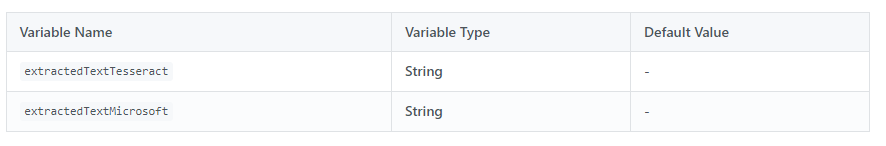

This is how your workflow should look up until this point:

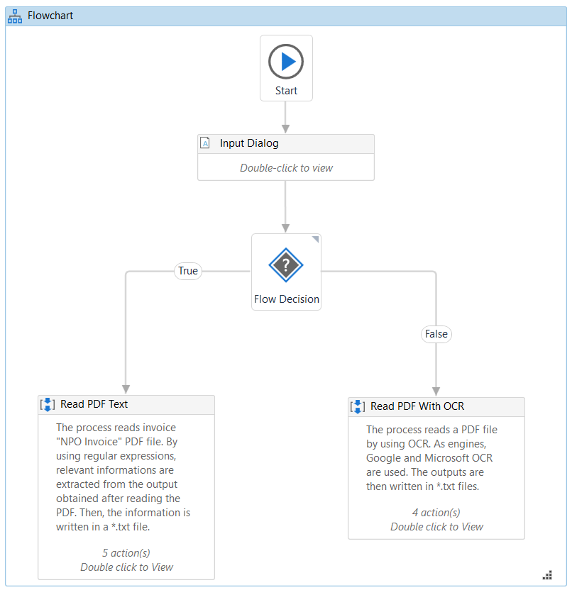

 

Read a PDF File using the **Read PDF Text** activity

1.  Open the **Read PDF Text** sequence container by double-clicking on
    it.
2.  Drag a **Read PDF Text** activity inside the sequence.

-   In the **Properties** panel, add the expression
    "NPO Invoice.pdf" in the **FileName** field.
-   Add the value
    "All" in the **Range** field.
-   Add the variable
    extractedText in the **Text** field.

3.  Place an **Assign** activity under the **Read PDF Text** activity.

-   Add the variable
    arrayText in the **To** field.
-   Add the expression
    extractedText.Split(Environment.NewLine.ToArray,
    StringSplitOptions.RemoveEmptyEntries) in the **Value** field.

4.  Drag an **If** activity below the **Assign** activity.

-   Add the expression
    `arrayText(0).Equals("Tiefland Glass AG")` in the **Condition** field.

5.  Drag an **Assign** activity inside the **Sequence** container.

-   Add the variable
    address in the **To** field.
-   Add the expression
    arrayText(2) in the **Value** field.

6.  Drag another **Assign** activity and place it below the previous
    one.

-   Add the variable
    city in the **To** field.
-   Add the expression
    `arrayText(3).Split(","c)(0)` in the **Value** field.

7.  Drag another **Assign** activity and place it below the previous
    one.

-   Add the variable
    phoneNumber in the **To** field.
-   Add the expression
    `arrayText(4).Split(":"c)(1).Split({"INVOICE"},StringSplitOptions.None)(0)`
    in the **Value** field.

8.  Drag another **Assign** activity and place it below the previous
    one.

-   Add the variable
    invoiceNumber in the **To** field.
-   Add the expression
    `arrayText(4).Split(":"c)(1).Split({"INVOICE"},StringSplitOptions.None)(1).Split("#"c)(1)`
    in the **Value** field.

9.  Drag another **Assign** activity and place it below the previous
    one.

-   Add the variable
    vendor in the **To** field.
-   Add the expression
    `arrayText(arrayText.Count-5)` in the **Value** field.

10. Drag an **Assign** activity inside the **Else** field.

-   Add the variable
    address in the **To** field.
-   Add the expression
    arrayText(1) in the **Value** field.

11. Drag another **Assign** activity and place it below the previous
    one.

-   Add the variable
    city in the **To** field.
-   Add the expression
    `arrayText(2).Split(","c)(0)` in the **Value** field.

12. Drag another **Assign** activity and place it below the previous
    one.

-   Add the variable
    phoneNumber in the **To** field.
-   Add the expression
    `arrayText(3).Split(":"c)(1).Split({"INVOICE"},StringSplitOptions.None)(0)`
    in the **Value** field.

13. Drag another **Assign** activity and place it below the previous
    one.

-   Add the variable
    invoiceNumber in the **To** field.
-   Add the expression
    `arrayText(3).Split(":"c)(1).Split({"INVOICE"},StringSplitOptions.None)(1).Split("#"c)(1)`
    in the **Value** field.

14. Drag another **Assign** activity and place it below the previous
    one.

-   Add the variable
    vendor in the **To** field.
-   Add the expression
    `arrayText(arrayText.Count-5)` in the **Value** field.

    This is how your **Sequence** should look up until this point:

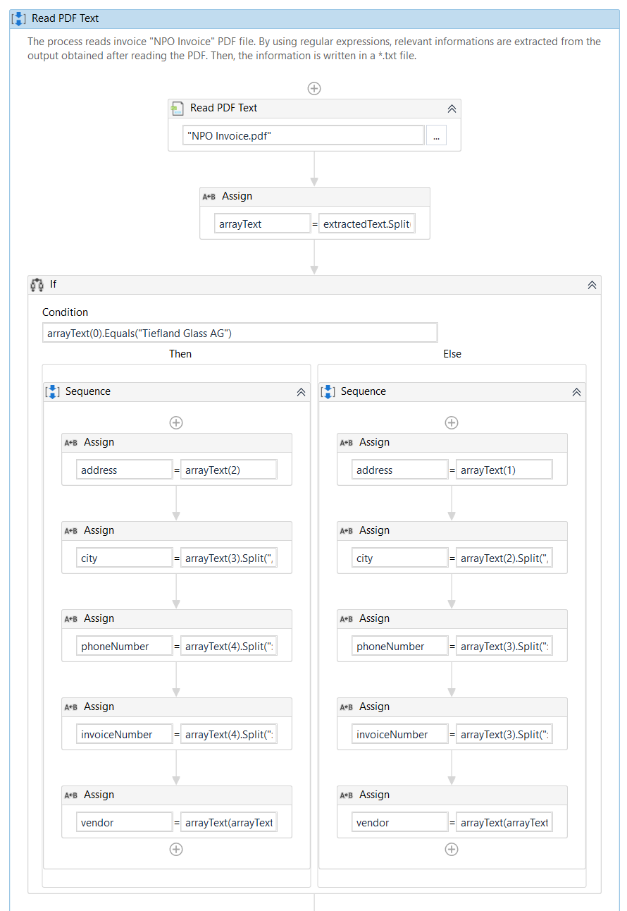

15. Place a **For Each** activity below the **If** container and
    double-click the activity to open it.

-   Add the variable
    arrayText in the **Value** field.

16. Drag an **If** activity inside the **Body** container of the **For
    Each** activity.

-   Add the expression
    `item.Contains("Bank Name:")` in the **Condition** field.

17. Drag an **Assign** activity inside the **Then** field.

-   Add the variable
    bankName in the **To** field.
-   Add the expression
    `item.Split(":"c)(1)` in the **Value** field.

18. Place an **If** activity below the previous one.

-   Add the expression
    `item.Contains("Bank Account:")` in the **Condition** field.

19. Drag an **Assign** activity inside the **Then** field.

-   Add the variable
    bankName in the **To** field.
-   Add the expression
    `item.Split(":"c)(1)` in the **Value** field.

20. Place an **If** activity below the previous one.

-   Add the expression
    `item.contains("IBAN Code:")` in the **Condition** field.

21. Drag an **Assign** activity inside the **Then** field.

-   Add the variable
    ibanCode in the **To** field.
-   Add the expression
    `item.Split(":"c)(1)` in the **Value** field.\
     This is how the **For Each** container should look:

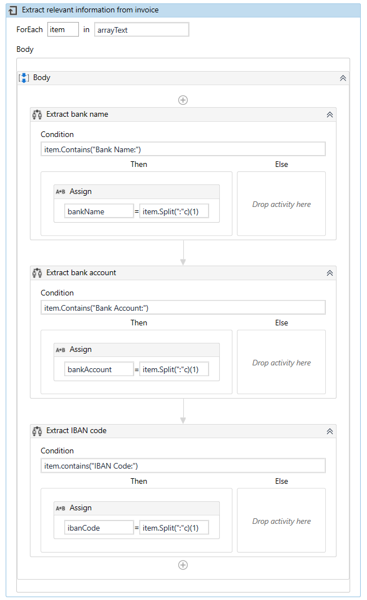

22. Return to the **Read PDF Text** sequence and drag a **Write Text
    File** activity below the **For Each** activity.

-   Add the value
    "InvoiceDetails.txt" in the **FileName** field.
-   Add the following expression in the **Text** field.

`"Invoice details"+Environment.NewLine+Environment.NewLine+"Vendor: "+vendor+Environment.NewLine+"Vendor address: "+address+Environment.NewLine+"City: "+city+Environment.NewLine+"Phone number:"+phoneNumber+Environment.NewLine+"Invoice number:"+invoiceNumber+Environment.NewLine+"Bank name:"+bankName+Environment.NewLine+"Bank account:"+bankAccount+Environment.NewLine+"IBAN Code:"+ibanCode`

This is how the **For Each** container should look:

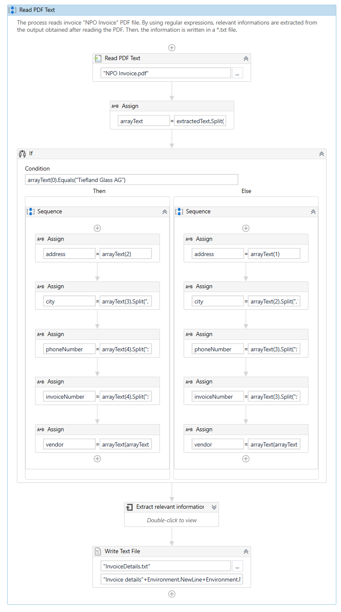

23. Return to the **Main** workflow working area.

Read a PDF File using the **Read PDF with OCR** activity

1.  Open the **Read PDF With OCR** sequence container by double-clicking
    on it.
2.  Drag a **Read PDF With OCR** activity inside the sequence.

-   Add the value
    "Invoice02.pdf" in the **FileName** field.
-   In the **Properties** panel, add the value
    1 in the **DegreeOfParallelism** field.

3.  Drag the **Google OCR** engine inside the **Read PDF With OCR**
    activity.

-   In the **Properties** panel, add the variable
    extractedTextTesseract in the **Text** field.

4.  Drag another **Read PDF With OCR** activity and place it below the
    previous one.

-   Add the value
    "Invoice02.pdf" in the **FileName** field.
-   In the **Properties** panel, add the value
    1 in the **DegreeOfParallelism** field.

5.  Drag the **Microsoft OCR** engine inside the **Read PDF With OCR**
    activity.

-   In the **Properties** panel add the variable
    extractedTextMicrosoft in the **Text** field.

6.  Drag a **Write Text File** activity below the **Read PDF With OCR**
    activity.

-   Add the value
    "OCRMicrosoft.txt" in the **FileName** field.
-   Add the variable
    extractedTextMicrosoft in the **Text** field.

7.  Drag a **Write Text File** activity below the previous **Write Text File** activity.

-   Add the value
    "OCRTesseract.txt" in the **FileName** field.
-   Add the variable
    extractedTextTesseract in the **Text** field.
     This is how the **Read PDF with OCR** sequence should look:

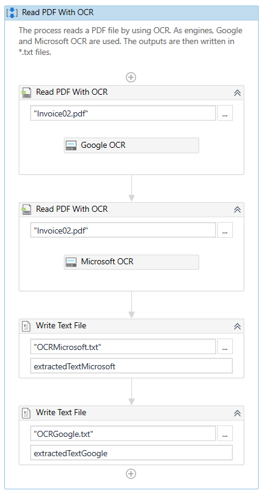

8.  Run the process. The robot extracts the data using the specified
    process and saves the output in a .txt file.

**Select Option**
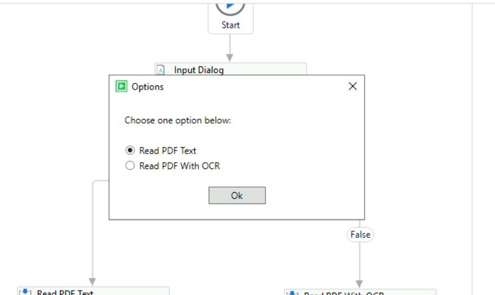

**Read PDF Text Option**
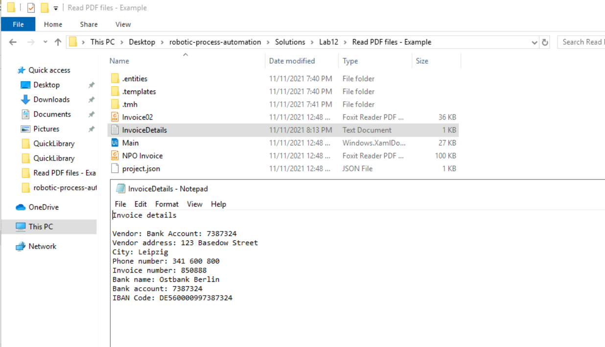

**Read PDF with OCR**
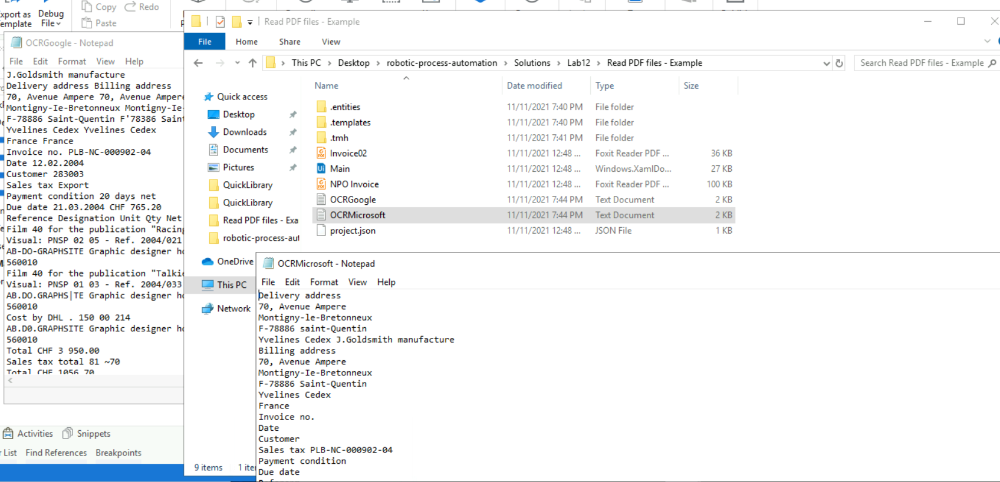

