Lab 12. CRM Automation
==============

Have you ever had to look up data from one application and update
another system? 

There are many scenarios where people copy and move data between
systems. Sometimes, \"swivel chair activities\" can occur, which can
result in human errors. RPA can help us automate these activities to
make them quicker while also eliminating any human errors. 

In this project, we will automate one such swivel chair activity in
customer services. We will look up customer information on an external
website and update that information in our **Customer Relationship Management** (**CRM**) system. 

This project will help you understand the following:

-   Using RPA for swivel chair activities
-   Looking up data on a third-party website
-   CRM application Automation 
-   Data scrapping in UiPath 
-   Updating DataTable using UiPath
-   Exception handling in UiPath
-   Unit testing UiPath bots

Technical requirements
======================

We will need the following hardware and software for this project:

-   A PC with UiPath Community edition version 19.10.0 installed.
-   Chrome browser with the UiPath add-on.
-   The Apptivo Saas ERP application with the CRM module. You can sign
    up for free at [https://www.apptivo.com](https://www.apptivo.com/).
-   Crunchbase. Go to <https://www.crunchbase.com/register>, enter the
    required details, and register for an account.

Project overview
================

Organizations add customers all the time, and we can do this and update
their information within the **Customer Relationship Management**
(**CRM**) system. Customer information such as key contacts, email,
phone, address, website, and social media information is looked up using
websites such as Hoover, D&B, and so on and kept updated. Here is a
high-level workflow for the project:

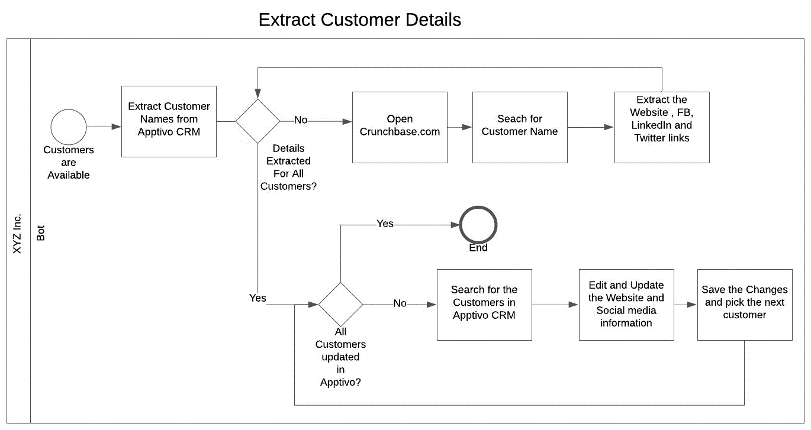

In this CRM project, we will extract the list of customers to be updated
from the CRM application known as Apptivo. Automation will then open up
Crunchbase, a third-party site that provides company information. It
will search and capture the website and social media data for each
customer. This data will then be used to search and update the customer
record in Apptivo. 

Now, let\'s look at the project\'s components and walk through the
creation of Automation. 

Project details
===============

As we did in lab *Help Desk Ticket Generation*, we will divide our Automation into logical
workflows to come up with our Automation. Let\'s have a look at the
technical components we will be building for this project.

We will have a main workflow called Main.xaml where we will
extract the customers using Get Customer List Sequence. Once we
have the customer list, we will invoke
RequestCustomerDetails.xaml so that we can search
Crunchbase.com](http://crunchbase.com/) and capture the customer
details. We will pass the customer details back to Main.xaml,
where we will then use Update Customer details Sequence to
update the customer data in Apptivo CRM. 

The following is a high-level sequence diagram depicting this:

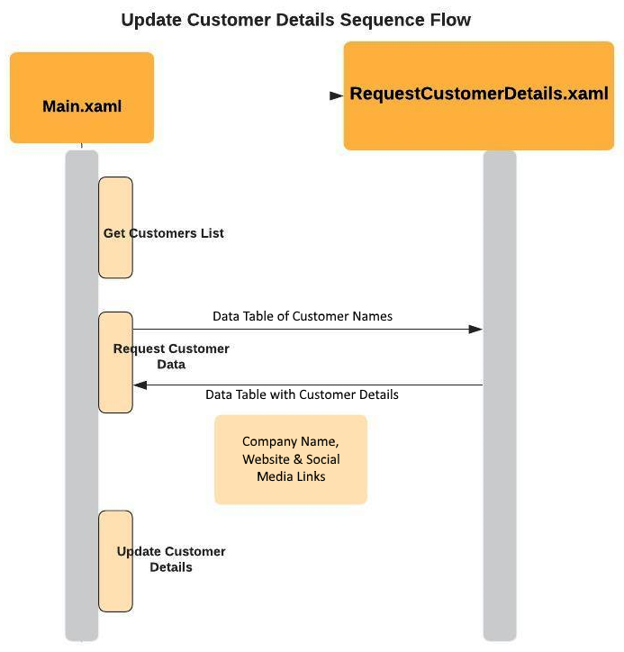

Now that we\'ve had this overview, let\'s create these technical
components and test them. Before we do that, however, we need to prepare
our CRM application -- Apptivo. 

CRM preparation
---------------

As shown in the preceding diagram, we will be updating the customer
information in the Apptivo CRM application. So, let\'s add a few
customers so that we can update their information: 

1.  Log into Apptivo (apptivo.com](http://apptivo.com/)). If this is
    your first time on the site, please sign up using the appropriate
    option.
2.  Once you\'ve logged in, go to the CRM menu option
    and select Customers.
3.  Within the CUSTOMERS tab, use the
    Create option to create our customers, as shown in
    the following screenshot:

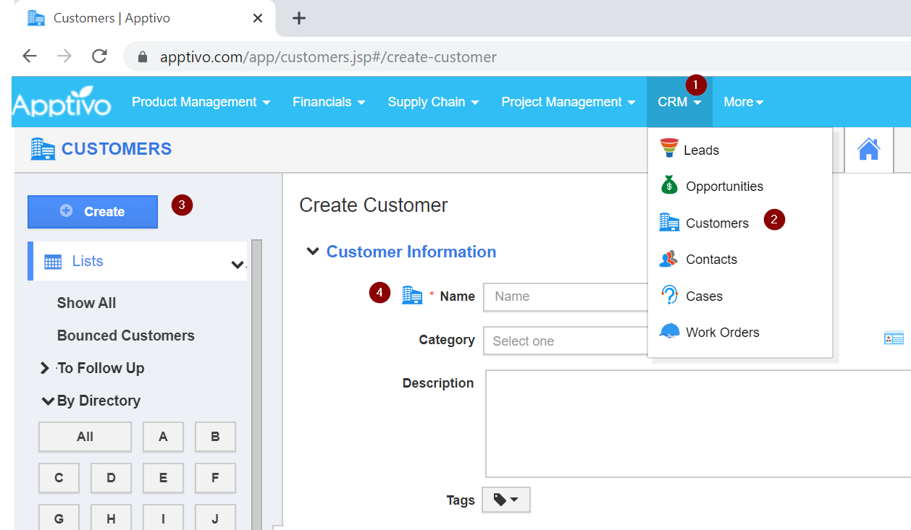

For now, we will only enter the names of the customers. We will update
their information from a lookup site. 

Let\'s add three customers called Amazon, Salesforce,
and Uber. You can play around with other companies as well, but
I suggest that you stick to these company names so that it\'s easier for
you to step through the project creation process. It is important to
have customer names that exist on our lookup site, that
is, Crunchbase.com](http://crunchbase.com/).

Please ensure that Apptivo is open in one of your browser tabs and that
you are logged in. This project assumes that you are logged in to
Apptivo and ready to work on the application. 

Now that we have got the preparation out of the way, let\'s go ahead and
create our project with UiPath Studio.

Setting up the project
----------------------

For this project, we will start with a blank project and design
Automation within that. Let\'s get started:

1.  Launch UiPath Studio and choose Process under the
    New Project group, as shown in the following
    screenshot:

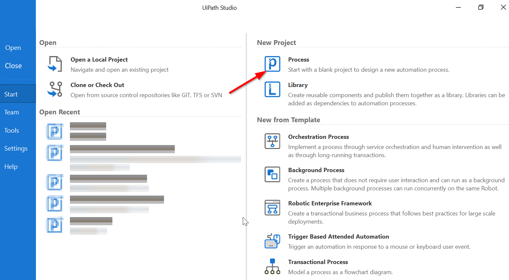

2.  On the popup for New Process, go ahead and
    provide a name and description for the project and click on
    Create. On the Studio screen, choose Open Main
    Workflow, as we did in the previous lab, to get
    to the initial screen.

3.  We\'ll choose to start with a blank process, which means we have to
    build everything from scratch. Let\'s start by adding a
    Sequence UiPath activity and renaming it Main
    Sequence. You can just click on the name on the Activity box
    and add the name Main Sequence. This is optional but
    recommended as it gives better readability to your workflows. You
    can see this Sequence in the following screenshot (in the next
    section), along with the other Sequences. 

Within this Main Sequence, we will have three subSequences. We
will start by creating a Sequence to get the customer list.

Extracting the customer list from CRM
-------------------------------------

First, let\'s get the list of customers in the Apptivo CRM that we need
to update. For that, we\'ll need to create a new Sequence and prepare
the browser to record our customer\'s web activities.

We will start by adding a new Sequence within the Main Sequence.
We will call this Get Customer List Sequence. Within this,
we\'ll add a Try-Catch block activity for exception
handling. Your Main workflow should now look like this:

Now, we are ready to add our Automation activities to the workflow. 

Preparing the browser
---------------------

Let\'s identify the Apptivo application tab for Automation:

1.  Start by adding the Attach Browser activity and
    attaching it to the browser tab. After that, perform the necessary
    extraction steps. 
2.  If you don\'t have Apptivo open in your Chrome browser, ensure that
    you have it open and are logged in. Now, click on Indicate browser
    on-screen within the Attach
    Browser activity and point to the Apptivo home tab
    in the browser, as shown in the following screenshot:

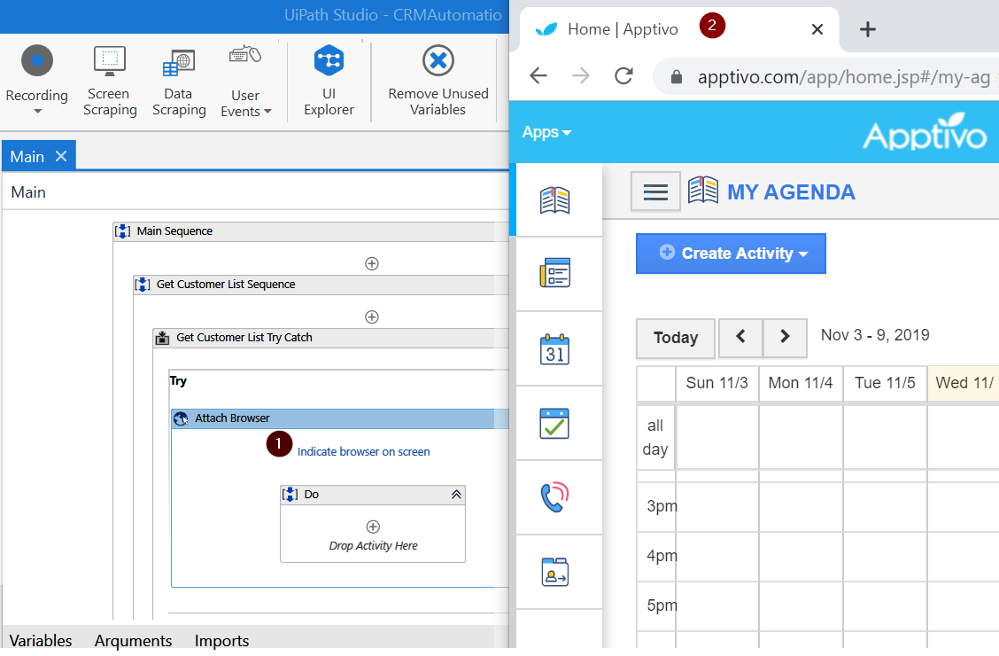

3.  On the properties panel for the Attach Browser
    activity, do the following:
    -   Make sure that the BrowserType is
        Chrome.
    -   Add a new variable for the UiBrowser property
        under output using *Ctrl *+ *K*, type in
        browserApptivo, and press *Enter*.
    -   In the same properties panel, update the
        Selector property. We will update the
        title with wild characters to make it generic
        across all the web pages in the Apptivo application. Click on
        the option to edit the selector and update
        the title to \*Apptivo\*, as shown in
        the following screenshot:

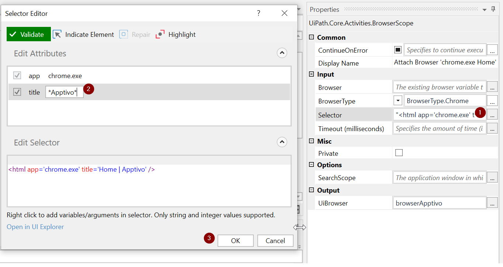

We are using a browser variable called browserApptivo so that we
can reuse this variable wherever we need to perform any Automation steps
on the Apptivo web application.

4.  Next up, we will use
    the Activate UiPath activity to
    bring our window to the foreground and to maximize this window using
    the Maximize window activity. Add these within the
    Do Sequence.

One of the best practices in web Automation is to check that the browser
is maximized and that the zoom is set to 100%. Use the Maximize
window activity to always maximize the browser in case
it isn\'t.

Now that we have the browser ready, we can add the necessary activities
so that we can get to the customer list on Apptivo and retrieve that
data. We will use UiPath\'s web recording feature to do so.

Web recording
-------------

Follow these steps to get to the customer\'s details from the Apptivo
application:

1.  Ensure that you have the Apptivo web application open in your
    browser. Then, within UiPath Studio, click on
    Recording and choose the
    Web option. Click on the
    Record button in the Web Recording
    dialog to start recording:

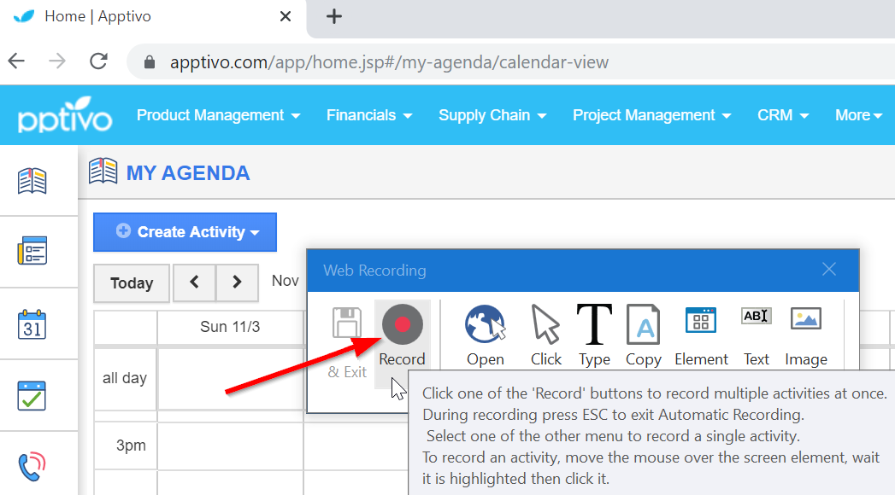

2.  With the recorder on, click on CRM and
    then Customers, as shown in the following
    screenshot:

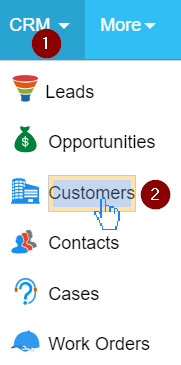

3.  In the popup that opens, click on Indicate
    Anchor and point to the icon next to the
    Customers option, as shown in the following
    screenshot:

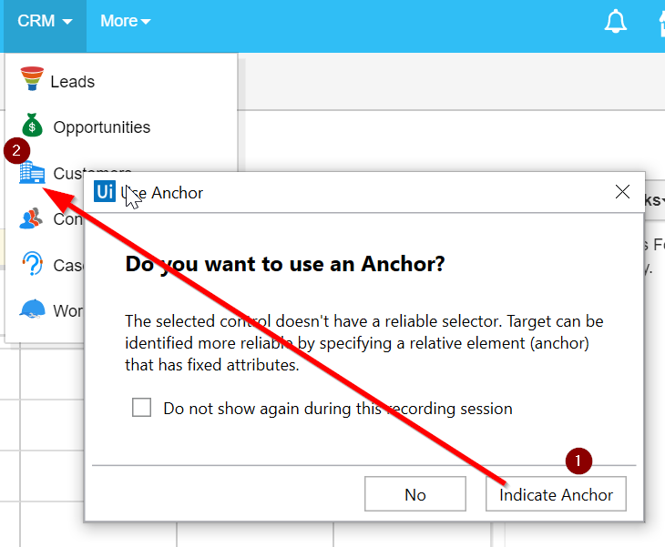

Doing this records the steps that we need to follow to navigate to the
page with the customer listings. You will end up on the customers page
in Apptivo. Press the *Esc* key to stop the recording and click Save &
Exit on the recording panel to end the web recording.

4.  You will find that the recorded steps are listed as a new Sequence
    at the end of the project. We only want a part of those activities
    and we need them in our Try block.
    So, copy the activities called Click A and Anchor
    Base and paste them under the Maximize
    Window activity, as shown in the following
    screenshot:

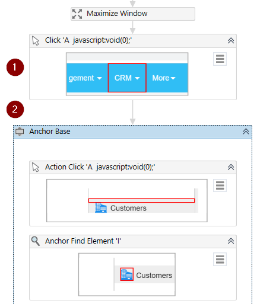

5.  Ensure that you *delete* the Sequence that was automatically created
    by the web recording after you\'ve copied the required activities
    (the Sequence named Web at the bottom).

Following these steps takes us to the Customers page.
We will stay on the Apptivo Customers page and get all
the customer names from this page using data scraping.

Data scraping
-------------

Now, we will extract the customer names from the displayed customer
details using the Data Scraping feature in UiPath.
Follow these steps:

1.  Click on Data Scraping in the top ribbon:

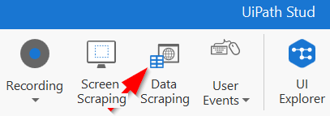

2.  In the Extract Wizard that pops up, click on
    Next. Choose the first customer on the list (for
    example, Amazon). The wizard will prompt you with
    an option to extract the whole table. We\'ll choose
    No as we only need the customer names for this
    project.
3.  Click Next and select another element for the Data
    Scraping wizard to be able to identify the table.
    Point to the last customer on the list (for example,
    Salesforce). Click Next.
4.  On the next screen, provide a column name for the data we are
    extracting. Let\'s call it Name since the data is customer
    names. Click Next:

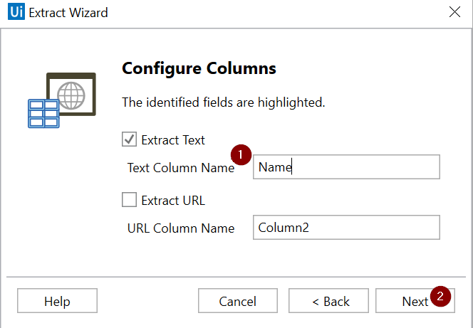

5.  Now, you\'ll be shown a preview of the data that you extracted.
    Check the data and click on Finish, as shown in the
    following screenshot:

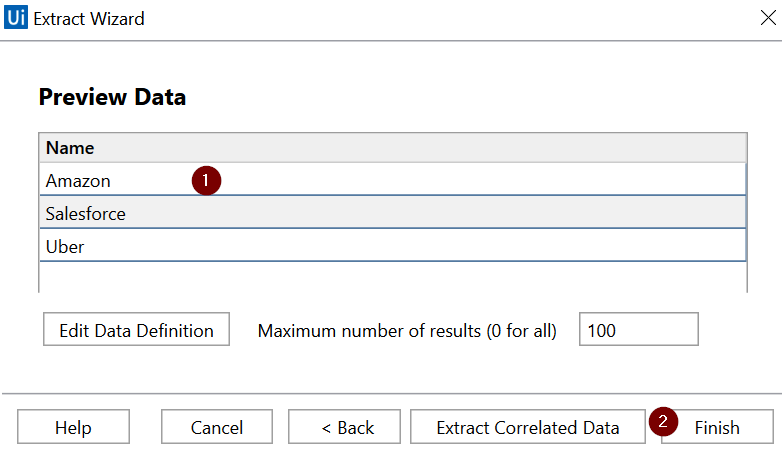

6.  Choose No in the dialog that asks whether the data
    is spanning multiple pages. You will find the Extract structured
    Data activity within the Data
    Scraping Sequence that was created and appended at
    the bottom of the workflow.
7.  Go ahead and copy this activity before pasting it within the
    Try block under Anchor Find. In
    the properties for the Extract activity, remove the
    ExtractDataTable variable. We will add a new
    variable in its place in the next step:

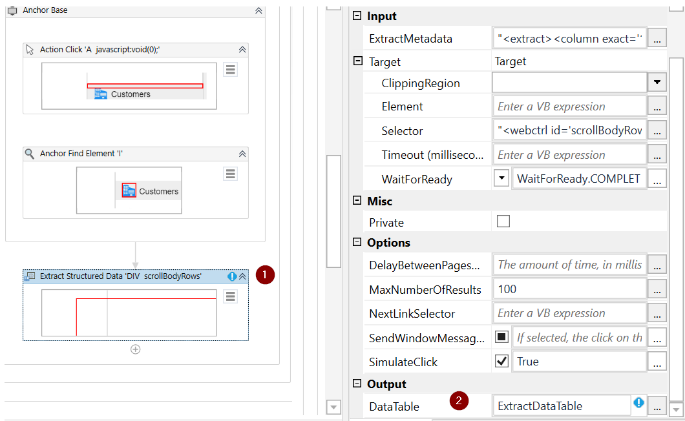

8.  Create a new DataTable variable called
    dtCompanyList to store the customer list that contains the
    names of companies that will be passed as input to
    Crunchbase.com](http://crunchbase.com/). We\'ll add this as the
    output for the Extract Structured Data activity. In
    the Variable pane, set its scope to Main
    Sequence. 
9.  Once we have copied what is needed, make sure to *delete* the Data
    Scraping Sequence that was created automatically.

That\'s all for the Try block. Next, we\'ll handle the
exceptions in the Catch block.

Using a Catch block for the Get Customer List Sequence
------------------------------------------------------

Let\'s handle any exceptions within the Catch block:

1.  In the Catch block, we will handle system
    exceptions. So, let\'s choose Exception as
    System.Exception. Click on Add Activity in
    the Finally part and add a Log
    Message of Log Level set to
    Error with a message stating \"Not able to Extract Customer
    list. Due to this Error: \"+exception.Message.
2.  If there is an exception while we extract the customer list from
    CRM, then Automation won\'t be able to proceed. Let\'s add
    a Terminate Workflow activity to handle this.
    Within the properties for the Terminate activity,
    set Exception to exception (start typing
    and the list should pop up) and add \"Cannot Extract Customer list
    from CRM, so terminating the Automation.\" as a reason, as
    shown in the following screenshot:

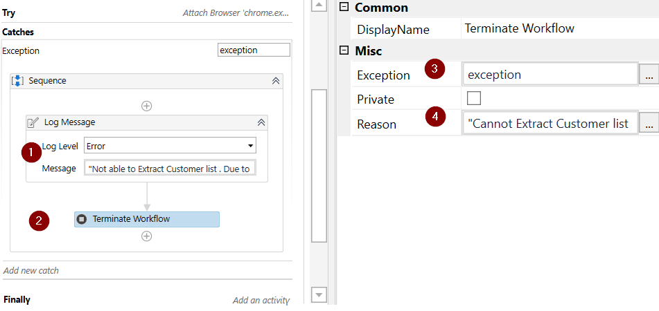

3.  Now, we have completed the first part of extracting the customer
    list from CRM. To test this Sequence, let\'s add a
    Message box activity with the
    message dtCompanyList.Rows.Count at the end of the
    Try block, after the Extract Structure
    Data activity.

4.  Let\'s run and test the Automation we have so far. Ensure that
    Apptivo is open in Chrome. Go ahead and click the
    Run button on the Studio ribbon. If the message box
    returns your number of customers (3, in our case), then we have
    successfully completed this part of the main workflow.
5.  Please ensure you remove the message box after the unit test has
    completed.

Next, we will use the customer\'s names to look up their information
from the Crunchbase website. 

Looking up customer information
-------------------------------

We will use the Crunchbase.com](http://crunchbase.com/) website to look
up the company information for our customers. This information will be
used to update the customer information in our Apptivo:

1.  If you haven\'t done so already, go to
    Crunchbase.com](http://crunchbase.com/) in Chrome and create an
    account by providing the necessary details. You can also use social
    authentication. Just ensure you are in a logged in for the
    Automation process.
2.  With the lookup site ready, let\'s create the Automation to get the
    customer information. We will create a new Sequence by clicking on
    New and then choosing
    Sequence from the Studio ribbon on top. Name
    it RequestCustomerDetails in the Sequence box that pops up
    and click Create. 
3.  To pass the customer data around, we\'ll need to create two
    arguments. Select the RequestCustomerDetails.xaml Sequence
    and click on Arguments to create two
    DataTable arguments called CompanyList and
    CompanyData:

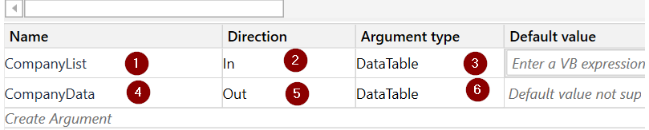

Now that we have completed the groundwork for the lookup, let\'s create
a data table that we will be passing back to the main workflow, complete
with customer (company) data.

Creating a data table
---------------------

Follow these steps to create the data table:

1.  Let\'s use the Build Data Table activity to build a
    data table for CompanyData, as shown in the following
    screenshot:

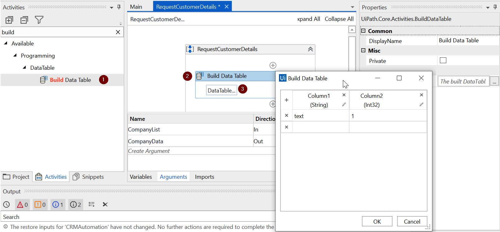

2.  We will be looking up the customer\'s name and gathering their
    website and social media information to update our CRM. Let\'s
    create five columns for the data table so that we can gather this
    information. Click on DataTable in the activity and
    within the popup, edit and rename the existing column names. Then,
    use the Add column option (the plus (+) sign on
    left) to create the rest of the columns (Company name,
    Website, Facebook, LinkedIn, and
    Twitter):

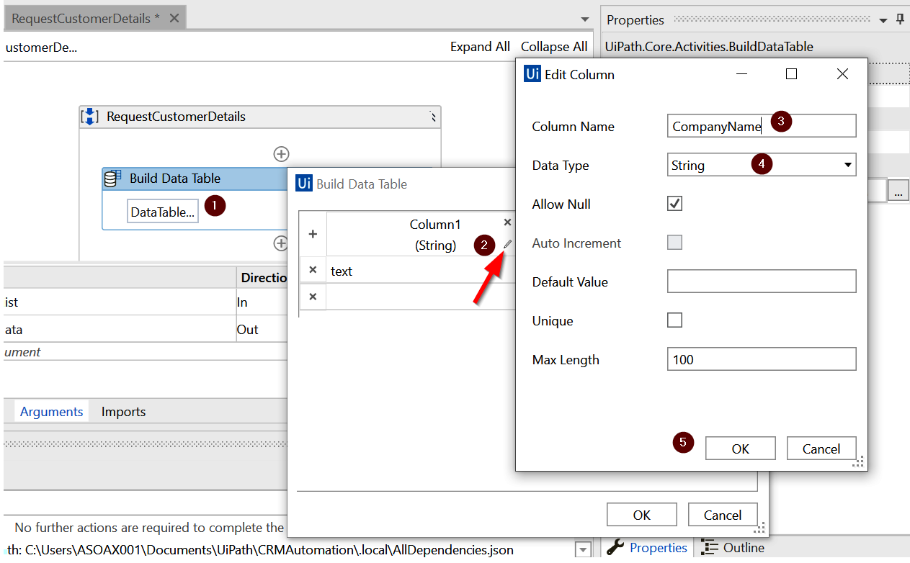

3.  Once added, your Data Table will look as follows.
    Click on OK to continue:

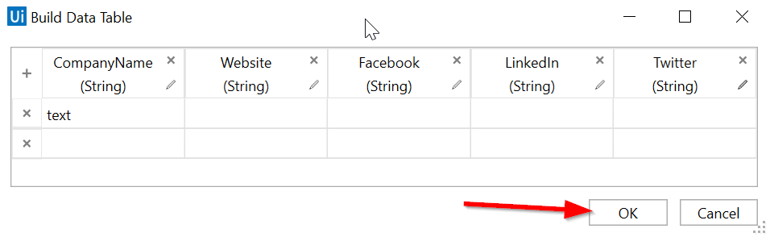

Make sure that you delete the default rows in the table. There is
usually a row with the first column set to text as
shown in the preceding screenshot. Also, ensure that all five columns
are of the String type.

4.  In the properties for the Build Data
    Table activity, update Output \|
    DataTable to the CompanyData argument that
    we created earlier: 

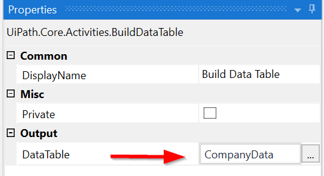

Now that we have the data table, let\'s access the Crunchbase site. 

Looping and creating company URLs
---------------------------------

Now, we will construct company URLs so that we can look up the data for
each company on the Crunchbase.com](http://crunchbase.com/) website:

1.  Open Chrome and navigate to the lookup site:
    a.  Use the Open Browser activity and configure the
        URL so that
        it\'s [https://www.crunchbase.com/.](https://www.crunchbase.com/)
    b.  Ensure that Input \|
        BrowserType is Chrome.
    c.  Create an output UiBrowser variable for this activity called
        browserCrunchBase.

Your Open Browser activity will look like this:

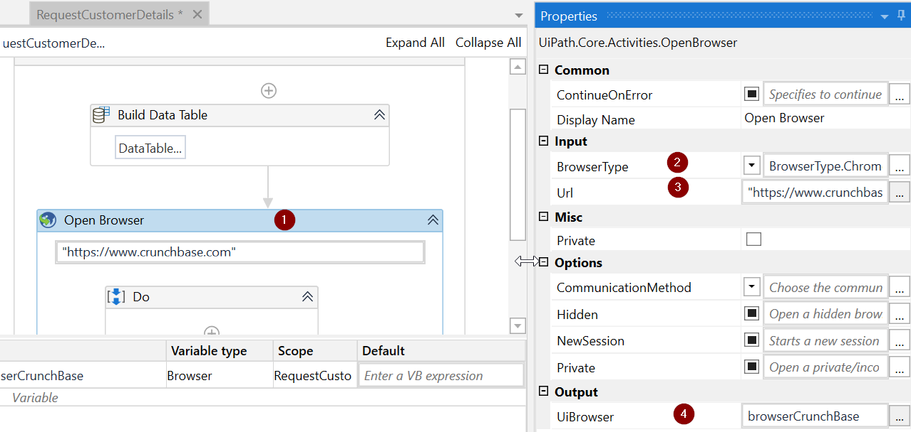

2.  As always, we will use a Try-Catch block to handle
    any exceptions. In the Try block,
    we will loop through the customer list and get the details of the
    company from this site.

3.  Let\'s add the For Each Row activity in order to
    loop through the company names (customer names from CRM). Let\'s add
    the CompanyList argument we created previously as our input:

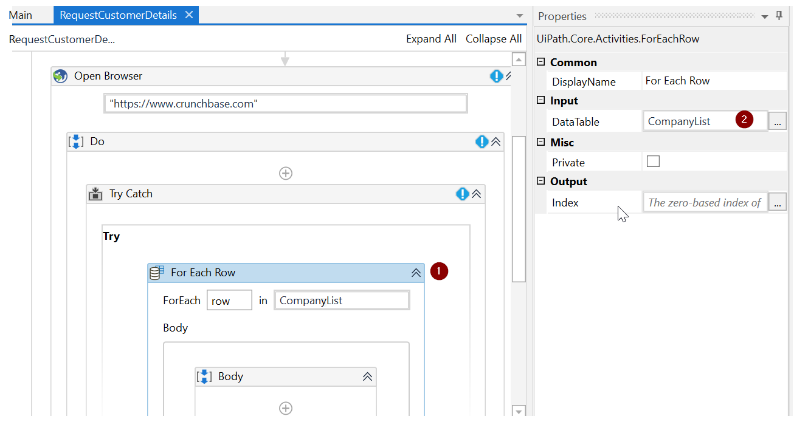

4.  Next, we\'ll add variables for each piece of data we\'d like to read
    from the Crunchbase website. As you may recall, this data is the
    customer\'s website and social media information. Let\'s add the
    respective variables, as shown in the following screenshot:

strCrunchBaseURL has to be populated with the default, that
is, \"https://www.crunchbase.com/organization/\".

5.  We will use this URL to append company names and open the browser to
    a specific company detail view. 
6.  Now, we will go directly to the company page on
    Crunchbase.com](http://crunchbase.com/) and capture the company
    details. The first step is to construct the URL that contains the
    details for the specific company. The URL\'s format
    is www.crunchbase.com/organization/\<company name\>. We will
    use the strCrunchBaseURL variable that we created previously
    and append the company name to it. This needs to be in lowercase.

At the time of writing this course, this is the current format of the
Crunchbase.com ](http://crunchbase.com/)company URL. If this changes,
you may have to change the strCrunchBaseURL default value to the
appropriate one. 

7.  Let\'s use the Assign activity to populate the
    strCompanyName variable with the lowercase name of the
    company from the CompanyList data table. To read and convert
    the company value from the data table into lowercase, we need to
    use row(0).ToString.ToLower. Then, we need to use
    the Navigate To activity and pass this parameter,
    which constructs the URL for the specific company, that
    is, strCrunchBaseURL+strCompanyName:

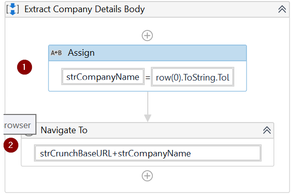

With the company URLs created, we are ready to extract the website and
social media information for the company. 

Extracting company details from Crunchbase.com
----------------------------------------------

Now, let\'s use the UiPath recorder function to add the activities so
that we can extract data from the Crunchbase website:

1.  On your Chrome browser, go ahead and open
    <https://www.crunchbase.com/organization/uber> and scroll down to
    the place where Website, Facebook,
    LinkedIn, and Twitter information
    is visible:

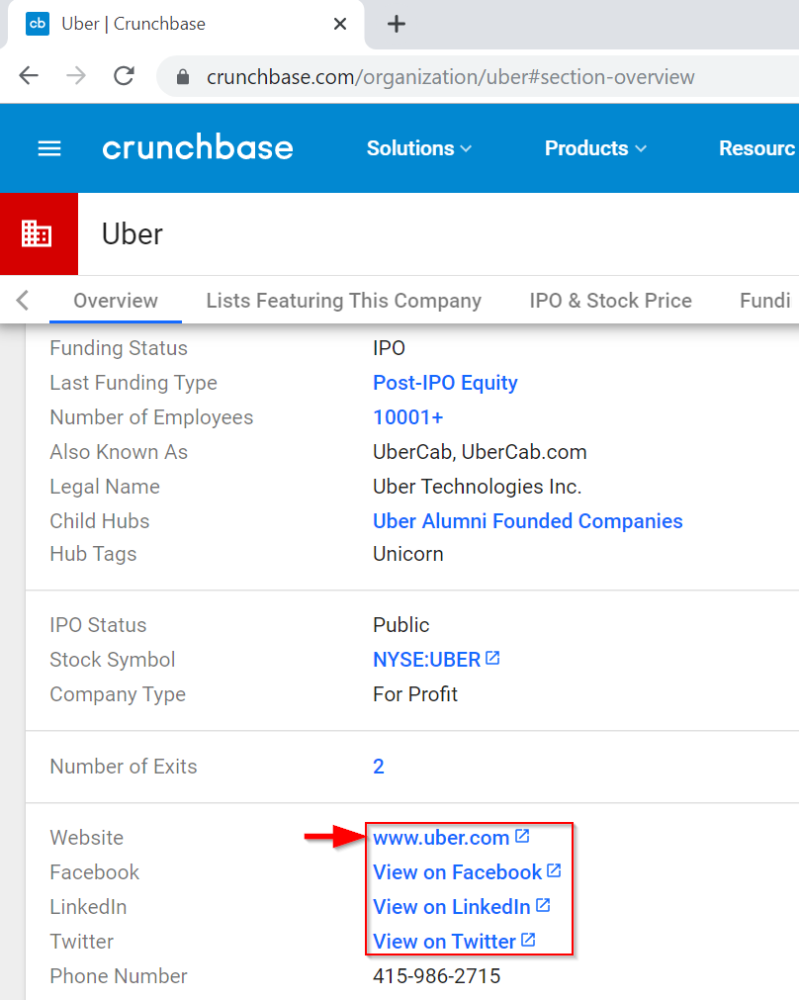

2.  Now, let\'s extract the website address and save it as the variable
    we created. To do this, open the UiPath web recorder and click on
    Copy Text on the Recorder panel.
    Then, point to the text on the website that says
    www.uber.com](http://www.uber.com/). Once you\'ve done that, click
    on Save and Exit on the Recorder
    panel:

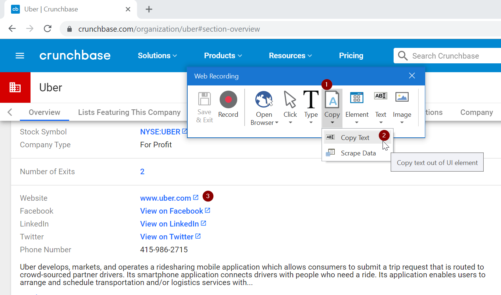

The recorder will add a new Web Sequence with the recorded action. Cut
and move this Sequence to the Try block below
the Navigate to activity.

3.   Within the activities we just moved, click on the Attach
    Browser activity, update the
    Browser property to browserCrunchBase, and
    remove the existing values in the Selector
    parameter:

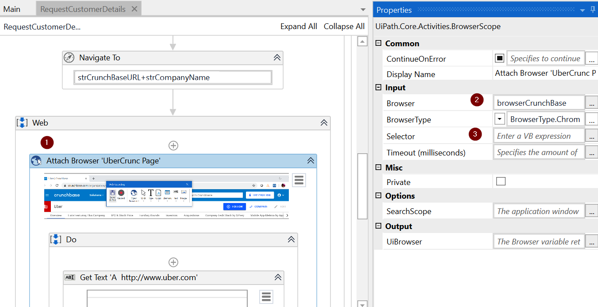

4.  As we have been doing with our web Automations, let\'s
    add the Activate and Maximize
    Window activities before the Get
    Text activity within the
    Do Sequence.

We have to use *PgDn* key to get to the required information on the
page. So, let\'s use the Send HotKey activity with
the pgdn key and point to an object on the web page
frame that contains the company information. Point to an object in the
frame below the menus -- one such label is Overview
heading, which can be found on the default information tab:

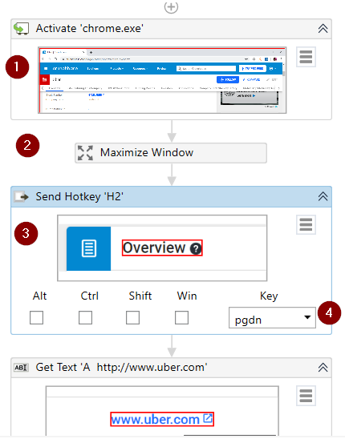

When working with web Automation, use DelayAfter and
DelayBefore in the Activities
properties panel to provide some wait time in milliseconds based on the
performance of the system.

5.  Now, let\'s assign this website data to the variable we created.
    Let\'s go to the Get Text activity properties and
    assign the output to the strWebsite variable that we
    created.
6.  Let\'s also update the target selector so that it can work for any
    website data. To do this, click on the Selector and
    update the aaname from www.uber.com to
    \*com\*:

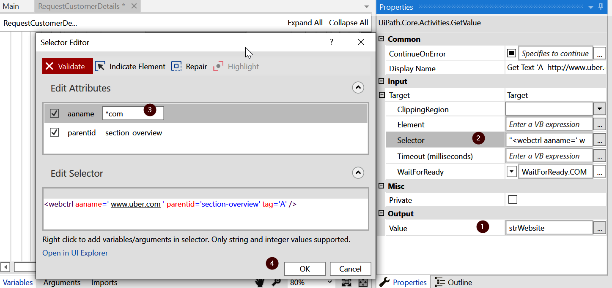

7.  Next, let\'s extract the social media information, starting with the
    Facebook link. To do that, we will right-click and copy the Facebook
    link address. The shortcut key for this is *E*.

8.  We will use the Click activity and point to
    the View on Facebook link on the web page. In the
    properties for this activity, let\'s update the properties of
    MouseButton to BTN\_RIGHT:

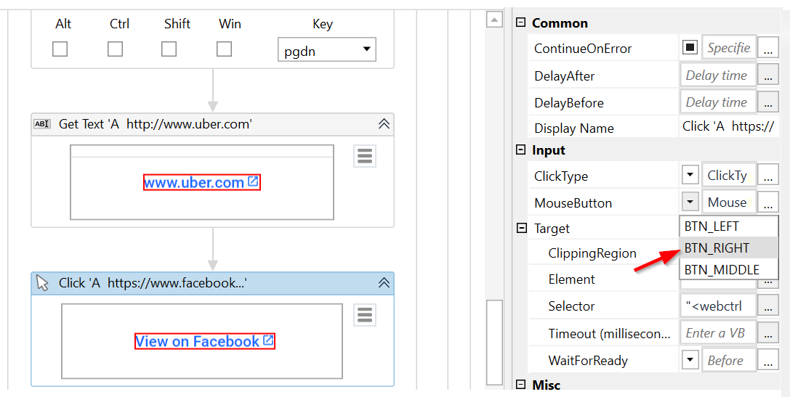

9.  To copy the Facebook link address, we need to add a Send
    HotKey activity. Click on View on
    Facebook on the web page and press the *E* key. This
    will copy the Facebook link to the clipboard. We will then use Get
    From Clipboard to output the result to
    the strFacebook variable. Please
    use DelayBefore and DelayAfter in
    activity properties as necessary:

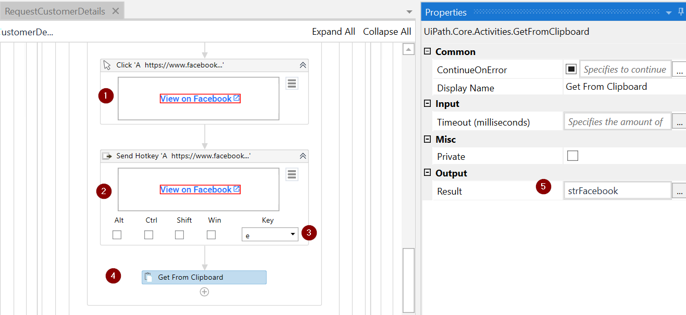

10. Repeat the Click, Send HotKey, and
    Get From Clipboard activities to capture the links
    for LinkedIn and Twitter. Then, store them in
    the strLinkedIn and strTiwtter variables. 

You can find the recently used activities in the Recent
section of the Activities panel on the left. So, all
three activities can be easily dragged and dropped from the
Recent section. 

11. Now that we have extracted all the company data from
    CrunchBase.com](http://crunchbase.com/), let\'s build the output
    data table so that we can pass it back to the Main
    workflow. 
12. Let\'s use the Add Data Row activity to update the
    ArrayRow property to {strCompanyName, strWebsite,
    strFacebook, strLinkedIn, strTwitter} and
    the DataTable property to CompanyData. We
    will pass this DataTable argument back
    to Main.xaml once we\'ve finished extracting:

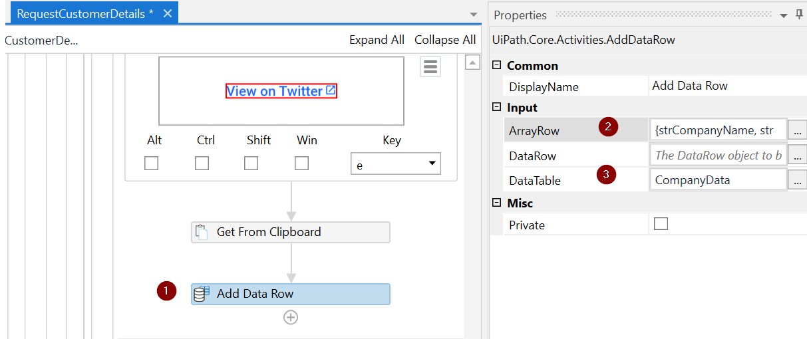

13. Finally, let\'s add a Log Message activity to
    ensure extraction is successful. Set the
    Level to Info and add \"Customer details
    Extracted Successfully for: \"+ strCompanyName as the log
    message.

That\'s it for the Try block. Now, let\'s handle any
exceptions within the Catch block. After doing this, we
will test this Sequence once by invoking it from the
Main workflow.

14. In web Automation, most exceptions occur because the selector of a
    web element hasn\'t been found. So, within the
    Catch block, let\'s add an exception called
    SelectorNotFoundException. In Finally,
    we\'ll add a Log Message activity with
    Level set to Error with the
    following message: \"Not able to get the information for Customer:
    \"+strCompanyName + \"Due to this Exception:
    \"+exception.Message.

We can add multiple exceptions of different types based on the
project\'s requirements. Here, we are only checking for and handling one
exception. 

15. Finally, add a Close Tab activity outside the
    Try-Catch block and pass browserCruchbase
    for the Browser parameter. This will ensure that we
    close the Crunchbase.com](http://crunchbase.com/) website after the
    data has been extracted:

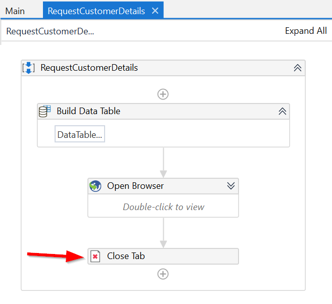

Now that we have a workflow set up so that we can capture the company
data for our customers, let\'s use this workflow to get the customer
details that we need to update CRM. With this, we have completed the
RequestCustomerDetails.xaml workflow. 

Invoking the RequestCustomerDetails workflow from the Main workflow
-------------------------------------------------------------------

Now, we will go back to the Main workflow and invoke
the customer information lookup workflow that we created in the previous
section. Let\'s start by creating a variable that we\'ll use to store
the company data:

1.  In the Main.xaml file, create a new data table variable,
    call it dtCompanyData, and set its scope to Main
    Sequence. Let\'s also set the default values for
    both dtCompanyList and dtCompanyData to New
    System.Data.DataTable, as shown in the following screenshot:

2.  Now that we have the variable, let\'s add a new Sequence below the
    Customer List Sequence called Request Customer details
    Sequence and add the Invoke Workflow file
    activity. Point the activity to RequestCustomerDetails.xaml,
    click on Import arguments, and map the arguments to
    the respective input and output data table variables, as shown in
    the following screenshot:

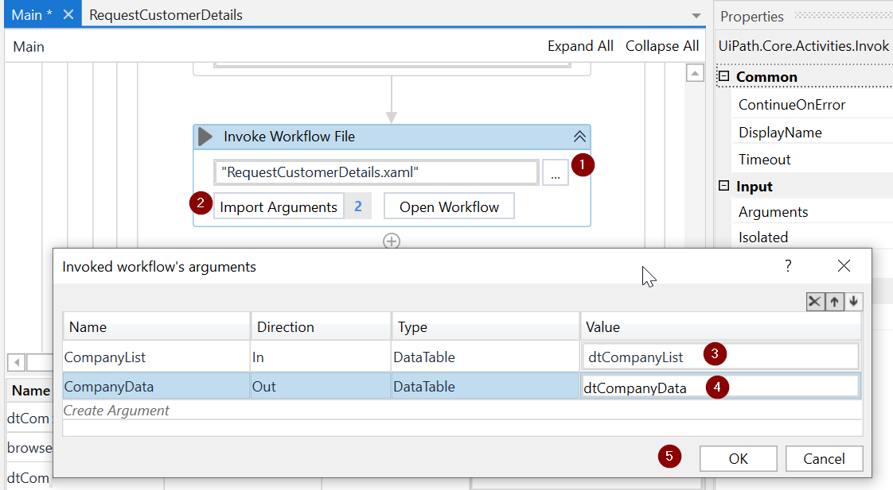

3.  To test what we have so far, let\'s add a message box under Invoke
    Workflow and add dtCompanyData.Rows.Count as
    our message, as shown in the following screenshot:

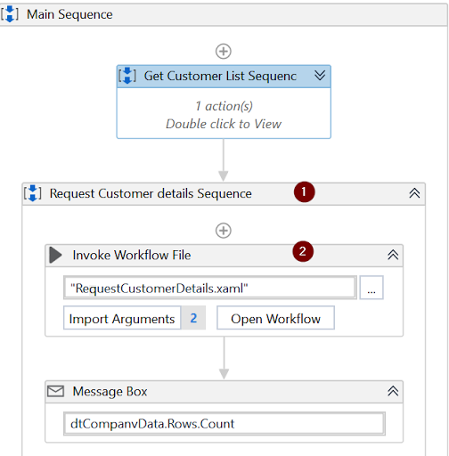

This will help us understand whether the output data tables have been
populated and how many rows there are.

Now, let\'s run a test for the Automation we have so far. From the
Main.xaml file, go ahead and run the Automation. You should
receive a message with the count set to 3. This means
the company details for all three companies have been extracted. 

Now that we have the company information within the
Main workflow, let\'s use that data and update the CRM.

Updating the CRM with customer information
------------------------------------------

In this final Sequence for Main.xaml, we will update the Apptivo
CRM with the customer details we got from
Crunchbase.com](http://crunchbase.com/). Follow these steps to do so:

1.  Let\'s create a new Sequence called Update
    Customer Details Sequence. We will continue to add this part
    of the Automation to the Main workflow. Add this
    Sequence under the Invoke Workflow from the
    previous section:

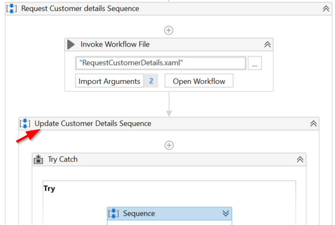

2.  Let\'s add a Try-Catch block to the Sequence so
    that we can handle any exceptions that occur during the update
    operation in the CRM. In the Try block, we\'ll need
    to create some variables so that we can store the company name,
    website, Facebook, LinkedIn, and Twitter details:

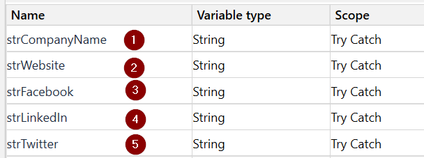

With the Sequence and variables added, let\'s loop through each
customer\'s details and make the updates in Apptivo.

Looping through the data table and updating the CRM
---------------------------------------------------

Now, we will loop through the data table of extracted company details
and update the CRM:

1.  Let\'s add the For Each Row UiPath activity, which
    you can find under DataTable. Let\'s loop through
    the dtCompanyData data table.
2.  Within this loop, we will use the Assign activity
    to assign values to all the variables we created previously. We will
    extract each row from the data table and convert them into strings
    using the row(columnname or ColumnIndex).ToString syntax;
    for example, strCompanyName = row(\"CompanyName\").ToString.
    Your looping part of the Sequence will look as follows:

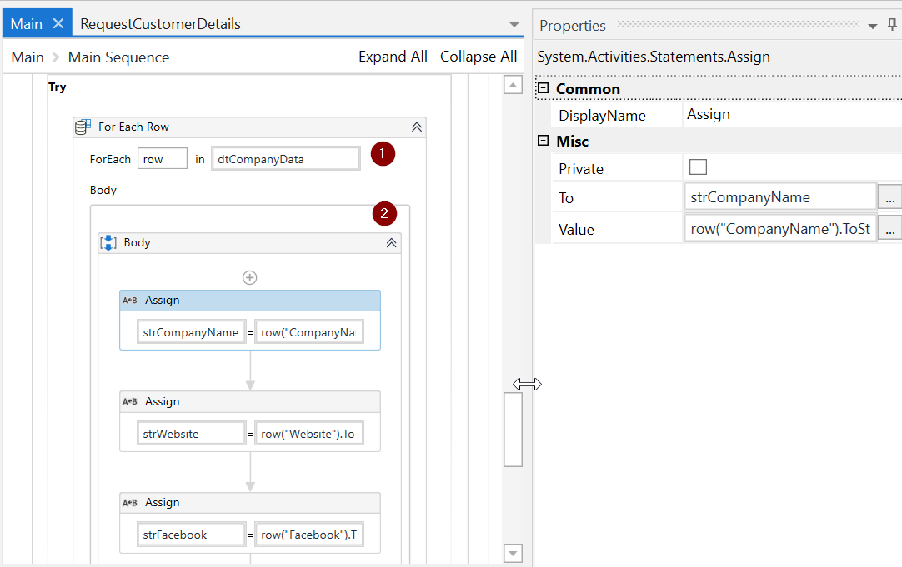

Note that we have to assign data to all five variables we defined
previously.

3.  With the data assigned to our variables, we can update the Apptivo
    CRM application. We will search for our customer in Apptivo and then
    go to that specific customer record and update the same. 
4.  To automate the search, we will use the UiPath web recorder to
    record the search steps. For that, manually open the customer page
    in Apptivo by going to the CRM menu option and then
    choosing Customers. Then, go to the UiPath web
    recorder option. From the Recorder panel, choose
    Type and input a customer name
    (say, Amazon) in the Apptivo search box, as shown in the
    following screenshot:

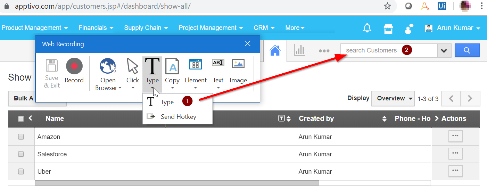

Once you\'ve done that, Save and Exit the recording. 

5.  Now that we\'ve got to the customer record, we will start the web
    Automation process so that we can enter the data into Apptivo. For
    that, we\'ll need to add the Attach Browser
    activity to the Try block, just below the set of
    Assign activities. Within the properties for this activity, update
    the browser attribute to browserApptivo. As you may recall,
    this is the browser variable we created during the first part of the
    Automation process.

If you are not able to reuse this browser variable, go back to the
variable and ensure the scope of the variable is set to Main
Sequence.

6.  Now, let\'s copy the Type Into activity that was
    created by the web recorder into the Attach
    Browser activity. In the properties for this
    activity, let\'s update the Target Text value from
    Amazon to strCompanyName. Ensure you delete
    the web recorder\'s Web Sequence from the bottom,
    after copying the Type into the activity. 
7.  Next, we will use the Send HotKey activity, point
    to the same search box in Apptivo, and use the *Enter *key: 

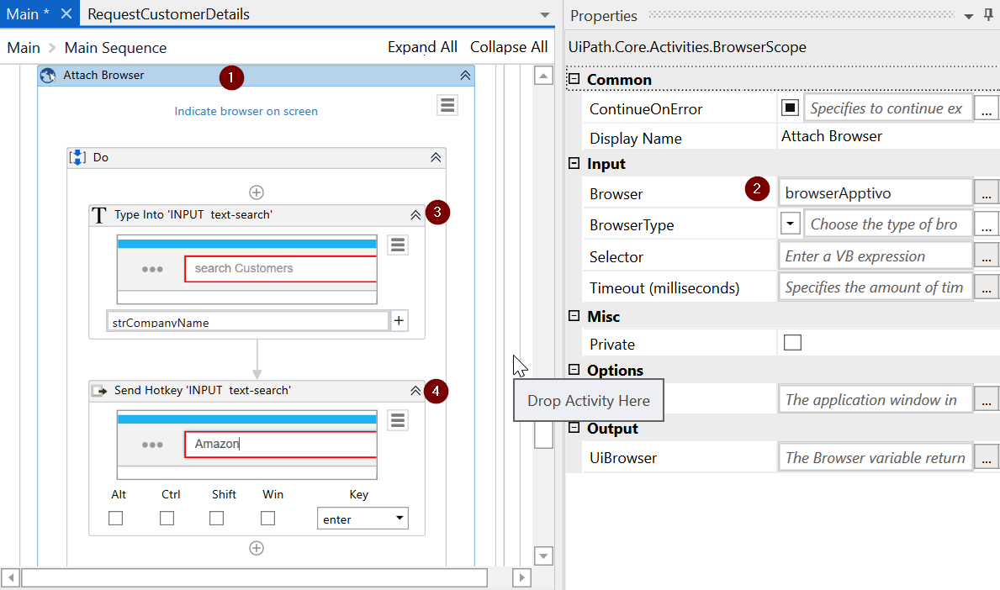

When we use the Type Into activity, in the properties
panel, please use DelayAfter,
DelayBefore to generate any necessary delays. Also,
set the EmptyFields property to True
to remove any existing input from the text boxes.

8.  Apptivo displays the search results in a table with an action button
    so that we can edit the customer record. We will use the UI
    Automation Click activity and point that to the More
    details action button (\...).
9.  Clicking the action button takes you the customer details page in
    Apptivo. We have to click on any one of the text boxes -- say,
    Name -- to go to Edit mode. Let\'s use a
    Click activity again and point to the text next to
    the Name label:

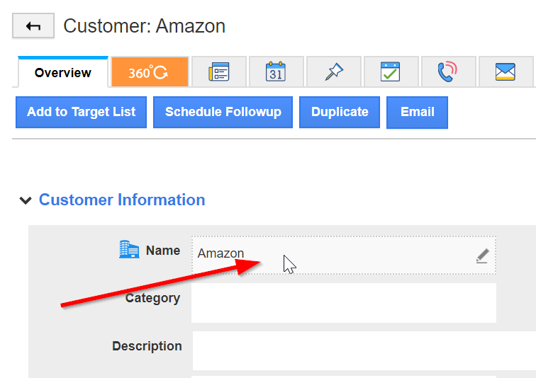

You will see the Save and
Cancel buttons on the customer record, which means that
you are in Edit mode. 

10. In Edit mode, we can update the customer details. First, let\'s
    update the website\'s information. To do this, we have to scroll
    down to the Website text box. Let\'s use the Send
    HotKey activity and point to the name text box and
    pgdn. Copy this activity again to page down twice.
    You should be able to find Website in the
    Additional Information section.

11. Now, we will use the keyboard Type Into activity
    and point to the text box next to the
    Website label. Use the strWebsite variable
    to input the necessary value:

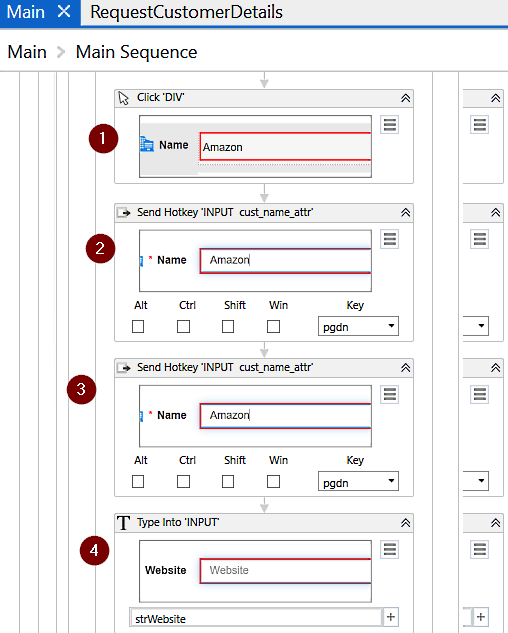

12. Next, we will find the social media fields on the page and update
    them as well. Let\'s use the page down twice more by using the Hot
    Key activity. You should be able to find the
    Facebook, LinkedIn and
    Twitter fields under the Social
    Information section.

13. Similar to the previous step, we will use the Type
    Into activity and perform the same steps to get the
    values of Facebook, LinkedIn, and
    Twitter into the strFacebook,
    strLinkedIn, and strTwitter variables.
14. Now that we have updated all the information, let\'s click on the
    Save button. Let\'s use the Click
    activity and point to the Save button at the top of
    the page:

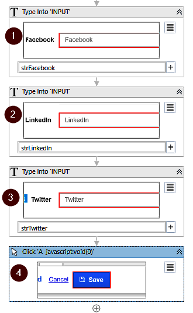

15. To make the Automation generic, let\'s edit the selector property in
    Save so that it only
    includes aaname. Go ahead and uncheck the
    parentId as the selector may change every time the
    Automation runs:

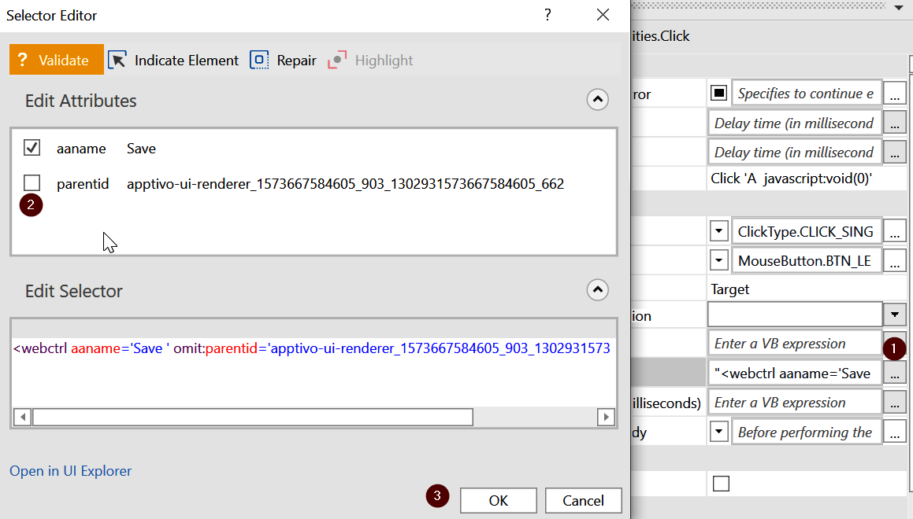

16. Finally, let\'s add a Log Message within the
    Try block that states, \"Successfully Updated the
    Customer details for :\"+ strCompanyName.
17. In the Catch block for Update
    Customer details Sequence, let\'s handle any exceptions that
    may arise. Let\'s add a new exception called
    SelectorNotFoundException. Within that, add a Log
    Message with the log Level set
    to Error and a message stating, \"Cannot Update
    Customer details for :\"+ strCompanyName+ \" Due to this Error :\" +
    exception.Message. 
18. Please add a Message box activity stating that the
    Automation is Completed in the Finally block.

To test the complete Automation, make sure the
Crunchbase.com](http://crunchbase.com/) web page is closed but ensure
you\'re still logged in to your Apptivo page in your Chrome browser.
Then, click on Run. The Automation process should take
a few minutes to run and update the Apptivo CRM application.

Summary
=======

In the lab, we looked at a real-world project in order to learn how
to keep the **Customer Relationship System** (**CRM**) updated. We
captured information for the customers from a third-party website called
Crunchbase.com](http://crunchbase.com/) and updated our CRM
application, that is, Apptivo. 

This project added a little more complexity in terms of data scraping,
passing data tables containing customer information, and using that data
to update our CRM application. We are steadily exploring more and more
advanced features of UiPath. 

