Lab 13. Using AI and RPA for Invoice Processing
=======================================

In this lab, we will complete our first project with Automation
Anywhere RPA and **Artificial Intelligence** (**AI**). 

We will use the Automation Anywhere IQ Bot to convert invoice data from
an unstructured format into a structured format that we can use for
automation. IQ Bot is an intelligent document processing platform from
Automation Anywhere that can be used to classify, extract, and validate
content from documents. IQ Bot allows us to process unstructured data
using AI technologies such as computer vision, **Natural Language Processing** (**NLP**), **Machine Learning** (**ML**), and text
classification. 

More than 80% to 90% of data in organizations is placed in documents and
forms. So, processing documents is one of the common requirements for
most automation use cases.

We will learn about basic document processing and more in this lab.
More specifically, we will cover the following topics:

-   Using basic AI with RPA
-   Document processing using IQ Bot
-   Creating learning instances for document processing 
-   Invoking IQ Bot with the A2019 Task Bot
-   Downloading unstructured data from IQ Bot

Technical requirements
======================

The following are the technical requirements you\'ll need for this
lab:

-   Automation Anywhere A2019 Community Edition. Sign up
    at <https://www.automationanywhere.com/products/community-edition>.
-   A PC with the Automation Anywhere Community Edition A2019 Bot Agent
    installed.
-   Google Chrome with the Automation Anywhere extension installed.
-   Sample invoices to process. You can download this from the A2019 IQ
    Bot.
-   Microsoft Excel 2007 or any program that can be used to view CSV files.

Intelligent document processing
===============================

When we started using RPA in our organization, one of the major
difficulties we faced was the need to process a large volume of
documents. Since these documents and forms contribute to a bulk of the
data in the enterprise, this is the experience of many early RPA
practitioners. 

The traditional way to process documents with RPA was to
use **Optical Character Recognition **(**OCR**). This technology has
many limitations when it comes to different document formats,
interpreting natural language, and detecting blurred and scanned text.
Without intelligence, OCR is not accurate and impedes straight-through
processing.

Now that we can use AI with RPA, we have the ability to perform
**Intelligent Document Processing** (**IDP**), which uses ML to
read, classify, and extract the data in these documents into structured
data. The documents that usually need processing include emails, forms,
PDF documents, and scanned documents. With IDP, we can use the generated
structured data to automate more processes end to end. 

We will be looking at this option of using AI for IDP and
enabling straight-through processing for our automation. Also, RPA with
AI -- Cognitive Automation - is one of the most promising areas in RPA.
This is the reason we have included this topic -- so that you can some
experience in this evolving area. 

Both UiPath and Automation Anywhere offer IDP solutions. Let\'s take a
look at them.

UiPath -- Document Understanding
--------------------------------

The Document Understanding offering from UiPath can be used to extract
data from a wide range of document types.

The major phases of this solution are as follows:

-   **Load Taxonomy**: This is the form and fields hierarchy and will be
    used for classification and extraction.
-   **Digitize**: Uses different OCR engines to digitize the document
    into a machine-readable format.
-   **Classify**: Classifies document types; for example, claims,
    invoices, and receipts. 
-   **Extract**: Extracts data from forms, such as name and date of
    birth.
-   **Validate**: Validates and corrects the extracted data against the
    data in the document.
-   **Export**: Exports the data as an output file; for example, Excel.

There are different OCR engines that are shipped with this package that
can be used to digitize the documents in different formats, such as PDF,
TIFF, JPEG, and so on. Classifying and extracting the content is done
with position-based form extractors.

ML extraction is also available for specific formats such as invoices,
receipts, and purchase orders. Custom machine models can be built for
specific cases too. An interesting aspect of this solution is that it
allows us to mix and match available form extractors and machine leaning
extractors at the field level of the forms.

Automation Anywhere -- IQ Bot
-----------------------------

The IQ Bot offering from Automation Anywhere uses machine learning to
extract structured or semi-structured data from documents.

IQ Bot uses AI technologies such as machine learning, computer vision,
and NLP to learn and extract information from business documents and
emails.

The main features of IQ Bot are as follows:

-   **Classification**: IQ Bot uses AI-based learning algorithms to
    recognize and classify content.
-   **Digitization**: It does not rely on traditional OCR. Instead, it
    uses the latest computer vision technologies to
    intelligently digitize documents.
-   **Continuous learning**: It learns from user feedback and
    validation, thereby improving its classification and extraction
    accuracy over time.

There are five key phases of the IQ Bot process:

-   Create a learning instance
-   Review and update field mapping
-   Load documents to classify and extract data
-   Output the extracted data
-   Validate forms with issues

And if necessary, retrain the learning instance. We will be covering
most of these phases in this lab.

Now, let\'s look at the project components and how we can
perform intelligent document processing for invoices using the
Automation Anywhere IQ Bot. 

Project overview 
=================

In this project, we will create a bot that will use RPA and AI to
process invoices.

First, we will create an IQ Bot learning instance so that we can
classify invoices and extract invoice details from PDFs and place them
in a CSV file. The IQ Bot will learn our invoice format using AI and
process them.

Then, we will use an A2019 Task Bot to feed the invoices that we\'d like
to process. We will loop through each file in the Invoice inputs folder
and upload them to the IQ Bot Learning instance we\'ll create. 

Once the Upload bot has run successfully, we will be able to download
the CSV files from the IQ Bot. We will use another Task Bot to download
the CSV files and verify the data contained within them. If there are
any shortcomings, we can retrain the IQ Bot. 

The overall workflow is as follows:

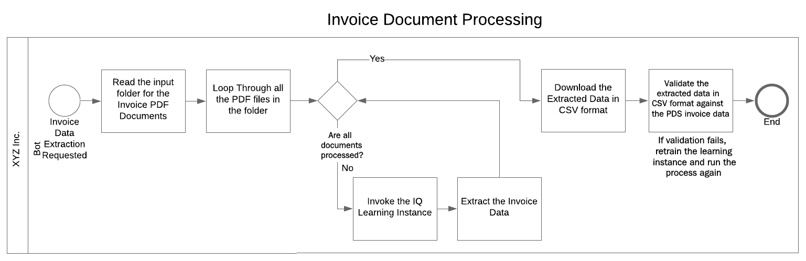

What we are doing here is intelligent document processing using AI. This
is an important area where RPA is making a difference in enterprises.
Now, let\'s take a look at the project\'s components.

Project details
===============

Processing invoices containing unstructured data in PDF files and
changing them into structured data in the form of CSV files involves two
steps. Let\'s take a look:

1.  **Creating a learning instance**: We need to create a learning or
    training instance by feeding a few sample invoice documents for the
    AI (IQ Bot) to learn from. Then, we need to review and confirm or
    correct the mappings so that the AI learns the fields correctly. The
    IQ Bot is then ready to process invoices that are uploaded to it and
    convert them into structured CSV files. This can be seen in the
    following diagram:

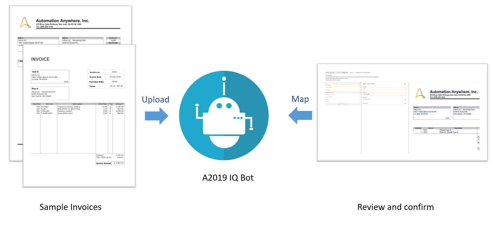

2.  **Upload and download from IQ Bot**: Once we have the learning
    instance, we can use a Task Bot to upload the invoices that we\'d
    like to process to the IQ Bot learning instance. The IQ Bot
    processes the PDF documents and provides structured data in CSV
    format. We will use another bot to download those CSV files. Here is
    a sequence diagram showing this process:

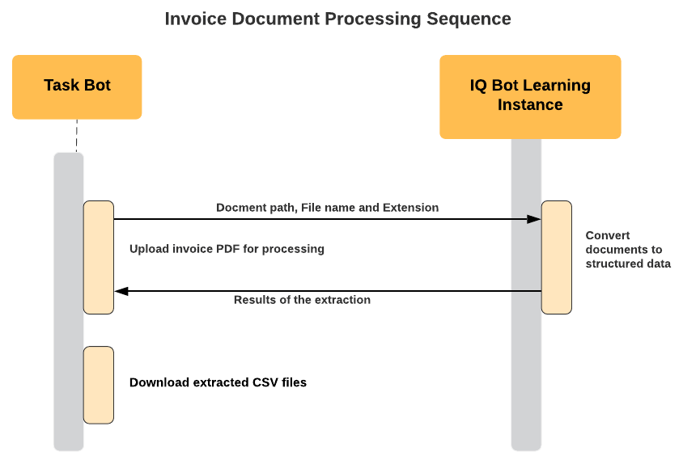

Now, let\'s go through the project, starting with some groundwork. 

Project groundwork
------------------

Let\'s set up a few things before we start working on the project. We
will open Automation Anywhere A2019 and download the sample invoices
that we will learn and process. 

Opening the Automation Anywhere A2019 Control Room
--------------------------------------------------

We will be creating an IQ Bot learning instance and some Task Bots so
that we can invoke IQ Bot using the A2019 Control Room. So, open the
A2019 Community Edition in your browser at
<https://community.cloud.automationanywhere.digital/#/login>. Please log
into the Control Room so that you end up on the Control Room\'s home
page. 

Now that we\'re in the A2019 Control Room, we can go to IQ Bot and
gather the invoice samples. 

Downloading sample invoices
---------------------------

We will download and use the A2019 IQ Bot invoice samples so that it\'s
easy for you to follow along:

1.  To download Automation Anywhere samples, click on the Launch IQ
    Bot button from the Control Room home page, as shown
    in the following screenshot: 

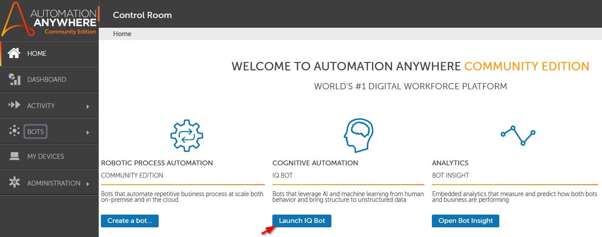

2.  A2019 will open the IQ Bot home page in a new
    browser tab. Click on Get Started on the IQ Bot
    home screen to advance.
3.  On the next screen (Create), you should find the
    option to Download sample
    documents, as shown in the
    following screenshot:

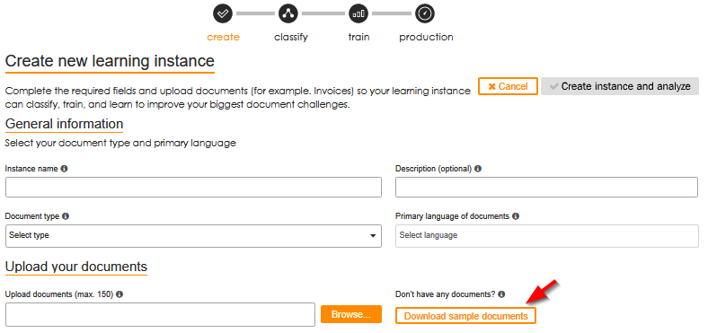

Click on the Download sample documents button. This
will download a ZIP file containing all the document samples.

4.  Extract the ZIP file and look for the Invoices
    folder. Copy that folder over to the project area. 
5.  Within this Invoices folder, create two folders --
    Train and Test. We will put the
    invoices that we want to use for learning in the
    Train folder and the ones we want the bot to
    process in the Test folder. We can choose three
    typical formats and put them in the Train folder
    and place seven in the Test folder. You can choose
    different combinations and test the combinations for yourself. 

Now that we have the sample invoices for the project, we can start
creating the IQ Bot learning instance.

Creating the IQ Bot learning instance 
--------------------------------------

As we discussed in the introduction, IQ Bot uses AI to learn the format
of the invoice. It uses what it\'s learned to process the rest of the
invoices. 

So, the first step is to create an instance that has been trained using
the necessary invoice formats. Once we have the learning instance, we
can upload the invoices to IQ Bot and convert them into structured data.
Let\'s start by setting up the IQ Bot instance. 

Setting up the initial IQ Bot learning instance
-----------------------------------------------

As part of the groundwork process, we opened the IQ Bot and went to the
initial screen to create the learning instance. Go back to that page and
pick up from where we left off:

1.  On the Create screen, under General
    information, choose a name for the instance. Next,
    we have to provide a Document Type. We use this to
    tell the IQ Bot what type of documents we will be processing. Let\'s
    choose Invoices as we want IQ Bot to process
    invoices. 
2.  Under the Upload your documents section, we have to
    upload a few sample invoices for IQ Bot to learn from. Click on
    Browse and upload the invoices we put in the
    Train folder previously. 
3.  Finally, under Fields to extract, you can leave the
    default selected fields for the invoice as is. Click on Create
    instance and analyze:

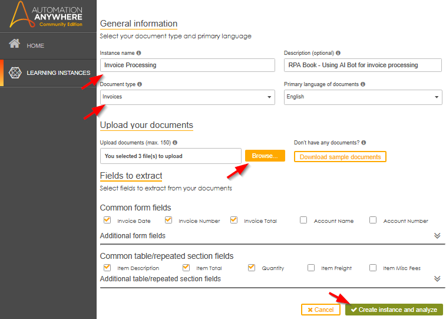

It will take IQ Bot a few minutes to analyze the documents and create
the learning instance. After doing this, it will present us with a
screen where we can review these changes and make any updates to the
training process. 

Reviewing and updating field mappings
-------------------------------------

IQ Bot presents us with a Review group with the mapping
it has so far for the invoices we uploaded for training. This mapping is
a starting point based on typical invoice formats. It is up to us to
review and ensure that the fields and values are mapped correctly.
Let\'s look at the steps:

1.  Here\'s what the review screen looked like for us. This may vary
    based on the training invoices you chose, though not by much if you
    also choose the Automation Anywhere sample invoices:

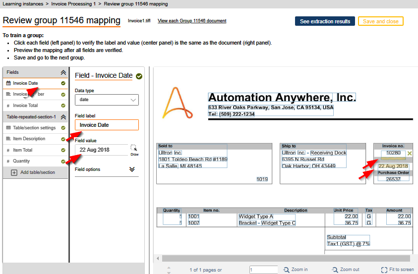

2.  Look at each field and check whether the Field
    Label and Field Value options match
    with what is on the invoice on the right. For example, in the
    preceding screenshot, we have pointed out the fields and data to
    check for Invoice Date.

IQ Bot may classify the documents into different groups if there is more
than one distinct format. We chose three similar types, so there is only
one group. If there is more than one group, an extra button will appear
at the top, near Save and close, so that you can review
the other groups as well. 

3.  Next, click on the See extraction results button to
    verify that the data is being extracted as intended. You will see a
    screen similar to the one shown in the following screenshot so that
    you can verify whether the data is being extracted to the right
    fields. You can navigate to the results for the three invoices using
    the buttons at the top of the screen. Once you are satisfied with
    the extraction process, you can go Back to training
    by clicking the button shown in the following screenshot:

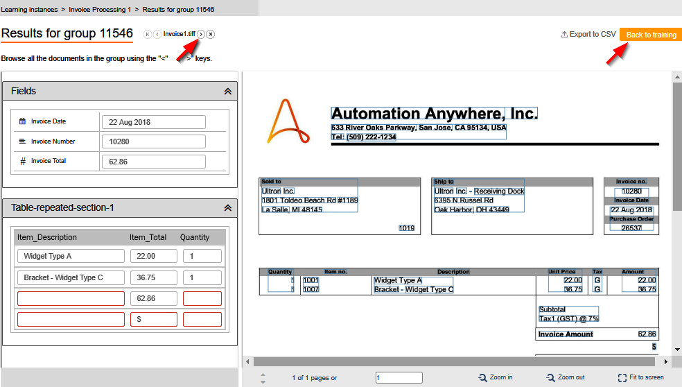

4.  Once you are back on the Review group screen, click
    on Save and close. You will see a popup, asking
    whether you would like to save what you have trained currently. Go
    ahead and click on Save if you are satisfied with
    the training and the extraction you\'ve done.
5.  IQ Bot will then show you the learning instance and its group(s), as
    shown in the following screenshot. For us to use IQ Bot, we need to
    send to production using the toggle button shown in the following
    screenshot:

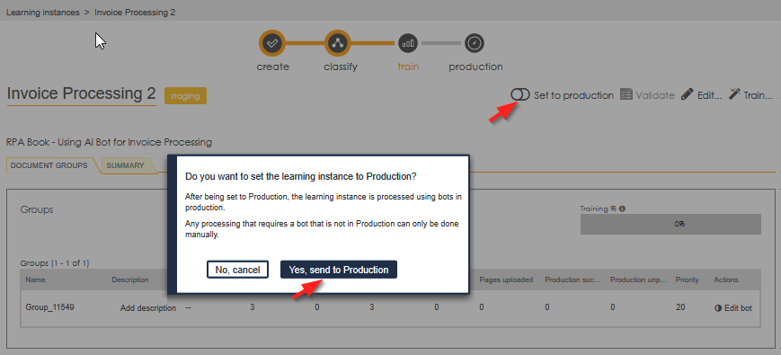

After some time, training will be at 100%. Now that we have a learning
instance in production, we can upload the invoices we \'d like to
process in IQ Bot.   

First, let\'s create a Task Bot so that we can invoke and upload the
invoices to IQ Bot.

Uploading invoices to IQ Bot 
-----------------------------

Now, we are ready to process the rest of the invoices we placed in the
Test folder. We will create a Task Bot that will loop
through the Test folder and upload all the documents to
IQ Bot. Follow these steps:

1.  Let\'s go back to the Automation Anywhere A2019 Control Room home
    page. Note that this is different from the IQ Bot home page. Go to
    My Bots and then Create a
    bot, just like we did for our past
    A2019 projects. Name the bot Invoice Upload (or any
    name that you\'d like to use to identify the bot):

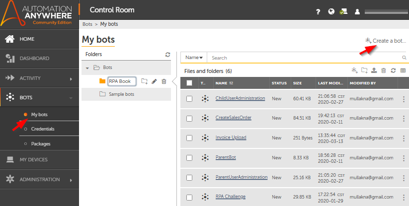

2.  On the new bot canvas, add a Loop action. Since we
    need to loop through each file in the Test folder,
    we\'ll set Iterator to For each file in
    folder. Provide the Folder path as
    the complete path to the Test folder. Finally,
    choose the wizard and add a Dictionary variable
    called File for the Assign file name and extension to this
    variable input box:

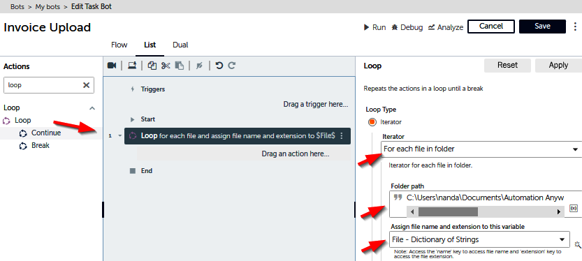

3.  Next, add an IQ Bot step so that you can upload each of these
    documents. Choose the IQ Bot Upload Document
    Action. In the properties, choose the learning instance that we set
    to production in the previous section:

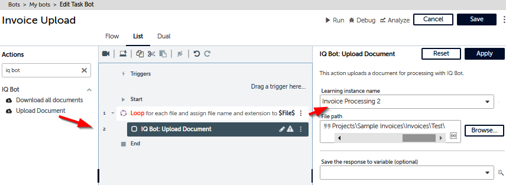

4.  For the File path property, we need to construct
    the filename and append it to the path. To do so, we need to add the
    path to the Test folder, followed by a \"\\\", and then
    click on the insert variable within the input box. Choose the
    File Dictionary variable and then type in name for
    the Dictionary key. Since we are constructing a
    filename with an extension, we\'ll need to add a \".\" after the
    File name variable. Click the insert variable
    again, choose File, and add a Dictionary
    key called extension. Your File
    path will be in the following format: 

    `<Your File Path>\$File{name}$.$File{extension}$`
    This can be seen in the following screenshot:

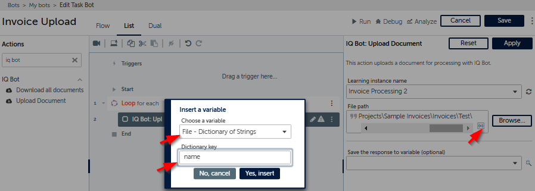

You can also add a variable to capture the response from IQ Bot using
the Save the response to variable option in the Upload
Document activity, as shown in the preceding screenshot.
Then, you can check whether the response is positive before uploading
the next document.

5.  Your uploaded Task Bot is ready. Save the bot and
    run it using the Run button. This will upload all
    the invoice documents we\'d like to process with IQ Bot. If all goes
    well, you will receive a message stating that your bot ran
    successfully:

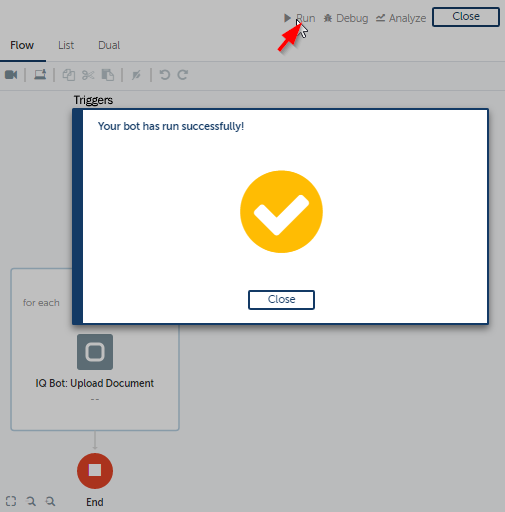

So far, IQ Bot has taken all the invoices from the Test folder
and converted them into structured data. Now, we need to download them.

Downloading structured data from IQ Bot
---------------------------------------

Now, let\'s download the CSV files that were generated by IQ Bot. These
CSV files contain the invoice data from the mapping we created in the
learning instance. To create this Task Bot, follow these steps:  

1.  Go to My Bots on the left panel and select Create
    a bot, just like we did in the previous section.
    Name it Invoice Download. 

2.  We just need one Action to download the files from IQ Bot. Let\'s
    look up and add the IQ Bot Download all documents
    Action. In its properties, choose the learning instance we created
    earlier. For the Local output folder, add the path
    where you\'d like the bot to place the processed CSV files:

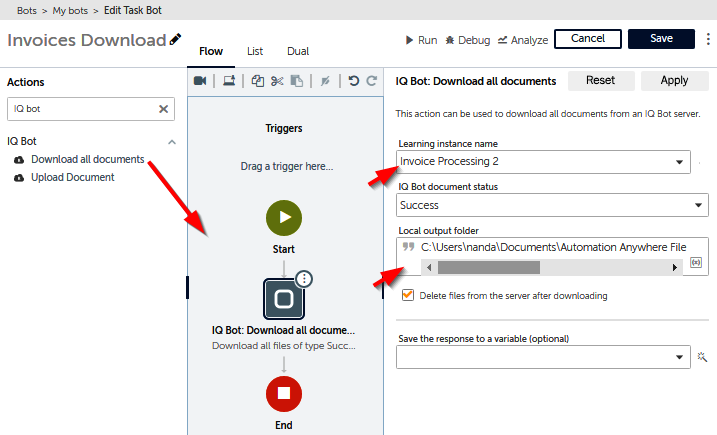

3.  Save the bot and run it. Once the bot has run successfully, go to
    the processed CSV files folder and check whether you have the files.
    The bot will have processed all the invoices that matched the format
    that we trained it on.

Now that we have the structured data downloaded, let\'s verify the data
with the corresponding invoices. 

Checking the automation
-----------------------

Let\'s compare the structured data output from the bot with the
unstructured data from the invoices. This way, we can test that our
project works.

Open the CSV file from the processed files folder. Also, open the
corresponding invoice. The bot will have named the CSV file so that the
invoice\'s filename is at the end. Place them side by side to compare
them, as shown in the following screenshot:

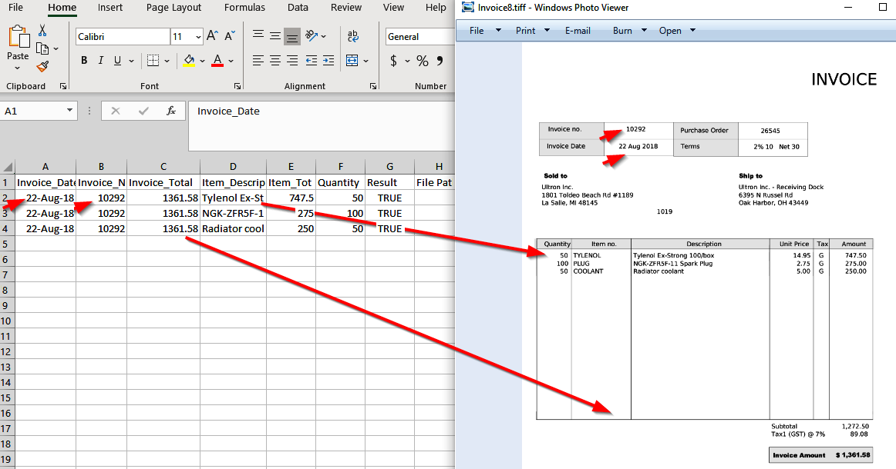

You can compare each of the invoice fields to the columns in the CSV
file. Do this comparison for the rest of the files that were generated.
If all goes well, all the fields should match perfectly. 

These CSV files can now be used as input for an automation process that
needs to use the invoice data. IQ Bot Community Edition can process many
standard document formats such as invoices, purchase orders, bank
statements, credit memos, and utility bills. There are many more formats
in the Enterprise version. 

So, if we were to repeat these steps for purchase orders using a sample
format, we could take the structured data and put it in a purchase order
application.

This was our last project with Automation Anywhere. Let\'s do a quick
recap.

Automation Anywhere projects -- recap
-------------------------------------

With this project, we completed five projects with Automation Anywhere
A2019 that have increased in complexity. Here is what we\'ve covered: 

-   We started with the Automation Anywhere A2019 platform by solving an
    RPA challenge. This included performing basic automation, along with
    handling dynamic elements in forms.
-   Then, we learned how to use web automation by creating sales orders
    in the Apptivo application.
-   Next, we learned about how to perform user administration with bots
    by creating new users in a SaaS application.
-   Then, we completed an exciting project that sent emergency text
    messages using the Twilio API.
-   In this final project, we learned how to use AI to extract
    meaningful data from scanned documents using Automation Anywhere IQ
    Bot.

With that, we have covered five different projects using Automation
Anywhere and UiPath! 

Summary
=======

In this lab, we learned how to use AI with RPA for document
processing. 

Processing documents such as purchase orders and invoices is one of the
common yet difficult problems that arises when it comes to automation.
So, in this lab, we looked at how to crack that problem with AI.

Once AI has processed these documents into structured data, it opens up
many automation use cases for downstream processing. For example,
invoice data output could be entered into the Apptivo application, which
we used previously in this course.

Now that we have come this far, we encourage you to try out what you\'ve
learned for yourself. In fact, there are many more use cases that you
can automate based on the projects we completed in this course. 

This is the last lab in this course. We had great fun creating these
projects and have included provided the code on GitHub. We hope you\'ve
enjoyed working on the projects as much as we\'ve enjoyed guiding you
through them. We\'re sure you\'ve faced some difficulties but have come
out the other end as a better RPA practitioner. 

Hopefully, we will get to write more books on this subject. When we do,
we hope to see you there -- or somewhere on the web! 
