Lab 2: Sequence, Flowchart and State Machines
=============================================


#### Lab Solutions
Lab solution(s) are present in `Solution\Lab02` folder.


Sequences
=========

To create a sequence that asks the user for his first and last name, and
his hair color, and then displays his answers, do the following:

1.  Create a blank process and, on the **Design** tab, in the **File**
    group, select **New \> Sequence**. The **New Sequence** window is
    displayed.

> Note:
>
> You can also add a
> [**Sequence**] activity
> to the **Designer** panel to create a new sequence, or simply drag an
> activity from the **Activities** panel and Studio automatically adds a
> parent sequence to it.

2.  In the **Name** field type a name for the automation, such as "First
    Sequence", and leave the default project location or add a
    subfolder. Click **Create**. The **Designer** panel is updated
    accordingly.
3.  Create three **String** variables such as 
    FirstName, 
    LastName, and 
    HairColor, so that you can store data from the user in them. Leave
    the **Default** field empty, to indicate that there is no default
    value.

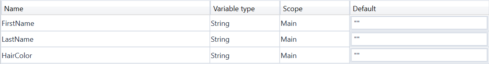

4.  Drag three [**Input Dialog**]
    activities to the **Designer** panel, one under the other.
5.  Select the first **Input Dialog** and, in the **Properties** panel,
    add a **Label** asking for the first name of the user, and a custom
    **Title**.

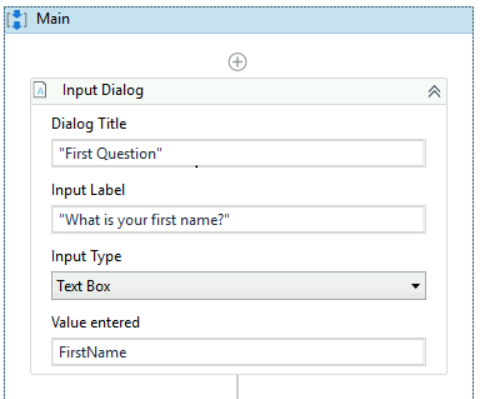

6.  In the **Result** field add the 
    FirstName variable. This indicates that this variable is going to be
    updated with the value added by the user at this point.
7.  Repeat steps 6 - 7 for the second and third **Input Dialog**
    activities to ask the user for his last name and hair color, and
    store them in the 
    LastName and 
    HairColor variables.
8.  Add a [**Message Box**] activity
    under the third **Input Dialog**.
9.  Select the **Message Box** and, in the **Properties** panel, in the
    **Text** field, add the variables and a string to enable you to
    display all information gathered from the user, such as:
     
```
FirstName + " " + LastName + " has " + HairColor + " hair."
```

> Note:
>
> Remember to add spaces between variables and within strings for an
> optimal output.

The final project should look as in the following screenshot.

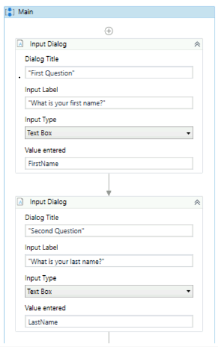

10. On the **Design** tab, in the **File** group, click **Run**. The
    automation is executed. The final output message should look as in
    the following screenshot.

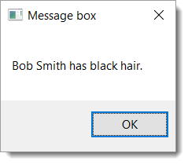


Flowcharts
==========

To exemplify the properties of a flowchart, we are going to build a
guessing game that generates a random number from 1 to 999 that the user
must guess. To create such an automation, do the following:

1.  Create a blank process and from the **Design** tab, in the **File**
    group, select **New \> Flowchart**. The **New Flowchart** window is
    displayed.

> Note:
>
> You can also add a
> [**Flowchart**] activity
> to the **Designer** panel to create a new flowchart project.

2.  In the **Name** field type a name for the automation, such as "First
    Flowchart", and leave the default project location or add a
    subfolder. Click **Create**. The **Designer** panel is updated
    accordingly.
3.  Create two **Int32** variables (
    RandomNumber, 
    GuessNumber) and a **String** one (
    Message).
4.  Set the default value of the 
    Message variable to "Guess a number from 1 to 999." The
    
    RandomNumber stores a random number between 1 and 999,
    GuessNumber stores the user’s guess and 
    Message stores the message that is going to be displayed to prompt
    the user.

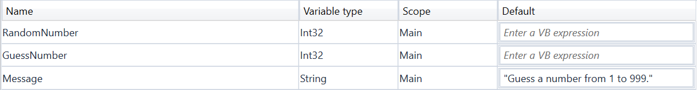

5.  Add an [**Assign**]
    activity to the **Designer** panel, and connect it to the **Start**
    node.
6.  In the **Properties** panel, in the **To** field add the RandomNumber variable.
7.  In the **Value** field, type 
    new Random().Next(1,999).

> Note:
>
> This field uses the
> Random() function to generate a random number between 1 and 999. For
> more information on variables, see
> [Variables](https://docs.uipath.com/studio/docs/managing-variables).

8.  Add an [**Input Dialog**] activity
    to the **Designer** panel and connect it to the **Assign** one.
9.  In the **Properties** panel, in the **Label** field, add the
    Message variable.
10. In the **Result** field, add the 
    GuessNumber variable. This activity asks and stores the user’s
    guesses in the 
    GuessNumber variable.

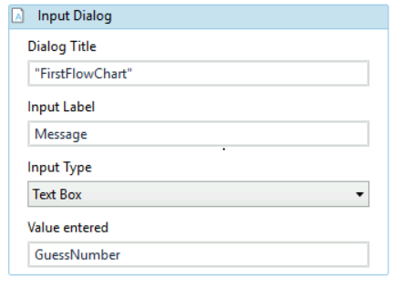

11. Add a [**Flow Decision**]
    activity and connect it to the **Input Dialog**. This activity
    enables you to tell the user if he correctly guessed the number or
    not.
12. In the **Properties** panel, in the **Condition** field, type
    
   `GuessNumber =  RandomNumber`
    
    This enables you to verify if the number added by the
    user is the same as the randomly-generated one.
13. Add a [**Message Box**] activity and
    connect it to the **True** branch of the **Flow Decision**.
14. In the **Properties** panel, in the **Text** field, type
    `"Congratulations! You guessed correctly! The number was " + RandomNumber.ToString + "."`
    This is the message that is going to be
    displayed if the user correctly guessed the number.
15. Add a new **Flow Decision** activity and connect it to the **False**
    branch of the previously added **Flow** Decision.
16. In the **Properties** panel, in the **Condition** field, type
    `GuessNumber > RandomNumber`
    
    This activity enables you to check if the number the
    user added is bigger than the randomly-generated one.
17. In the **DisplayName** field, type **Comparison**. This enables you
    to easily to tell the difference between the two **Flow Decisions**
    used.
18. Add an **Assign** activity and connect it to the **True** branch of
    the **Comparison** activity.
19. In the **To** field, type the 
    Message variable, and in the **Value** field, type a message
    indicating that the guess was too high, such as:
    `"Too big. Try again."`

20. Select the **Assign** activity and press Ctrl+C. The entire activity
    and its properties are copied to the Clipboard.
21. Press Ctrl + V. A duplicate of the previous **Assign** activity is
    displayed.
22. Connect it to the **False** branch of the **Comparison** activity
    and, in the **Properties** panel, in the **Value** field, type:
    `"Too small. Try again."`

23. Connect the **Assign** activities created at steps 18-22 to the
    **Input Dialog**. A loop is created, asking the user to type a
    smaller or bigger number, until he guesses correctly.
    The final project should look as in the screenshot below.

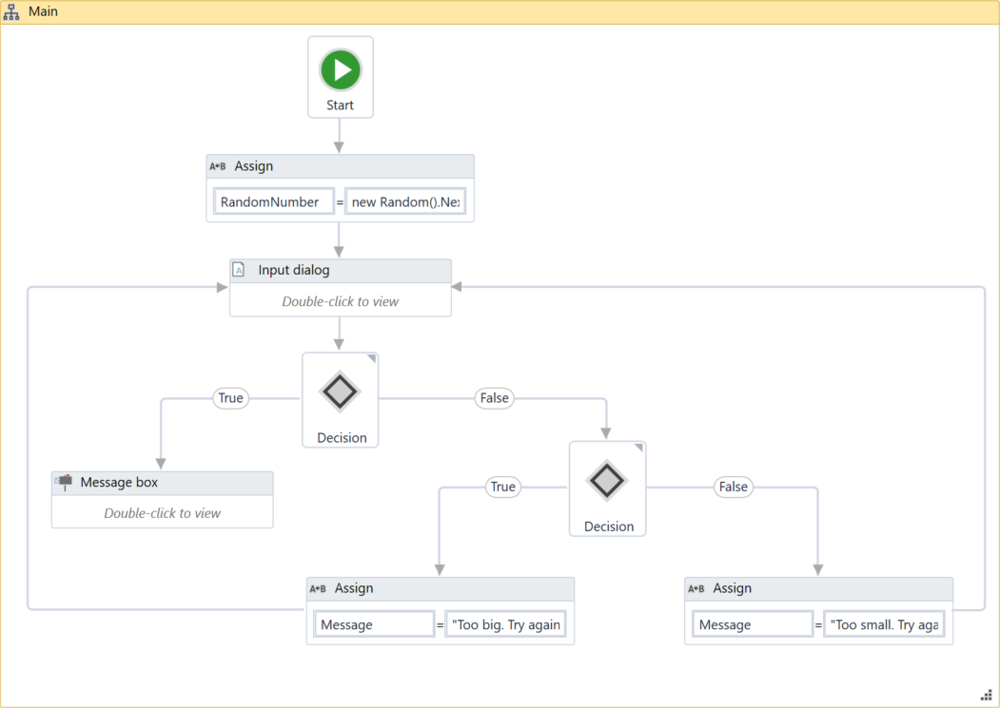


State Machines
==============

There are two activities that are specific to state machines, namely
[**State**] and [**Final State**], found under
**Workflow \> State Machine**.

> Note:
>
> You can only create one initial state, yet it is possible to have more
> than one **Final State**.

The **State** activity contains three sections, **Entry**, **Exit** and
**Transition(s)**, while the **Final State** only contains one section,
**Entry**. Both of these activities can be expanded by double-clicking
them, to view more information and edit them.

The **Entry** and **Exit** sections enable you to add entry and exit
triggers for the selected state, while the **Transition(s)** section
displays all the transitions linked to the selected state.

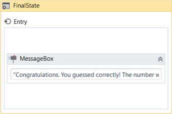
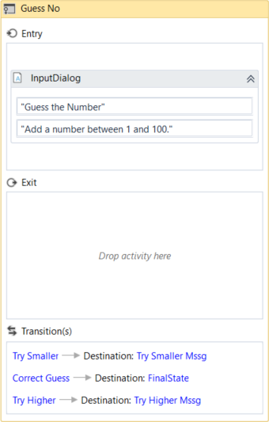

Transitions are expanded when you double-click them, just like the
**State** activity. They contain three sections, **Trigger**,
**Condition** and **Action**, that enable you to add a trigger for the
next state, or add a condition under which an activity or sequence is to
be executed.

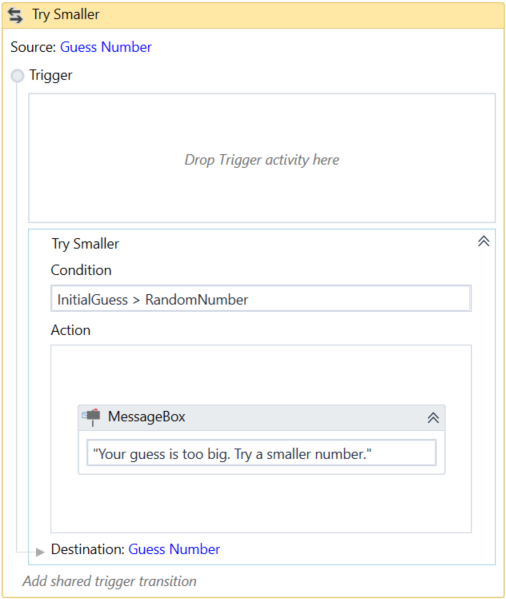


##### Example of How to Use a State Machine


To exemplify how to use a state machine, we are going to build the
guessing game we did in the previous chapter, the only difference being
that we will try to guess a number between 1 and 100.

1.  Create a blank process and, on the **Design** tab, in the **File**
    group, select **New \> State Machine**. The **New State Machine**
    window is displayed.

> Note:
>
> You can also add a [**State Machine**] activity
> to the **Designer** panel to create a new state machine automation.

2.  In the **Name** field type a name for the automation, such as "First
    State Machine", and leave the default project location or add a
    subfolder. Click **Create**. The **Designer** panel is updated
    accordingly.
3.  Create two integer variables, 
    InitialGuess and 
    RandomNumber. The first variable stores your guess, while the second
    stores the random number.
4.  Add a **State** activity to the **Designer** panel and connect it to
    the **Start** node. This is the initial state, and it is used to
    generate a random number.
5.  Double-click the activity. This **State** activity is displayed
    expanded in the **Designer** panel.
6.  In the **Properties** panel, in the **DisplayName** field, type
    Initializing Random Number. This enables you to easily tell states
    apart.
7.  In the **Entry** section, add an
    [**Assign**] activity.
8.  In the **To** field, add the 
    RandomNumber variable.
9.  In the **Value** field, type 
    new Random().Next(1,100). This expression generates a random number.
10. Return to the main project view and add a new **State** activity.
11. Connect it to the previously added activity.
12. Double-click the last added **State** activity. This activity is
    displayed expanded in the **Designer** panel.
13. In the **Properties** panel, in the **DisplayName** field, type
    Guess Number. This state is used to prompt the user to guess a
    number.
14. In the **Entry** section, add an [**Input Dialog**] activity.
15. Select the **Input Dialog**, and in the **Properties** panel, add an
    appropriate **Label** and **Title** to prompt the user to guess a
    number between 1 and 100.
16. In the **Result** field, add the 
    InitialGuess variable. This variable stores the user’s guess.
17. Return to the main project view and create a transition that points
    from the Guess Number state to itself.
18. Double-click the transition. The transition is displayed expanded in
    the **Designer** panel.
19. In the **Properties** panel, in the **DisplayName** field, type Try
    Smaller. This message is displayed on the arrow, enabling you to run
    through your automation easier.
20. In the **Condition** section, type 
    InitialGuess \> 
    RandomNumber. This verifies if the user’s guess is bigger than the
    random number.
21. In the **Action** section, add a [**Message Box**] activity.
22. In the **Text** field, type something similar to "Your guess is too
    big. Try a smaller number." This message is displayed when the
    user’s guess is bigger than the random number.
23. Return to the main project view and create a new transition that
    points from the **Guess Number** state to itself.
24. Double-click the transition. The transition is displayed expanded in
    the **Designer** panel.
25. In the **Properties** panel, in the **DisplayName** field, type "Try
    Bigger". This message is displayed on the arrow, enabling you to run
    through your automation easier.
26. In the **Condition** section, type 
    InitialGuess \< 
    RandomNumber. This verifies if the guess is smaller than the random
    number.
27. In the **Action** section, add a **Message Box** activity.
28. In the **Text** field, type something similar to "Your guess is too
    small. Try a bigger number." This message is displayed when the
    users guess is smaller than the random number.
29. Return to main project view and add a **Final State** activity to
    the **Designer** panel.
30. Connect a transition from the **Guess Number** activity to the
    **Final State**.
31. In the **Properties** panel, in the **DisplayName** field, type
    "Correct Guess".
32. In the **Condition** field, type 
    InitialGuess = 
    RandomNumber. This is the condition on which this automation steps
    to the final state and end.
33. Double-click the **Final State** activity. It is displayed expanded
    in the **Designer** panel.
34. In the **Entry** section, add a **Message Box** activity.
35. In the **Text** field, type something similar to "Congratulations.
    You guessed correctly! The number was " + 
    RandomNumber.ToString + "." This is the final message that is to be
    displayed, when the user correctly guesses the number.\
     The final project should look as in the following screenshot.

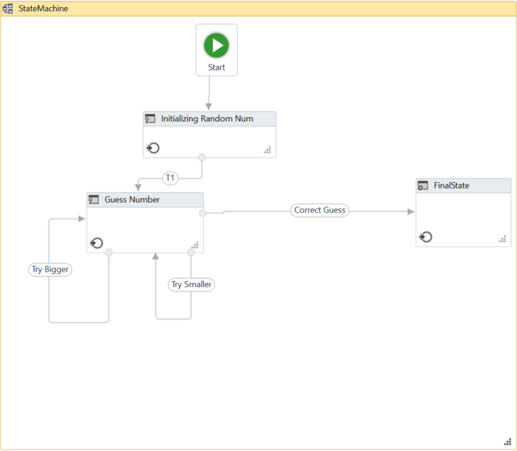

36. Press F5. The automation is executed correctly.

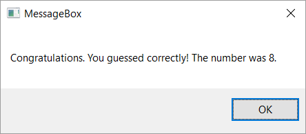

