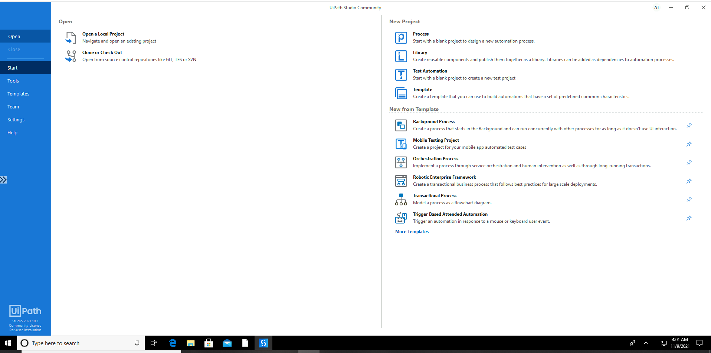

Lab 2. Record and Play
-----------------------------------

The facility of recording user steps on a computer and playing them back
has made **Robotic Process Automation** (**RPA**)
highly successful. Without this feature, the adoption of the technology
might have been very slow and it would have
been seen as another automation/scripting tool.

In the previous lab, we gained a basic understanding of Robotic
process automation. In this lab, we will see how to use the recorder
as the first step of automation in our journey. Before that, let us
understand the UiPath tool and learn how to install it (you can only use
the recorder after installing it). We will cover:

-   The UiPath stack and components of the platform.
-   How to download and install UiPath components.
-   Understanding the Project Studio in detail. The Project Studio is
    the place where developers spend most of their time configuring the
    Robots.
-   The recorder, with two step-by-step examples to quickly master
    record and play.

UiPath stack
------------------------------

In order to make the UiPath platform fully operational at an enterprise
level, there are various components that need to be in place. There are
three basic components in UiPath:

1.  UiPath Studio
2.  UiPath Robot
3.  UiPath Orchestrator

Downloading and installing UiPath Studio
----------------------------------------------------------

The UiPath Community Edition has the following features:

-   Auto update
-   No server integration
-   Community forum for support
-   Online self-learning
-   No complex installation required
-   Online activation is mandatory

To get your Community Edition of UiPath Studio, type the following link
in your
browser: [https://www.UiPath.com/community](https://www.uipath.com/community){.ulink}:

1.  A **`Community Edition`** page opens. Click on
    **`Get Community Edition`**:

 

2.  On the next page, you must register yourself in order to download
    the Community Edition. So, use the correct details and remember them
    because the same email will be used to activate the software. Fill
    in the following details: **`First Name*`**, **`Last Name*`**,
    and **`Email*`**. Filling in the **`Twitter User`** field is not
    mandatory, but it is good to provide it:

Click on **`REQUEST COMMUNITY EDITION`**.

3.  You will be directed to a page that requests you to check your email
    for downloading the link. Click on the link to download UiPath
    Studio. You may also directly download UiPath Studio. Just click on
    the word [here]{.underline} in **`download it here`**, as shown in
    the following screenshot:

4.  Once the download is complete, open the downloaded
    file, `UiPathStudioSetup.Exe`.

5.  The installation will then begin. Once the installation is complete,
    a welcome message will be displayed. Click on the **`Start Free`**
    option:

6.  Then, as requested, enter your **`Email Address`** once again and
    click on **`Activate`**. Please remember to use the same email ID
    that you used to download the software. This email ID will be bound
    to the computer. The activation will happen online. An offline
    activation option is not available for the Community Edition.
7.  A message will then be displayed on the screen informing you of the
    successful installation. Close this window.

**Note:**

For more convenient use, you can pin it to your taskbar immediately;
otherwise, you may have to unnecessarily search for
`UiPath.exe` in your computer every time you wish to use it.

Your UiPath Studio is now ready for use!

Learning UiPath Studio
----------------------------------------

The **UiPath Studio** platform helps to design Robotic processes with a visual interface.
Automation in UiPath Studio requires no or very little prior programming
knowledge. It is a Flowchart-based modeling tool. Thus, automation is
faster and more convenient. The presence of a visual signal that points
out errors in the model, along with the recorder, which performs what
users execute, makes modeling much easier.

We will study UiPath Studio in detail now. First and foremost, let us
understand the types of project available and which should be used when.

### Projects

The main types of project supported by UiPath
Studio are as follows:

-   **Sequence**: This is suitable for simple actions or tasks. It enables you to go from one activity
    to another, without interfering with your project. It consists of
    various activities. Creating sequences is also useful for debugging
    purposes. One activity from a particular sequence can easily be
    tracked. The Basic type of project can be started using
    the **`Blank`** option in the start tab and then adding the sequence
    in the diagram from the toolbox.
-   **Flowchart**: This is suitable for dealing with more complex projects. It enables you
    to integrate decisions and connect activities. To start this kind of
    project, choose the **`Flowchart - Simple Process`** option from the
    new project menu.
-   **Assistant:** This is suitable for developing attended or Front Office Robots:
    sometimes these Robots are called assistants. To start this kind of
    project, choose the **`Assistant - Agent Process Improvement`**
    option from the new project menu.
-   **State machine**: This is suitable for very large projects that use a finite number of
    states in their execution, triggered by a condition. To start this
    kind of project, choose
    the **`Process - Transaction Business Process`** option from the new
    project menu:

Please remember, the four types of project mentioned in the preceding
screenshot are only available in the **`Start`** tab of the studio.
However, if you click on the **`New`** option in the DESIGN tab, you
only get three options:

-   Sequence
-   Flowchart
-   State Machine

The preceding options selected from the DESIGN tab\'s **`New`** menu
become part of an existing project and are referred to as a diagram.

UiPath Studio basically helps in automating various tasks through the
designing of projects. A project is a graphical representation of any
rule-based business process. It is usually in Flowchart form. One can
design projects by customizing and defining the various steps, known as
activities, ranging from a simple click to
entering particular data.

### The user interface

When you first open UiPath Studio, you are directed to the page shown in the following screenshot:

Start tab of UiPath Studio

You can either open an old project or create a new one. Let us say we
are making a new project. We click on **`Blank`** and name it. We will
then be directed to a screen, which will display the following:

[]

****

1.  The Ribbon
2.  Quick Access Toolbar
3.  Designer panel
4.  Properties panel
5.  Outline panel
6.  Arguments panel
7.  Variable panel
8.  Import panel
9.  Activity panel
10. Library panel
11. Project panel
12. Output panel

#### The Ribbon

This panel located at the top of the user
interface and consists of four tabs:

1.  **`START`**: This is used to start new projects or to open projects
    previously made.
2.  **`DESIGN`**: This is to create new sequences, Flowcharts, or state
    machines, or to manage variables:

3.  **`EXECUTE`**: This is used to run projects or to stop them, and
    also to debug projects:

4.  **`SETUP`**: This panel is for deployment and configuration options;
    it has three tools available:
    
    -   **`Publish`**: This is used to publish a project or create a
        shortcut for it and schedule tasks
    -   **`Setup Extensions`**: This is used to install extensions for
        Chrome, Firefox, Java, and Silverlight
    -   **`Reset Settings`**: This is used to reset all settings to
        defaults:
    

#### The Quick Access Toolbar

This panel gives the user a shortcut to the
most used commands. One can also add new commands to this panel. This is
located above the Ribbon on the user interface.** **The Quick
Access Toolbar has been circled in the following screenshot and is
indicated by the arrow:

It can be moved above or below the Ribbon. By default, there are two
buttons available, **`Save`** and **`Run`**, which are also available in
the **`DESIGN`** tab of the Ribbon.

#### Designer panel

This is the panel where one defines the steps
and activities of the projects. It is where a developer does most of the
things to record activities or manually drop activities on the canvas.
In UiPath, this is equivalent to the code windows of Microsoft Visual
Studio. When we develop a Robot, this is the window where we will be
organizing various activities in a flow or chain to accomplish a task.

The project a user makes is clearly displayed on the Designer panel and
the user has the option of making any changes to it.

#### Properties panel

 The panel located on the right-hand side of
the user interface is for viewing the properties of the activities and
for making any changes, if required. You need to select an activity
first and then go to the **`Properties`** panel to view or change any of
its properties:

[]

****

** **

#### Activities panel

Located on the left-hand side of the user
interface, this panel contains all the activities that can be used in
building the project. The activities can easily be used in making a
project by simply dragging and dropping the required activity into the
required location in the Designer panel.

#### Project panel

With the **`Project`** panel, you can view
the details of your current project and open it in a
**`Windows Explorer`** window. It is located on the extreme left-hand
side of the design panel, below the **`Library`** panel:

[]

****

#### Outline panel

As the name suggests, this panel gives a
basic outline of the project. The activities that make up the workflow
are visible in this panel. Using this, you may see a high-level outline
of the project and you can drill down to see deeper. This panel is
especially helpful of large automation projects, where one may otherwise
have a tough time going through it:

#### Output panel

This panel displays the output of the [*log message*] or
[*write line*] activities. It also displays the output during
the debugging process. This panel also shows
errors, warnings, information, and traces of the executed project. It is
very helpful during debugging. The desired level of detail can be
changed in **`Execute`** \| **`Options`** \| **`Log activities`**:

#### Library panel

With this panel, you can reuse automation
snippets. It is located on the extreme left-hand side of the Designer
panel:

#### Variable panel

This allows the user to create variables and make changes to them. This is located below the Designer panel.

In UiPath Studio, variables are used to store multiple types of data
ranging from words, numbers, arrays, dates, times, and timetables. As
the name suggests, the value of the variable can be changed.

An important point to note is that variables can only be created if
there is an activity in the Designer panel.

To create new variables, you can go to the **`DESIGN`** tab on the
Ribbon and click on **`create variable`**, then choose the type of
variable. Otherwise, one can simply go to the Variable panel located
below the Designer panel and create a variable. Also, if one renames a
variable in the Variables panel, the variable is renamed in every place
it is used in the workflow. The Scope of the variable shows where the
variable is located.

#### Argument

While variables pass data from one activity
to another in a project, arguments are used for passing data from one
project to another. Like variables, they can be of various
types---String, Integer, Boolean, Array, Generic, and so on.

Since arguments are used to transfer data between different workflows,
they also have an added property of [*direction*]. There are
four types of direction:

-   In 
-   Out
-   In/Out
-   Property

These depend on whether we are giving or receiving data to or from
another workflow.

Task recorder
-------------------------------

The task recorder is the main reason for RPA\'s success. With the task
recorder, we can create a basic framework for automation. The user\'s
actions on the screen are recorded by the
recorder and turned into a recording sequence in the current project.
That\'s how Robots are able to mimic human actions.

The recording is collection of execution steps that has to be taken, on
the applications in the scope, in order to accomplish a task.

These steps can be recorded one by one (manually) by pointing it on the
screen or many steps in a go that is, automatically.

There are four types of recording in UiPath Studio:

-   Basic
-   Desktop
-   Web
-   Citrix

We will talk about them later. The user can modify the recorded sequence
even after the recording is over. This is especially helpful in cases
where small changes have to be made to the recording sequence. The
option to modify an existing recorded sequence thus ensures that there
is no need to record the entire process again.

There are four basic types of recording:

-   **Basic recorder**: Basic recorder is used to record activities on the desktop. This type of
    recorder is used for single activities and simple workflows. The
    actions here are self-contained and not contained in separate
    windows, as shown in the following screenshot:

-   **Desktop recorder**: The desktop recorder, like the
    basic recorder, is used to record activities on the desktop.
    However, it is used to record and
    automate multiple actions and complex workflows. Each activity here
    is contained in an **`Attach Window`** component, as shown in the
    following screenshot. The **`Attach Window`** component is
    especially important to ensure that other windows of the same
    application do not interfere in the workflow. UiPath uses the name
    of the app, the title of the window, and the currently opened file
    to locate and identify the correct window. However, there may be
    cases where, for example, two untitled Notepads are open on the
    screen. Without **`Attach Window`**, UiPath may select the wrong
    Notepad, thus causing errors:

-   **Web recorder**: The web recorder, as the name suggests,
    is used to record actions on web
    applications and browsers.
-   **Citrix recorder**: Citrix is used to record virtual machines, VNC, and Citrix
    environments. This recording allows only keyboard, text, and image
    automation.

Some actions are recordable while others are not:

-   **Recordable actions**: Left-click on buttons, check
    boxes, drop-down lists, and other GUI elements. Text typing is also
    recordable.
-   **Actions that cannot be recorded**: Keyboard shortcuts,
    mouse hover, right-click. Modifier keys such as [*Ctrl*]
    and [*Alt*] cannot be recorded.

There are two types of recording:

-   **Automatic recording**: This is for
    recording multiple actions in one go.
    This is a very good feature for preparing a solid foundation for
    automating a task. It can be invoked with the **`Record`** icon
    available in basic, desktop, and web recorders. The Citrix recorder
    does not support automatic or multiple step recording. A few types
    of action cannot be recorded using automatic, for example, hotkeys,
    right-click, double-click, and a few more. For all these activities,
    you should use a single step recorder, also know as a manual
    recorder.
-   **Manual recording**: This type of
    recording is used to record each step one
    at a time and hence offers more control over the recording. Also, it
    can record all actions that cannot be recorded using automatic
    recording such as keyboard shortcuts, mouse hover, right-click,
    modifier keys, such as [*Ctrl*] and [*Alt*],
    finding text from apps, and many other activities.

While the desktop, basic, and web recorders can automatically record
multiple actions and manually record single actions on the screen, the
Citrix recorder can only record a single action (manual recording).

**Note:**

**`Shortcut keys`**:

-   [*F2*] key: This pauses the recording for 3 seconds. The
    countdown menu is also shown on the screen. 

-   Right-click: Exits the recording.

-   [*Esc*] key: Exits the recording. If one presses the
    [*Esc*] key again, then the recording will be saved.

Let us now explore the functions of these recordings. The operations
that can be completed with the help of recording are as follows:

-   Click (clicking a UI element: button, image, or icon)
-   Type (typing any value into the available text field)
-   Copy and paste

We can see a **`Recording`** icon at the top of the user interface on
the **`DESIGN`** tab of the Ribbon, as shown in the following
screenshot:

After clicking on this**`Recording`**icon, a list of the recording types
are displayed, as shown in the following screenshot:

Clicking on each type of recording will result in the display of a
recording panel with features specific to the type of recording. When
clicking on **`Basic`** from the recording options, then the recording
panel that appears looks as follows:

The panel that appears in the previous screenshot contains features
specific to **`Basic`** Recording. For example;**`Start App`**,
**`Click`**, **`Type`**, **`Copy`**, and so on.

-   **`Start App`**: This is used to start an application. When we
    left-click on this option, we are asked to point to an application
    that we want to open. When we are done, we can click on the
    **`Save & Exit`** option. The following screenshot shows the
    recorded sequence. 

    As we can see in the screenshot, an open `explorer.exe`
    program appears. This is the title of the application. Below it, the
    path of this application is shown. As mentioned previously, the
    features that appear in the panel are specific to the type of
    recording. In case of web recording, there is an option of
    **`Open Browser`** rather than **`Open Application`**:

-   **`Click`**: Another option is **`Click`**, which is used to click
    on a UI element. This feature is used as a mouse input. That is, it
    is used for clicking, checking, or selecting an item. When we click
    on this option, we are asked to indicate the location of the UI
    element we want to click. We can change the type of click to
    right-click or double-click in the **`Click Type`** property from
    the **`Properties`** panel.

-   **`Type`**: Another option shown in the recording panel is Type. As the name suggests, it is used for
    typing something inside the indicated element. Say, for example, you
    want to type something in Command Prompt. All you need to do is to
    indicate the area where you want to type. Then, you need to type
    your input in the popup that appears for typing. Checking the empty
    field box (shown in the following screenshot) ensures that text
    written in the past (if any) will be emptied, leaving you with only
    the current text you have typed:
    
    
    

After you are done typing, do not forget to press the
[*Enter*] key. When the [*Enter*] key is pressed,
the step is recorded. You can then click on **`Save & Exit`** to view
the recording sequence.

The recording sequence is shown in the following screenshot. You can
change the text you have written (by changing the value of the
**`Type`** in the block). You can write the desired text in double
quotes (`" "`), or you can simply use a variable to store the
data:

-   There are three more options in the recording panel:

    
    -   Element
    -   Text
    -   Image
    

    These three are UI elements; the same keyboard and mouse options can
    be performed on them as explained in the preceding screenshot.

-   You can see by clicking on the **`Element`**** **option
    that the click and type options are available as shown in the
    following screenshot:

    
    
    

    Similarly, in case of **`Text`** and
    **`Image`**** **options, there are basically two events
    that come into play:

-   Clicking any text or image indicated as the UI element

-   Get text or get image

###  Advanced UI interactions

Advanced UI interactions are input and output
interactions. In other words, it refers to the types of input methods
and output techniques that are used while automating.

#### Input methods

The input that we give in the form of text
can be of three types:

1.  Default
2.  Simulate
3.  Window message

Default is the generated method, while the other two are available in
the **`Properties`** panel.

There are two checkboxes for these two methods. The Default method is
the slowest process and is the best way to test whether our input option
is working or not.

The other two methods work in the background. Out of these three
methods, the simulate type is the fastest method and is mostly preferred
because in the window message input type, it types only the lowercase
characters.

#### Output methods

These are the methods we use for getting our
output, which can be in the form of text or images. The available
methods are:

-   Native
-   Full text
-   OCR

Native is, by default, the generated method to extract data from the
window. When you indicate to any element, the scraping window appears,
and here all of the options can be found. We can choose any one that
displays better results. OCR is preferred when the other two fail to
extract data:

As shown in the screenshot, the scraping methods are **`Native`**,
**`Full text`**, and **`OCR`**.

 In OCR, there are two types of **`OCR engine`**: One is Google OCR and
the other is Microsoft OCR. We can choose whichever displays better
results. Also, we can adjust the scale mentioned in the properties of
the OCR. This scale can be used to improve the efficiency of the OCR.

Step-by-step examples using the recorder
----------------------------------------------------------

In this section, we will illustrate two
examples of using the UiPath recorder:

1.   Emptying the trash folder in Gmail
2.   Emptying Recycle Bin

The first one is to show a recording of a web-based application, and the
second is Windows-based. These are very simple examples, and show how a
simple task can be automated quickly.

### Emptying trash in Gmail

This is an example of how we can empty a
folder in Gmail with the help of a UiPath Robot, solely on the basis of
recording.

 To do this, we are going to record all the actions that have to be
performed to empty this Trash folder so that our Robot understands the
sequence to be performed.

We can see the process flow of this simple activity in the following
diagram:

Process flow for emptying Gmail trash

We need to see all process flows, however small or big, as shown in the
previous diagram. This makes developing RPA much easier and, organized.

First and foremost, we begin with a blank project in UiPath Studio and
then choose **`Web`** recorder from the **`Recording`** drop-down list:

We have to click on the **`Recording`** option and select the type of
recording. As discussed before, we will use ****`Web`****
recording for this process since we are working on a website. Just click
on the **`Recording`** icon at the top of the page. From the four types
of recording that appear, choose **`Web`** recording. A
**`Web Recording`** panel will appear, as shown in the following
screenshot:

Notice **`Open Browser`** between **`Record`** and **`Click`**; this is
available with web recorder to record steps in browser-based
applications.

**Note:**

**`Preparation`**: Open your favorite browser, navigate
to** **[https://gmail.com](https://gmail.com/){.ulink}, and
keep this browser open.

The following are the six steps in our process flow:

1.  **` Open Browser`**: Although we have
    already opened Gmail in the browser, we did not record that step.
    Here, we will note that step in the recorder using
    the **`Open Browser`**button in the recorder. A drop-down menu will
    appear. Again, choose **`Open Browser`** from the drop-down menu. It
    will ask to highlight the browser, highlight the already opened
    browser and click on the top of the browser.
2.  **Go to gmail.com**: You will be prompted to enter
    the **`URL `**of the website to navigate to. Type
    `https://gmail.com` or `gmail.com` and
    press **`OK`**:

Please remember the first step will merely make note of the steps in the
recording but will not do anything on the screen. From the next step
onwards, we will use the already opened
[gmail.com](http://gmail.com/).

3.  **Sign In**: Start recording by clicking on the
    **`Record`** icon of the recording panel.

Go to the already open Gmail and click on the Email or Phone field.
UiPath will pop up a prompt for typing the email:

Type `Email` in the box provided by the UiPath recorder and
press [*Enter.*] The Gmail textbox will automatically fill up
with your typed content.

Click on the **`NEXT`** button of the Gmail interface; it will also get
recorded.

Now, you have recorded an entry in the password field. For simplicity,
you may type the password in the prompt provided by UiPath.

**Note:**

In a real-world environment, you will select the **`Type password`**
checkbox if you are entering a password (details on this will be
discussed in later labs). 

 Type your password in the text field of the popup that appears. Then,
click **`NEXT`** to log in to your account. Clicking on the **`NEXT`**
button will also get recorded.

4.  **Locate Trash Folder**: In this step, we
    have to click on the search box of Gmail
    and type `in:trash` in the UiPath prompt and hit
    [*Enter*]:

 Now, click on the Search button beside the search box. It will also get
recorded automatically and the Trash folder will appear.

5.  **Click on Empty Trash now**: Once you are done with
    clicking on the Trash action, You can see a link showing
    **`Empty Trash now`**. Hover mouse on this link and it will get
    highlighted, click on it to delete all the messages in the Trash
    folder:

6.  **Confirm**: When you click on **`Empty Trash``now`**, a
    confirmation dialog will appear asking your permission for the
    action. Just confirm your action by clicking on the **`OK`** button.

**Note:**

 After clicking on any button, the recorder may display a dialog for
using the **`Indicate Anchor`**. In that case, just click on the
**`Indicate Anchor`** button and indicate the element adjacent to the
button you want to click. This is used to confirm the location of the
element on which you are performing the action.

In the indicate anchor wizard, we have to indicate the adjacent button,
that is, the **`Cancel`** button, so that the recorder will identify
that the button is adjacent to **`Cancel`**.

Now recording is complete, press [*Esc*] to get to the
recording dialog. Click on the **`Save & Exit`** button.

Then, in UiPath Studio, you can see a recording sequence in the Designer
panel. Rename it to `emptying trash folder`. This will help in
easy recognition of the purpose of the sequence.

Now run it by pressing the ;[*F5*] key; it should perform the
same task again. You have created your first
Robot, which empties trash from your Gmail!

### Emptying Recycle Bin

We are going to automate emptying the Recycle
Bin. There are various steps that are involved. Let\'s map the process
of how to empty the Recycle Bin:

Steps to empty Recycle Bin

This diagram is simpler and more detailed than in the Emptying trash in
Gmail example; we need to do exactly the same steps in order to perform
this task.

Open UiPath Studio and choose a blank project. Since we are working in
the recorder, and since we are working on the desktop and not a web
application, we are required to choose the **`desktop`** recorder:

Start the recorder and simply perform the following steps:

1.  Go to the desktop by pressing the [*Windows*] +
    [*D*] keys. 
2.  Open Recycle Bin by clicking on Recycle Bin and then
    pressing [*Enter*] key.
3.  Click on the **`Manage`** tab of the `Recycle Bin` folder.
4.  Click on the **`Empty Recycle Bin`** button.
5.  Confirm by clicking on the **`Yes`** button in the dialog box.
6.  Close the Recycle Bin folder by pressing the **`cross`** button.
7.  Press the [*Esc*]** **key and
    **`Save & Exit`** the recorder.

Now your recording is ready to view, let\'s examine each step recorded:

1.  Go to the desktop by pressing [*Windows + D*] keys: This
    step is not recorded! Never mind, it is not needed. Please note that
    the recorded steps attach themselves to an application, and execute
    commands for that application, so the next step (Open Recycle Bin)
    will be executed on the desktop whether you are there or not.
2.  Open Recycle Bin by clicking on Recycle Bin and then pressing
    the [*Enter*] key---We can see the recorded step in the
    following screenshot:

Please note that only selecting the Recycle Bin is recorded, not
the [*Enter*] key. We should manually add that step. Search
for `Send hotkey` in the **`Activities `**window and insert it
into the workflow just below the **`Select item 'list Desktop'`** step,
as shown in the following screenshot:

3.  Click on the ****`Manage`**** tab of the Recycle Bin
    folder: This is recorded as it is and so
    is the fourth step, click on
    the** **`Empty Recycle Bin`**** button:

4.  Confirming by clicking on the **`Yes`** button on the dialog box is
    also recorded smoothly:

In the last step, closing the Recycle Bin folder by pressing
the** **`cross`**** button, you may have to indicate an
anchor.

Save it and press [*F5*] to run it. Voila! It runs
like a charm. You see how easy it is to
record steps taken on a computer and automate them.

**Note:**

In some scenarios, the second step of opening Recycle Bin may get
recorded as a single-click instead of Selection; in that scenario, you
may not manually insert **`Send hotkey`** for [*Enter*] but
instead, change the single click Recycle Bin activity from single to
double. For that, open your recording sequence and find the click
Recycle Bin activity.Now click this activity, and you will see that its
properties containthe click activity, and we have to change
the**`ClickType; `**from single to double. 

Summary
-------------------------

In this lab, we have learned about components of the UiPath platform
and their functions. In the next lab, readers will examine the
project that we generated with the recorder, explain the structure of
the program flow (workflow), and understand the use of sequences and the
nesting of activities. Readers will learn how to use the building blocks
of a workflow Flowchart and control flow (looping and decision making).
