Lab 3: UiPath Variables
=======================

#### Lab Solutions
Lab solution(s) are present in `Solution\Lab03` folder.

Text Variables
==============

To exemplify how you can work with text variables, we are going to
create a project that asks for the user’s name, stores it and displays
only the first letter of his name in the **Output** panel.

1.  Create a sequence.
2.  Create two simple string variables, 
    FullName and 
    FirstLetter.

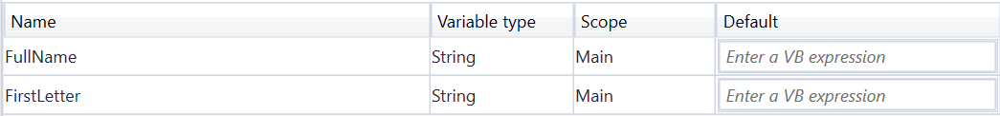

3.  Add an [**Input Dialog**] activity
    to the **Designer** panel.
4.  In the **Properties** panel, in the **Label** field, type "Type your
    full name please.".
5.  In the **Title** field, type "What is your name?".
6.  In the **Result** field, add the 
    FullName variable. This variable stores whatever the user writes
    when prompted with the **Input Dialog** activity.
7.  Add an [**Assign**]
    activity under the **Input Dialog** one.
8.  In the **Properties** panel, in the **To** field, add the
    
    FirstLetter variable.
9.  In the **Value** field, type 1). The
    FirstLetter variable is assigned the new value created by the
    FullName.Substring(0,1) expression.

> Note:
> This field uses the
> Substring() function to find the first character from the string added
> by the user in the **Input Dialog**.

10. Add a [**Write Line**] activity
    under the **Assign** one.
11. In the **Properties** panel, in the **Text** field, enter the
    
    FirstLetter variable. This means that the **Output** panel is going
    to display the first letter of what the user wrote in the **Input Dialog**. The project should look as in the following screenshot.

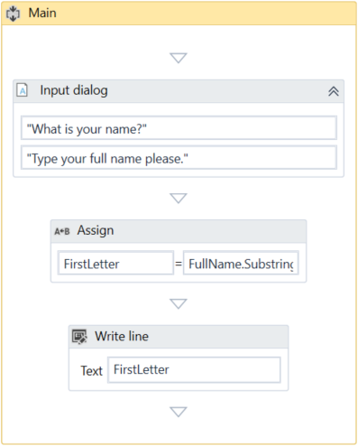

12. Press F5. The **What is your name?** window is displayed.
13. Type your name in the text field and click **OK**. In **UiPath
    Studio**, in the **Output** panel, note that the first letter of
    your name is displayed.

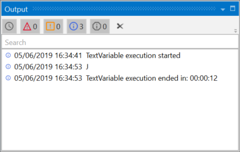

True or False Variables
=======================

The true or false variable, also known as boolean, is a type of variable
that only has two possible values, true or false. These variables enable
you to make decisions, and thus have a better control over your flow.

To exemplify how you can work with true or false variables, we are going
to create an automation that asks the user for his name and gender, and
displays the results in another window.

1.  Create a new process and add a
    **[Flowchart](https://studio.uipath.com/docs/flowcharts)**.
2.  Create two string variables, 
    Name and 
    Gender. The first is going to be used to store the name of the user,
    and the second to store the user’s gender.
3.  Create a boolean variable, 
    Male. This variable is going to be used to verify if the user is a
    male.

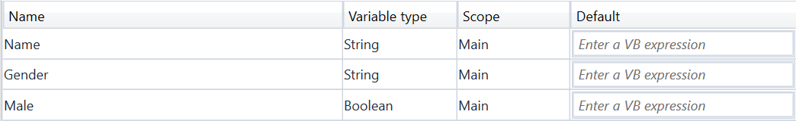

4.  Add an [**Input
    Dialog**] activity
    to the **Designer** panel and connect it to the **Start** node.
5.  In the **Properties** panel, in the **Label** field type "What is
    your name?".
6.  Add a title and, in the **Result** field, add the
    Name variable.
7.  Add another **Input Dialog** activity and connect it to the previous
    one.
8.  In the **Properties** panel, in the **Label** field, type "What is
    your gender?".
9.  Add a title and, in the **Result** field, add the
    Gender variable.
10. Add a [**Flow
    Decision**]
    activity to the **Designer** panel, and connect it to the second
    **Input Dialog**.
11. In the **Properties** panel, in the **Condition** field, type
    
    Gender = "Male" or 
    Gender = "male". This activity checks if the user is a male or
    female.
12. Add two [**Assign**]
    activities.
13. Connect one to the **True** branch of the **Flow Decision** activity.
14. In the **Properties** panel, in the **To** field enter the
    
    Male variable.
15. In the **Value** field, type **True**. This assigns the **True**
    value to the 
    Male variable when the 
    Gender = "Male" or 
    Gender = "male" condition is met.
16. Connect the second **Assign** activity to the **False** branch of
    the **Flow Decision**.
17. In the **Properties** panel, in the **To** field, enter the
    
    Male variable.
18. In the **Value** field, type **False**. This assigns the **False**
    value to the 
    Male variable when the 
    Gender = "Male" or 
    Gender = "male" condition is not met.
19. Add a new **Flow Decision** and connect the previously added
    **Assign** activities to it.
20. In the **Properties** panel, in the **Condition** field, type   
    Male = True.
21. Add a [**Message Box**] activity and
    connect it to the **True** branch of the **Flow Decision**.
22. In the **Properties** panel, in the **Text** field, type
    
    Name + " is a " + 
    Gender + ".". This message displays the name of the user and its
    gender, if 
    Male is true.
23. Add another **Message Box** activity and connect it to the **False**
    branch of the **Flow Decision**.
24. In the **Properties** panel, in the **Text** field, type
    
    Name + " is a " + 
    Gender + ".". This message displays the name of the user and its
    gender, if 
    Male is false. The final project should look like in the following
    screenshot.

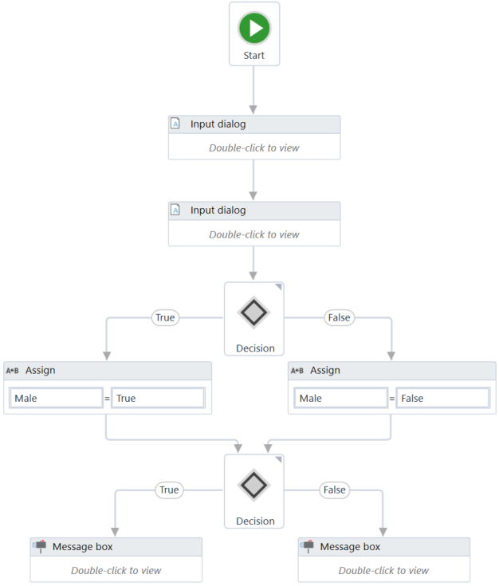

25. Press F5. The automation is executed. Note that the final **Message
    Box** displays the message as expected.

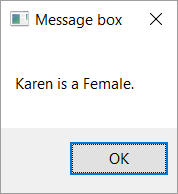

Number Variables
================

Number variables are also known as integer or Int32, and are used to
store numeric information. They can be used to perform equations or
comparisons, pass important data and many others.

##### Example of Using a Number Variable

To exemplify how you can work with number variables, we are going to
create an automation that asks the user for the year in which he or she
was born and displays the age in a window.

1.  Create a new sequence.
2.  Create two Int32 variables, 
    BirthYear and 
    Age. The first stores the user’s birth year and the second, the
    user’s age.
3.  Add an [**Input
    Dialog**] activity
    to the sequence.
4.  In the **Properties** window, type an appropriate title and label.
5.  In the **Result** field, add the 
    BirthYear variable.
6.  Add an [**Assign**]
    activity under the **Input Dialog**.
7.  In the **Properties** panel, in the **To** field, add the
    
    Age variable.
8.  In the **Value** field, type 
    2019 – BirthYear. This assigns the value of the subtraction (2019
    minus the user’s birth year) to the 
    Age variable.
9.  Add a [**Message Box**] activity
    under the **Assign** one.
10. In the **Properties** panel, in the **Text** field, type
    "Congratulations! You are " + 
    Age.ToString + ".".

> Note:
>
> The .ToString method converts the integer stored in the
> Age variable to a string and displays it as such.

The final project should look as in the following screenshot.

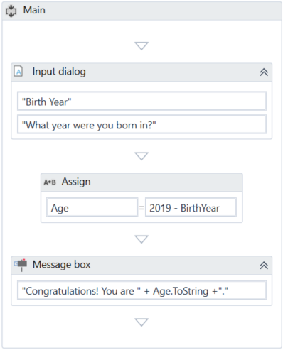

11. Press F5. The automation is executed. Note that the **Message Box**
    displays your age, as expected.

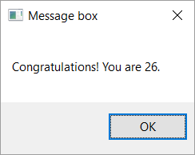

Date and Time Variables
=======================

The date and time variable is a type of variable that enables you to
store information about any date and time. This type of variable can be
found in the **Browse and Select a .Net Type** window, under the System
namespace 

System.DateTime. For more information, see [Browsing for .Net Variable
Types](https://docs.uipath.com/studio/docs/managing-variables#section-browsing-for-net-variable-types).

For example, they can be used to append dates to invoices or any other
documents you may be working with and are time-sensitive.

##### Example of Using a Date and Time Variable

To exemplify how you can work with a date and time variable, we are
going to build an automation that gets the current date and time,
subtracts a specific amount of time and writes the result to a Microsoft
Excel spreadsheet.

1.  Create a new sequence.
2.  Create two DateTime variables, Today and LastTime.
3.  Create a TimeSpan variable, called 
    Span, and in the **Default** field type 1.02:10:04.

> Note:
>
> The default value attributed to the Span variable uses the day.hh:mm:ss format.

4.  Add an [**Assign**]
    activity to the **Designer** panel.
5.  In the **Properties** panel, in the **To** field, add the
    
    Today variable.
6.  In the **Value** field, type 
    Now. This gives you the date and time when the project is executed,
    in the 
    dd/MM/yyyy and 
    hh:mm:ss formats.
7.  Add another **Assign** activity under the previous one.
8.  In the **Properties** panel, in the **To** field, add the
    LastTime variable.
9.  In the **Value** field, type 
    Today.Subtract(Span). This is going to subtract the default value of
    the 
    Span variable from the current date and time, stored in the
    Today variable.

10. Add an [**Excel Application Scope**] activity under the last **Assign** one.

> Note:
>
> Use the [Manage
> Packages](https://docs.uipath.com/studio/docs/managing-activities-packages#section-managing-packages)
> feature to download the Excel activities, if you do not already have
> them installed.

11. In the **Properties** panel, in the **WorkbookPath** field, type the
    path of the Excel file you want to write to, between quotation
    marks. In our case, 
    "%HOMEPATH%\\Desktop\\urgent\_invoice.xlsx".

> Note:
>
> If the file does not exist at the provided path, it is going to be
> created.

12. Add a [**Write
    Cell**] activity in
    the **Excel Application Scope** activity.
13. In the **Properties** panel, in the **Range** field, type the
    coordinates of an Excel cell between quotation marks. In our case,
    
    "E3".
14. In the **Sheet Name** field, type the name of the sheet in which you
    want to write. In our case, 
    "Invoice". Note that if the sheet does not exist, it is going to be
    created.
15. In the **Value** field, type 
    LastTime.ToString. This transforms the value of the
    LastTime variable to a string and writes it to the coordinates
    previously given.\
     The final project should look as in the following screenshot:

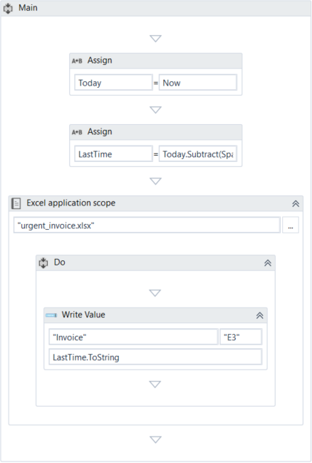

16. Press F5. The automation is executed.
17. Navigate to your Excel file and double-click the cell in which you
    added the date. Note that the time and date information is displayed
    in the cell you pointed towards.

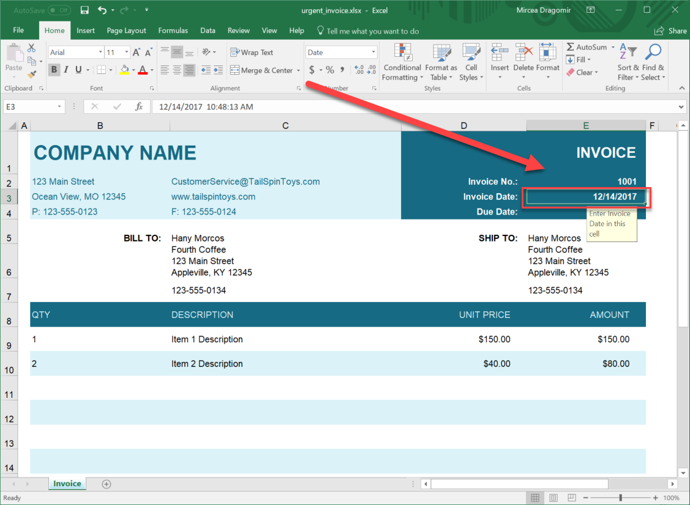

GenericValue Variables
======================

Let's us create an
automation that performs different operations whose results depend on
the way we define their expressions. We create two GenericValue
variables of different data types and display the results in the
**Output** panel.

1.  Create a new blank project.
2.  Create three GenericValue variables: 
    Int, 
    Str, and 
    Result.
3.  In the **Default** column for the , and for the
    Str variable, type "34". The first variable is interpreted as an
    integer, while the second one is interpreted as a string.

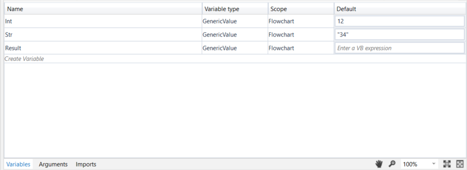

4.  Add an [**Assign**]
    activity to the **Designer** panel and connect it to the **Start**
    node.
5.  In the **Properties** panel, in the **To** field, enter the
    
    Result variable.
6.  In the **Value** field, type 
    Int + 
    Str.
7.  Add a [**Write Line**] activity and
    connect it to the **Assign** one.
8.  In the **Properties** panel, in the **Text** field, enter the
    
    Result variable.\
     The project should look as in the following screenshot.

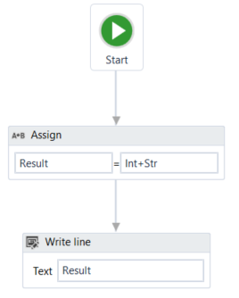

9.  Press F5 to execute your automation. Note that, in the **Output**
    panel, the sum of the two numbers is displayed.

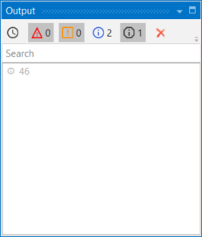

10. Go back to the previously added
    [**Assign**] activity and
    change the **Value** field to 
    Str + 
    Int, to reverse the order of the variables. The project should look
    as in the following screenshot.

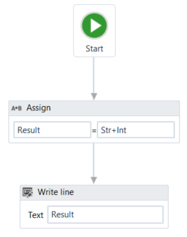

11. Press F5 to execute your automation. Note that, in the **Output**
    panel, the concatenation of the two numbers is displayed.

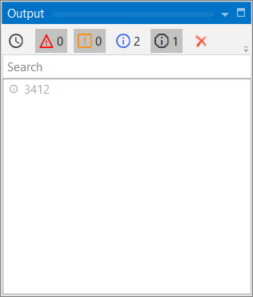

This means that UiPath Studio takes the first element defined in your
expression as a guideline for what operation to perform. If the first
element in your expression is an integer or a GenericValue variable
filled in as integer, UiPath Studio will perform the sum of the
elements.

If the first element in your expression is a string or a GenericValue
variable filled in as string, UiPath Studio will perform the
concatenation of the elements.
