Lab 3. Sequence, Flowchart, and Control Flow
---------------------------------------------------------

So far we have learned what RPA is, and we have seen how simple it is to
[*train*] a UiPath Robot by recording the activities of a
task and running it. Automating mundane routine tasks is very easy with
UiPath using the recorder. Before we start automating complex tasks, let
us learn how to control the flow of activities from one to another.

In this lab, we will learn about methods to lay down activities in
an orderly fashion and how to control the flow. These are basic to any
kind of programming. We will learn about putting activities in
Sequences, Flowcharts, and loops. We will also look at logical control
using if-else.

To train robots to process a type of transaction, it is very important
to have the instructions in a methodical flow. Mostly, these
instructions are executed in Sequences. Let us understand this in
detail.

This lab will cover the following topics:

-   Sequencing the workflow
-   Activities
-   What Flowcharts are and when to use them
-   Control Flow, various types of loops, and decision making
-   Step-by-step example using a Sequence and Flowchart

Sequencing the workflow 
------------------------------------------

UiPath provides four types of projects:

-   Sequences
-   Flowcharts
-   User Events
-   State Machines

These are used to design a project on the basis of type and convenience.
These four types of projects are useful in dealing with different kinds
of processes. A Flowchart and Sequence are mainly used for simple
automation. User Events are beneficial for implementing front office
robots, while State Machines are used for dealing with complex business
processes. 

### What is a Sequence?

A Sequence is a group of logical steps. Each step represents an action or a piece of work. A Sequence is used
for processes that happen in linear succession, that is, one after the
other. Among the three types of projects in UiPath, Sequences are the
smallest. An illustration of how to build a Sequence in UiPath Studio is
presented in the following section.

In the following example, we will make a simple project that asks for
the name of the user and then displays his or her response:

1.  Open UiPath Studio and click on **`Blank`** to start a fresh
    project. Give it a meaningful name. On the Designer panel, drag and
    drop a **`Flowchart`** activity from the **`Activities`** panel.
2.  Search for `Sequence` in the **`Activities`** panel and
    then drag and drop it into the **`Flowchart`**, as shown in the
    following screenshot:

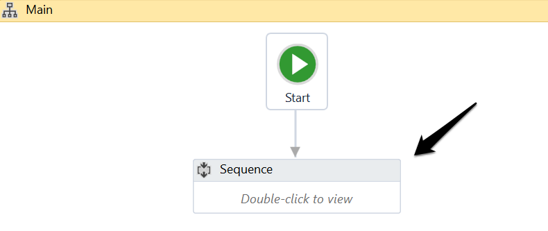

3.  Double-click on the **`Sequence`**. We now have to add the steps
    that we want to perform. Consider each step as an action.

We can add many steps inside a **`Sequence`**. For the sake of
simplicity, we will add two steps:

-   
    1.  Ask for the username in an **`Input``d`**ialog
    2.  Display the username in a **`Message box`**
    

3.  Search for **`Input dialog`** in the Search panel of the
    **`Activities`** panel. Drag and drop the **`Input dialog`**
    activity inside the **`Sequence`** (the
    ****`Input dialog`**** activity is a dialog box that
    appears with a message or a question, in response to which the user
    is required to put in his or her reply):

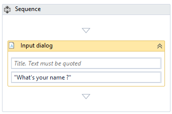

Write the appropriate message on the **`Label`** of this
**`Input dialog`** to ask for the user\'s name. In our case, we have put
in `"What's your name?"`.

4.  Drag and drop a **`Message box`** activity into the **`Sequence`**.
    (A **`Message box`**, as the name suggests, displays a given text.
    In this case, we will use it to display the text/reply that the user
    has given in the **`Input dialog`** box on being asked his/her
    name.)
5.  Next, create a variable and give it the desired name. This variable
    will receive the text that the user has entered in the
    **`Input dialog`** box in response to our question, that is, the
    user\'s name:

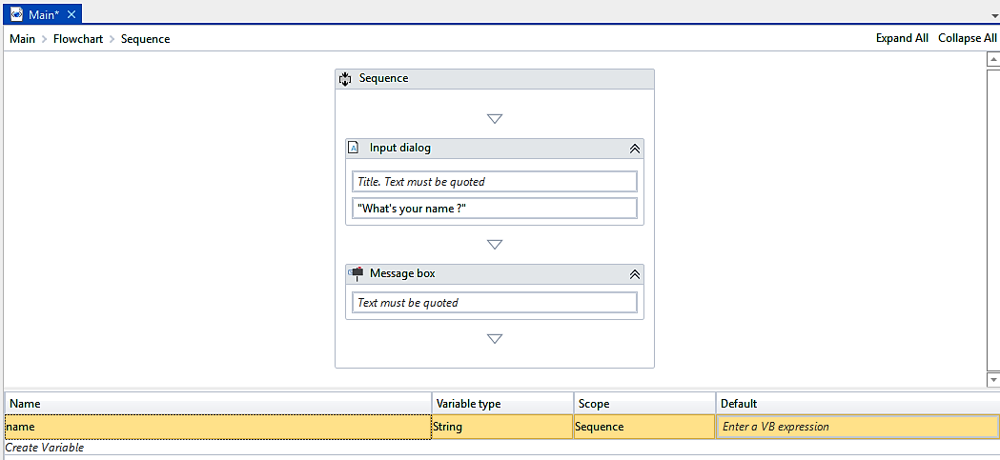

6.  We now have to specify the **`Result`** property (in the
    **`Properties`** panel) of the**`Input dialog`**box. On specifying
    the variable name there, it will receive the text that the user
    entered. Click on the dotted icon that appears on the right side of
    the **`Result`** property. Now, specify the variable name:

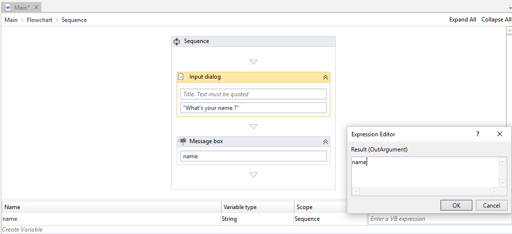

7.  Specify the variable name that we have created in the Text area of
    the **`Message box`** (the Text area of the **`Message box`**is used
    to input text that will be displayed in the**`Message box`**). We
    just need to connect the **`Sequence`**to the**`Start`**icon. This
    can be done by right-clicking on the**`Sequence`**activity and
    choosing the**`Set as Start node`**option.
8.  Hit the **`Run`**button and see the result.

Activities 
-----------------------------

In UiPath Studio, an **activity** represents the unit of an
action. Each activity performs some action. When these activities
combine together, it becomes a process.

Every activity resides on the **`Activities`** panel of the main
Designer panel. You can search for a particular activity and use it in
your project. For example, when we search for **`browser`**, all the
browser activities will appear in the **`Activities`** panel, as shown
in the following screenshot:

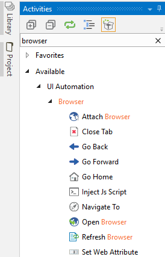

### Using activities with workflows

We have seen how we can easily search
for a particular activity. Now, let us see
how to use them in a workflow:

1.  Search for `Flowchart` in the same way that we have
    searched for the browser activities in the **`Activities`** panel
    search bar. Drag and drop the **`Flowchart`** activity inside the
    Designer panel.

2.  The **`Flowchart`** appears in the Designer panel and we have a
    given **`Start`** node. The **`Start`** node specifies where the
    execution begins.

3.  We are ready to use different activities in our **`Flowchart`**. You
    can use any activity/activities inside the**`Flowchart`**. For the
    sake of simplicity, let us just use a**`Write line`**activity.

4.  Drag and drop the**`Write line`**activity inside the**`Flowchart`**.
    Set its text property by providing a string value. Connect
    this**`Write line`**activity with the **`Start`**node by
    right-clicking on the**`Write line`**activity and
    selecting**`Set as Start Node`**.

You may be wondering what the role of a workflow is. Suppose you have a
big project that consists of hundreds of activities. How will you debug
it? It is a developer\'s nightmare to deal with such a situation. Here,
the workflow comes into play. To build such a big project, a developer
will simply divide it into smaller modules and extract it as a workflow.
Now, each workflow can be tested separately. Thus, it is very easy to
find bugs and errors. Creating different workflows and combining them
into a logical **`Sequence`** will enhance our code quality,
maintainability, reliability, and readability.

We have made a smaller module and now it is time to extract it as a
workflow. Right-click on the main Designer panel and choose
**`Extract as Workflow`**:

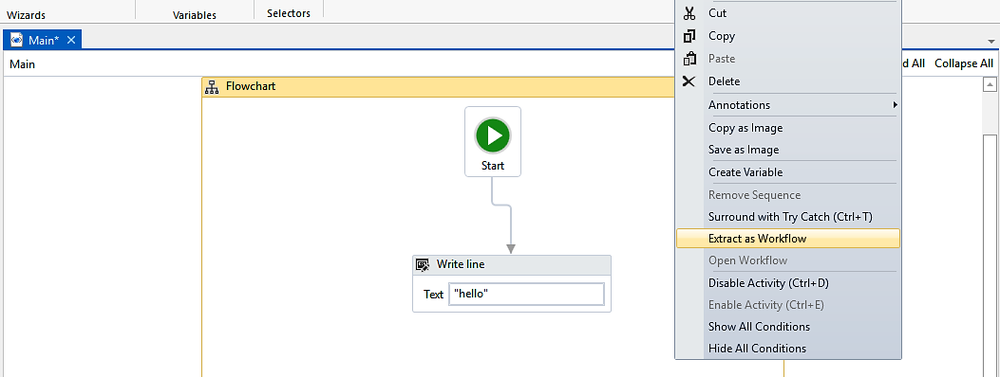

A window will pop up asking for the name. Give it a meaningful name and
click on **`Create`**. This will be the name of your workflow:

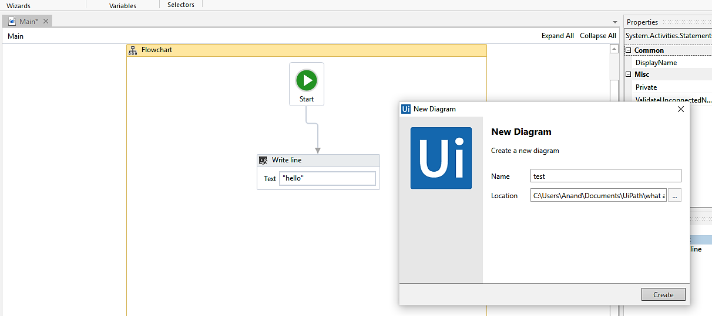

We have just used activities and extracted them in a workflow. If you
check the main Designer panel, it looks like the following screenshot:

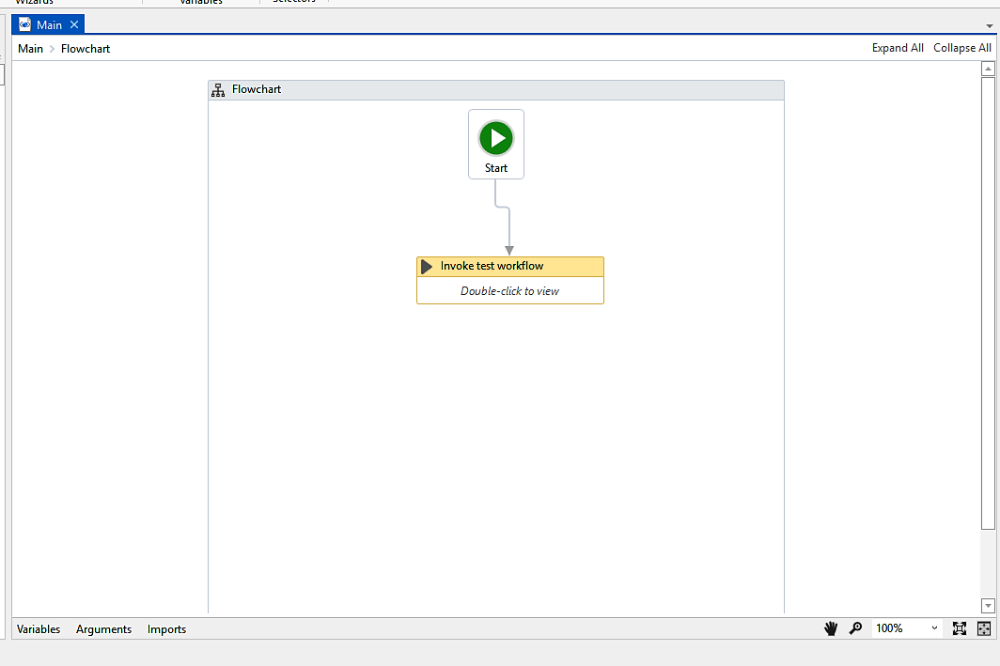

It automatically generates the **`Invoke test Workflow`** activity. Now,
when we run the program, it will invoke the workflow that we have
extracted (double-click on the ****`Invoke test workflow`****
activity to see which workflow it is going to invoke and where it is
generated).

### What Flowcharts are and when to use them

A Flowchart is generally used for complex
business processes. It provides decision-making facilities and can be
used for both small and large projects. Here, we can add activities in
different ways:

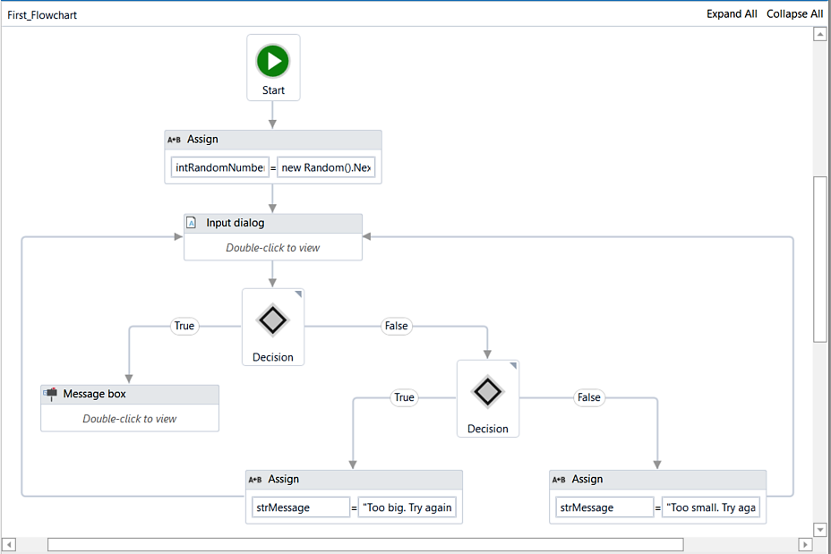

A Flowchart provides multiple branching logical operators to make
decisions. A Flowchart is able to run in reverse. Also, it can be used
inside Sequences. A Flowchart facilitates reusability for distinct
projects. Once we create it to use in a project, it can be used
for a different but similar project.  

A Flowchart\'s branches are set to true/false by default. However, its
names can be manually changed from the **`Properties`** panel. For
example, enter two numbers and check whether their sum is less than 20.

Perform the following steps:

1.  First, add a**`Flowchart`**from the**`Activities`**panel into the
    Designer panel.
2.  Add a **`Sequence`**activity within the**`Flowchart`**.
3.  Take two **`Input dialog`**activities (for entering the numbers to
    be added) inside the**`Sequence`**activity.
4.  Create the variables [*x*]and[*y*]to save the
    values.
5.  Next, add a **`Message box`**activity to perform a mathematical
    operation. In our case, the sum of the two numbers is less than 20:

[*x + y \< 20*]

6.  Now, add a **`Flow Decision`** activity to check the mathematical
    operation.
7.  If true, the **`Flow Decision`**will flow toward the true branch.
    Otherwise, it will flow towards the false branch.

Control flow, various types of loops, and decision making
---------------------------------------------------------------------------

**Control flow** refers to the order or the particular manner in which actions are performed in an
automation. UiPath provides numerous activities for performing the
decision-making process. These activities, present in the
**`Activities`** panel, are put into the workflow either using the
double-click method or the drag and drop method.

Different types of control flow activities are as follows:

-   The Assign activity
-   The Delay activity
-   The Break activity
-   The While activity
-   The Do While activity
-   The For each activity
-   The If activity
-   The Switch activity

### The Assign activity

The **Assign** activity is used to designate a value to
the variable. The Assign activity can be used
for different purposes, such as incrementing the value of a variable in
a loop, or using the results of a sum, difference, multiplication, or
division of variables and assigning it to another variable.

### The Delay activity

The **Delay** activity, as the
name suggests, is used to delay or slow down an automation by pausing it
for a defined period of time. The workflow continues after the specified
period of time. It is in the hh:mm:ss format. This activity plays a
significant role when we need a waiting period during automation,
perhaps say, a waiting period required for a particular application to
open.

#### Example

To better understand how the **`Delay`**
activity works, let us see an example of an automation that writes two
messages to the **`Output`** panel with a delay of 50 seconds.

Perform the following steps:

1.  First, create a new**`Flowchart`**.
2.  Add a ****`Write line`**** activity from
    the**`Activities`**panel and connect it to the**`Start`**node.
3.  Select the ****`Write line`****activity. Now, type the
    following text into
    the**`Text`**box:`"Hey, what is your name?"`.
4.  Next, add a **`Delay`** activity and connect it to
    the****`Write line`****activity.
5.  Select the **`Delay`**activity and go to the **`Properties`** panel.
    In the **`Duration`** field, set 00:00:50. This is a 50-second delay
    between the two logged messages.
6.  Take another ****`Write line`**** activity and connect it
    to the**`Delay`**activity. In the**`Text`** field,
    write`"My name is Andrew Ng."`:

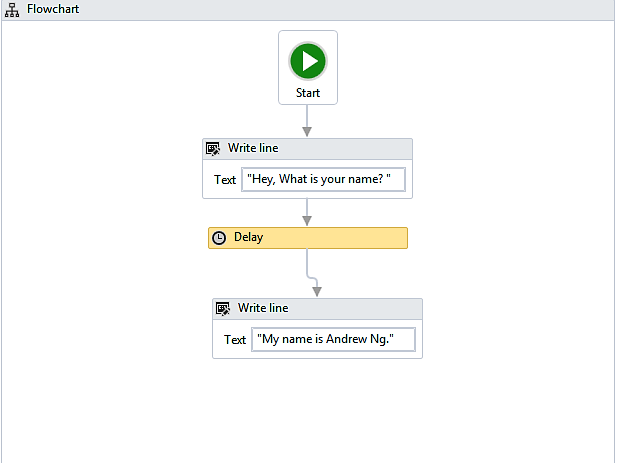

7.  After clicking on the **`Run`** button, the **`Output`** panel shows
    the message that delays it by 50 seconds:

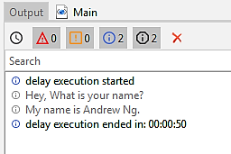

### The Break activity

The **Break** activity is used to break/stop
the loop at a particular point, and then
continue to the next activity according to the requirement. It cannot be
used for any other activity apart from the For each activity. It is
useful when we want to break the loop to continue to the next activity
in the For each activity.

#### Example

In this example, we will use the Break
activity to execute only one iteration.

Perform the following steps:

1.  Add a**`Sequence`** activity to the Designer panel.
2.  Next, add a ****`For each`****activity inside
    the**`Sequence`**(as mentioned in the preceding section, to use
    the**`Break`**activity, we need
    the****`For each`****activity):

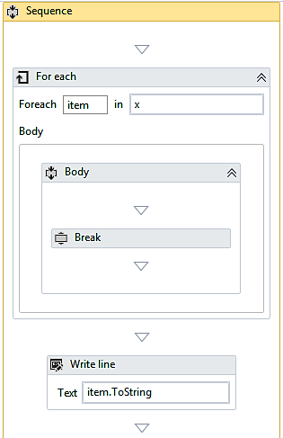

3.  Create two variables; an integer variable named `item`,
    and an array integer variable named `x`. Then, set them to
    the text field.
4.  Now, assign a default value to the integer variable `x`.
5.  Add a **`Break `**activity inside the body of the loop.
6.  Under the **`For Each`**activity, add
    a ****`Write line`****activity.
7.  In the ****`Write line`****activity,
    type `item.ToString` in the text field.
8.  When we click the **`Run`**button, it will display one element, as
    shown in the following screenshot. This is due to
    the**`Break`**activity, which has stopped execution after the first
    iteration:

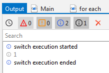

Before going on to the other control flow activities, we will learn
about loops, which are an important aspect of automation. One of the
most frequently mentioned advantages of automation is its ability to
perform functions that are repetitive and to perform them without
errors. Loops are meant precisely for such functions. Let us say, one
wants to repeat a certain part of a workflow for different cases or when
a certain criterion is fulfilled. In such a scenario, a loop comes in
very handy. A loop can simply be created by connecting the end of the
workflow to the point where we want the workflow to resume.

**Note:**

One thing that needs to be kept in mind while making such loops is to
make sure there is also an exit point. Otherwise, the loop will continue
infinitely!

The While, Do while, and For each activities mentioned among the various
control flow activities are examples of loops. Let us now see where they
are used and how they work.

### The While activity

The While activity is used in automation to
execute a statement or process based on a certain condition. If found
true, the loop is executed; that is, the process is executed repeatedly.
The project only exits from the loop when the condition does not hold
true. This activity is useful while iterating through an array of
elements.

#### Example

In the following example, we will see how an
integer variable will increase from 5 to 50 in increments of 5.

Perform the following steps:

1.  On a **`Blank`** project, add a **`Sequence`** activity.
2.  Now, create an integer type variable `x`. Set its default
    value to `5`.
3.  Next, add a **`While`** activity to the **`Sequence`**.
4.  In the condition field, set `x<50`.
5.  Add an **`Assign`** activity to the body section of the **`While`**
    loop.
6.  Now, go to the **`Properties`** panel of the **`Assign`** activity
    and type in the text field integer variable for value field integer
    `x+5.`

7.  Drag and drop a **`Write line`** activity and specify the variable
    name `x` and apply `ToString` method on this
    variable:

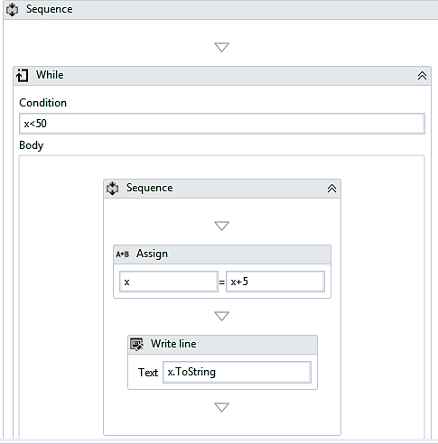

8.  Now, click the **`Run`** button. The output will display in the
    **`Output`** panel, as shown in the following screenshot:

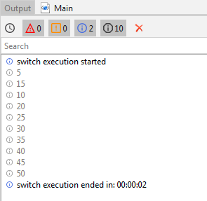

### The Do while activity

The **Do while** activity is used
in automation when it is required to execute a  statement based on the
fulfillment of a certain condition. How it differs from the While
activity is that it executes a statement, then checks whether the
condition is fulfilled. If the condition is not fulfilled, it exits the
loop.

#### Example

Let us take an example to understand how the
Do while activity works in automation. Take an integer variable.
Starting with this variable, we shall generate all multiples of 2, less
than 20.

Perform the following steps:

1.  Add a ****`Sequence`**** to the Designer panel.
2.  Add a ****`Do while`****activity from
    the**`Activities`**panel.

3.  In the body section of the ****`Do while`**** activity,
    add an ****`Assign`**** activity.
4.  Now, select the **`Assign`**activity. Go to the**`Properties`**panel
    and create an integer variable`y`. Set its default value
    to`2`.
5.  Set `y+2`in the value section of the**`Assign`**activity
    to increment the result each time by`2`until the loop is
    executed.
6.  Add a ****`Write line`****activity inside
    the**`Assign`**activity.
7.  In the text field of the ****`Write line`****activity,
    type`y`.
8.  In the condition section, set the condition `y<20`. The
    loop will continue until the condition holds true:

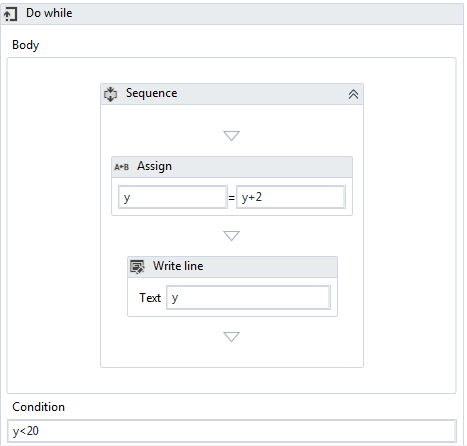

9.  On clicking the Run button, the output displayed will be as follows:

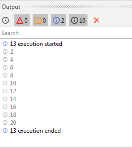

### The For each activity

The **For each** activity works by
iterating each element from the collection of items or list of elements,
one at a time. In the process, it will execute all the actions that are
available inside the body. Thus, it iterates through the data and
processes each piece of information separately.

#### Example

In the following example, we shall use the
**`For each`** activity to go through a collection of even numbers and
display each element one at a time. 

Perform the following steps:

1.  Start with a **`Blank`** project in UiPath.
2.  Add a **`Sequence`**activity to the Designer panel.

3.  Next, add a **`For each`**activity within the**`Sequence`**and
    create an integer type array variable, `x`.

4.  In the default value of the variable, put
    in (`{2,4,6,8,10,12,14,16,18,20}`).
5.  Add a **`Write line`**activity to the Designer Panel (this activity
    is used to display the results).
6.  In the **`Text`**field of the**`Write line`**activity,
    type `item.ToString` to display the output:

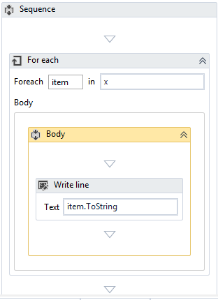

7.  Now, run the program. You will see that each number of the array is
    displayed one by one because of the use of the **`For each`**
    activity:

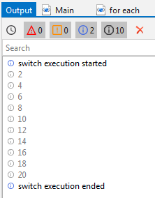

The Control flow also facilitates decision-making mechanisms that can
help in taking a decision on a particular activity\'s step. For example,
suppose we are using a loop and we want to display only a desired value,
then we can filter out all our desired values by implementing the If
activity, and making a decision based on the basis of the If activity\'s
result, that is, true or false. The decision-making process will require
some time to break the action after executing the desired element. This
is followed by the Break activity, which will play a significant role.
If you want to choose an execution from the task, then the activity
needs to be switched in order to make such a decision.

The If activity and the Switch activity are the Control flow\'s
decision-making activities.

### The If activity

The If activity consists of a statement with
two conditions: true or false. If the statement is true, then the first
condition is executed; if not, the second condition is executed. This is
useful when we have to take decisions on the basis of statements.

To better understand how the **`If`** activity works, let us see an
example that checks whether the sum of any two numbers is less than 6.

Perform the following steps:

1.  Add a**`Flowchart`**from the**`Activities`**panel.
2.  Add two ****`Input dialog`****activities. Create two
    integer variables,[*x*]and[*y*]. 
3.  In the **`Properties`**panel, change the label name and title name
    of both the**`Input dialog`**activities.
4.  Now, specify these name of these two variables in the
    **`Result`**property of both the**`Input dialog`**activities.
5.  Now add the **`If`**activity to the Designer panel:

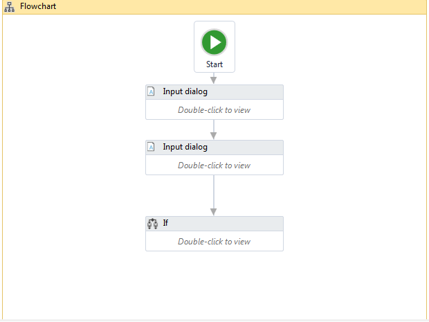

6.  In the condition part, `x+y<6`, check whether it is true
    or false. Add two Write line activities and
    type `"True"` in one and `"False"` in the other:

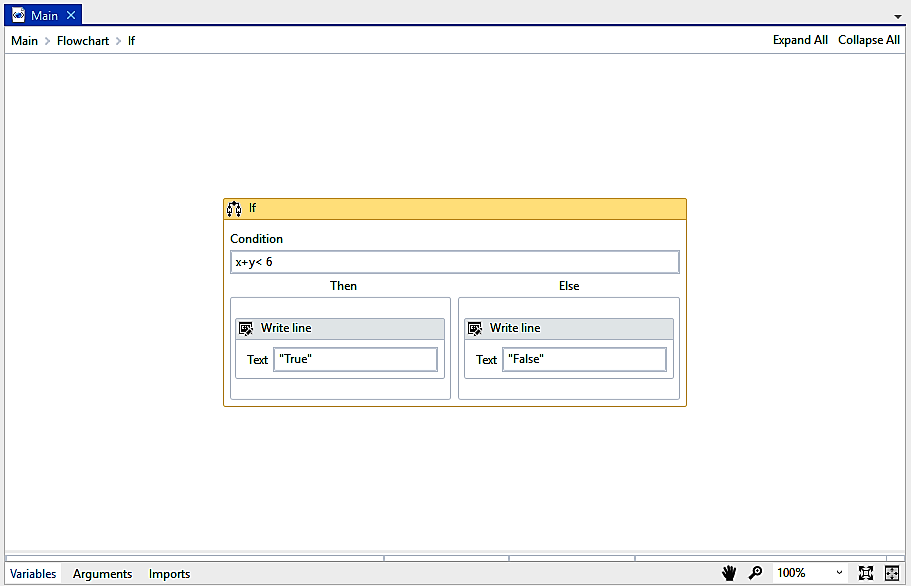

7.  Click the **`Run`** button to check the output. If the condition
    holds true then it will show the true value; otherwise, it will show
    the false value, as shown in the second screenshot (in our case, we
    put in the values
    of [*x*] and [*y*] as `9` and `4`,
    respectively, thus getting a sum of 13, which is not less
    than `6`; hence, the output shows it as false value):

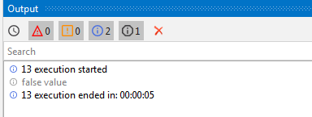

### The Switch activity

The **Switch** activity can be
used to make a choice. When we have various options available and want
to execute one option, we frequently use the Switch activity.

By default, the Switch activity takes an integer argument. If we want to
take a desired argument, then we can change it from the Properties
panel, from the TypeArgument list. The Switch activity is very useful in
the categorization of data according to one\'s own choice.

#### Example

Let\'s see an example where we have to check
whether a given number is odd or even.

We know that all odd numbers, when divided by 2, leave a remainder of 1.
On the other hand, even numbers, on being divided by 2, leave a
remainder of 0. Hence, we will have two cases getting a remainder of 1
or 0.

Perform the following steps:

1.  Add a**`Sequence`**activity.
2.  Add an ****`Input dialog`****activity inside
    the**`Sequence`**.
3.  Now, create an integer type variable `k`.
4.  Specify the newly created variable\'s name in the
    **`Result`**property inside the**`Properties`**panel.
5.  Add the **`Switch`**activity under the**`Input dialog`**activity.
6.  In the **`Expression`**field, set`k mod 2`to check whether
    the number is divisible by 2 or not.
7.  Add a ****`Write line`****activity to
    the**`Default`**section and type
    the`k.ToString  +" is an even number"` in the text field.

8.  Now, create **`Case 1`**, add the one other
    ****`Write line`**** activity to it, and
    type `k.ToString  +" is an odd number"` in the text field:

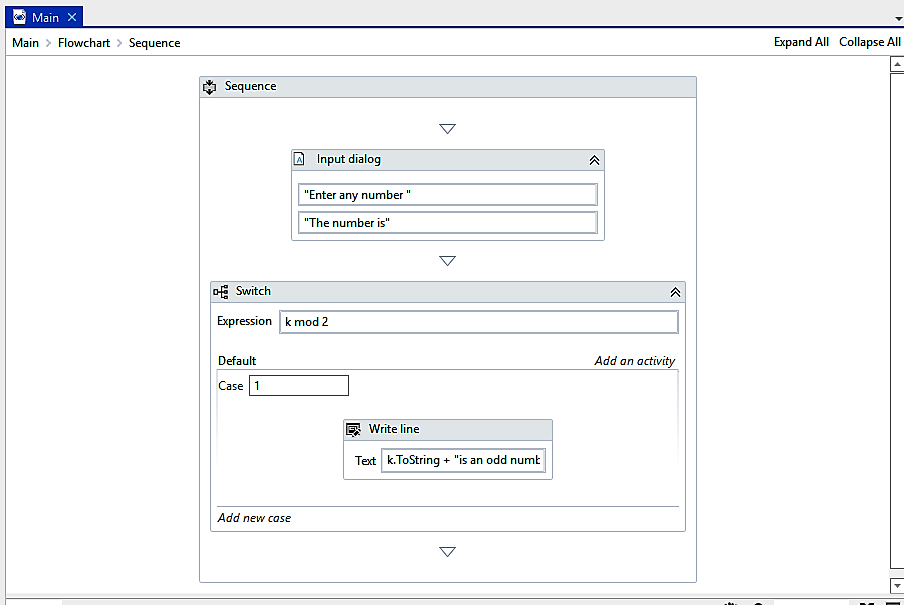

Step-by-step example using Sequence and Flowchart
-------------------------------------------------------------------

A Sequence and a Flowchart are similar
concepts. They are both used to contain logical steps or actions. One
should know when to use each of them. Where they differ from each other
is that a Sequence is generally used to contain multiple steps to
perform an action. A Flowchart, on the other hand, is suitable for a
particular task. When we have lots of steps of a similar kind, we
contain them in a Sequence. There may be different Sequences doing their
jobs. We can easily put similar Sequences into a workflow; each workflow
represents a task. It is very easy to test a separate workflow alone.
Let us try to understand them better with an example.

### How to use a Sequence

There may be different Sequences doing their jobs. We can easily put
similar Sequences into a workflow; each workflow represents a task. It
is very easy to test a separate workflow
alone. Let us try to understand them better with an example.

Perform the following steps:

1.  Drag and drop a**`Flowchart`**onto the Designer panel. Drag and drop
    a**`Sequence`**activity. Connect the**`Sequence`**activity with
    the**`Start`**node.
2.  Double click on the **`Sequence`**activity. Drag and drop
    an****`Input dialog`****activity and
    a****`Message box`****activity. Specify a message in
    the**`label`**property of
    the****`Input dialog`****activity.
3.  Create a variable of type **`String`**. Give it a name. Also,
    specify this newly created variable\'s `name`in the
    content property of the****`Message box`****activity:

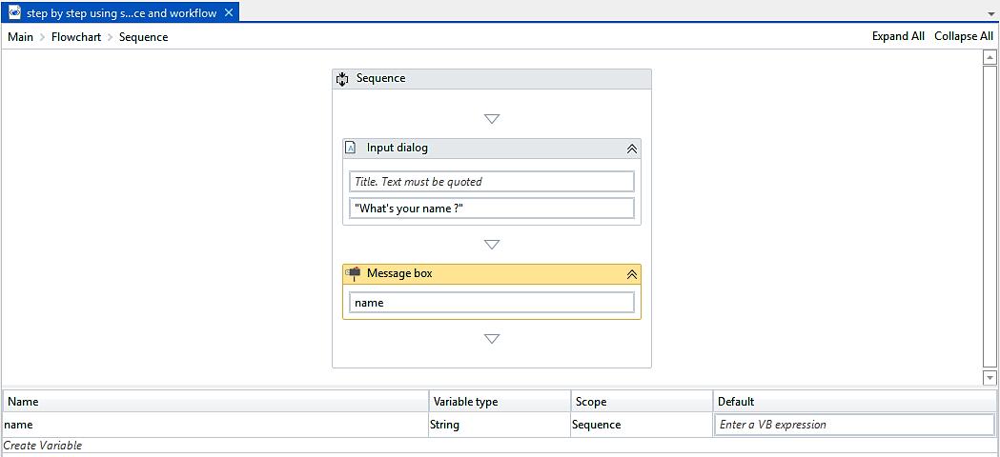

Hit the **`Run`** button or press [*F5*] to see the result.

We can see clearly that we have used two activities inside the
**`Sequence`** that are logically related (one for inputting the name
and the other for popping it up). Here, the **`Sequence`** contains two
activities. Of course, you can put as many activities as you want inside
the **`Sequence`**; it will be executed according to the order in which
you have defined it.

### How to use a Flowchart

Previously, we have seen how to use a
Sequence and activities. We shall now learn how to use a
**`Flowchart`**. A **`Flowchart`** is a container. It can contain
activities inside it.

**Note:**

I order to use email activities in example please install
**`UiPath.Mail.Activities`**. You can find it by clicking on Manage
package icon or pressing [*Ctrl*] + [*P*] and
search for mail in all package.

Let us drag and drop a **`Message box`** activity inside the
**`Flowchart`**. Double click on the **`Message box`** and type
`"Hello World!"` in the area where the text is to be quoted.
Press [*F5*] to see the result):

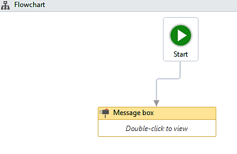

So, when the program has only a few steps, we can use activities
directly inside the **`Flowchart`**. However, it becomes more complex
when we have a large number of steps. That is why it is necessary to
arrange the related activities into Sequences and then group the
Sequences into a **`Flowchart`**.

Let us take an example to see how to use Sequences in the
**`Flowchart`**.

**Note:**

We are not going to implement the actual code for sending the email. It
will be covered later in detail. The aim of this session is to clearly
understand where and how we use workflows and Sequences.

Perform the following steps:

1.  Drag and drop two**`Flowchart`**activities on the
    main**`Flowchart`**. Rename them
    as`Send Mail`and`Message`.

We have two different workflows. The **`Send Mail`**workflow will send
the mail to an email address. The **`Message`**workflow has the message
body of that email and will ask the user for a name, message, sender,
and receiver.

2.  We have to implement the desired steps in both workflows.

For that, we are using a **`Sequence`**inside the**`Flowchart`**. Double
click on the**`Flowchart`**. Drag and drop a**`Sequence`**activity
inside both Flowcharts. Connect the**`Sequence`**to the**`Start`**node
by right-clicking on the**`Sequence`**and selecting
the**`Set as Start node`**option.

3.  Double click on the **`Sequence`** in the **`Message`** Flowchart.
    Drag and drop four **`Input dialog`** activities for the name,
    message, sender, and receiver (in this **`Sequence`**, we are not
    going to set any property of the **`Message box`** since the purpose
    of this lesson is to clearly understand where and how we use
    workflows and Sequences):

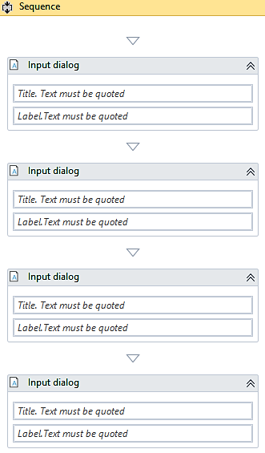

4.  Double click on the **`Send Mail Flowchart`**. Double click on
    the **`Sequence`**. You can drag and drop the email activities here.
    (We are not going to drag any mail activity although you are free to
    do so. There is another lab for that). 
5.  That\'s it. Now, go to the main **`Flowchart`**. Connect
    the **`Message`` Flowchart`** to the **`Start`** node. Also, connect
    the **`Send Mail`** activity to the **`Message`` Flowchart`**:

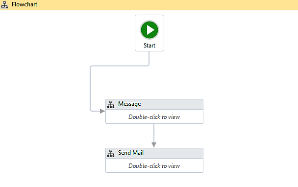

6.  Run the programand visualize it.

Step-by-step example using Sequence and Control flow
----------------------------------------------------------------------

In this session, we are going to discuss
Control flow with an example. We will see how to use Control flow in a
Sequence. There are the various Control flow
activities, as mentioned before.

Consider an array of names. Say we have to find out how many of them
start with the letter [*a*]. We will then create an
automation where the number of names starting with [*a*] is
counted and the result is displayed.

Perform the following steps:

1.  Drag and drop a **`Flowchart`** activity from the **`Activities`**
    panel.
2.  Drag and drop a **`Sequence`** activity inside the **`Flowchart`**.
    Connect the **`Sequence`** to the **`Start`** node by right-clicking
    on the **`Sequence`** activity and selecting the
    **`Set as Start node`** option.
3.  Double click on the **`Sequence`** activity. Create a variable. Give
    it a name (in our case, we will create an array of type string and
    name the variable as `names`). Set the variable type
    to **`Array of [T]`**. When asked for the type of array, select
    **`String`**.

Also, initialize the array in the **`Default`**section of the variable
by giving it a default values. For
example, `{"John", "Sam", "Andrew", "Anita"}`.

4.  Create a variable of type integer **`Count`**for storing the result.
    Set the variabletype to **`Int32`**:

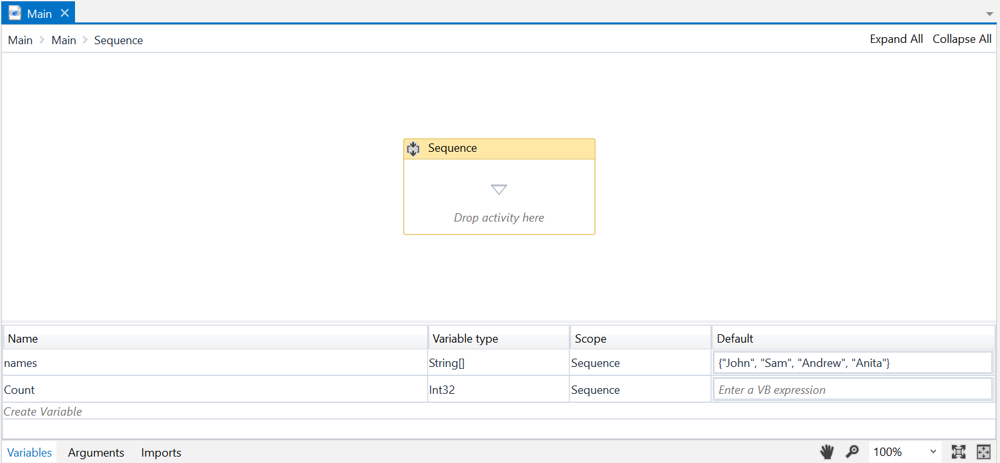

5.  Drag and drop a **`For each`** activity inside the **`Sequence`**.
    Also, specify the array name in the expression box of
    the **`For each`** activity. The **`For each`** activity is used to
    iterate over the array. It will pick up one name from the array each
    time until it reaches the end:

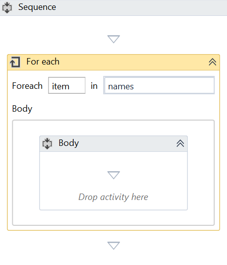

6.  Drag and drop the **`If`** activity from the **`Activities`** panel
    and place it inside the **`For each`** activity at the location
    where **`Drop``activity here`** is mentioned. Specify the condition
    in the expression box of the **`If`** activity. The **`If`**
    activity is used to check for a particular condition/expression. If
    that expression is satisfied, the **`Then`** block will be executed.
    Otherwise, the **`Else`** block will be executed.

We have specified the expression as
`item.ToString.StartsWith('a')`. This expression specifies the
name present in the item variable starts with the letter
`'a'`. The **`For each`** activity iterates over the array,
picks up one name at a time, and stores it as a
variable, `item`:

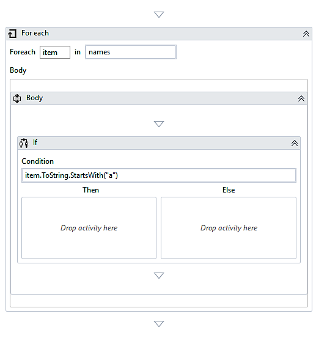

7.  Now, we are going to use the `Count` variable and
    increment it each time a name from an array starts with the letter
    `a`. For this, we have to use the **`A+B Assign`**
    activity. Drag and drop the **`A+B Assign`** activity inside the
    **`If`** activity. Set the **`To`** property to `Count`
    (variable name) and the **`Value`** property to `Count+1`
    (to increment its value) of the **`A+B Assign`** activity:

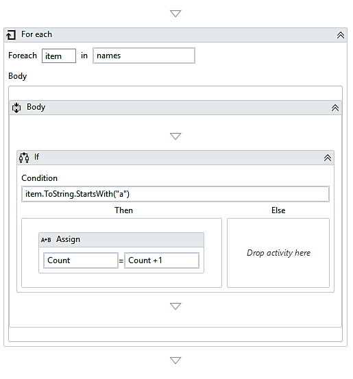

8.  Just drag and drop a **`Message box`** activity inside the
    **`Sequence`** activity. Specify the count variable in the
    expression box of the **`Message box`**
    activity. But remember, the variable that we have created is of type
    **`Int32`**, so, it cannot be used with
    the **`Message box`** activity without converting it to a string. To
    convert it to a string, we have the `'.toString'` method
    available in UiPath Studio. Just apply it to the variable and select
    `'.toString'`:

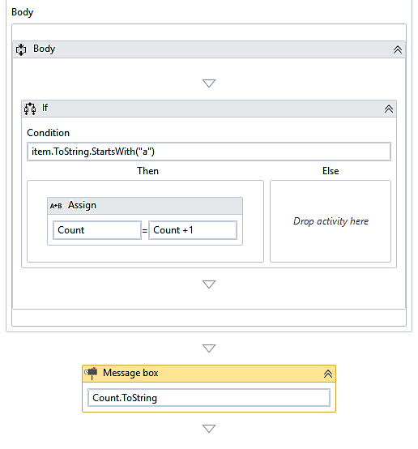

Hit the **`Run`** button or press [*F5*] and see the result.

Summary
-------------------------

In this lab, we examined the project that was generated by the
recorder and saw an explanation of the structure of the program flow
(workflow). We understood the use of Sequences and the nesting of
activities. We learned how to use the building blocks of a workflow,
Flowchart, and Control flow (looping and decision making).

In the next lab, we will learn techniques to use memory with
variables, and we will also learn about using data tables to store and
easily manipulate data in memory. The next lab will also show how
disk files (CSV, Excel, and so on) are used to persist data.
