Lab 4. Data Manipulation
-------------------------------------

So far we have learned about the basics of RPA and how to organize steps
in a workflow using a Flowchart or Sequence. We now know about UiPath
components and have a thorough understanding of UiPath Studio. We used a
few simple examples to make our first robot. Before we proceed further,
we should learn about variable and data manipulation in UiPath. It is
not very different from other programming concepts. However, here we
will look at the specifics of UiPath data handling and manipulation.

This lab will mainly deal with data manipulation. Data manipulation
is the process of changing data---whether it is adding, removing, or
updating it. Before learning about data manipulation, we shall see what
variables, collections, and arguments are, what kind of data they store,
and what their scope is. We will then carry out various examples of data
manipulation. We will also learn to store and retrieve data.

In this lab, we will cover:

-   Variables and the scope of a variable in the workflow
-   Collections, how to store data in arrays, and how to traverse them
-   Arguments, why we need them, and how to use them
-   Clipboard usage
-   Data scraping 
-   File management with a step-by-step example
-   Data table usage with an example

                                                                                                                  

Variables and scope
-------------------------------------

Before discussing variables, let us take a look at **`Memory`**and its structure:

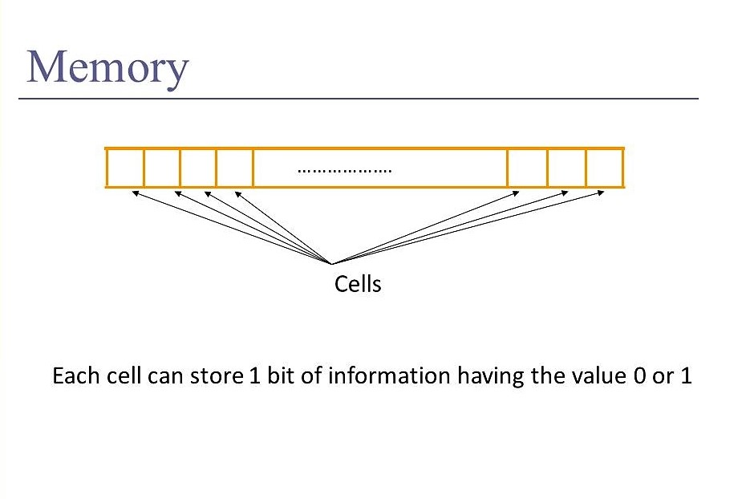

**Memory** consists of millions of
memory **Cells** and each memory cell stores data in the form of 0s and 1s (binary digits). Each
cell has a unique address, and by using this address, the cell can be
accessed:

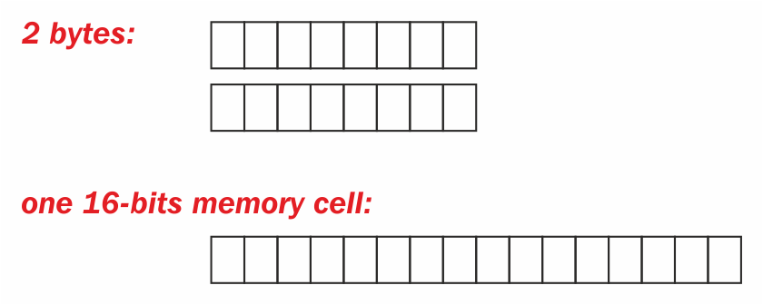

When data is stored in memory, its content gets split into further
smaller forms (binary digits). As shown in the preceding diagram, **2
bytes** of data consists of several
memory cells.

A variable is the name that is given to a particular chunk of memory
cells or simply a block of memory and is used to hold data.

You can declare any desired name and create a variable to store the
data.

**Note:**

It is recommended, however, that we use meaningful variable names. For
example, if we wish to create a variable to store the name of a person,
then we should declare Name: Andy It is a good practice to create
meaningful variable names. This becomes very useful in debugging the
program.

As we discussed, a variable is used to store data. Data is present
around us in different types---it can be an mp3 file, text file, string,
numbers, and so on. That is why variables are associated with their
respective data types. A particular type of variable can hold only that
type of data. If there is a mismatch between the data and the variable
type, then an error occurs. The following table shows the type a of
variable available with UiPath:

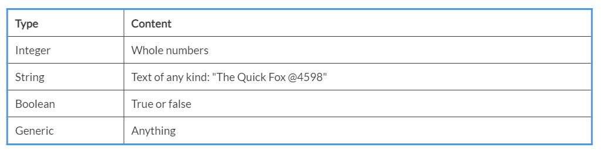

**[* *]**In UiPath, we can declare a variable in
the **`Variables`** section. Just give it a meaningful name and select
the appropriate type from the drop-down list.

**Note:**

By a meaningful variable, it is implied that the variable name should
not be ambiguous. Try to make it as descriptive as possible so that the
person reading the code understands the purpose of the variable. Good
examples are `daysDateRange`, `flightNumber`, and
`carColour`. Bad examples are `days`,
`dRange`, `temp`, and `data`.

We can also specify the scope of a variable. The **`Scope`** is the
region under which the data has its effect or availability. You can
choose the **`Scope`** of the variable according to your requirements;
try to limit it as far as possible. Please refer to the following
screenshot to understand **`Variables`** panel:

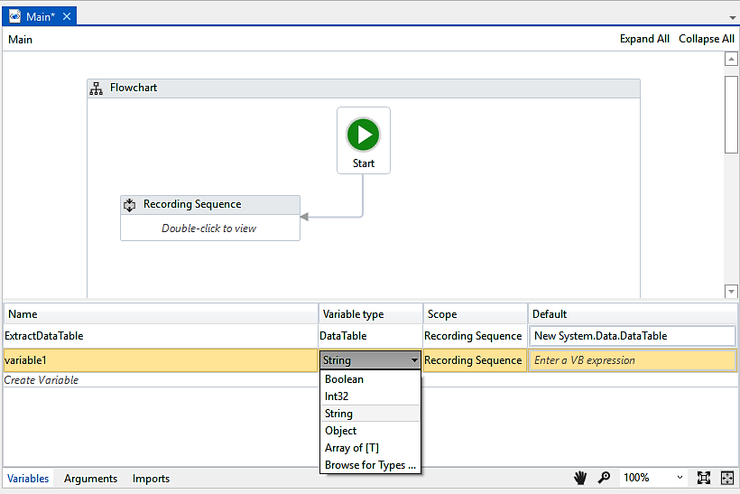

Creating a variable 

**Note:**

For security reasons, it is not a good practice to set the **`Scope`**
of your variable to fullest as it may accidentally be accessed by
another region or could be modified.

Let us take an example of creating a variable and then displaying a
**`Message box`** using that variable:

1.  We have declared a variable as `name` in the
    **`Variables`** section and set its **`Default`** value to
    `"Hello world"`. By default, the type of the variable is
    **`String`** (we can change its type according to our needs). 
2.  Search for `Message box` in the **`Activities`** panel.
    Drag and drop that **`Message box`** template into a
    **`Flowchart`**.
3.  Right-click on the message template and select
    **`Set as Start node`**:

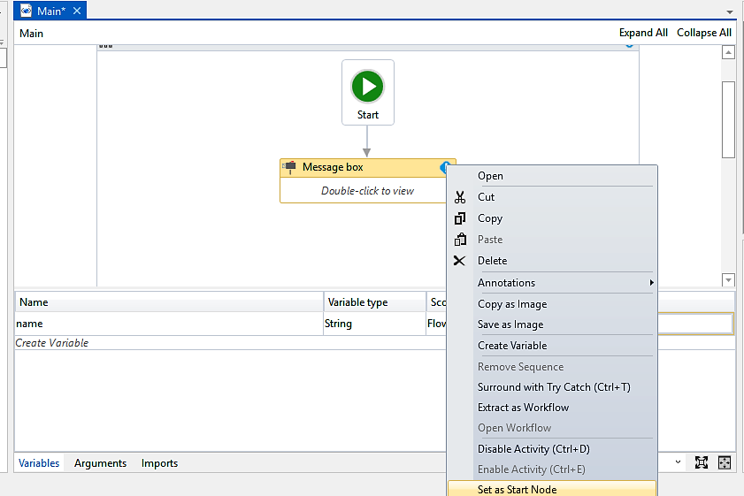

4.  Double-click on the **`Message box`** template and specify the
    variable name that we created earlier. At this stage, we are ready
    to run our application by simply clicking on the **`Run`**button:

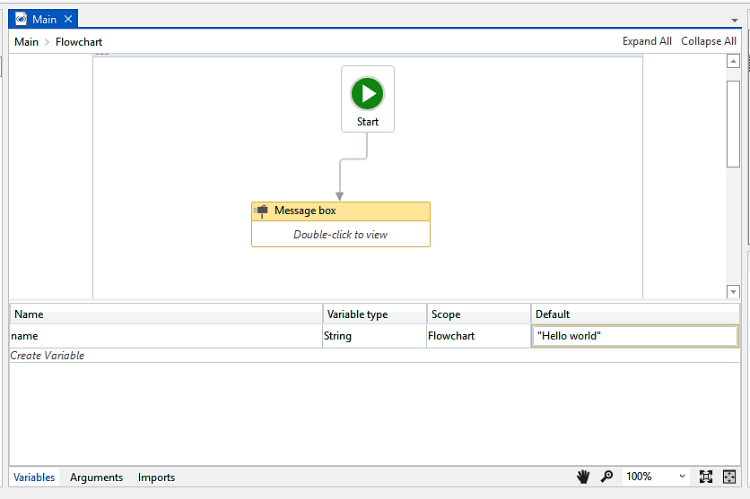

A dialogue box will pop up with the `"Hello world"` text
displayed on it.

Collections
-----------------------------

There are different types of variables. Variables can be classified into three categories:

-   **Scalar**: These are variables that can only hold a single data point of a particular
    data type, for example; Character, Integer, Double, and so on.
-   **Collections**: These are variables that can hold one or more data point of a particular
    data type. For example; array, list, dictionary, and so on.
-   **Tables**: These are a tabular form of the
    data structure which consists of rows and
    columns.

In this section, we are going to see how collections work and how we can
store values in the collection variables.

In a collection, we can store one or more data points, but all the data
must be the same. Consider an example. An array is a collection in which
we can store different values of a particular data type. It is a fixed
data type, meaning if we store five values inside the array, we cannot
add or remove any value/values in that array.

**Note:**

The** **object is a data type in which you can store any type
of data. Hence, if we take an array of objects then we can store
different types of data in an array. This is an exceptional case.

Let us see how we can use an array with an example. In this example, we
are going to take an array of integers, initialize it, and then iterate
through all the elements of the array:

1.  Drag and drop a **`Flowchart`** activity onto the main Designer
    panel, and drag and drop a **`Sequence`** activity inside the
    **`Flowchart`**. Set the sequence as **`Start`** node.
2.  Create a variable in the **`Variables`** panel and give it a
    meaningful name (in this example, we have created a variable
    named `arr`, which is an array of integers). Choose the
    data type as an array of integers.

 

3.  We have initialized the array as `{1, 2, 3, 4, 5}` in the
    **`Default`** section. You can initialize it with the **`int32`**
    data type:

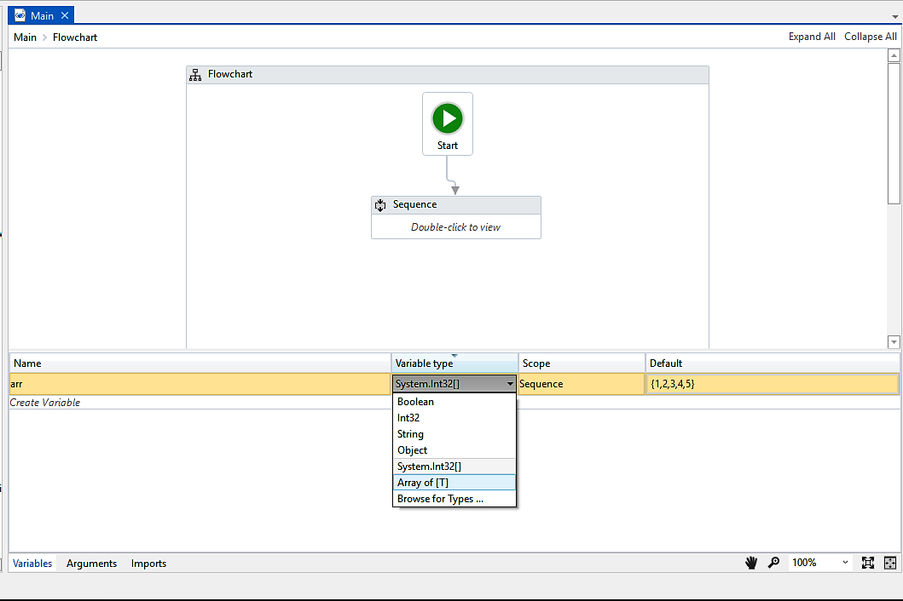

4.  Drag and drop a ****`For each`**** activity from the
    **`Activities`** panel inside the **`Sequence`**,**` `**and drag and
    drop a ****`Message box`**** activity inside the
    ****`For each`**** activity.
5.  Specify the array name in the expression text box of the
    ****`For each`**** activity.
6.  Specify the `item` variable that is auto-generated by the
    **`For each`** activity, inside the ****`Message box`****
    activity. But hold on, we have to convert the `item`
    variable into the **`String`** type because the
    ****`Message box`**** activity is expecting the string
    data type in the text box. Just press the dot (`.`) along
    with the `item` variable and choose the **`ToString`**
    method:

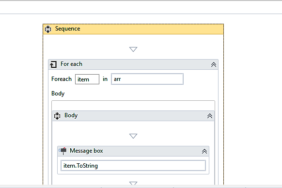

Hit the **`Run`** button to see the result. All the values will pop up
at once.

In this example, we have seen how easily we can initialize the array and
iterate through it.

Arguments -- Purpose and use
----------------------------------------------

An **Argument** is simply a variable that can store a value. You can create an argument in the Argument
section of the main Designer panel.

But remember, they are not limited to variables. An argument has a
larger scope than a variable and is used to pass values between
different workflows. You might be wondering why we need this. Suppose we
have a big project to build; we break down the project into different
workflows because smaller workflows can be easily tested separately. It
is very easy to build smaller workflows and combine them, thus turning
them into the real solution of the project.

These Arguments are used for interacting with different workflows by
exchanging data between them. That is why the direction property is
associated with Arguments. We can choose the direction on the basis of
our requirement---either giving the value to some workflow or receiving
the value from another workflow.

We can easily create arguments in the **`Arguments`** panel. We can also
specify the direction:

-   **In**: When we have to receive the value from another
    workflow.
-   **Out**: This is the current value if we have to send the
    value to a workflow.
-   **In/Out**: This specifies both; it can take or receive
    the value.
-   **Property**: This specifies that it is not being used
    currently:

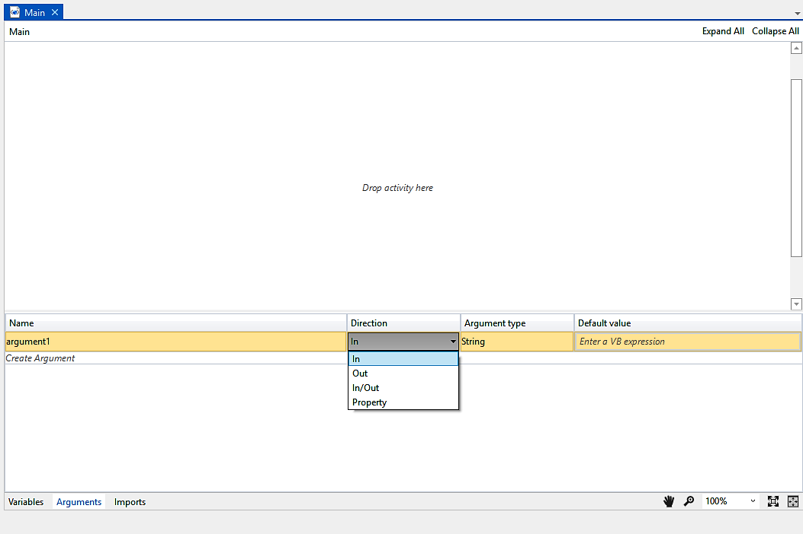

Data table usage with examples
------------------------------------------------

A data table is a tabular form of data
structure. It contains rows and each row has columns, for example:

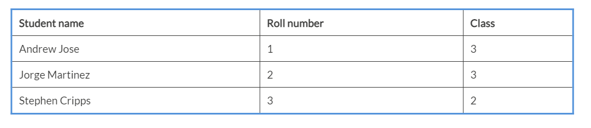

The preceding illustration is an example of a data table that has three
rows and three columns. You can build a data table in UiPath also.

A data table is used for various purposes. Say, for example, you have to
build a table dynamically. You can use a data table as your preferred
choice. A data table is also extensively used to store tabular data
structures. In data scraping, data tables are widely used. Data scraping
is a method in which we can dynamically create tabular data records of
search items on the web.

We shall build two projects in which we will use a data table:

-   Building a data table
-   Building a data table using data scraping (dynamically)

### Building a data table

Let us see, how to build a data table can be
built. First, create an empty project. Give it a proper name:

1.  Drag and drop a **`Flowchart`** activity on the Designer panel.
    Also, drag and drop a **`Sequence`** activity and set it as the
    **`Start`** node.
2.  Double click on the **`Sequence`** and drag and drop the
    **`Build Data Table`** activity inside the **`Sequence`** activity.

3.  Click on the **`Data Table`** button. A pop-up window will appear on
    the screen. Remove both the columns (auto generated by
    the ****`Build Data Table`**** activity) by clicking on
    the Remove Column icon:

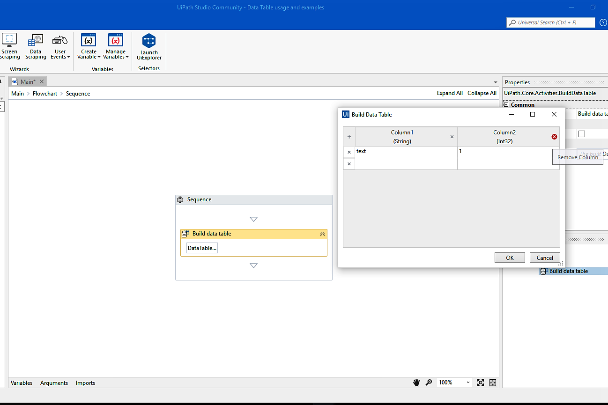

4.  Now, we will add three columns by simply clicking on the + symbol.
    Specify the column names and select the appropriate data types from
    the drop-down list.  Click on the**`OK`**button. We will
    add column `Name` of
    **`String`** Data Type, `Roll_No` of **`Int32`** type and
    finally Class of string type:

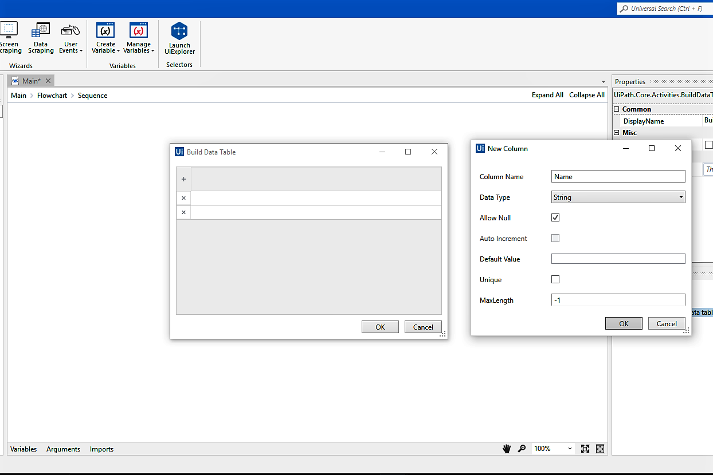

Now enter some random values just to insert the data into the rows:

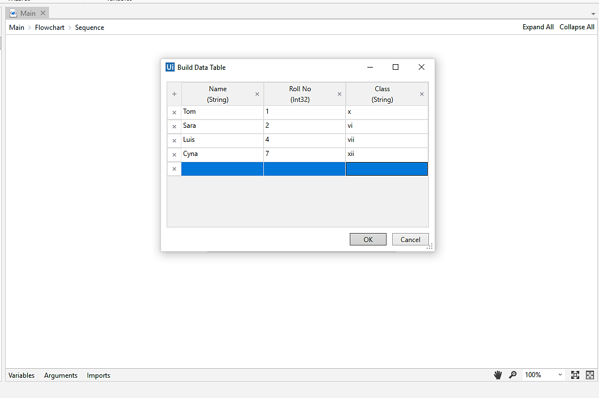

 

Click on the **`OK`** button and our data table is ready. We have to
iterate over the data table\'s rows to make sure everything works
correctly.

5.  In order to store the Data Table created
    by **`Build Data Table`** activity, we have to create a data table
    variable `MyDataTable` of **`DataTable`** type and in
    order to store the result of the data table that we have dynamically
    built. Also, specify  assign the **`Output`** property of the
    **`Build Data Table`** activity with this variable. Specify the data
    table variable\'s name there.
6.  After our data table is ready, we will iterate the data table\'s
    rows to make sure everything works correctly. Drag and drop the
    **`For each row`** activity from the **`Activities`** panel inside
    the **`Sequence`** activity. Specify the data table variable\'s name
    (`MyDataTable`) in the expression text box of the
    **`For each row`** activity:

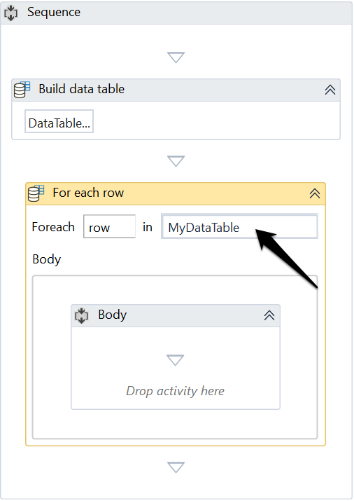

 

7.   Drag and drop the ****`For each row`**** activity from
    the **`Activities`** panel inside the ****`Sequence`****
    activity. Specify the data table variable\'s name in the expression
    text box of the ****`For each row`**** activity:

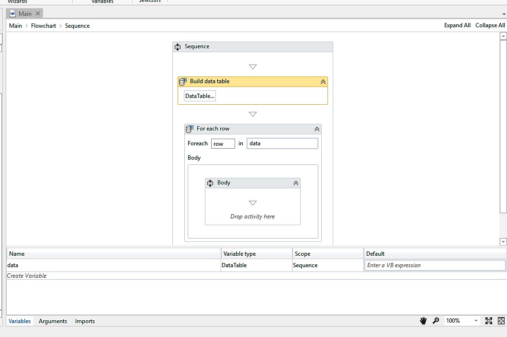

**Note:**

**`For each`** and **`For each row`** are two different activities.
**`For each`** is used to iterate over the collections, while the
**`For each``row`** activity is used to iterate over the data table
rows.

8.  Drag and drop a **`Message box`** activity inside the
    **`For each row`** activity. In the **`Message box`**activity,
    Inside the message box we have to write following
    string: `row("Name").ToString +"-"+ row("Roll_No").ToString + "-"+row("Class").ToString. row` the
    variable which holding data for the data
    row in each iteration:

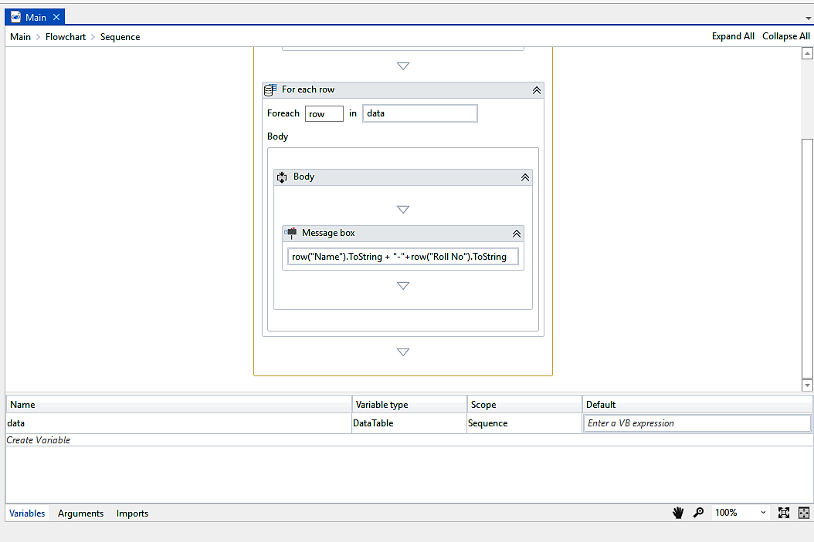

This row variable contains all the columns of a particular row. Hence,
we have to specify which column value we want to retrieve by specifying
the column name. Instead of the column name, we can also specify the
column index (the column index always starts from zero). Hit the
**`Run`** button to see the result.

### Building a data table using data scraping (dynamically)

Using data scraping, we can build the data
table at runtime. Let us consider an example of extracting data from
Amazon\'s website. Perform the following steps:

1.  Drag and drop the **`Flowchart`** activity from the **`Activities`**
    panel, and drag and drop the **`Sequence`** activity inside the
    **`Flowchart`** activity.
2.  Double-click on the **`Sequence`** activity.
3.  Drag and drop the ****`Open Browser`**** activity inside
    the **`Sequence`** activity. Specify the URL in the text box:

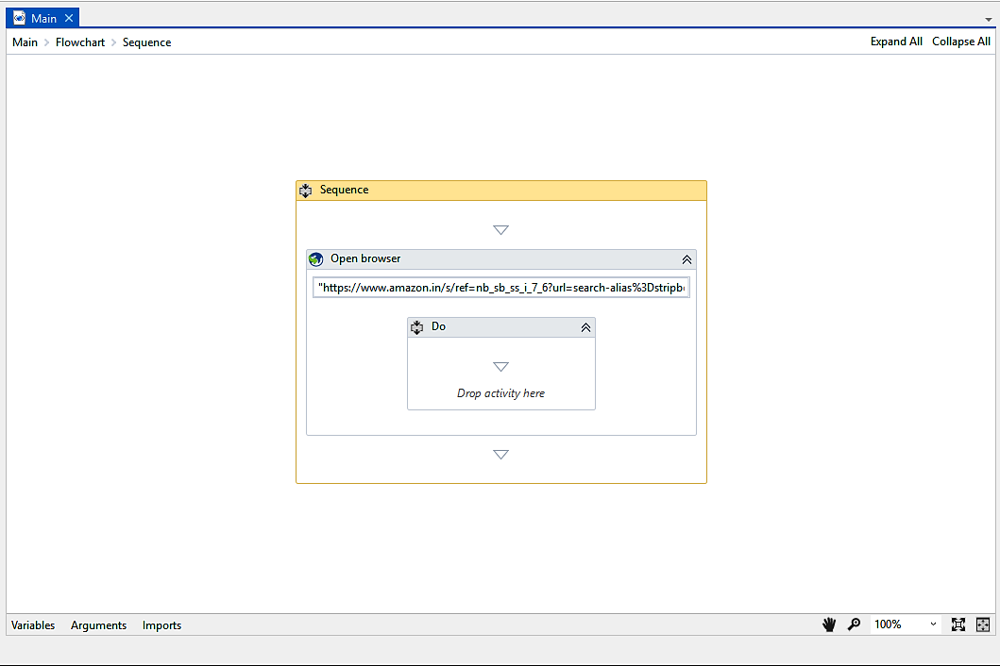

(URL: <https://www.amazon.in/s/ref=nb_sb_ss_i_7_6?url=search-alias%3Dstripbooks&field-keywords=books+for+kids&sprefix=books+%2Cstripbooks%2C322&crid=2OWJE9AMZYS06>)

4.  Click on the **`Data Scraping`** icon on the top left corner of
    UiPath Studio. A window will pop up. Click on the **`Next`** button.
5.  Now, there will be a pointer pointing to the UI elements of the web
    page. Click on the name of the book:

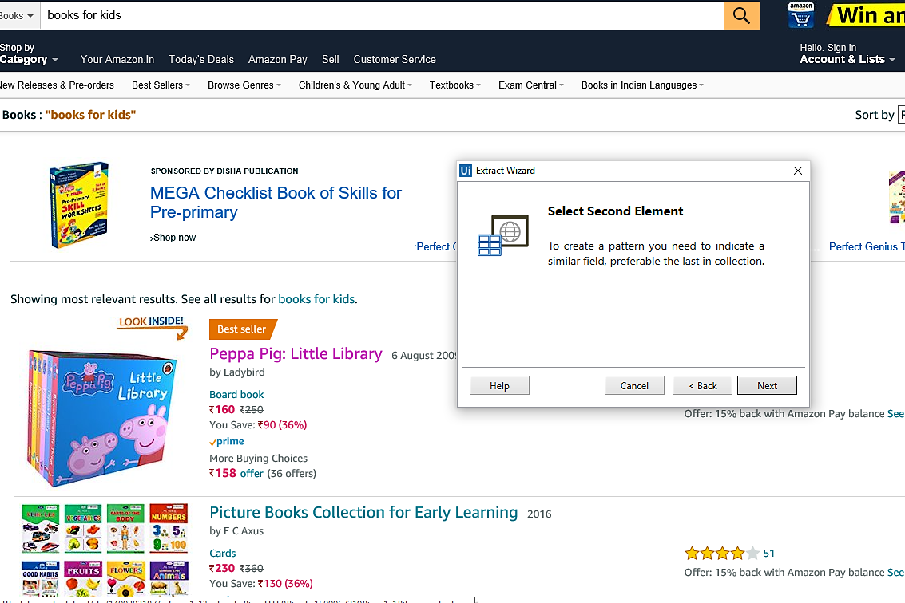

It will ask you to point to a second similar element on the web page:

6.  Point to a second similar element on that web page. Specify the name
    that you want to give for that extracted data column. (It will
    become the column name of the extracted data). Click on the
    **`Next`** button.
7.  A list of names will appear in a separate window.

If you want to extract more information, then click on the
**`Extract correlated data`** button and repeat the same process once
again (just as we extracted the name of the
book from Amazon\'s website). Otherwise, click on the
**`Finish`** Button:

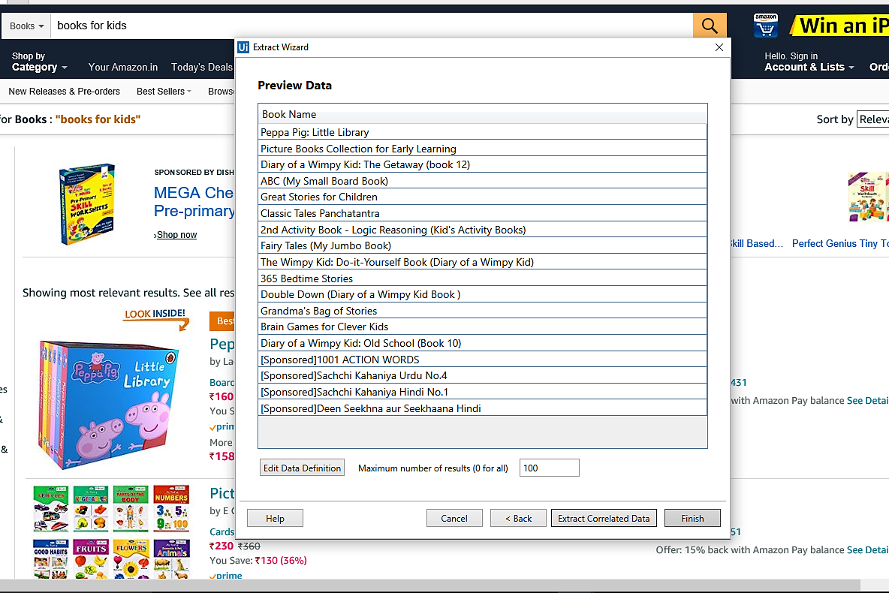

8.  It will ask you to locate the next page\'s button/link. If you want
    to extract more information about the product and it spans across
    multiple pages, then click on the **`Yes`** button and point to the
    next page\'s button/link. Then, click on it. If you want to extract
    only the current page\'s data, click on the **`No`** button, (you
    can also specify the number of rows that you want to extract data
    from: By default it is 100):

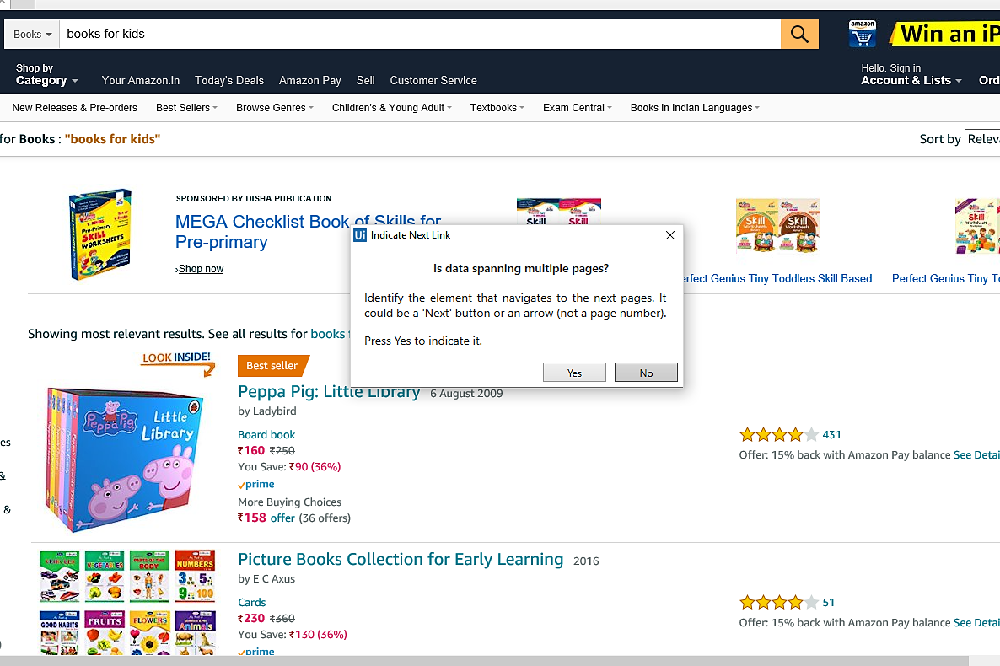

9.  Data scraping generates a data table. (In this case,
    `ExtractedDataTable` is generated.) Change the scope
    of `ExtractedDataTable` to the **`Flowchart`** so that it
    is accessible within the **`Flowchart`**activity:

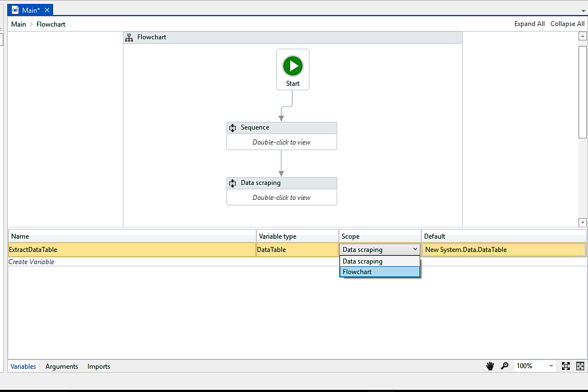

10. Drag and drop the ****`Output data table`**** activity
    on the **`Flowchart`**. Set the
    **`Output`** property of the ****`Output data table`****
    activity as: `ExtractedDataTable`:

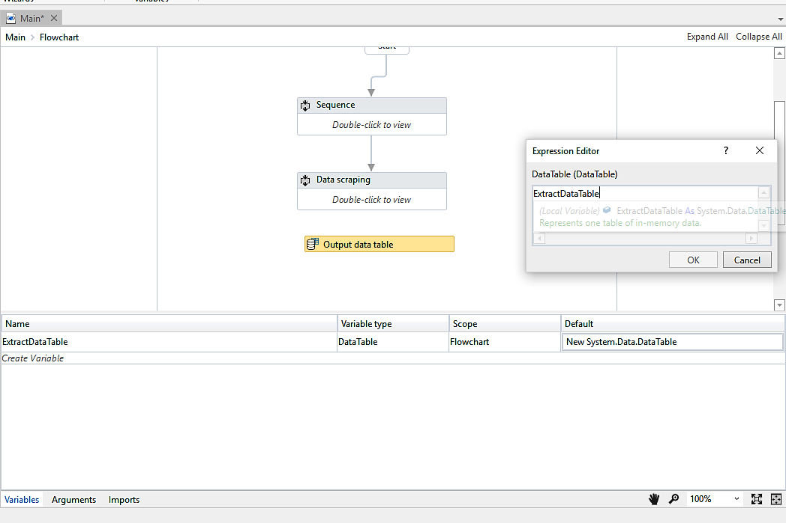

11. Connect the ****`Output data table`**** activity to
    the ****`Data Scraping`**** activity. Drag and drop the
    ****`Message box`**** activity on the Designer window.
    Also create a string variable to receive the text from the
    ****`Output data table`**** activity (in our case, we
    have created a `result` variable).

Specify the text property of the **`Output data table`** activity as
the `result` variable to receive the text from the
****`Output data table`****:

12. Connect the **`Message box`** activity to the
    **`Output data table`** activity. Double-click on the
    **`Message box`** and specify the text property as
    the `result` variable (the variable that you created to
    receive the text from the **`Output data table`** activity).
13. Hit the **`Run`** button and see the result.

Clipboard management
--------------------------------------

Clipboard management involves managing the
activities of the clipboard, for example, getting text from the
clipboard, copying selected text from the clipboard, and so on.

Let us see an example of getting text from the clipboard.

In this example, we will use Notepad. We will open Notepad, write some
data into it, and then copy the data to the clipboard. We will then
extract the data from the clipboard:

1.  Drag and drop a **`Flowchart`** activity from the **`Activities`**
    panel.
2.  Click on the **`Recording`** icon on the top of UiPath Studio. A
    drop-down menu will appear with the options, **`Basic`**,
    **`Desktop`**, **`Web`**, and **`Citrix`**, indicating the different
    types of recording. Select **`Desktop`** and click on **`Record`**.
3.  Click on **`Notepad`** to open it. A Notepad window will pop up:

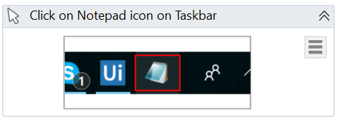

4.  Click on the text area of Notepad. Type into the dialog box and
    check the empty field. (Checking the empty field will erase all
    existing data in Notepad before writing any new data.) Press
    [*Enter*].

Data will be written on the Notepad text area:

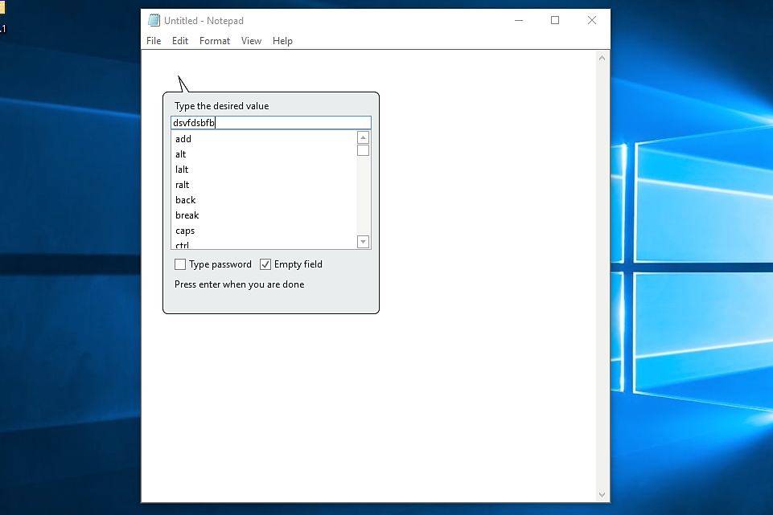

5.  Click on the **`Edit`** button. A pop-up window will appear asking
    you whether you want to use an anchor. (An anchor is a relative
    element of the current `{focused}` element.) As you can
    see clearly, the anchor element of the **`Edit`** button can be
    the **`File`** or **`Format`** button. In this case, we have chosen
    the **`Format`** button:

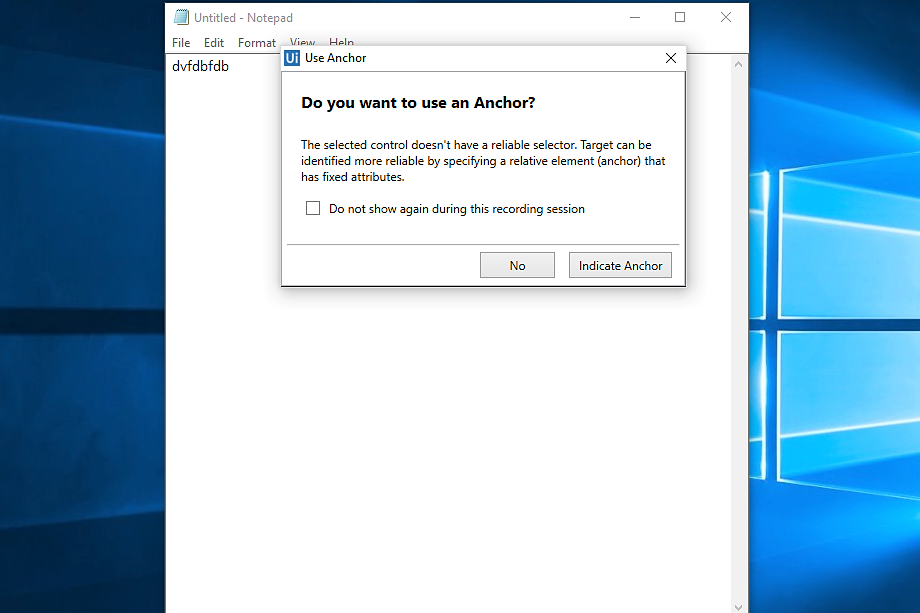

6.  Then, it will automatically start recognizing the**`Edit`** button. Choose the **`Select all`** option
    from the drop-down list:

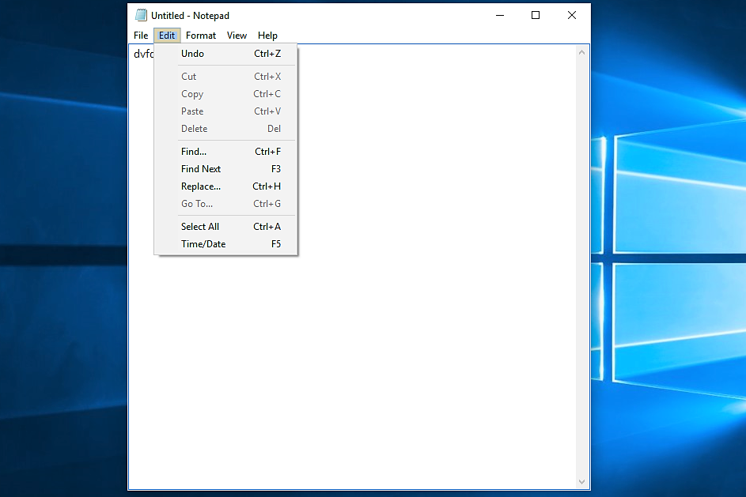

7.  Once again, click on the **`Edit`** button. It will again ask you to
    indicate the anchor element. Indicate the anchor button and the
    **`Edit`** button will be highlighted, giving you a drop-down box.
    Select the **`Copy`** option:

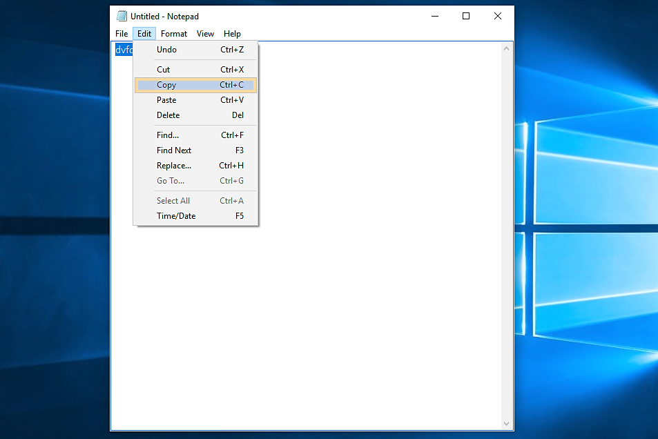

 

This copied text is now stored in the clipboard.

We can use the ****`Get from clipboard`****,
and ****`Copy selected text`**** activities to copy the text
that is stored in the clipboard.

We will use the ****`Copy selected text`**** activity.

8.  Double-click on the **`Recording sequence`** that is generated by
    the recording. Scroll down and drag and drop the
    ****`Copy selected text`**** and
    ****`Message box`**** activities inside
    the**`Recording sequence`**:

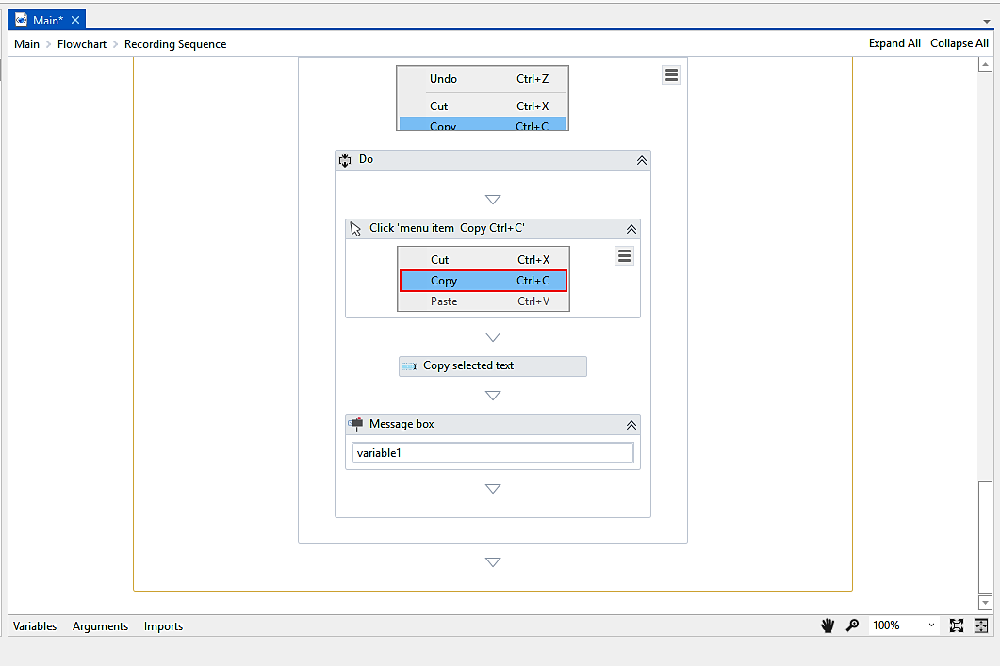

9.  Create a variable of type **`String`** to store the output value of
    **`Copy selected text`**. This variable will receive the required
    text from the clipboard with the
    ****`Copy selected text`**** activity. Now, specify the
    newly created variable in the **`Output`** property of the
    **`Copy selected text`** activity. This will be the required
    selected text that we have copied into the clipboard.
10. Specify the string variable in the text property of the
    ****`Message box`**** activity.
11. Hit the **`Run`** button to see the result.

File operation with step-by-step example
----------------------------------------------------------

In this module, we are going to operate on
Excel file. The following are the methods that are frequently used with
an Excel file:

-   Read cell
-   Write cell
-   Read range
-   Write range
-   Append range

Once you get familiar with these methods, it will become very easy for
you to use other methods too.

### Read cell

This is used to read the value of a cell from
an Excel file. We have a sample Excel file that we will use in this
example:

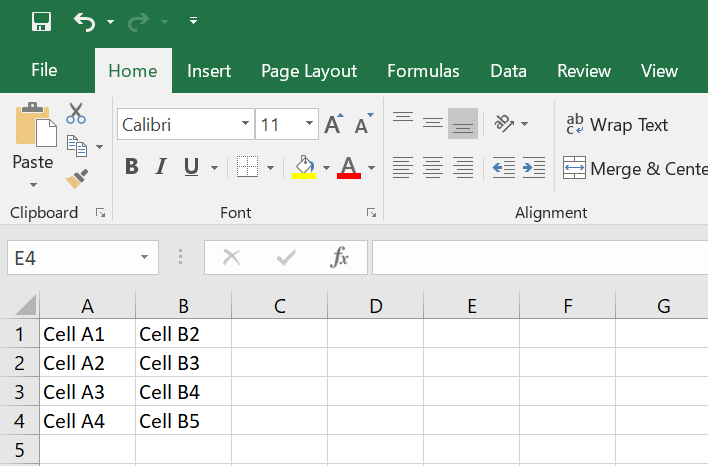

Suppose we have to read the value of the **`B3`** cell:

1.  Drag and drop a ****`Flowchart`**** activity on the main
    Designer panel. Also, drag and drop
    an ****`Excel application scope`**** inside the
    **`Flowchart`**. Connect it to the **`Start`** node.  Double click
    on Excel application scope.

**Note:**

It is a good practice to use the **`Excel application scope`** when
using Excel activities inside our project.

2.  Drag and drop the ****`Read Cell`**** activity inside the
    ****`Excel application scope`**** activity. Specify the
    range value in the cell text box of the **`Read Cell`** activity.
    Create a variable of type string to hold the result produced by the
    ****`Read Cell`**** activity. In our case, we have
    created a `Result` variable. Specify the **`Output`**
    property of the ****`Read Cell`**** activity by providing
    the variable\'s name that we have created:

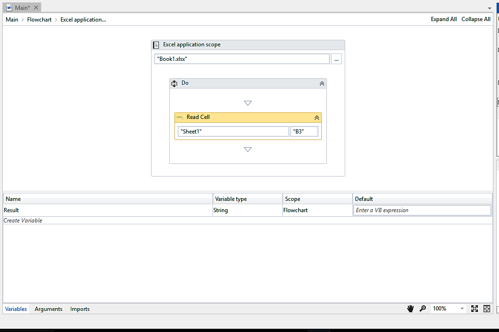

3.  Drag and drop a ****`Message box`**** activity inside the
    ****`Excel application scope`**** activity and specify
    the string variable\'s name (which we created earlier) in the
    expression box of the ****`Message box`**** activity.

That\'s it. Press [*F5*] to see the result.

### Write cell

This activity is used to write a value in a
cell of an Excel file:

1.  Drag and drop a **`Flowchart`** activity on the main Designer panel.
    Also, drag and drop an **`Excel application scope`** inside the
    **`Flowchart`** activity. Connect it to the **`Start`** node.
2.  Drag and drop a **`Write Cell`** activity inside the
    **`Excel application scope`**. Specify the cell value in which we
    want to write in the **`Range`** property of the **`Write Cell`**
    activity. Also, specify the value of the **`Value`** property:

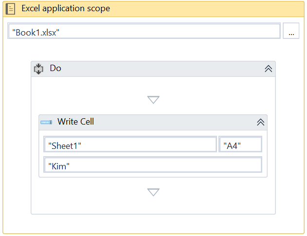

Press [*F5*] and see the result. Open the Excel file to see
the changes:

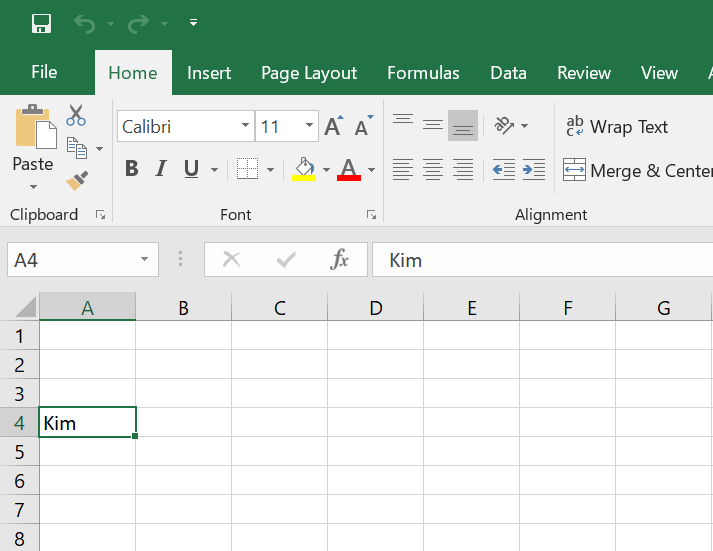

### Read range

This is used to read the value up to the
specified range. If the range parameter is not specified, it will read
the entire Excel file:

1.  Drag and drop a **`Flowchart`** activity on the main Designer panel.
    Also, drag and drop an ****`Excel application scope`****
    inside the **`Flowchart`** activity. Connect it to the **`Start`**
    node.
2.  Drag and drop a ****`Read Range`**** activity inside the
    ****`Excel application scope`**** activity. The
    ****`Read Range`**** activity produces a data table. We
    have to receive this data table in order to consume it. We need to
    create a data table variable and specify it in the **`Output`**
    property of the ****`Read Range`**** activity.

3.  Drag and drop an ****`Output Data Table`**** activity
    inside the ****`Excel application scope`**** activity.
    Now, we have to specify two properties of the
    ****`Output Data Table`****
    activity: **`Data Table`** property and text property. The
    **`Data Table`** property of the
    ****`Output Data Table`**** activity is used to convert
    the data table into a string format. The text property is used to
    supply its value in a string format. We have to receive this value
    in order to consume it. For this, let us create a variable of type
    string. Give it a meaningful name (in our case, it is**`Result`**):

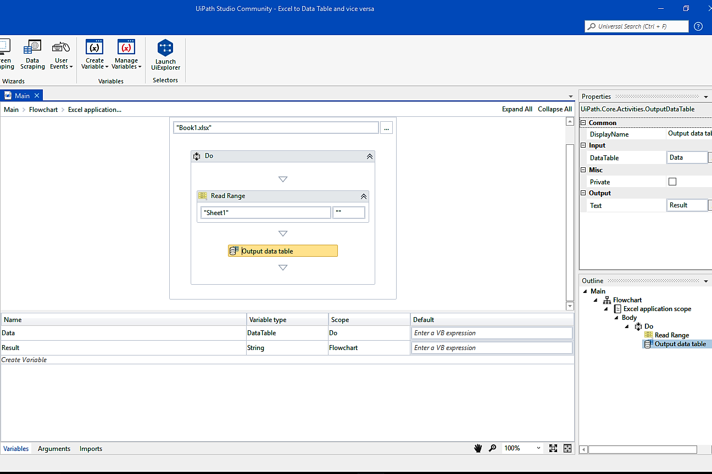

4.  Drag and drop a ****`Message box`**** activity inside the
    ****`Excel application scope`**** activity. Also, specify
    the string variable\'s name that we created earlier inside the
    ****`Message box`**** activity:

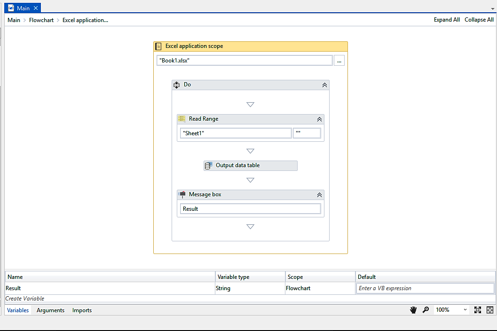

 

That\'s it. Press [*F5*] to see the result. A window will pop
up displaying your Excel file data.

### Write range

This is used to write a collection of rows
into the Excel sheet. It writes to the Excel file in the form of a data
table. Hence, we have to supply a data table:

1.  Drag and drop a ****`Build data table`**** activity from
    the**`Activities`** panel. Double-click
    on this activity. A window will pop up. You will notice that two
    columns have been generated automatically. Delete these two columns.
    Add your column by clicking on the **`+`** icon and specify the
    column name. You can also select your preferred data type. You are
    free to add any number of columns:

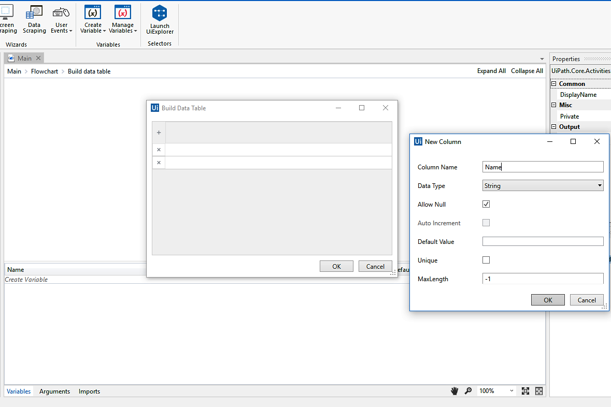

2.  In this project, we are adding two columns. The procedure for adding
    the second column is almost the same. You just have to specify a
    name and its preferred data type. We have added one more column
    (Roll) and set the data type to **`Int32`** for the data table. We
    have also initialized this data table by providing some values in
    its rows.

Create a variable of type data table. Give it a meaningful name. Specify
this data table name in the **`Data table`** property of the
**`Build data table`** activity. We have to supply this variable in
order to get the data table that we have built:

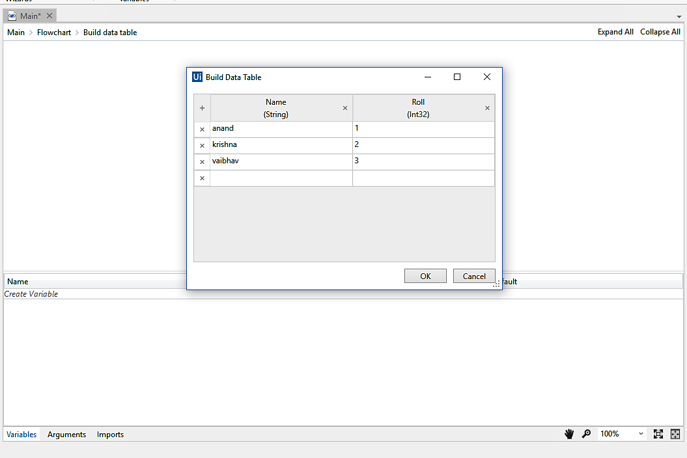

Our data table has been built successfully.

3.  Drag and drop an **`Excel application scope`** inside the main
    Designer panel. You can either specify the Excel sheet path or
    manually select it. Connect this activity to the
    **`Build Data Table`** activity. Inside the
    **`Excel application scope`** activity, just drag and drop the
    **`Write Range`** activity:

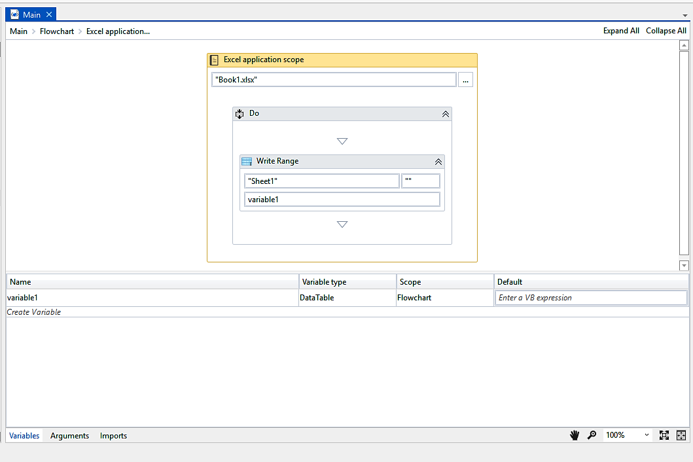

4.  Specify the data table variable name that we created earlier and set
    it as a **`Data table`** property inside the **`Write Range`**
    activity. We can also specify the range.
    In this case, we have assigned it as an empty string:

That\'s it. Hit the **`Run`** button or press [*F5*] to see
the result.

### Append range

This is used to add more data into an existing Excel file. The data will be appended to the end.

1.  Drag and drop the **`Flowchart`** activity on the main Designer
    window. Also, drag and drop the
    ****`Excel application scope`**** inside the
    ****`Flowchart`**** activity. Connect it to the Start
    node.

The ****`Append Range`**** activity requires a data table. In
this program, we are going to use another sample Excel file, which has
some raw data. Then, we will read this Excel file and append the data to
another Excel file.

First, we have to read its contents:

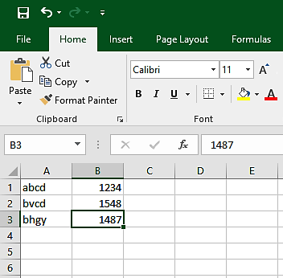

2.  Drag and drop the ****`Read Range`**** activity inside
    the ****`Excel application scope`**** activity. The
    ****`Read Range`**** activity produces a data table. We
    have to receive this data table in order to consume it. Create a
    data table variable and specify it in the **`Output`** property of
    the ****`Read Range`**** activity:

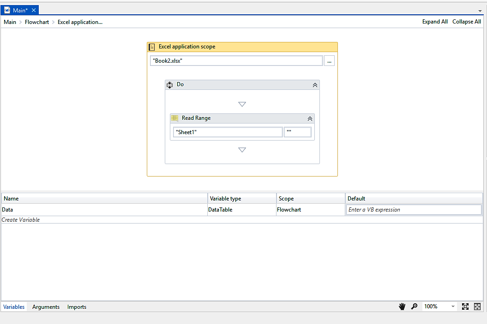

3.  Drag and drop the ****`Append Range`**** activity inside
    the ****`Excel application scope`**** activity. Specify
    the Excel file path in the ****`Append Range`****
    activity (in which we want to append the data). Also, specify the
    data table (which is generated by the **`Read Range`** activity):

That\'s it. Press [*F5*] to see the result:

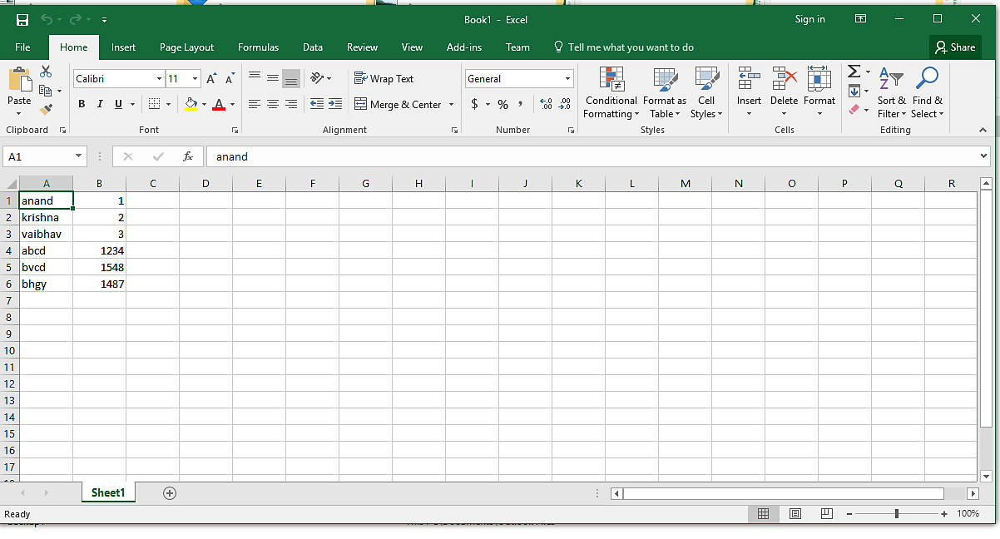

 

We can clearly see that the data has been appended successfully to the
Excel sheet.

CSV/Excel to data table and vice versa (with a step-by-step example)
--------------------------------------------------------------------------------------

In this section, we will see how to extract data from an Excel file into a
data table and vice versa. We will achieve
this by:

-   Reading an Excel file and creating a data
    table using data from the Excel file
-   Creating a data table and then writing all its data to an Excel file

### Reading an Excel file and creating a data table by using data from the Excel file

We have an existing Excel file and we are
going to use it in our project:

1.  Drag and drop the **`Flowchart`** activity on the main Designer
    window. Also, drag and drop the **`Excel application scope`** inside
    the **`Flowchart`**.
2.  Double-click on the **`Excel application scope`**. You have to
    specify the path of your workbook/Excel file. Drag and drop the
    ****`Read Range`**** activity from the **`Activities`**
    panel inside the ****`Excel application scope`****.

The ****`Read Range`**** activity will read the entire Excel
sheet. We also have the option of specifying our range. Create a
variable of type data table and specify it in the **`Output`** property
of the **`Read Range`** activity. This variable will receive the data
table produced by the **`Read Range`** activity:

3.  Drag and drop the ****`Output Data Table`**** activity
    inside the **`Excel application scope`** activity. Now, we have to
    specify two properties of the ****`Output Data Table`****
    activity: the **`Data Table`** property and the text property. The
    **`Data Table`** property of the
    ****`Output Data Table`**** activity is used to convert
    the **`Data Table`** into string format.

The text property is used to supply its value in a string format. We
have to receive this value in order to consume it. For this, let us
create a variable of type string. Give it a meaningful name:

4.  Drag and drop a ****`Message box`**** activity inside the
    ****`Excel application scope`**** activity. Also, specify
    the string variable\'s name that we created earlier inside the
    ****`Message box`**** activity.

That\'s it. Press [*F5*] to see the result. A window
displaying the Excel file data will pop up.

### Creating a data table and then writing all its data to an Excel file

In this project, we will build a data table
dynamically and then write all its data to an
Excel file:

1.  Drag and drop a **`Build data table`** activity from the
    **`Activities`** panel. Double-click on this activity. A window will
    pop up. Two columns have been generated automatically; delete these
    two columns. Add your column by clicking on the + icon and specify
    the column name. You can also select your preferred data type. You
    are free to add any number of columns:

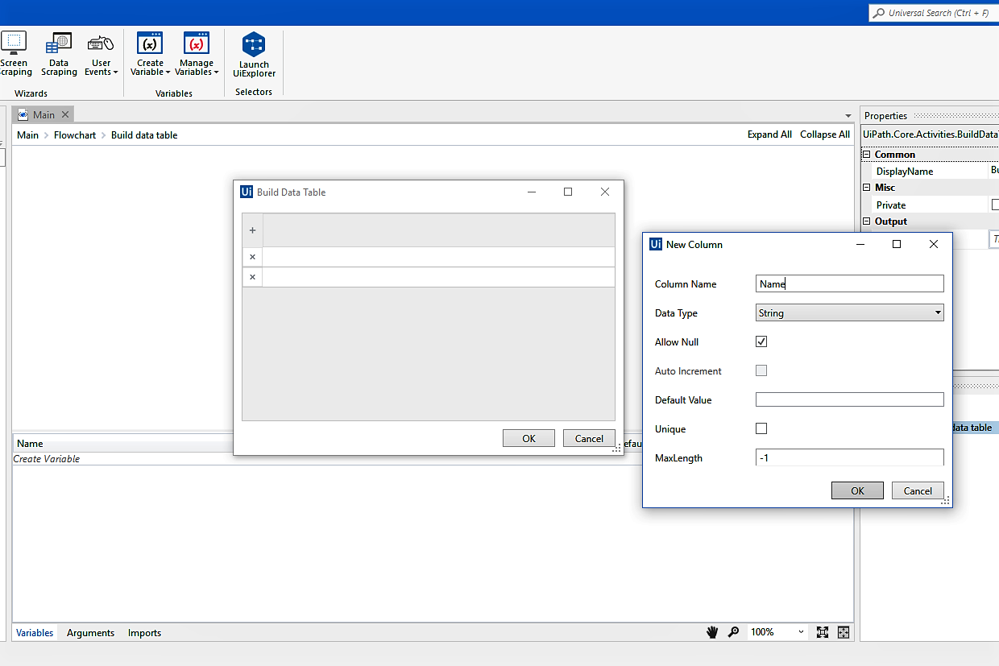

2.  In this project, we are adding two columns. The procedure for adding
    the second column is almost the same. You just have to specify a
    name and its preferred data type. We have added one more column
    (Roll) and set the data type to **`Int32`** in the data table. We
    have also initialized this data table by giving some values to its
    rows.

Create a variable of type **`Data Table`**. Give it a meaningful name.
Specify this data table\'s name in the **`Data Table`** property of the
**`Build data table`** activity. We have to supply this variable in
order to get the data table that we have built:

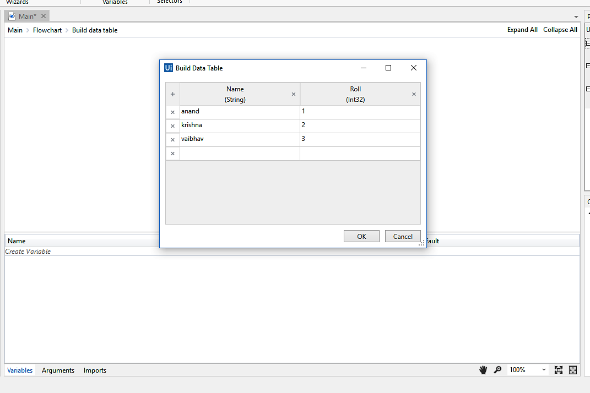

 

Our data table has been built successfully.

3.  Drag and drop the **`Excel application scope`** inside the main
    Designer window. Specify the Excel sheet\'s path or manually select
    it. Connect this activity to the **`Build Data table`** activity:

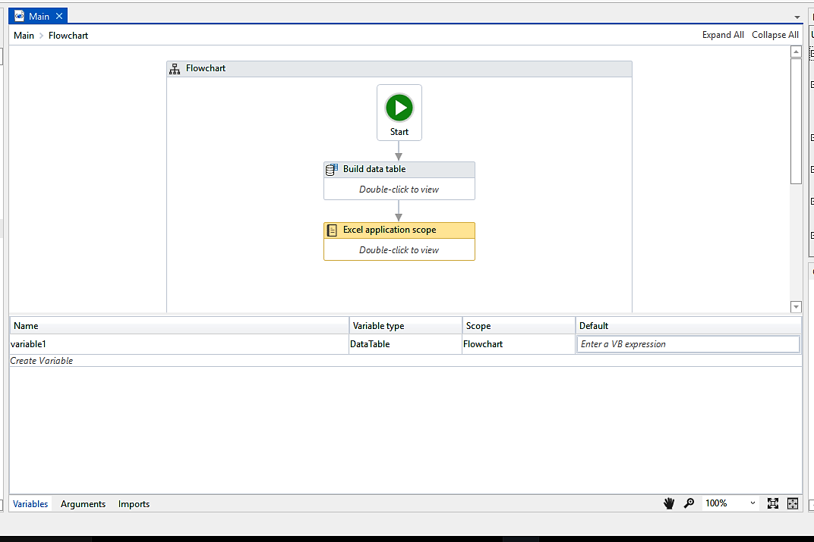

4.  Inside the **`Excel application scope`** activity, drag and drop
    the **`Write Range`** activity. Specify the data table variable name
    that we created earlier and set it as a **`Data table`** property
    inside the **`Write Range`** activity. We can also specify the
    range. In this case, we have assigned it as an empty string:

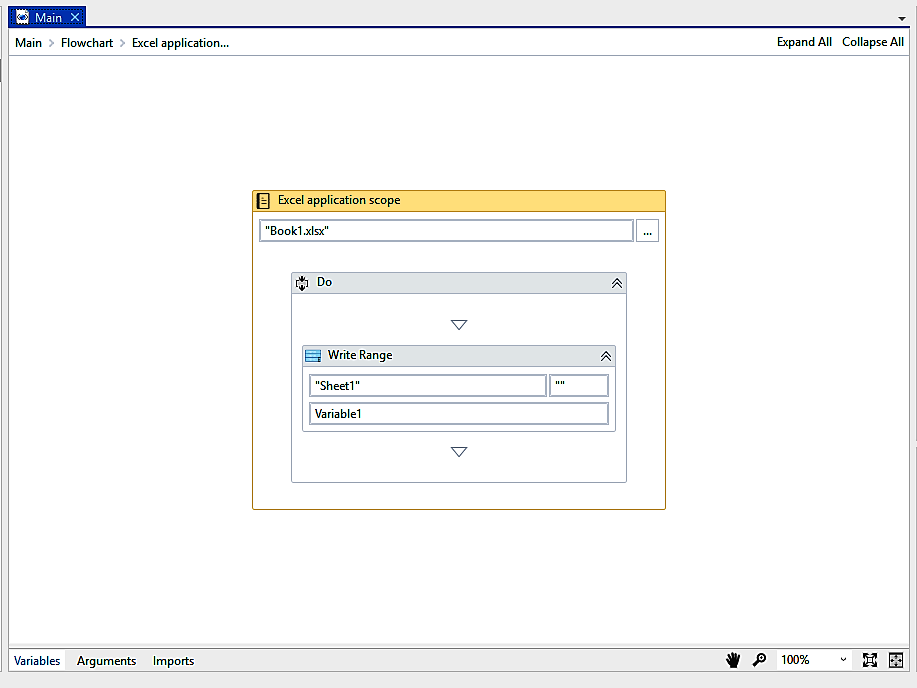

5.  That\'s it. Hit the **`Run`** button or press [*F5*] to
    see the result.

Summary
-------------------------

In this lab, you have learned techniques for using memory with
variables. You also have learned about data tables and easy ways to
manipulate data in memory.

Apart from using a variable or collection to store data, we have learned
to store and manipulate data in a more persistent way using such files
as CSV and Excel.

In the next lab, we will learn to handle controls within
applications in a better way.
