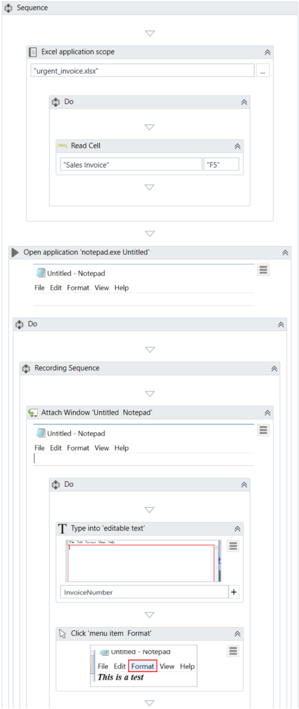
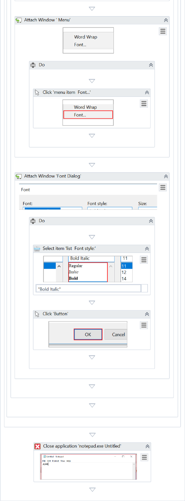
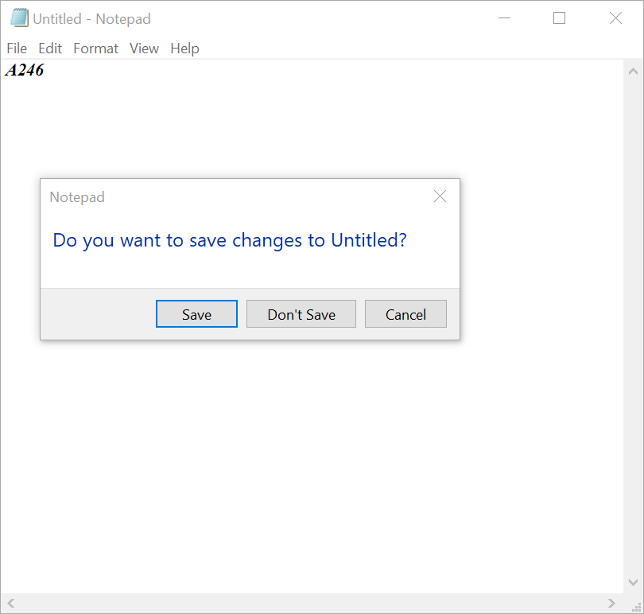

Automatic Recording with Basic and Desktop
==========================================

#### Lab Solutions
Lab solution(s) are present in `Solution\Lab04` folder.

To exemplify how you can use the automatic recording and understand more
about the differences between **Basic** and **Desktop**, let’s create
the same project for the two.

1.  Open Notepad.
2.  In UiPath Studio, create a new sequence.
3.  In the **Design** ribbon tab, in the **Wizards** group, select
    **Recording** and then select the recording type:
    -   **Basic** - The **Basic Recording** toolbar is displayed and the
        main view is minimized.
    -   **Desktop** - The **Desktop Recording** toolbar is displayed and
        the main view is minimized.

4.  In the toolbar, click **Record**. The automatic recording process
    starts.
5.  In Notepad, click on the main panel. A pop-up window is displayed.

6.  Type a custom text and press Enter. The string is displayed in
    Notepad.

> Note:
>
> Select the **Empty field** check box to delete previously existing
> text. You can also select this option after the recording is finished,
> in the **Properties** panel of the [**Type
> Into**] activity.

7.  From the **Format** menu, select **Font**. The **Font** window is
    displayed.
8.  Select a different font style, such as Bold Italic, and click
    **OK**.
9.  Press Esc two times. You exit the recording view and the saved
    project is displayed in the **Designer** panel.
10. Press F5. The automation is executed as expected.

The two screenshots below display part of the resulted projects for the
**Basic** (first screenshot) and **Desktop** (second screenshot)
automatic recordings. As you can see, the second one generates an
[**Attach Window**]
container, while the **Basic** one does not.

**Desktop** recorder - The top level window selector from the **Attach
Window** container:

**Desktop** recorder - The partial selector for the **Type Into**
activity:

**Basic** recorder – The full selector for the **Type Into** activity:

You can also customize and parameterize this project after it is
recorded. To exemplify this, let’s take the **Desktop** recording
example and build upon it.

For example, let’s assume that we want to extract the number of an
invoice from an Excel file, copy it to a new Notepad application which
we close in the end.

1.  Add an [**Excel Application
    Scope**]
    activity before the recording sequence.
2.  In the **WorkbookPath** field, type the path of the Excel file you
    need to extract information from.
3.  Add a [**Read
    Cell**] activity
    in the **Excel Application Scope**.
4.  In the **Properties** panel, add the **Sheet Name** and **Cell**
    information from the Excel file used.
5.  Right-click in the **Result** field, and click **Create Variable**.
    The **Set Name** field is displayed.
6.  Fill in the name, such as
    InvoiceNumber, and press Enter. The variable of type 'GenericValue'
    is created and displayed in the **Result** field and **Variables**
    panel.
7.  Change the scope of the variable to **Main**.
8.  In the recording sequence, in the **Type Into** activity, in the
    **Text** field, add the
    InvoiceNumber variable. This copies the value stored in the variable
    to Notepad.\
     What was added to the project should look as in the following
    screenshot.

9.  Add an [**Open Application**]
    activity between **Excel Application Scope** and the Recording
    sequence.
10. Use **Indicate window on screen** to select the active **Notepad**
    window.
11. Place the Recording sequence inside the **Open Application**
    activity.
12. Add a [**Close Application**]
    activity after **Open Application**.
13. Use **Indicate window on screen** again to select the active
    **Notepad** window to be closed.
14. Make sure the **OffsetX** and **OffsetY** properties (**Cursor Position**) are empty.
What was added to the project should look as in the following screenshot.

15. Press F5. The automation is executed as expected.

> Note:
>
> To ensure that the workflow execution ends, close the Save Notepad
> window.

