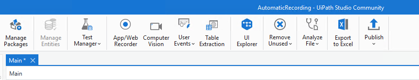
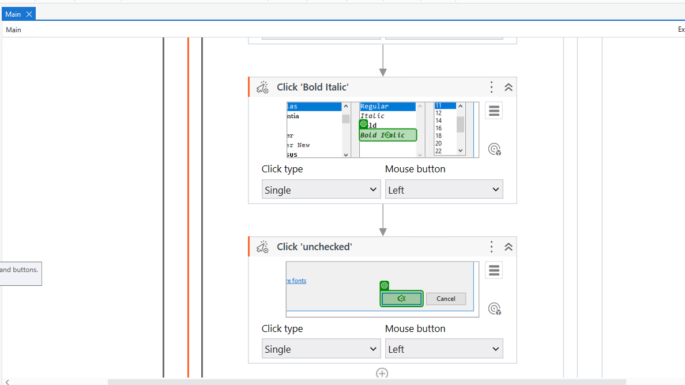

Automatic Recording with Basic and Desktop
==========================================

In this lab, we will learn to use the automatic recording.

#### Lab Solutions
Lab solution(s) are present in `Solution\Lab04` folder.

1.  Open Notepad.
2.  In UiPath Studio, create a new sequence.
3.  In the **Design** ribbon tab, select **App/Web Recording**:

4.  The automatic recording process starts.
5.  In Notepad, click on the main panel. A pop-up window is displayed.

6.  Type a custom text and press Enter. The string is displayed in Notepad.

> Note:
>
> Select the **Empty field** check box to delete previously existing
> text. You can also select this option after the recording is finished,
> in the **Properties** panel of the [**Type Into**] activity.

7. From the **Format** menu, select **Font**. The **Font** window is displayed.

8. Select a different font style, such as Bold Italic, and click **OK**.

9. Press Esc two times. You exit the recording view and the saved project is displayed in the **Designer** panel.

10. Press F5. The automation is executed as expected.

