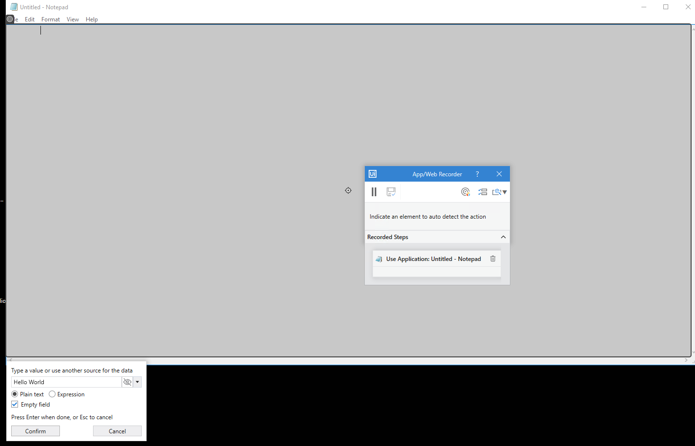

Automatic Recording with Basic and Desktop
==========================================

#### Lab Solutions
Lab solution(s) are present in `Solution\Lab04` folder.

To exemplify how you can use the automatic recording and understand more
about the differences between **Basic** and **Desktop**, let’s create
the same project for the two.

1.  Open Notepad.
2.  In UiPath Studio, create a new sequence.
3.  In the **Design** ribbon tab, in the **Wizards** group, select
    **Recording** and then select the recording type:
    -   **Basic** - The **Basic Recording** toolbar is displayed and the
        main view is minimized.
    -   **Desktop** - The **Desktop Recording** toolbar is displayed and
        the main view is minimized.

4.  In the toolbar, click **Record**. The automatic recording process
    starts.
5.  In Notepad, click on the main panel. A pop-up window is displayed.

6.  Type a custom text and press Enter. The string is displayed in Notepad.

> Note:
>
> Select the **Empty field** check box to delete previously existing
> text. You can also select this option after the recording is finished,
> in the **Properties** panel of the [**Type Into**] activity.

7.  From the **Edit** menu, select **Replace...**. The **Replace** window is
    displayed.

8.  Enter text to replace and click **Replace All**.

9.  Press Esc two times. You exit the recording view and the saved
    project is displayed in the **Designer** panel.
10. Press F5. The automation is executed as expected.

The two screenshots below display part of the resulted projects for the
**Basic** (first screenshot) and **Desktop** (second screenshot)
automatic recordings. As you can see, the second one generates an
[**Attach Window**]
container, while the **Basic** one does not.

**Desktop** recorder - The top level window selector from the **Attach Window** container:

**Desktop** recorder - The partial selector for the **Type Into**
activity:

**Basic** recorder – The full selector for the **Type Into** activity:

