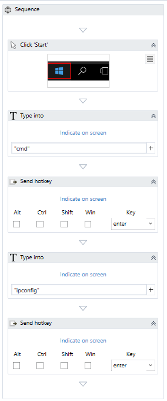
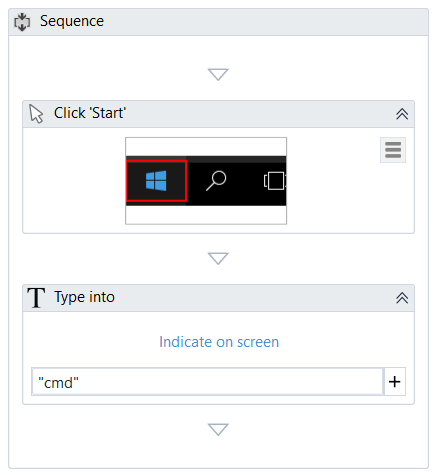
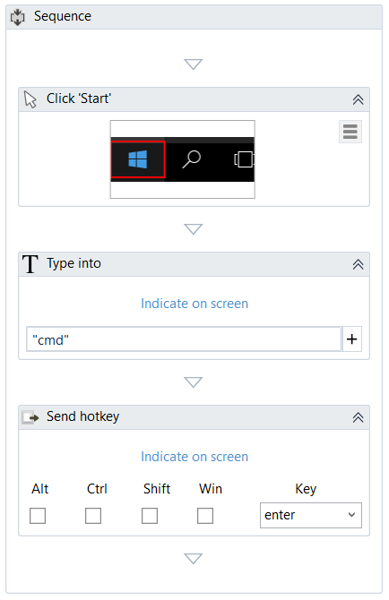
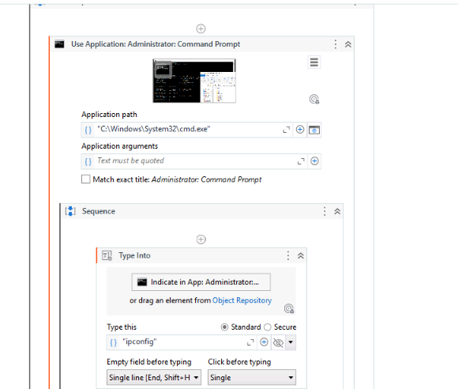
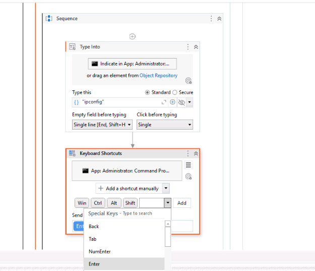
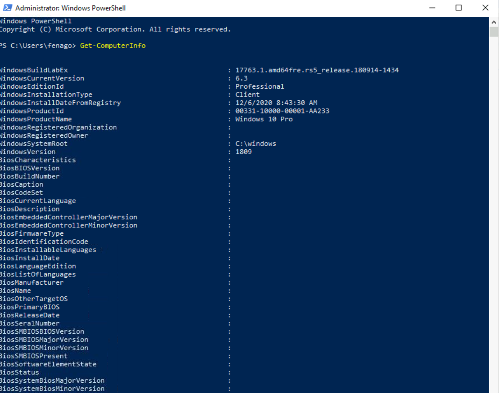

Lab 5: Using Mouse and Keyboard Automation
===========================================

#### Lab Solutions
Lab solution(s) are present in `Solution\Lab05` folder.

To exemplify the automation of a process by using activities that
simulate mouse and keyboard input, we created an automation that
displays the IP address, subnet mask, and default gateway for all
adapters from the Command Prompt, by using the ipconfig command and
actions similar to human ones:

1.  Create a new
    [**Sequence**].
2.  Add a [**Click**] activity
    to the **Designer** panel.
3.  Select the activity, click the **Indicate on screen** button and
    click the **Start** button.

4.  Add a [**Type Into**]
    activity under the previously added one.
5.  Select the activity, and in the **Text** field, write
    cmd.

6.  Add a [**Send  Hotkey**] activity
    under the previously added one.
7.  Select the activity and, from the drop-down menu choose **enter**.

8.  Add another **Type Into** activity under the previously added one.
9.  Select the activity, and into the **Text** field, write ipconfig.

10. Add another **Send Hotkey** activity under the previously added one.
11. Select the activity, and from the drop-down menu select the
    **enter** key.

12. Press F5. The automation is executed. The IP address, subnet mask
    and default gateway for all adapters are displayed in the Command
    Prompt.

**Task:**

Create new sequence to open "Powershell" and get System Info as shown below:

