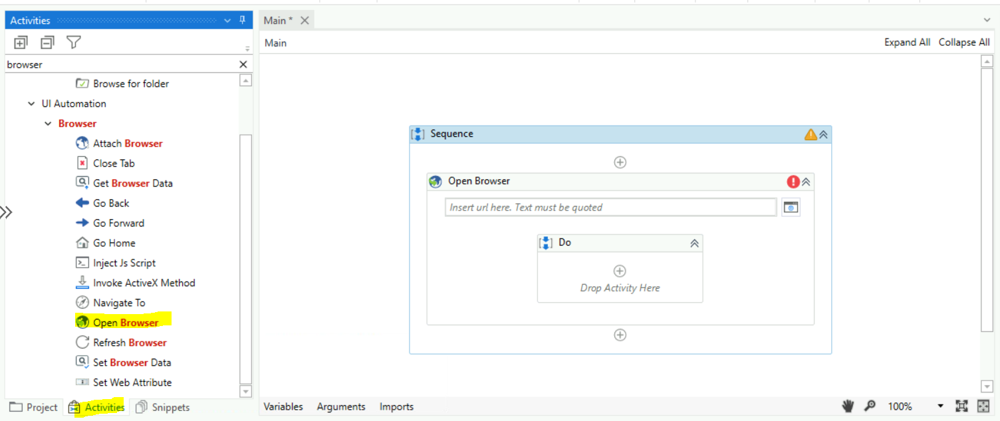
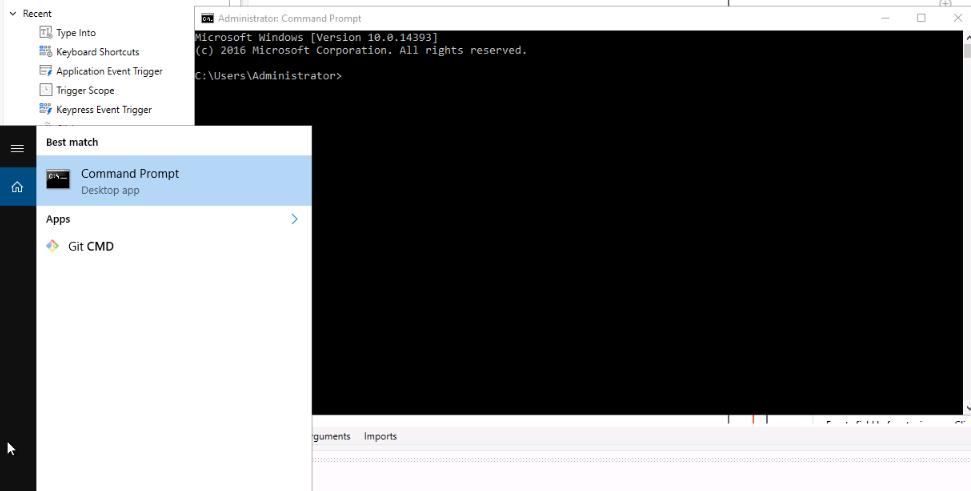
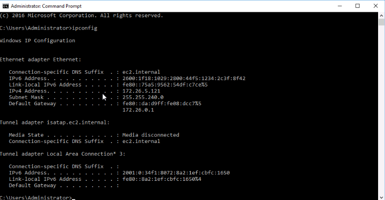

Lab 5: Using Mouse and Keyboard Automation
===========================================

#### Lab Solutions
Lab solution(s) are present in `Solution\Lab05` folder.

To exemplify the automation of a process by using activities that
simulate mouse and keyboard input, we created an automation that
displays the IP address, subnet mask, and default gateway for all
adapters from the Command Prompt, by using the ipconfig command and
actions similar to human ones:

1.  Create a new **Sequence**.

2.  In the **Activities** panel, search for **Use Application/Browser**
    and drag it to the **Designer** panel. Notice that the activity is
    automatically added inside a **Sequence**.

3. Open new **terminal**:

4. In `Use Application/Browser`, click **Indicate application to automate**, and then move the mouse pointer to the cmd terminal you just opened. When the window is highlighted, click anywhere in the window.

5. The `Use Application/Browser` activity is updated, the Application Path is added and a screenshot of the window appears inside the activity.

6.  Add **Type Into** activity.
7.  Select the activity and into the **Text** field, write "ipconfig".

8. Add **Keyboard Shortcuts** activity below `Type Into` activity.
9. Select the activity and from the drop-down menu select the **Add a shortcut manually** option. After that, select **Enter** key in `Send key combination`.

10. Press F5. The automation is executed. The IP address, subnet mask
    and default gateway for all adapters are displayed in the Command
    Prompt.

**Task:**

Create new sequence to open "Powershell" and get System Info as shown below:

