Lab 5. Taking Control of the Controls
--------------------------------------------------

By now, you should be able to make fairly complex workflows and take
various paths using control flows. You should now know how to store and
evaluate variables to make a decision. I hope you are using a recorder
extensively, as we will revisit the recorder in this lab to learn
more about it.

In this lab, we will go into detail on how we can interact with the
controls in the UI. Sometimes, you may need to click on a particular
button or extract information from a textbox. Either we take some action
on a control, or we read/write. We will go into detail on how to do this
accurately. In this lab, readers will learn about the various
[*selectors*] available in UiPath to extract and take action
on controls:

-   Finding and attach windows
-   Find controls
-   Techniques to wait for a control
-   Acting on controls---mouse and keyboard activities
-   Working with UiExplorer
-   Handling events

 We will then discuss the recorder in a new context.

Extraction is a primary feature of RPA, enabling UI automation. Behind
the scenes, many technologies are at work on the seamless extraction of
information from the UI. When typical RPA techniques are not successful,
OCR technology is used to extract information. We will learn about using
OCR and other techniques in the following topics:

-   Screen Scraping
-   When to use OCR
-   Types of OCR available
-   How to use OCR

Finding and attaching windows
-----------------------------------------------

In this section, we are going to use the
Attach Window activity.

The Attach Window activity can be found in
the **`Activities`** panel. This activity is generally used to attach an
already opened window. It is also auto-generated when we record actions
using the Basic or Desktop recorder. You will get a much clearer idea
after going through the example in the following section.

### Implementing the Attach Window activity

In this example, we shall use the
**`Attach Window`**activity manually. Here,
we are going to attach a Notepad window and then write some text into
it:

1.  Create a blank project and give it a meaningful name.
2.   Drag and drop a **`Flowchart`** activity on the Designer panel.
    Also, drag and drop a **`Click`** activity inside the Designer
    panel. Set this **`Click`** activity as the **`Start`** node.
3.  Double-click on the **`Click`** activity and then click on
    **`Indicate on screen`**. Locate the Notepad icon.
4.  Drag and drop the ****`Attach`******`Window`** activity
    on the main Designer panel. Connect the
    ****`Attach`******`Window`** activity to the **`Click`**
    activity.
5.  Double-click on
    the** **`Attach`******`Window`** activity. Click
    on **`Click Window on Screen `**and indicate the Notepad window. The
    Notepad window is now attached to the previous activity:

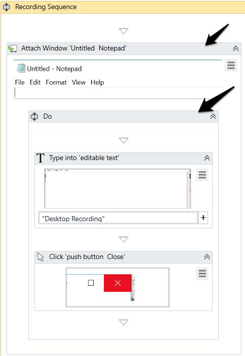

             

6.  For the sake of completeness, we are going to add a
    **`Type into `**activity. Just drag and drop the
    **`Type into `**activity, inside the **`Attach Window`** activity.
    Click on the **`Indicate element inside window`** and locate the
    Notepad window where you want to write the text. Write the text in
    the Text property of the **`Type into`** the activity.
7.  Hit the **`Run`** button.

Finding the control
-------------------------------------

There are many activities which can be used to find
controls on screen/ applications. These
activities are used to find or wait for an UI element.

Following are the activities that help in finding the controls:

-   Anchor base
-   Element Exists
-   Element scope
-   Find children
-   Find element
-   Find relative element
-   Get ancestor
-   Indicate on screen

We will discuss all these controls one by one.

### Anchor base

This control is used for locating the UI
element by looking at the UI element next to it. This activity is used
when we have no control over the selector. That means when we do not
have a reliable selector, then we should use the **`Anchor base`**
control to locate the UI element.

We can use the **`Anchor base`** control as explained in the following
section:

1.  Drag and drop a **`Flowchart`** activity on the Designer panel of a
    blank project. Also, drag and drop an **`Anchor base`** control from
    the **`Activities`** panel. Connect the **`Anchor base`** control
    with **`Start`**.
2.  Double-click on the **`Anchor base`** control:

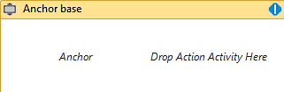

3.  There are two activities that we have to supply to the
    **`Anchor base`** control: **`Anchor`** and action activities.
4.  Drag and drop the **`Anchor base`** activity (for example;
    **`Find Element`** activity) in the **`Anchor`** field and
    **`Action`** activity (for example; **`Type into`**) in the
    ***`Drop Action Activity Here`*** field of the
    **`Anchor base`** control.

The **`Anchor base`** activity will find the relative element nearby the
element on which you want to perform the Action, and the Action activity
will perform the appropriate action that you have specified.

### Element Exists

This control is used to check the
availability of the UI element. It checks if the UI element Exists or
not. It also returns a Boolean result if the UI Element Exists, then it
returns true: otherwise, it returns false.

You can use this control to check for the UI element. In fact, it is
good practice to use this control for UI elements whose availability is
not confirmed or those that change frequently.

Just drag and drop the **`Element Exists`** control from the
**`Activities`** panel. Double-click on it. You can see there is an
**`Indicate on screen`** option. Click on it to indicate the UI element.
It returns a Boolean result, which you can retrieve later from the
Exists property. You just have to supply a Boolean variable in the
**`Exists`** property in the **`Properties`** panel.

### Element scope

This control is used to attach a UI element
and perform multiple actions on it. You can use a bunch of actions
within a single UI element.

Drag and drop the ****`Element scope`**** control and
double-click on this control:

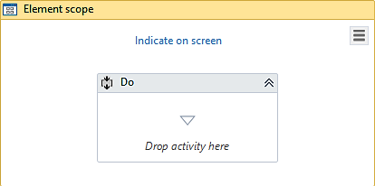

You can clearly see that you have to indicate the UI element by clicking
on **`Indicate on screen`** and specifying all the actions that you want
to perform in the **`Do`** sequence. You can add many activities inside
the **`Do`** sequence.

### Find children

This control is used to find all the children UI elements of a specified
UI element. It also retrieves a collection of children UI elements. You
can use a loop to inspect all the children UI
elements or set up some filter criteria to filter out the UI elements.

Drag and drop the **`Find children`** control from the **`Activities`**
panel.

Double-click on it to indicate the UI element that you want to specify.
You can indicate it by clicking on **`Indicate on screen`**:

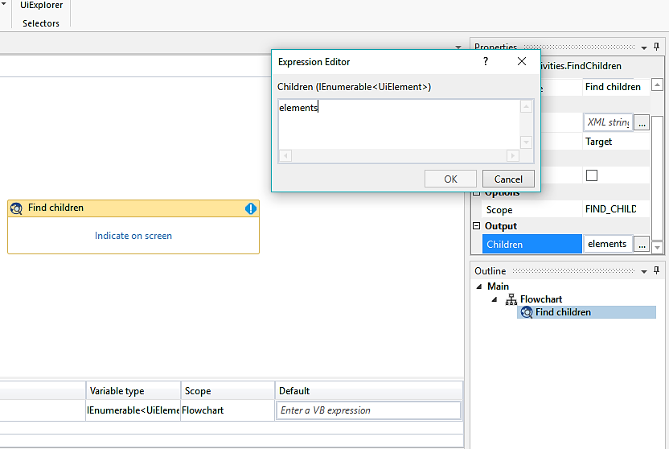

You have to supply a variable of type
`IEnumerable<UIElements>`**` `** in the children property, as
mentioned in the preceding screenshot. This variable is then used for
retrieving the UI elements:

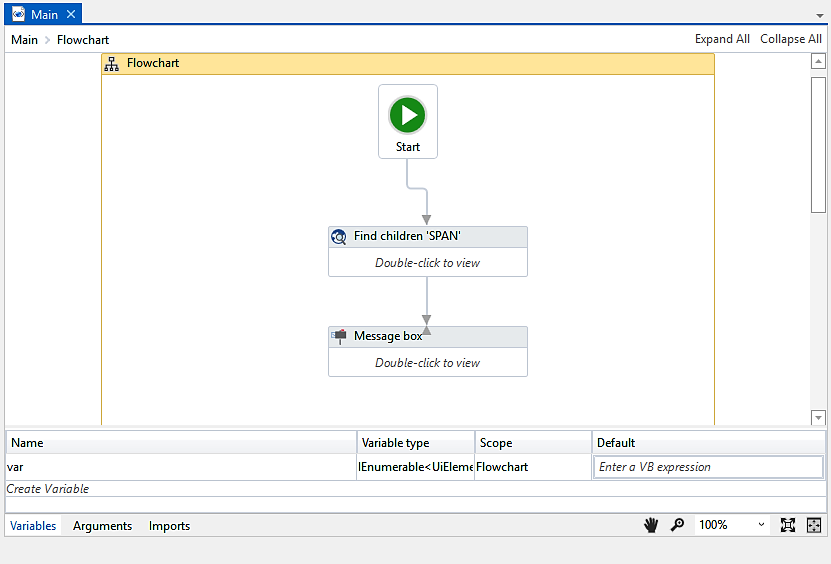

               

### Find element

This control is used to find a particular UI
element. It waits for that UI element to appear on the screen and
returns it back.

You can use this control in the same way that you used the other
controls. Just drag and drop this control, and indicate the UI element
by clicking on **`Indicate on screen`**.

You can specify the variable of type UI element in the Found
element property of the Find Element control to receive the UI element
as output.

### Find relative element

This control is similar to the Find element
control. The only difference is that it uses the relative fixed UI
element to recognize the UI element properly.

This control can be used in scenarios where a reliable selector is not
present.

Just drag and drop this control, and indicate the UI element by clicking
on **`Indicate on screen`**.

You can also look for its selector property after indicating the UI
element for better analysis.

### Get ancestor

This control is used to retrieve the ancestor
of the specified UI element. You have to supply a variable to receive
the ancestor element as output. You can specify the variable name in the
**`Ancestor`** property of the **`Get ancestor`** control.

After receiving the ancestor element, you can retrieve its attributes,
properties, and so on for further analysis:

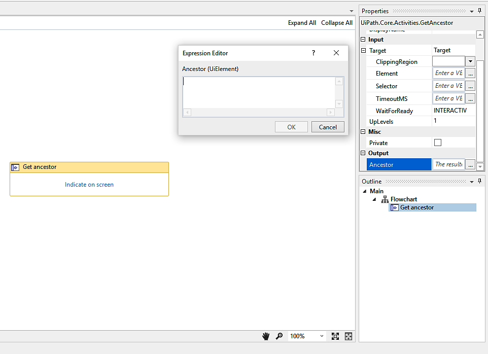

Just drag and drop this control and indicate the UI element by clicking
on **`Indicate on screen`**.

### Indicate on screen

This control is used to indicate and select
the UI element or region at runtime. It gives flexibility to indicate
and select the UI element or region while running the workflow.

You just have to drag and drop this control in your project:

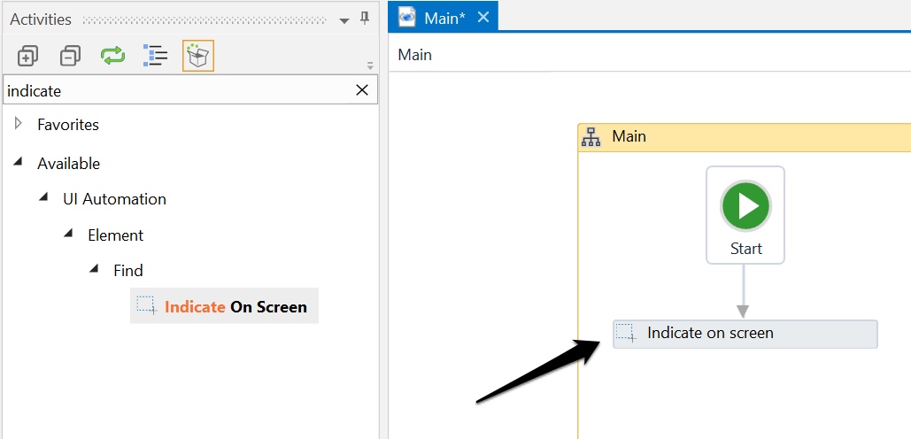

**Note:**

Do not confuse this with **`Indicate on screen `**written inside any
activity like **`Type into`**. In previous examples, we have
used **`Indicate on screen`** inside various controls (as shown in the
following screenshot). This button is used to locate the region or UI
element before the execution of the workflow, while
the **`Indicate on screen`** control executes its process after the
execution of the workflow:

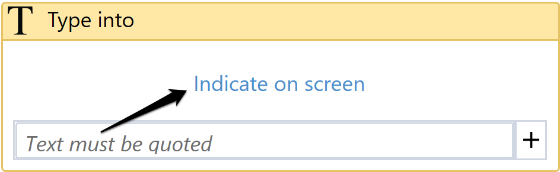

Techniques for waiting for a control
------------------------------------------------------

There are three techniques through which we
can wait for a control. They are:

1.  Wait Element Vanish
2.  Wait Image Vanish
3.  Wait attribute

### Wait Element Vanish

This activity is used to wait for a certain
element to disappear from the screen. Let us see an example where the
**`Wait Element Vanish`** activity is in use:

1.   Create a **`Blank`** project and give it a meaningful name.
2.   Drag and drop a **`Flowchart`** activity on the Designer panel.
    Also, drag and drop the **`Wait Element Vanish`** activity on the
    Designer panel. Set this activity as the **`Start`** node.
3.  Double-click on the **`Wait Element Vanish`** activity, then
    indicate on the screen which element needs to vanish.

### Wait Image Vanish

The **`Wait Image Vanish`** activity is similar to the **`Wait Element Vanish`** activity. This activity is
used to wait for an image to disappear from the UI element.

The only difference between the **`Wait Element Vanish`** and the
**`Wait Image Vanish`** activities is that the former is used to wait
for an element to disappear, while the latter is used to wait for an
image to disappear.

### Wait attribute

This activity is used to wait for the value
of the specified element attribute to be equal to a string. We have to
specify the string explicitly:

1.  Drag and drop a **`Flowchart`** activity on the Designer panel.
    Next, drag and drop the **`Wait attribute`** on the Designer panel.
    Now, right-click on the **`Wait attribute`** activity and set it as
    the **`Start`** node.
2.  Double-click on the ****`Wait attribute `****activity. We
    have to specify three values: attribute, element, and text property.
    We also have to specify the element on which we have to supply the
    value:

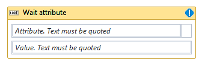

Hit the **`Run`** button and see the result.

Act on controls -- mouse and keyboard activities
------------------------------------------------------------------

While working in UiPath Studio, we have to work with various types of
controls, such as Find control, mouse control, keyboard control, and so
on, to automate tasks. In this section, we
are going to implement the mouse and keyboard
activities.

### Mouse activities

Those activities that involve interaction
with the mouse fall under the category of mouse activities.

There are three mouse activities in UiPath Studio:

-   Click activity
-   Double-click activity
-   Hover activity

#### The Click activity

When we have to click on a UI element on the
screen, we generally use the Click activity. It is very easy to use the
**`Click`** activity, as illustrated by the following example:

1.  Drag and drop a **`Flowchart`** on the Designer panel. Search for
    `mouse` in the search bar of the **`Activities`** panel.
    Drag and drop the **`Click`** activity. Right-click on the
    **`Click`** activity and select **`Set as Start Node`**.
2.  Double-click on the **`Click`** activity. Click on
    **`Indicate on screen`** and indicate the UI element you want to
    click on:

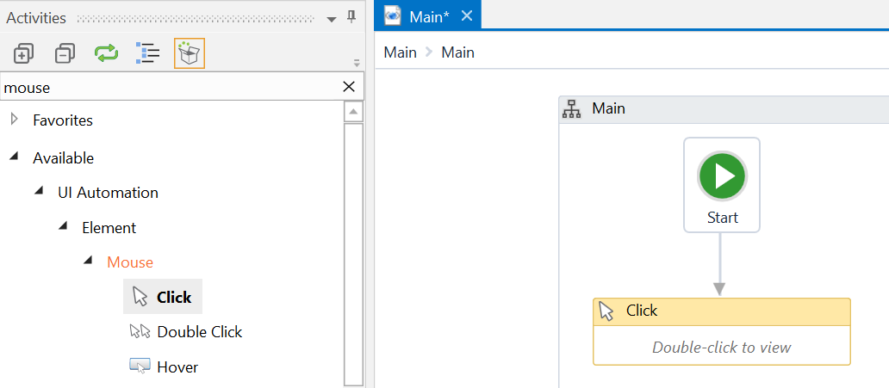

Hit the **`Run`** button to the see the result.

#### The Double-click activity

We have already seen the Click activity. The
Double Click activity is similar to the Click activity. It just performs
the double-click action. Using the Double click activity in your project
is almost the same as click. You have to use the Double click activity
instead of the Click activity and indicate the UI element, as we have
done in the previous example.

#### The Hover activity

The **Hover** activity is used to hover over a UI element. Sometimes, we have to hover over a UI to
perform an action. The Hover activity can be used in this case:

1.  Drag and drop a **`Flowchart`** on the Designer panel. Search for
    `mouse` in the search bar of the **`Activities`** panel.
    Drag and drop the **`Hover`** activity. Right-click on the
    **`Hover`** activity and select **`Set as Start Node`**:

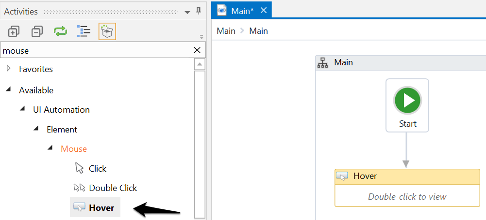

2.  Double-click on the **`Hover`** activity. Click on
    **`Indicate on screen`** to indicate the UI element you want to
    hover on. That\'s it. We are done.

Hit the **`Run`** Button to see the result.

 

### Keyboard activities

While automating tasks, we have to deal with keyboard activities a lot of a time. Keyboard activities generally
involve an interaction with a keyboard.

In UiPath Studio, the following are keyboard activities:

-   Send hotkey
-   Type into
-   Type secure text

#### Send hotkey

This activity is used to send keystrokes from the
keyboard as an input to the screen. Let us
use an example.

In the following example, we will use the **`Send hotkey`** activity to
scroll the Flipkart main page:

1.  Drag and drop a **`Flowchart`** on the Designer panel. Search for
    `Keyboard` in the search bar of the **`Activities`**
    panel. Drag and drop a **`Send hotkey`** activity. Right-click on
    the ****`Send hotkey`**** activity and select
    **`Set as Start Node`**.
2.  Double-click on the ****`Send hotkey`**** activity. Click
    on the **`Indicate on screen`** and indicate the required page (in
    our
    case, [https://www.flipkart.com](https://www.flipkart.com/){.ulink}). You
    can assign any key by marking the checkboxes. You can also specify
    the key by selecting a key from the drop-down list. In our example,
    we have chosen the **`down`** key:

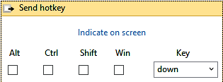

Hit the **`Run`** button to see the results.

**Note:**

To see the proper result, just scroll down the website. When this
activity does its work, you will able to distinguish the change in the
web page\'s position.

#### Type into activity

This activity is used to type the text into
the UI element. It also supports special keys.

The **`Type into`** activity is quite similar to the **`Send hotkey`**
activity. We have to send the keystrokes along with the special keys.
Special keys are optional:

You can use this activity by simply dragging and dropping the
**`Type into`** activity, and specifying the keystrokes and the special
keys by clicking on the + icon and choosing the key from the drop-down
list (if you wish to send special keys also). You also have to
**`Indicate on screen`** the area where you want the text to be typed.

#### Type secure text

This activity is used to send secure text to
the UI element. It sends the string in a secure way:

1.  Drag and drop a **`Flowchart`** on the Designer panel. Search for
    `Keyboard` in the search bar of the **`Activities`**
    panel. Drag and drop the ****`Type secure text`****
    activity. Right-click on the ****`Type secure text`****
    activity and select **`Set as Start Node`**.

2.  Create a variable of type **`SecureString`**. Now, double-click on
    the ****`Type secure text`**** activity and specify the
    variable\'s name in the **`SecureText`** property of the
    ****`Type SecureText`**** activity. You also have to
    indicate on the screen by clicking on **`Indicate on screen`**:

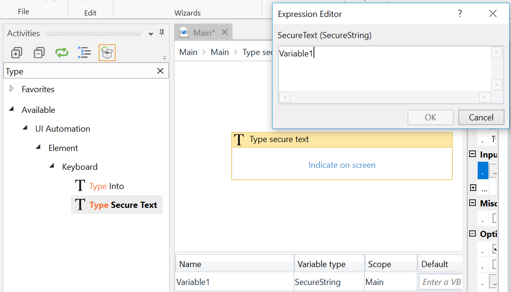

**Note:**

We have not assigned a value to the `variable1` of type
`SecureString`. In enterprise scenarios, you will be using
the **`Get credential`** activity. The **`Get credential`** activity is
used when we have to use Orchestrator. We shall learn about Orchestrator
later in the book.

Working with UiExplorer
-----------------------------------------

UiExplorer is a more advanced version of the
selector. It is a tool that gives us the flexibility to customize the
selector.

Let us try to understand the concept of UiExplorer with an example. In
this example, we are going to type some text into a Notepad window. It
is very easy to automate this task. You just have to use
the **`Type into`** activity and **`Indicate on screen`** the area to be
typed into and provide the text to be typed. Suppose you have opened a
Notepad window, written some text into it, and then saved this file. If
you want to write some text into it again, then UiPath Studio gives you
an error.

There is nothing wrong with the implementation. What actually happens is
that when you write some text in Notepad, UiPath Studio recognizes the
file, app, type, title, and class, and saves this information for future
recognition.

You have saved the file by providing a name. Hence, the title has been
changed by the system (as the name of the Notepad window has changed).
When you made the second attempt to write
some text, UiPath Studio failed to recognize that instance of the
Notepad window.

We can correct it by using UiExplorer. We have automated the task of
writing some text in the Notepad window. Double-click on the
**`Type into`** activity.

Click on the right side of the **`Selector`** property, expand
**`Target`** property to find **`Selector`** property. A window will pop
up. Click on the **`Open in UiExplorer`** button:

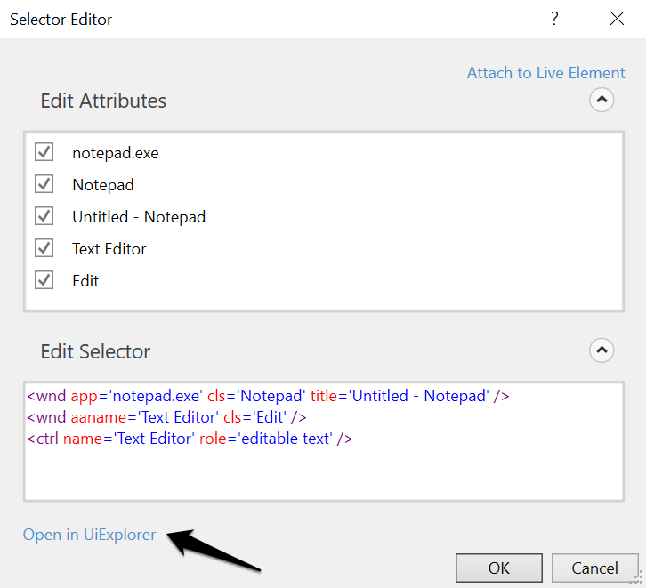

 

A window will pop up. You can see the **`Selector Editor`** window.
Analyze all the text written there. You will notice the title:
**`Untitled-Notepad`**.

You just have to edit this title. Just
specify **`test-Notepad`** between the quotes:

The problem was when you opened the Notepad window, UiPath Studio saved
the title attribute as **`Untitled-Notepad`**. You saved the file and
its title changed to **`test-Notepad`**. When you tried to write some
text next time, it did not recognize the title as it had been changed
from **`Untitled-Notepad`** to **`test-Notepad`**.

You just have to edit the title attribute to remove the error.

**Note:**

UiExplorer is used to customize the selector and to view attributes and
their associated values. View it carefully and inspect the attribute
that should be changed.

Handling events
---------------------------------

An event occurs when some action is
performed. There are different types of
events:

-   Element triggering event
-   Image triggering event
-   System triggering event

### Element triggering events

This type of event deals
with clicking and keypress events.

#### Click trigger

This event occurs when a specified UI element
is clicked.

Before using the Click trigger, we have to use the
****`Monitor events`**** activity. Without
****`Monitor events`****, the Click trigger cannot be used.

Double-click on ****`Monitor events`****. Drag and drop the
Click trigger inside **`Monitorevents`**. Also, drag and drop the
activity in the **`Event handler`** section of **`Monitor events`**. In
this case, we have used the ****`Message box`**** activity
and also specified the string value.

Inside the Click trigger, you have to indicate the UI element that you
want to click on:

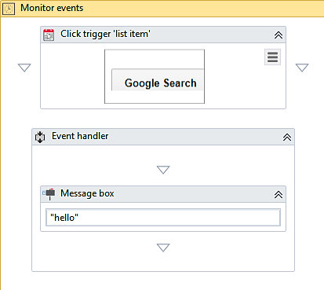

When the Click action is performed on the specified button, then the
event handler will be called and the activities inside the event handler
will be executed.

#### Key press trigger

This event is similar to the Click trigger. A
Key press trigger event occurs when keystrokes  have been performed on
some particular UI element. It calls the **`Event handler`** when it is
triggered.

While using **`Key press trigger`** event you have to specify the key or
combination of keys.

Indicate the UI element on which you want to perform the action:

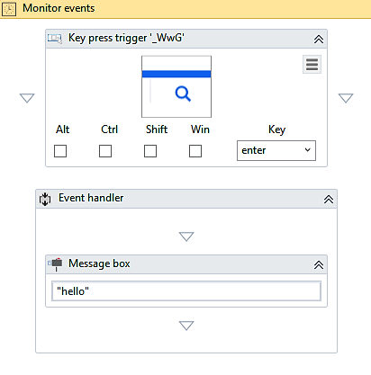

When the keys are pressed on the specified UI element, the event handler
will be called.

### Image triggering events

The Click image trigger is an
image tiriggering event.

Click image trigger, as the name suggests, is used for when we click an
image. You just have to use the Click image trigger event inside the
Monitor event and indicate the image. Upon clicking the indicted image
in the Click image trigger event, the event handler will be called.

### System triggering events

The following are System
triggering events:

-   Hotkey trigger
-   Mouse trigger
-   System trigger

#### Hotkey trigger

This event is raised when special keys are pressed. As we have already
looked at triggering events, you can use the
Hotkey trigger event on your own. You have to use this event inside the
Monitor event.

Specify the special key or combination of keys. Also, provide the event
handler that will be called when the event occurs.

#### Mouse trigger

This event is fired when the mouse button is
pressed. Use this event inside the Monitor event and specify the Mouse
button: Either the left mouse button, middle mouse button, or the right
mouse button.

#### System trigger

This event is used when you have to use all
of the keyboard events, all of the mouse events, or both.

In the following screenshot, we have dragged and dropped the
**`System trigger`** event into **`Monitorevents`**. You can specify the
trigger input property:

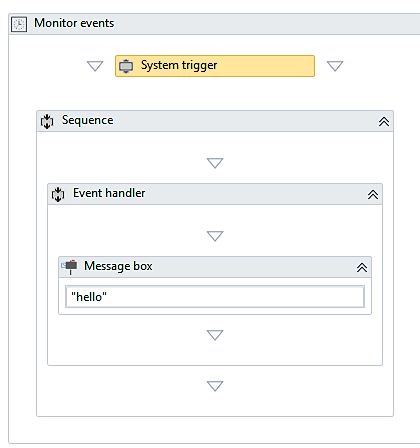

Revisit recorder
----------------------------------

You have already learned about Task recording in Lab 2. In this section, we will explore
recording a bit more.

As we discussed earlier, there are four types of
recording in UiPath Studio:

-   Basic recording
-   Desktop recording
-   Web recording
-   Citrix recording

### Basic recording

This is used to record the actions of applications that have a single window. Basic
Recording uses a full Selector. It works better for applications
performing a single action. It is not suitable for applications with
multiple windows.

There are two types of selectors, partial selectors and full selectors.
A Full selector has all the attribute to recognize a control or
application. The Basic recording uses full selectors.

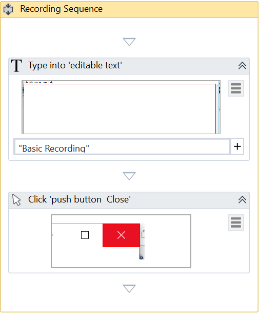

Please note that, in the preceding image that there are different
activities but those activities are not wrapped inside containers, it is
generated by Basic recorder. Basic recording generates different
activities and places them directly in the sequence with full selector.

You have already seen how to automate tasks using the Basic recorder;
now, let us cover other recorders.

### Desktop recording

This is similar to Basic recording with the added advantage of working with multiple actions. It is most
suitable for automating Desktop applications. 

Desktop recorder generates Partial selectors. The Partial selectors,
have a hierarchical structure. They are split into parent child views
for recognizing the UI element properly.

Please note in the preceding image there is a **`Attach Window`**
activities and other activities are nested under it. This flow is
generated **`Desktop`** recorder:

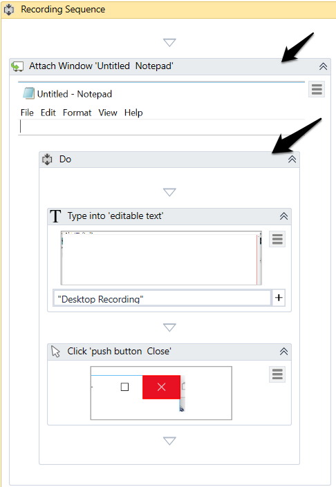

### Web recording

Web Recording can be done by using the Web recorder. For
recording web actions, the UiPath extension
for that browser should be installed. Otherwise, you will not able to
automate tasks or actions using Web
recording.

You just have to click on the Setup icon and then click on Setup
Extensions. Now, choose your browser and click on it. The UiPath
extension will be added to your specified browser.

Web Recording is similar to Desktop Recording. You just have to record
the actions and save it.

Create a **`Blank`** project. Drag and drop a **`Flowchart`** activity.
Now, click on the **`Recording`** icon and choose **`Web`** recording.
You can record your actions on the web on your own and then save it. In
our case, we have opened a web page using Google Chrome and logged in to
[http://www.google.com](http://www.google.com/){.ulink}. Then, we
started the recording by clicking on the Record button of the web
recorder. Next, we typed some text in the search bar of Google and
performed the Click activity. Then, we pressed the
[*Esc*] key to exit the recording and clicked on the
**`Save and Exit`** button. Now, a recording sequence is generated in
our Designer panel. Connect this sequence to the **`Start`** node. Hit
the **`Run`** button to see the result. In the following screenshot, you
can see the sequence generated by the Web recorder:

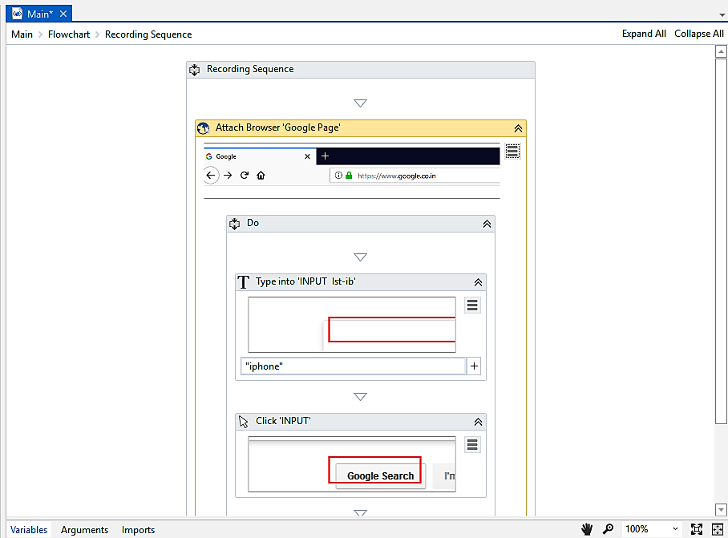

**Note:**

Before running the UiPath workflow, make sure you are on the Google
homepage.

We have seen Web recording and it is very easy. There is also another
option to extract information from websites.

We can easily extract information
from websites using data scraping.

Suppose we want to extract data from Amazon\'s website. Say we want to
search for books on Amazon and extract the search results. Extracting
data from websites becomes very easy with data scraping:

1.  Create a blank project and give it a meaningful name. Click
    **`Create`**.
2.  Log on to Amazon\'s website and search for books. A detailed list of
    books is listed on your screen:
    
    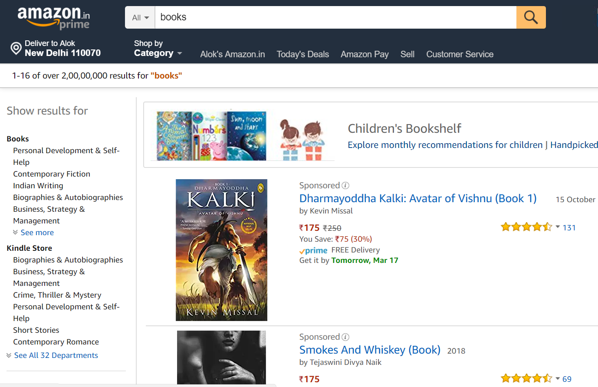
    
3.  Drag and drop a **`Flowchart`** activity on the Designer panel. Now,
    click on the **`Data Scraping`** icon. A window will pop up.
4.  Click on the **`Next`** button.
5.  You have to indicate the first book\'s entities. Entities can be
    name, price, author, and so on. It is your choice.
6.  Lets\'s, indicate the book\'s name. After that, it will ask for the
    next book\'s entities. Indicate the second book entity as well.
    Click on**`Next`**.

7.  This means you have to indicate the second book\'s entities:
    however, the entities will be the same. If you choose name as the
    first book\'s entity then you have to be specific and choose name as
    the second book\'s entity. You should not choose name as the first
    book\'s entity and then choose price as the second book\'s entity.
8.  Again, a window will pop up asking you to configure the columns. You
    can also extract the URL. If you want to do this, check the
    **`Extract URL`** checkbox.

9.  You can specify the column name as well. Click on the **`Next`**
    button.
10. As you can see, all the book names are extracted to a window. If you
    want to extract more columns or more entities, then click on
    **`Extract Correlated Data`** and you have to again indicate another
    entity of the book to extract more columns, as we have done
    previously. After that, all the data will be extracted and will be
    added to this table. Here, we have one column but if you extract
    more entities, then more columns will be added to this table:
    
    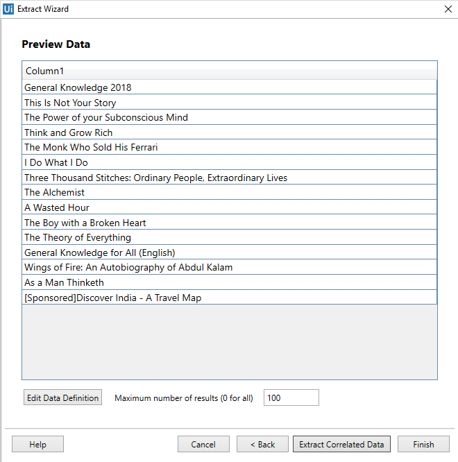
    

11. Click on the **`Finish`** button. If the results of your query span
    multiple pages, it will ask you to indicate the page navigation link
    on the website (Next button of the website that we used to navigate
    to another/next page). If the results of your query span multiple
    pages, click on the **`Yes`** button and indicate the link,
    otherwise click on the **`No`** button.
12. We have clicked on the **`No`**button. A datascrapingsequence is generated in our **`Flowchart`**.

It will also generate a data table. You can retrieve the information
from the data table.

### Citrix

When dealing with the Remote Desktop connection, methods such as Basic
Recording and Desktop Recording cannot be used. In an RDP environment,
images will be sent from one desktop to another, and will be
mapped by analyzing the position of the
pointer of the mouse button. Hence, basic and desktop
recording cannot be used, as these recording
techniques fail to interact with the images. In a Citrix environment, we
have the ****`Click Text`****
and****` `********`Click Image`**** activities,
using which we can work with images with ease.

You can clearly see the activities that are
listed in a Citrix Recording:

1.  Click Image
2.  Click Text
3.  Type
4.  Select & Copy
5.  Screen Scraping
6.  Element
7.  Text
8.  Image

All these activities are used extensively in a Citrix environment.

You can use these activities as you have used Basic Recording or Desktop
Recording: the only difference is that you have to indicate a point on
the screen, or you have to indicate an anchor element as you have used
in previous sections.

Screen Scraping
---------------------------------

Screen Scraping is a method of extracting
data from documents, websites, and PDFs. It is a very powerful method
for extracting text. We can extract text using the Screen Scraper
wizard. The Screen Scraper wizard has three scraping methods:

-   Full Text
-   Native
-   OCR

We shall elaborate on each of these methods one by one. One should have
a clear understanding of these methods in order to know when to use
which method. There will be situations when we have to choose the best
method for our needs:

-   **Full text**: The Full text activity is used to
    extract information from various types of
    documents and websites. It has a 100% accuracy rate. It is the
    fastest method among all three methods. It even works in the
    background. It is also capable of extracting hidden text. However,
    it is not suitable for Citrix environments.
-   **Native**: This is similar to
    the Full text method but has some differences. It has a slower speed
    than the Full text method. It has a 100% accuracy rate, like the
    Full text method. It does not work in the background. It has an
    advantage over the Full text method in that it is also capable of
    extracting the text\'s position. It cannot extract hidden text. It
    also does not work with a Citrix environment.
-   **OCR**: This method is used when the previous two methods fail to extract information. It
    uses the two OCR engines: Microsoft OCR and Google OCR. It has also
    a scale property: you can
    choose the scale level as per your need.
    Changing the scale property will give the best results:

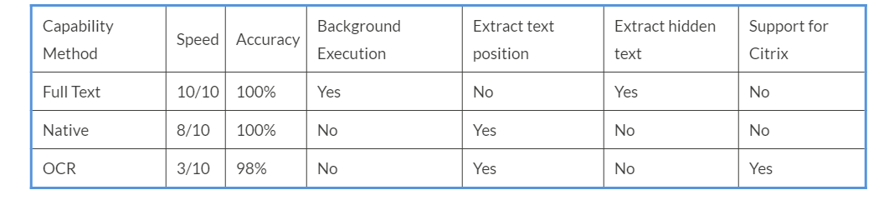

Let us consider an example of extracting text
from the UiPath website\'s main page:

1.  Create a **`Blank`** project and give it a meaningful name.
2.  Log on to the UiPath website by logging
    in to <https://www.uipath.com/> in your browser.
3.  Drag and drop a **`Flowchart`** activity on the Designer panel.
    Click on the **`Screen Scraping`** icon and locate the area from
    which you want to extract the information. Just choose an area on
    the UiPath website. A window will pop up stating that the
    **`AUTOMATIC method failed to scrape this UI Element`**.

By default, the **`Screen Scraper Wizard`** chooses the best scraping
method to extract data, but it failed to do so in our case:

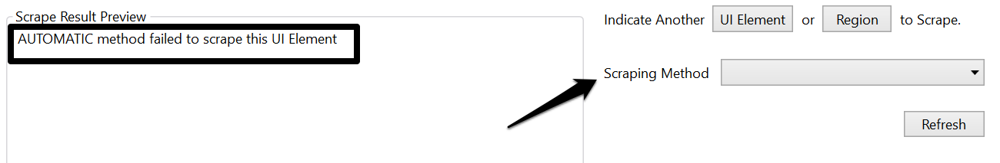

4.  Try choosing another method. We shall choose the Full text method.
    This too will fail. Next, choose the Native method. This will also
    fail, as you can see in the following screenshot:

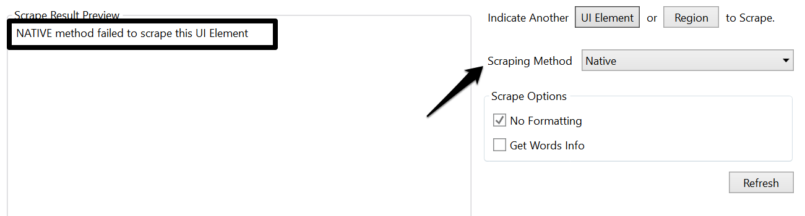

5.  This time, choose the OCR Scraping method. You can
    clearly see the extracted text:

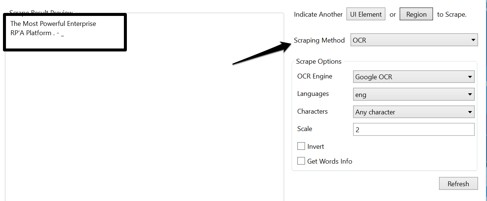

When to use OCR
---------------------------------

There are some scenarios where normal
activities such as **`Get Text`** and**` ``Click Text`** activities fail
to extract the text or perform an action. This is when OCR comes in,
giving us the flexibility to perform actions when existing activities
fail to do their job.

OCR stands for Optical Character Recognition. It is a text recognition
technique that transforms printed documents that are scanned into
electronic formats.

OCR is used mainly for images, scanned
documents, PDFs, and so on, to extract information or perform actions.
Extracting information or data from images, scanned documents, or PDFs
is a very tedious job. Normal activities are not recommended for
extracting these types of inputs. OCR uses a different
method and approach to extract the
information.

There are two OCRs available in UiPath
Studio:

1.  Microsoft OCR
2.  Google OCR

Microsoft\'s OCR is known as MODI, and Google\'s OCR is
called Tesseract. OCR is not
limited to only these two types of OCR. You
are free to use another type of OCR.

Let\'s see an example of when we should use
OCR.

Consider we are going to extract some text from a Word document by using
the **`Get Text`** activity:

1.  Create a **`Blank`** project and give it a meaningful name.
2.  Drag and drop a **`Flowchart`** activity on the Designer panel.
    Also, drag and drop a **`Get Text`** activity inside the Designer
    panel. Now right-click on the **`Get Text`** activity and choose
    **`Set as Start Node`**.
3.  Double-click on the ****`Get Text`**** activity. Click on
    **`Indicate on screen`**. Now indicate the text from which you want
    to extract information. You have to supply the output value for
    receiving the text from the **`Get text`** activity. Create a
    **`GenericValue`** type of variable and specify the variable name
    `str`.
4.  Drag and drop a **`Message box`** activity. Connect it to the
    **`Get Text`** activity. Double-click on the **`Message box`**
    activity and specify the variable\'s name (str) that you created
    earlier:

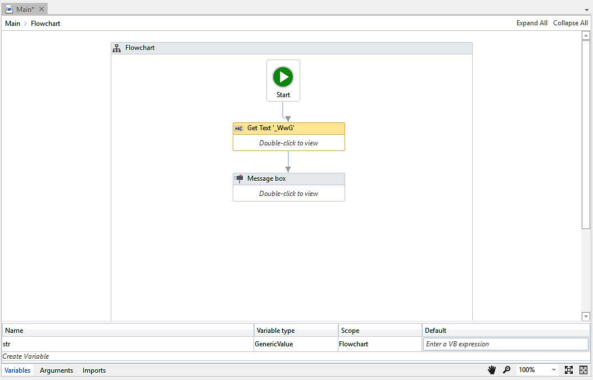

Hit the **`Run`** button to see the result. You can clearly see in this
example that using the **`Get Text`** activity does not extract, text
properly.

This is where OCR enters the picture. In the next section, we will see
the extraction of text using OCR.

Types of OCR available
----------------------------------------

There are two OCRs available in our UiPath
Studio:

1.  Microsoft OCR
2.  Google OCR

However, we are free to import other OCR
engines into our project.

Both the Microsoft and Google OCR engines
have their own advantages and disadvantages. The advantages of Google
OCR include the following:

-   Multiple language support can be added in Google OCR
-   Suitable for extracting the text from a small area
-   It has full support for color inversion
-   It can filter only allowed characters

The advantages of Microsoft OCR include the
following:

-   Multiple languages are supported by default
-   It is suitable for extracting text from a large area

**OCR** is not 100% accurate. It is useful for extracting
text that other methods cannot successfully do. It works with all
applications, including Citrix.

Microsoft and Google\'s OCRs are not the optimum for every situation.
Sometimes, we have to look for more advanced OCRs to recognize more
sophisticated text, such as handwritten documents and so on.

There is another OCR available in UiPath Studio, known as the Abbyy OCR
Engine. You can find this OCR engine in the **`Activities`** panel by
searching for `OCR`.

If you cannot find this OCR listed in the **`Activities`** panel, you
need to install the `UiPath.Core.Activities` package:

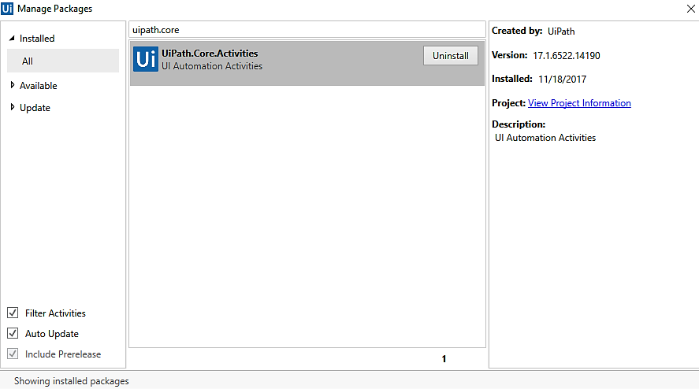

               

**Note:**

In the previous screenshot, the package has already been installed,
which is why there is an **`Uninstall`** button on the right-hand side
of `UiPath.Core.Activities`.

How to use OCR
--------------------------------

In this section, we are going to see how we can use OCR. Suppose we have
an image and we have to extract the text in it. In such a scenario, OCR
becomes very handy.

In the following example, we are going to use a random Google image with
some text in it, as follows:

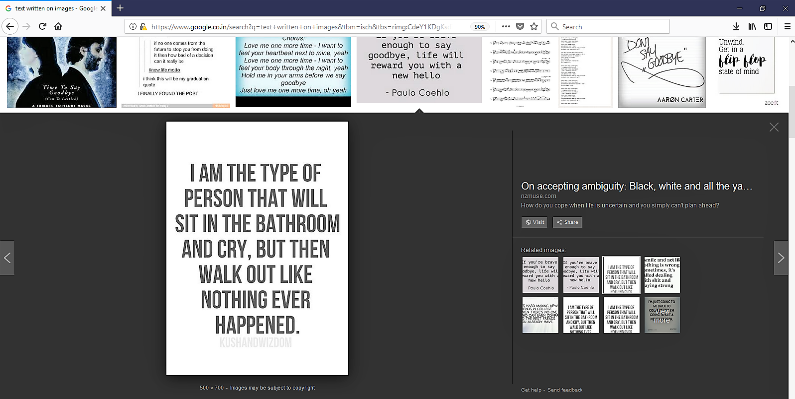

To extract text from the previous image, perform the following steps:

1.  Open UiPath Studio and click on a **`Blank`** project. Give it a
    meaningful name. On the Designer panel, drag and drop a
    **`Flowchart`** activity.
2.  Next, drag and drop a **`Get OCR Text`** activity from the
    **`Activities`** panel and set it as the start node. Double-click on
    it and click on the **`Indicate on screen`** option. Choose the
    specific area from which you want to extract the text from the
    image. In our case, we are using an image that we have searched for
    on Google.

 

3.  Now, click on the **`Text`** property of the **`Get OCR Text`**
    activity. A window will pop up as shown in the following screenshot.
    Right-click inside the window and choose **`Create Variable`**. Give
    it a meaningful name, press [*Enter*], and click on the
    **`OK`** button. A variable will be created with that name:

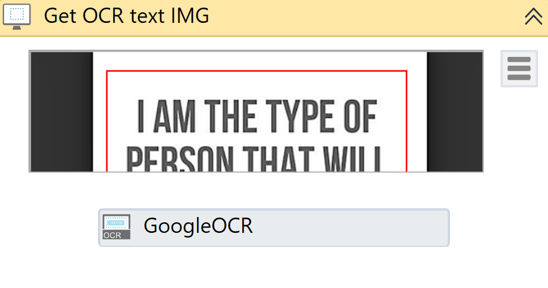

            

4.  Drag and drop the **`Message box`** activity. Connect it to the Get
    OCR with text activity. Double-click on the **`Message box`**
    activity and specify the variable name that you have created
    earlier in the expression box. (In our
    case, it is the `result` variable).

Press [*F5*] to see the result.

**Note:**

Try to change the scale property of the OCR engine. It will give you
better results in some cases.

Avoiding typical failure points
-------------------------------------------------

There are many scenarios where the normal
implementation would fail. We are going to discuss these failure points
and will see how to tackle them.

In this section, we will work with the following entities to tackle
failure points:

-   Selectors
-   Scope of the variable
-   Delay
-   Element Exists
-   `Try` / `Catch`
-   `toString` method

###  Selectors

Sometimes, it is tedious to deal with selectors while working with them. This is because a selector has
attributes, title, and class properties. When we select a UI element
using the selector, it stores all these properties. Different instances
of an application may have different properties of a UI element.

The problem with selectors is when you select
a UI element, it captures its properties. These properties will differ
when we select the UI element of a different instance of an application
with the selector. Hence, the property will differ and the selector will
fail to recognize the same UI element of another instance of the
application.

We can easily fix this problem by using wildcard characters or by
attaching it to a live element. Two wildcard characters are available
with UiPath:

1.  The question mark symbol, `?`, which replaces one
    character
2.  The asterisk symbol, that is, `*`, which replaces a number
    of characters

We have to simply replace the variables (the name that changes
continuously) with wildcard characters.

We can also use the **`Attach to live element`** option from the
selector property window and indicate the element again. It
automatically detects the variable properties and fixes them for us.

###  Scope of the variable

Sometimes we create a variable inside a
Sequence or Do activity. In doing so, the scope of the variable is
limited to only that activity.

When we try to access a variable from outside
its scope, it cannot be accessed. We have to change the scope of the
variable.

###  Delay activity

In some situations, we have to wait for a particular action. For example, when opening the Outlook application,
it needs to connect to the server (for synchronization). When it is
opened, it takes some time (the UI element is not stable at this stage).

In the meantime, the robot\'s activity is waiting for the UI element to be stable so that it can perform the
action. After waiting for some time, if the UI element is not stable, it
results in an error because the activity cannot find the UI element.
Thus, we have to add a Delay activity to ensure that the UI element is
stable for action. Specify the time for the delay in the expression text
box of the Delay activity. This activity will delay the process for the
specified period of time.

###  Element Exists

This activity is used to ensure that the
required Element Exists. It is used to ensure
that the element we are looking for exists in this context.

This is a good way of checking whether the activity exists or not.

### Try/Catch 

This is an exception handling
mechanism used to tackle exceptions.

Put all suspicious activities inside the `Try` block. If an
error occurs, it can be detected by the `Catch` block.

### toString

Sometimes, we forget to use
the `toString` method with  variables and we end up with an error.

For example, when outputting an integer variable inside the
**`Message box`**, we have to apply the `toString` method.

Summary
-------------------------

In this lab, we learned about the various types of controls
available in UiPath, including types of mouse and keyboard activities.
We also revisited the Recording feature of UiPath Studio, this time
learning more advanced features. UiExplorer is another topic we forayed
into, which is basically used to customize the selector. Furthermore, we
learned about OCR, its types, and its uses. Finally, we dealt with the
extraction of data using Screen Scraping.
