Lab 6: Control Flow
====================

#### Lab Solutions
Lab solution(s) are present in `Solution\Lab06` folder.

The Delay Activity
==================

The [**Delay**] activity
enables you to pause the automation for a custom period of time (in the
hh:mm:ss format). This activity proves itself quite useful in projects
that require good timing, such as waiting for a specific application to
start or waiting for some information to be processed so that you can
use it in another activity.

##### Example of Using the Delay Activity

To exemplify how you can best use the **Delay** activity, let's create
an automation that writes two messages to the **Output** panel, with a
delay of 20 seconds between them.

1.  Create a new flowchart.
2.  Add a [**Write Line**] activity and
    connect it to the **Start** node.
3.  Select the activity, and in the **Text** field, type "This is the
    start time."
4.  Add a **Delay** activity and connect it to the previously added
    activity.
5.  Select the activity, and in the **Properties** panel, in the
    **Duration** field, type 00:00:20. This is the 20 seconds delay that
    is going to be between the two logged messages.
6.  Add another **Write Line** activity and connect it to the previously
    added activity.
7.  In the **Text** field, type "Message delayed by 20 seconds.".\
     The final project should look as in the following screenshot.

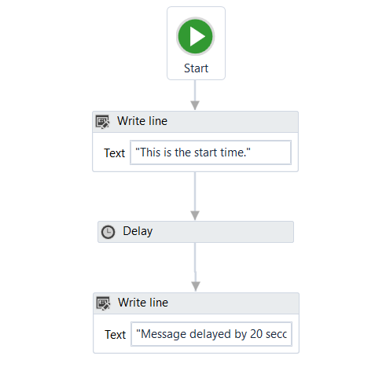

8.  Press F5. The automation is executed. Note that, in the **Output**
    panel, the two messages added in the **Write Line** activities are
    written twenty seconds apart.

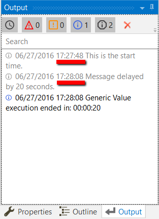

The Do While Activity
=====================

The [**Do While**] activity
enables you to execute a specified part of your automation while a
condition is met. When the specified condition is no longer met, the
project exits the loop.

This type of activity can be useful to step through all the elements of
an array, or execute a particular activity multiple times. You can
increment counters to browse through array indices or step through a
list of items.

> Note:
>
> **Do While** activities are evaluated only after the body has been
> executed once.

##### Example of Using a Do While Activity

To exemplify how to use a **Do While** activity, let’s create an
automation that increments an integer variable from 0 to 10, and
displays a message every time it is incremented.

1.  Create a new sequence.
2.  Create an integer variable, 
    Counter, with a default value of 0.
3.  Add a **Do While** activity to the **Designer** panel.
4.  In the **Body** section, add an
    [**Assign**] activity.
5.  Select the **Assign** activity, and in the **Properties** panel, in
    the **To** field, add the 
    Counter variable.
6.  In the **Value** field, type 
    Counter + 1. This helps you increment the value of the variable with
    one.
7.  Add a [**Write Line**] activity,
    under the **Assign** one.
8.  In the **Text** field, type "The counter is " + 
    Counter.ToString. This writes the value of the counter in the
    **Output** panel each time it is incremented.
9.  In the **Condition** section of the **Do While** activity, type
    Counter \< 10. The body of the **Do While** activity is repeated
    until the value of the 
    Counter variable is bigger than 10.\
     The project should look as in the following screenshot.

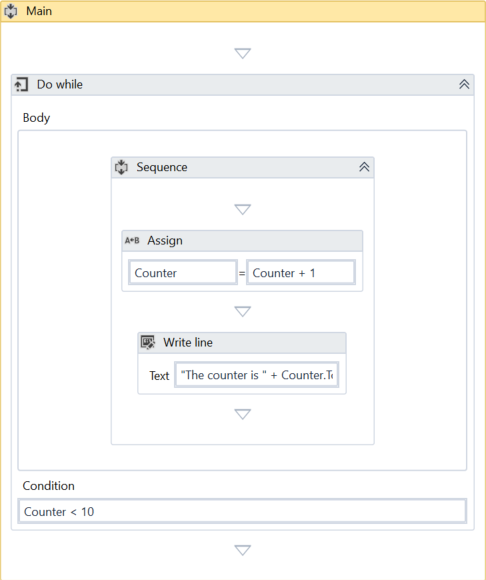

10. Press F5. The automation is executed. Note that the **Output** panel
    displays the message indicated in the **Write Line** activity.

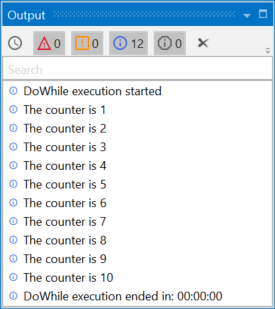

The If Activity
===============

The [**If**] activity contains a
statement and two conditions. The first condition (the activity in the
**Then** section) is executed if the statement is true, while the second
one (the activity in the optional **Else** section) is executed if the
statement is false.

**If** activities can be useful to make decisions based on the value of
variables.

> Note:
>
> The **If** activity is almost identical to the [**Flow
> Decision**] one.
> However, the latter can only be used in flowcharts.

##### Example of Using an If Activity

To exemplify how you can use the **If** activity, let’s create an
automation that asks the user for two numbers, checks to see if one is
divisible by the other, and depending on the result, displays a
different message in the **Output** panel.

1.  Create a new sequence.
2.  Create two integer variables, 
    FirstNumber and 
    SecondNumber for example.
3.  Add two [**Input
    Dialog**]
    activities to the **Designer** panel.
4.  In the **Properties** panel, type labels and titles for both
    activities and, in the **Result** fields, add the
    FirstNumber and 
    SecondNumber variables.
5.  Add an **If** activity to the **Designer** panel, under the
    previously added **Input Dialog** ones.
6.  In the **Condition** section, type 
    FirstNumber mod 
    SecondNumber = 0. This expression checks if the first number is
    divisible to the second one, using the
    [mod](https://msdn.microsoft.com/en-us/library/se0w9esz.aspx)
    operator.
7.  In the **Then** section, add a [**Write Line**] activity.
8.  In the **Text** field, type 
    FirstNumber.ToString + " is divisible by "+ 
    SecondNumber.ToString + ".". This is the message that is displayed
    if the first number is divisible by the second one.
9.  Click **Show Else** to display the Else section, and then add
    another **Write Line** activity in the **Else** section.
10. In the **Text** field, type 
    FirstNumber.ToString + " is NOT divisible by "+ 
    SecondNumber.ToString + ".". This is the message that is displayed
    if the first number is not divisible with the second one.

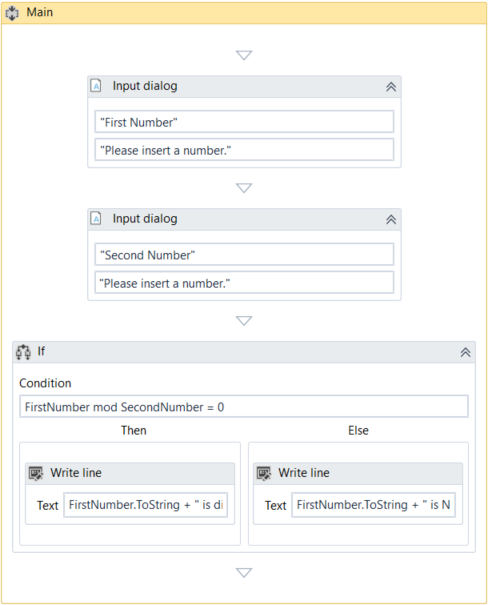

11. Press F5. The automation is executed.
12. Add numbers when prompted. Note that the **Output** panel displays
    the result, depending on the values added in the **Input Dialog**
    windows.

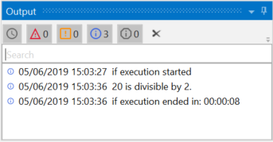
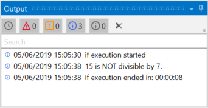

The Switch Activity
===================

The [**Switch**] activity
enables you to select one choice out of multiple, based on the value of
a specified expression.

By default, the **Switch** activity uses the integer argument, but you
can change it from the **Properties** panel, from the **TypeArgument**
list.

The **Switch** activity can be useful to categorize data according to a
custom number of cases. For example, you can use it to store data into
multiple spreadsheets or sort through names of employees.

##### Example of Using a Switch Activity

To exemplify how to use the **Switch** activity, we are going to create
an automation that asks the user for a number, checks if is odd or even,
and depending on that, a different message is written to the **Output**
panel.

Since all odd numbers divided by two have a remainder equal to 1, this
project needs only two cases (0 and 1) , yet keep in mind that this
activity supports multiple cases.

1.  Create a new sequence.
2.  Create an integer variable, 
    Number.
3.  Add an [**Input
    Dialog**] activity
    to the **Designer** panel.
4.  Add a **Title** and **Label** to prompt the user for a number.
5.  In the **Result** field, add the 
    Number variable.
6.  Add a **Switch** activity, under the **Input Dialog**.
7.  In the **Expression** field, type 
    Number mod 2. This verifies if the user’s number is divisible by 2.
8.  In the **Default** section, add a [**Write Line**] activity.
9.  In the **Text** field, type 
    Number.ToString + " is an even number.".
10. Click the **Add new case** line, and in the **Case Value** field,
    type 1.
11. Add a **Write Line** activity to this case.
12. In the **Text** activity, type 
    Number.ToString + " is an odd number.".

The final project should look as in the following screenshot.

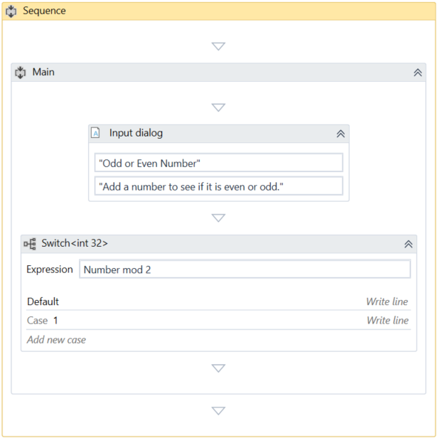

13. Press F5. The automation is executed. Note that the **Output** panel
    displays the data correctly.

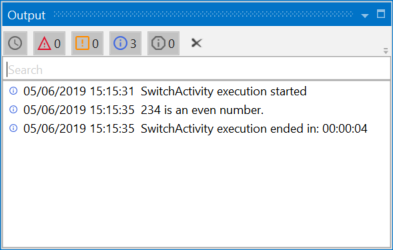
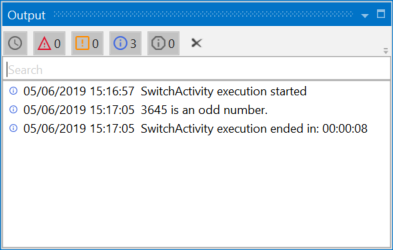

The While Activity
==================

The [**While**] activity
enables you to execute a specific process repeatedly, while a specific
condition is met. The main difference between this and the [**Do
While**] activity is that,
in the first one, the condition is evaluated before the body of the loop
is executed.

This type of activity can be useful to step through all the elements of
an array, or execute a particular activity multiple times. You can
increment counters to browse through array indices or step through a
list of items.

##### Example of Using a While Activity

To exemplify how to use a **While** activity, let’s create an automation
that increments an integer variable from 10 to 100, and writes all the
numbers to a Microsoft Word document.

1.  Create a new sequence.
2.  Create an integer variable, 
    Counter, with the default value of 10.
3.  Add a **While** activity to **Designer** panel.
4.  In the **Condition** field, type 
    Counter \< 100. This means that the body of the loop is going to be
    repeated until the value of the 
    Counter variable is going to be bigger than 100.
5.  In the **Body** section of the **While** activity, add an
    [**Assign**] activity.
6.  In the **Properties** panel, in the **To** field add the
    
    Counter.
7.  In the **Value** field, type 
    Counter + 1. This increments the value of the 
    Counter with one.
8.  Add an [**Append Text**]
    activity under the **Assign** one.

> Note:
>
> This activity is part of the Word activities package. If you do not
> have it, use the [package manager
> functionality](https://docs.uipath.com/studio/docs/managing-activities-packages#section-managing-packages)
> to install it.

9.  In the **FilePath** field, type the path of a Word document in
    between quotation marks.

> Note:
>
> Make sure that the Word document is not used when running the
> automation, otherwise a message error is displayed and the execution
> is stopped.

10. In the **Text** field, type "The counter is now " +
    Counter.ToString +".".\
     The final project should look as in the following screenshot.

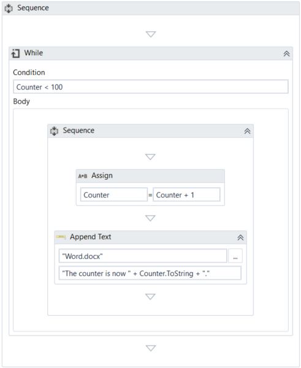

11. Press F5. The automation is executed.
12. Double-click the Word document specified at step 9. Note that all
    the numbers between 10 and 100 are written, as expected.

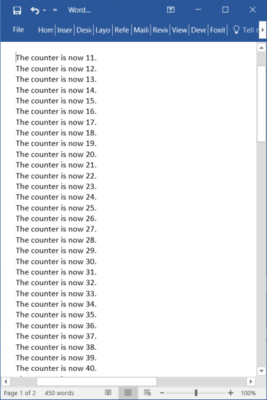

The For Each Activity
=====================

The [**For Each**] activity
enables you to step through arrays, lists, data tables or other types of
collections, so that you can iterate through the data and process each
piece of information individually.

##### Example of Using a For Each Activity

To exemplify how to use a **For Each** activity, let’s create an
automation that goes through each element of an array of integers and
writes the length of the array and each element to the **Output** panel.

1.  Create a new sequence.
2.  Create an array of integer variables, 
    FibonacciNumbers.
3.  In the **Default** field, type the Fibonacci sequence up to a
    desired value, such as {1, 1, 2, 3, 5, 8, 13, 21, 34, 55, 89}.
4.  Add a **For Each** activity in the **Designer** panel.
5.  Do not make any changes to the **Foreach** field.
6.  In the **In** field, add the 
    FibonacciNumbers variable. This activity looks at each individual
    item in the provided variable.
7.  In the **Body** section of the **For Each** activity, add a [**Write Line**] activity.
8.  In the **Text** field, type "The length of this Fibonacci sequence
    is " + FibonacciNumbers.Length.ToString + " and contains the " + item.ToString + " element.". 
    This expression enables you to write
    the total number of array elements and each element of the array in
    the **Output** panel.

The final project should look as in the following screenshot.

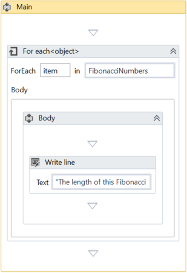

9.  Press F5. The automation is executed. Note that the **Output** panel
    displays the correct message for each element of the array.

> Note:
>
> The **Length** property enables you to find out the total number of
> array elements.

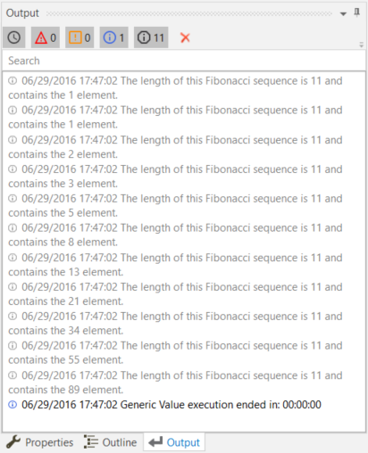

The Break Activity
==================

The [**Break**] activity
enables you to stop the loop at a chosen point, and then continues with
the next activity.

> Note:
>
> The **Break** activity can only be used within one of the following
> activities: For Each, While or Do While.

##### Example of Using a Break Activity

To exemplify how to use the **Break** activity we are going to build
upon the project created for [**The For Each Activity**].
This new project writes only the first iteration of the loop and a few
elements of the array to the **Output** panel.

1.  In the **Body** of the **For Each** activity, under the [**Write Line**], add a
    **Break** activity.
2.  Under the **For Each**, add a new **Write Line** activity.
3.  In the **Text** field, type `FibonacciNumbers(0).ToString` + " " + `FibonacciNumbers(2).ToString` + " " + `FibonacciNumbers(4).ToString` + " " + `FibonacciNumbers(6).ToString` + " " + `FibonacciNumbers(8).ToString` + " " + `FibonacciNumbers(10).ToString` + " ". This means that only the indicated elements of the array are going to be written to the Output panel.
The final project should look as in the following screenshot.

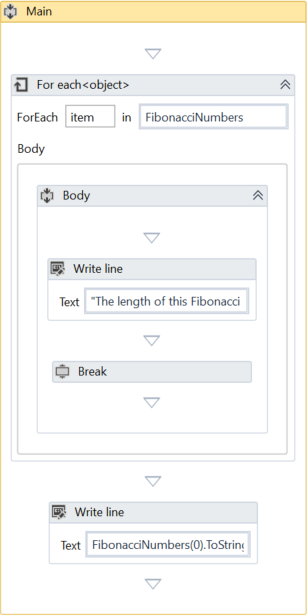

4.  Press F5. The automation is executed. Note that the **Output** panel
    only displays the first iteration of the loop and the specified
    array elements from the **Write Line** activity.

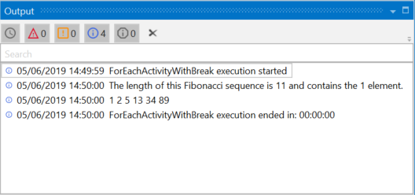

