Lab 6. Tame that Application with Plugins and Extensions
---------------------------------------------------------------------


So far, you have learned how to record steps to automate and also learn
about control flow, and the use of variables and data tables. The most
important part was understanding and mastering controls. Unless you are
able to identify controls of an application properly, it is not possible
to successfully automate a process. Now, in this lab, we will step
up to learn how to use external plugins and extensions. UiPath has many
plugins and extensions to ease UI automation, apart from basic
extraction and interaction with the desktop screen. These plugins allow
us to directly interact with those applications or ease UI automation.
Some of the important sections that are going to be covered in this
lab are:


-   Terminal plugin
-   SAP Automation
-   Java plugin
-   Citrix Automation
-   Mail plugin
-   PDF plugin
-   Web integration
-   Excel and Word plugins
-   Credentials management
-   Extensions: Java, Chrome, Firefox, and Silverlight


Terminal plugin
---------------------------------


The Terminal plugin is used to execute
commands in textual format (generally a black window). It works faster
than the **Graphical User Interface** (**GUI**)
methodology. It also has a broader scope in
terms of authority and permissions.

In UiPath Studio, there is a NuGet Package called
`UiPath.Terminal.Activities`. Terminal activity is
pre-installed in UiPath Studio. In case it is not installed, we have to
install it manually.  To check whether the Terminal activity is
installed or not, simply search for `Terminal` in the
**`Activities`** panel. It will list all the terminal activities. If no
activities are listed in the **`Activities`** panel, you have to install
the `UiPath.Terminal.Activities` package.

To install Terminal activity NuGet Package, click on
the ****`Manage Package`**** icon, as shown in the following
screenshot:


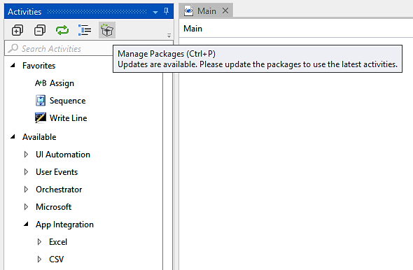


**`The Manage Packages`** window will appear.
Search for `terminal` in the search bar. As shown in the
following screenshot, there is an **`Uninstall`** button next to
**`UiPath.Terminal.Activities`**. This is because the **`Terminal`**
activity is already installed in UiPath Studio. If it is not installed,
an **`Install`** button will appear next to the
**`UiPath.Terminal.Activities`**:


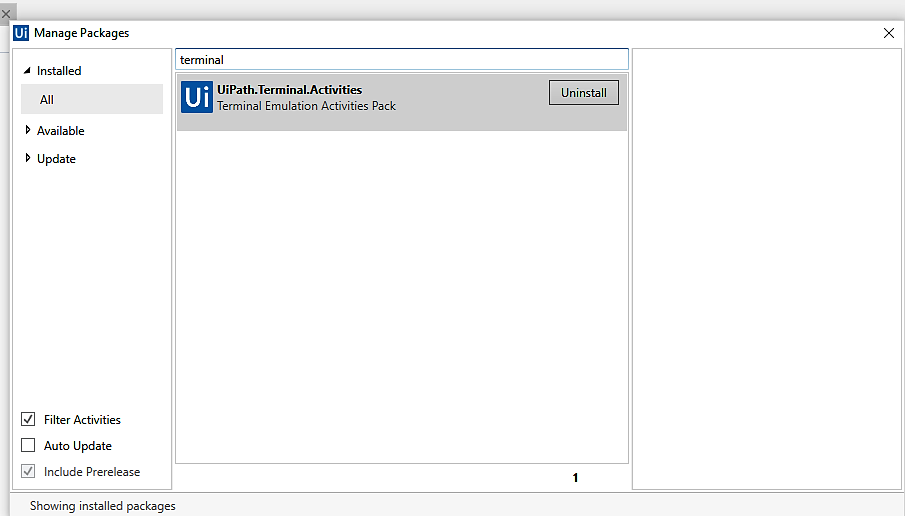


SAP automation
--------------------------------


Whether in software or in the form of mechanical Robots, automation is
everywhere. Businesses have not only the latest information but the most
accurate too. In today\'s market, if businesses cannot be kept up to
date then they will suffer.

SAP automation with UiPath is integrated with the latest techniques that are more suitable for organizations. Today,
SAP automation is becoming the buzzword in the IT industry. These days,
error-prone databases and unfilled/partially filled documents are mostly
discarded.

With SAP automation from UiPath Studio, these can be easily avoided. It
automates tasks easily and makes organizations more productive.

Some of the advantages of UiPath\'s SAP Automation are listed as
follows:


1.  It is compatible with all the SAP automation techniques that are
    best suited to the organization.
2.  It is accurate (99.999 % of the time) and delivers the best results.
    It avoids typical errors that humans/employees would be likely to
    make.
3.  Human employees demand higher salary and consideration has to be
    given to (**full-time employees**) FTE too. SAP
    automation has a modular approach to FTE.
4.  It is scalable. Just set it up with hundreds of Robots and you do
    not have to monitor them. There is no need to constantly watch them.
    The Robots can work independently.


SAP Automation requires some steps with which you should be careful
while automating. There are some situations when the Click activity
fails to recognize the UI element. Click Text activity and Click Image
activity are used when Click activity does not work in some situations
while automating SAP.

There are some scenarios when we have to extract tabular data from SAP.
Iterating through the table is not easy. In such case use selectors to
recognize the table cell. You can implement a loop to iterate through
each table cell. Now, how will you know when your loop should stop
iterating the table cell? You can put your code inside a Try Catch
activity and when an exception occurs (exception occurs when the loop
encounters an empty table cell or when the end of the table has been
reached), it is caught by the Catch block. In this way, you will be able
to iterate through all the table cells.

While interacting with checkboxes and radio buttons, make use of Get
attribute activity to check whether they are checked or not. 

When dealing with elusive UI elements, for example, a small button to
the right of some text, you have to think in terms of human actions. How
would a human react to such steps?


### How SAP Automation affects data entry jobs


Data entry is a complex task. Employees have to work in a smart manner during the entire process, constantly
checking for errors. There are some tasks that employees/humans do well,
such as scanning a form for some information and extracting it. They can
categorize the documents properly. Tasks like these are considered to be
difficult for a system/computer. Of course, employees/humans can make
errors that no software ever would. UiPath takes the best of both
worlds---the benefits of automation and the benefits of mimicking
humans, making software Robots that can be trained to scan forms, copy
data, or notice a key being pressed. This also significantly reduces
errors in the programs (in comparison to human employees undertaking the
same tasks).

In addition to these processes, UiPath uses a method to ignore unrelated
information on a website, SAP software, or any other application, only
giving priority to the important ones.

It means that no matter how much your SAP application is difficult to
handle, UiPath handles every action with ease. It can scale with any
application on any platform.


### Examples where SAP automation is used commonly


Some examples in which SAP automation is used
are:


1.  Filling in a form from any application.
2.  Copying and pasting data between SAP and other applications.
3.  Comparing data fields on the screen.
4.  Updating the status of an entity in a system.
5.  Scraping data from any application/websites.


UiPath is simple to use. In fact, there is no need to know a programming
language or any scripting language. UiPath\'s Robots can be trained by
the visual programming interface. You can define a complex workflow for
your existing application and train your Robot. Once trained, Robots can
run independently at a lower cost. It is estimated that a software
Robot\'s work efficiency is equal to three employees. It saves a lot of
time and money.

UiPath Studio comes with built-in libraries and activities so that the
Robot can be trained and processes can be automated. It means that it
can copy and paste the entities from one application to the other so
that employees have more time to do complex logical work. It increases
productivity and efficiency.


Java plugin
-----------------------------


The Java plugin software is a component of
the **Java Runtime Environment** (**JRE**). The
JRE allows applets (software programs written
in the Java programming language) to run in various browsers.


### Why are we using the Java plugin with UiPath Studio?


Suppose we have to automate a Java application. We cannot use
pre-installed activities with the Java application as it will not
recognize them properly. Hence, in order to use activities with the Java application, we have to install the
Java plugin.

Follow these steps to install the Java plugin inside UiPath Studio:1.
Click on the **`SETUP`** wizard:


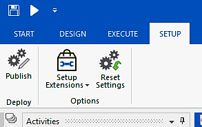


Next, click on Setup Extensions and choose Java:


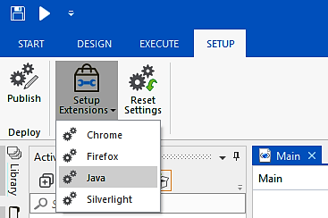


A confirmation window will pop up stating that the Java plugin has been
installed successfully.

To check whether the Java plugin is working properly, open UiExplorer,
click on any Java application, and select an element. If the entire
window is selected instead of that element, then your Java plugin has
not been installed successfully. On the other hand, if the element is
selected properly, then your Java plugin has been installed
successfully.


Citrix automation
-----------------------------------


We have previously dealt with common automations---automating desktop
applications or web applications. It is easy when we deal with these
applications having graphical user interfaces. UiPath identifies the
elements that we have clicked on and recognizes them. Thus, the next
time the Robot executes a process, it successfully identifies the same
element. We have already seen these types of action.

But what if we have a remote desktop connection and we
need to automate an application using this
remote desktop connection? It will be a tedious job.

Can we automate an application running on another machine while we are
accessing it remotely with the activities that we have used with simple
GUI? The answer is no.

Let\'s investigate why this is so. Suppose we have to automate a desktop
application so that the Robot does all the necessary actions on that
application. We can simply use the click, double-click, and other
activities to automate it. We cannot, however, use these activities when
establishing a connection with another system remotely. Why do normal
activities such as click and double click not work with a remote desktop
connection? The problem with a remote desktop connection is that it
sends the images of a system to another system. Recording activities
such as click or double click may not accurately capture the position of
that control inside the remote system.

You will get a better understanding with this example. Consider that
machine A has a screen whose resolution is 1366×768, while another
machine B has a screen whose resolution is 1024×768 resolution. Suppose
we are connecting machine A to machine B using a remote desktop
connection.

Now machine B with a resolution of 1024×768 is being accessed by machine
A. What actually happens is that the frontend image of the machine B
window is being sent to machine A. Hence, we cannot click on an image.

Since both machines have different resolutions, sending the coordinates
of an element to another machine is error-prone or difficult during the
remote desktop connection.

We have pointed out two problems when automating through the remote
desktop connection:


1.  We cannot click on an image
2.  Sending the coordinates of an element to another machine is
    error-prone


You will be wondering how we can overcome these two problems. Well,
UiPath Studio comes with an environment called Citrix. Using the Citrix
environment, it becomes very easy for us to automate an application when
accessing it remotely.

It has a lot of options so that clicking on an image or sending the
coordinates of an element become easy.

Some activities that Citrix supports are:


1.  Click Image
2.  Click text
3.  Type
4.  Send hotkey
5.  Select and Copy


6.  Screen Scraping and Scrape Data
7.  Copy text


To automate using the Citrix environment, we have to select the Citrix
Recording mode. In UiPath Studio, click on **`Recording`** and select
**`Citrix`**:


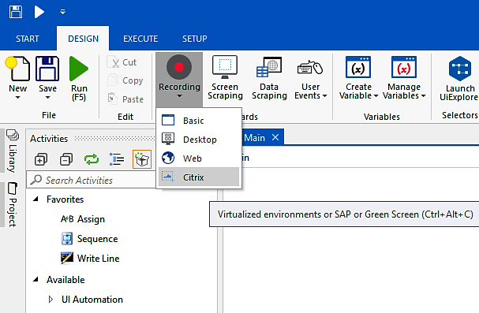


Now, you can use a variety of controls and activities that help in
automate applications remotely.


### How does the Citrix environment work?


Citrix gives us the flexibility to work
in **Remote Desktop Protocol** (**RDP**). It
captures the image and its position along
with its relative elements so that they can easily be identified on
another machine. No matter what the resolution of the screen, it can
recognize elements easily. Have a look:

(We are not going to use RDP here. This is an example just to
demonstrate the activity of Citrix).

Suppose we have to type into the Google search bar and click on the
**`Search`** button.

Click on the **`Recording`** icon at the top of UiPath Studio. Select
the **`Citrix`** option. A window will pop up. Now navigate to
**`Google`** and click on the **`Type`** activity from the pop-up menu:


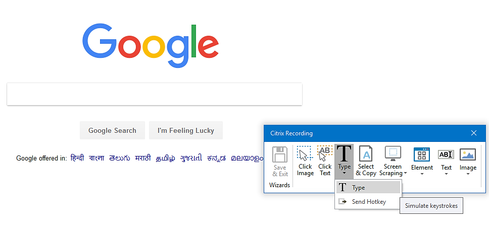


A pop-up window will be shown. Just type the text that you want to
search for. Also, check the **`Empty Field`** option. Press **`Enter`**:


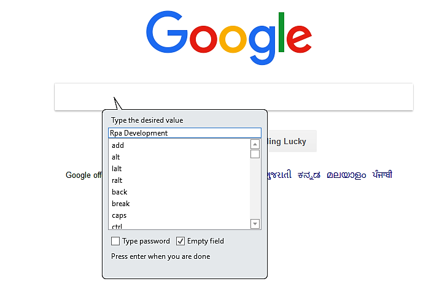


It will again show you a pop-up window. Now select
**`Click Image`** from the Citrix Recording
activity. You have to select the whole search area of the Google search
bar. This time, it will ask you to indicate a point on the screen. Just
point to the element that you have previously selected (in our case, it
was the search bar area):


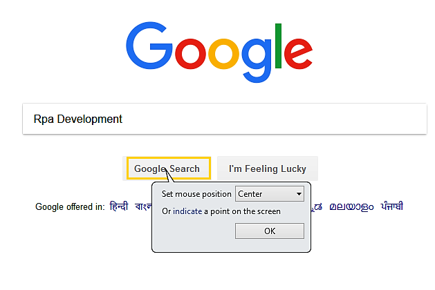


Click **`OK`**. Press **`Save & Exi``t`** and we are done. You can
clearly see that UiPath generated the sequence shown in the following
screenshot:


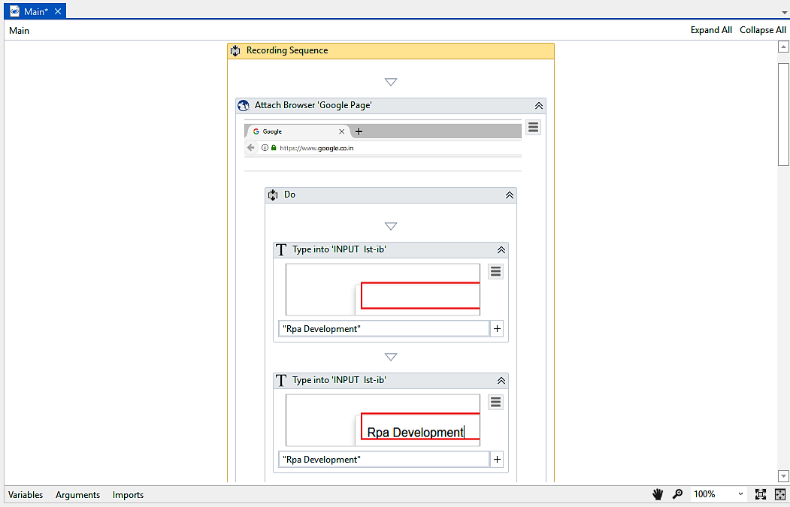


Press [*F5*] to see the result.


**Note:**

We have not used the **`Open browser`** activity. So, you have to log on
to Google.com before executing this program. If you do not want this,
then drag and drop the **`Open Browser`** activity before Recording
Sequence.


Mail plugin
-----------------------------


To use any Mail activities, you have to
install the Mail package. To check whether the Mail package is installed
or not, simply search for `Mail` in the **`Activities`**
panel. It will list all the mail activities. If the activities are not
listed in the **`Activities`** panel then you have to install
the `UiPath.Mail.Activities` package.

To install the Mail NuGet package, click on the **`Manage Package`**
icon at the top of the **`Activity`** panel. The **`Manage``Packages`**
window will appear. Search for `mail` in the search bar. As
shown in the following screenshot, there is an **`Uninstall`** button
next to **`UiPath.Mail.Activities`**. This is because the Mail activity is already installed in UiPath Studio. If
it is not installed, an **`Install`** button will appear next to the
**`UiPath.Mail.Activities`**:


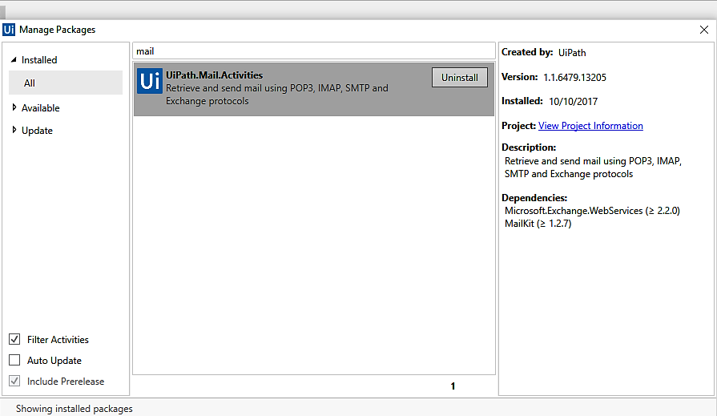


There are various mail activities that are used when working with UiPath
Studio:


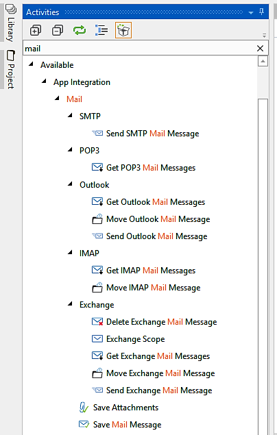


Some frequently used Mail activities are:


1.  **SMTP**: It is used to send
    mail messages:
    
    -   **Send SMTP Mail messages** activity: This activity
        is used to send a mail to another
        mail.
    


2.  **POP3**: Although this is not the preferred choice, it
    is still used to receive mail messages:
    
    -   **Get POP3 Mail Messages** activity: This activity is
        used to receive mail messages.
    


3.  **IMAP**: It is used to receive mail messages. It is a
    better option than POP3:
    
    -   **Get IMAP Mail Messages** activity: This activity is
        also used to receive the mail
        messages. It gives us the flexibility to manipulate mail
        messages and can be accessed remotely.
    


**Note:**

Once you get familiar with these, you can easily try the rest of the
activities.


PDF plugin
----------------------------


**PDF** stands for **Portable Document Format**
and it is used to keep the document platform
independent. Why do we use PDF?

Suppose we have a Microsoft Word 2007
application installed in our system and we make a `.doc` file.
This doc file can be opened on any system. Consider a system with
Microsoft Word 2017 installed on it. If we view that doc file in this
application, the format of the application is not going to be the same.
This is because both Microsoft applications have different sets of
architecture and specifications. Their format is not the same.

Here, PDF comes into action. It remains the same across all systems.
That is why all confidential documents are sent or received using PDF.
Also, if you do not want to change the behavior of the document across
different platforms, you should convert the document into the PDF
format.

To use any PDF activities, you have to install the PDF NuGet package. To
check whether the PDF package is installed or not simply search for
PDF activities in the **`Activity`** panel. It will list all PDF
activities. If PDF activities are listed in the **`Activities`** panel,
you have to install the `UiPath.PDF.Activities` package.

To install the PDF NuGet package, click on the **`Manage``Package`**
icon at the top of the **`Activities`** panel.

The ****`Manage Packages`**** window will appear. Search for
`PDF` in the search bar. As shown in the following screenshot,
there is an **`Uninstall`** button next to
**`UiPath.PDF.Activities`**. This is because PDF activity is already
installed in UiPath Studio. If it is not installed, an
**`Install`** button will appear next to **`UiPath.PDF.Activities`**:


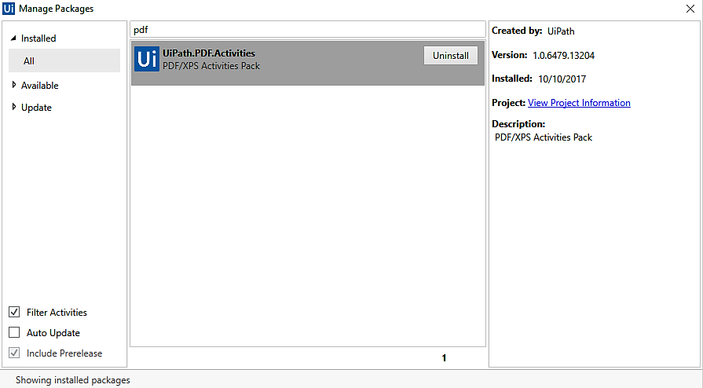


In our case, the PDF activity is already installed. That is why there is
an **`Uninstall`** button.

Some frequently used PDF activities are:


1.  **`Read PDF Text`**: It is used to read the text written on any PDF
    document. However, the **`Read PDF Text`** activity cannot guarantee
    extraction of the entire text.


OR

We can extract all the fields from the PDF file by using the Screen
Scraping activity. Start scraping the PDF file by clicking on the Screen
Scraping icon in the menu and simply locating the area in which we have
to extract the data. If the text extraction fails, then change the
extraction type to OCR with a scale of 3 and above. Choose either Google
or Microsoft OCR.


2.  **`Read PDF with OCR`**: It is used to read the image part of the
    PDF file. Suppose there is an image in the PDF file and there is
    some text written on it. The Read PDF text activity will fail to
    read that text. This is where OCR is used. There might be scenarios
    in which some text is written on a colorful background. Such cases
    can easily be tackled by using the **`Read Text With OCR`**
    activity.


If both **`Read PDF Text`** and **`Read PDF with OCR`** methods fail to
extract the text, we still have the Screen Scraping method to extract
the data from PDF (sometimes, we have to indicate the related element in
order to recognize the text):


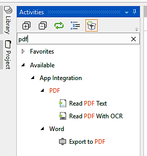


Select the proper method according to your needs and whatever is best
suited to your project.


Web integration
---------------------------------


Creating a web project, such as a company\'s website, B2B portal, or
e-commerce website, requires the involvement of a wide range of
technologies such as database design, networking, design, UX, user
accessibility, SEO, and project management. These technologies also
require HTML, CSS, JavaScript, JQuery, AJAX, system analysis and design,
testing, operation, and a number of other methodologies. All of these
activities can be classified under web integration.

Web integration, therefore, involves a wide process of connecting all these technologies and components that are
essential for completing the web project.

The following are the methodologies that are used extensively for
integrating with the web:


-   **Application Programming Interface** (**API**)
-   **Extensible Markup Language** (**XML**)
-   **Simple Object Access Protocol** (**SOAP**)
-   **JavaScript Object Notation** (**JSON**)
-   **Representational State Transfer** (**REST**)


1.  **API**: API integration is used quite frequently. It is
    impossible to find a modern web application or website that is not
    exposed to an API. API integration allows
    a software or web application to interact with other
    software or web applications in real
    time.


UiPath Studio works both ways: It can automatically extract data from
one application and pass it to a web service. Also, it can retrieve data
from a web service and input it to another application.

You have already explored and implemented how UiPath automates user
interfaces. API is the easiest way to connect two applications or
systems over the internet.


2.  **XML**:  XML is a markup
    language like **Hyper Text Markup Language**
    (**HTML**). XML was designed
    to store and transport data and also to be self-descriptive. We can
    say that it extends the functionality of HTML. It is a
    software-independent and hardware-independent
    technique for storing and transporting
    data, for example:


``` 
<Message><To>John</To>
   <From>Ava</From>
   <Subject>Reminder</Subject>
   < Message Body>Do not forget to meet me this weekend!</Message body></Message>
```


You can make any Parent-Node structure in XML.


3.  **SOAP**: SOAP is an XML-based messaging
    protocol for exchanging information
    between computers. You can say that SOAP
    is an application of XML.


The following are the advantages of SOAP:


-   
    -   SOAP is a communication protocol designed to communicate over
        the internet.
    -   SOAP can extend HTTP requests.
    -   SOAP can be used for broadcasting a message.
    -   SOAP is platform-independent.
    -   SOAP is language-independent.
    -   SOAP is the XML way of defining what information is sent and
        how.
    -   SOAP enables client applications to easily connect to remote
        services and invoke remote methods. SOAP can also be used in a
        variety of messaging systems.
    


4.  **JSON**: JSON is a method of
    lightweight data-interchange. It is self-describing and easy to
    understand. The most important part of JSON is that it is language independent.


When exchanging data between a browser and a server, the data can only
be text. JSON is text-based. We can convert any JavaScript object into
JSON, and send JSON to the server. Not only that; most languages have
their methods for converting their objects into JSON and vice-versa.

We can also convert any JSON received from the server into JavaScript
objects. In this way, we can work with the data as JavaScript objects,
without any parsing.


5.  **REST**: REST relies on a
    stateless, client-server, cacheable communication protocol. It is
    [*an architectural style*] for designing networked
    applications. The idea is that, rather than using complex techniques such as SOAP to connect between
    computers, a simple HTTP is used to make calls between machines.


The World Wide Web itself is based on HTTP and can be viewed as a
REST-based architecture. RESTful applications use HTTP requests to post,
read, and delete data. REST is lightweight. It is simple and
fully-featured. That said, there is basically nothing you can do in web
services that cannot be done with a REST architecture.


Excel and Word plugins
----------------------------------------


The most important plugins are Microsoft office plugins. In this
section, we will cover Excel and Word plugins.

In most projects, one of these two plugins is used. 


### Excel plugin


Excel is an application program developed by Microsoft. It is a part of
the Microsoft Office suite. Excel is capable of creating and
manipulating files that are saved with .xls
or .xlsx extensions. General uses of Excel include (an individual cell)
cell-based calculation. For example, with an Excel spreadsheet, you can
create a table, use formulae to compute every row and column, make your
own monthly expense list, and so on.

Unlike a word processor such as Microsoft Word, Excel documents consist
of rows and columns. Each column consists of a cell in which we can
store a value. The value can either be text, string, or number.

In UiPath Studio, there is a NuGet Package called
`UiPath.Excel.Activities`. The Excel activity is pre-installed
in UiPath Studio. In case it is not installed, it can be installed
manually.

To check if the Excel activity is installed
or not, simply search for `Excel` activities on the
**`Activities`** panel. It will list all Excel activities. If Excel
activities are not listed in the **`Activities`** panel, then you need
to install the **`UiPath.Excel.Activities`** package.

To install the Excel NuGet package, click on the
**`Manage Package`** icon located at the top of the **`Activities`**
panel.

A **`Manage Packages`** window will appear. Search for `Excel`
in the search bar. As shown in the following screenshot, there is an
**`Uninstall`** button next to **`UiPath.Excel.Activities`**. This is
because Excel activities are already installed in UiPath Studio. If it
is not installed, an **`Install`** button will appear next
to **`UiPath.Excel.Activities`**:


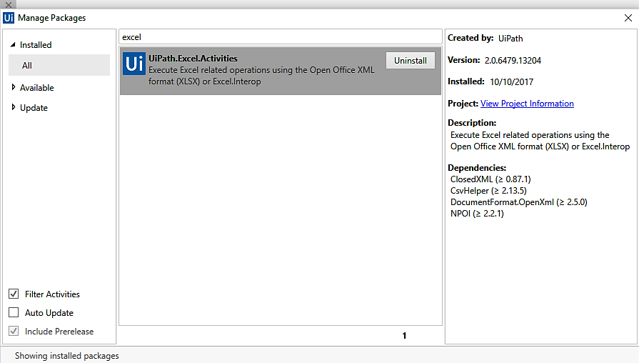


### Word plugin


Microsoft Word is often called simply Word or
MS Word. Microsoft Word is a widely used commercial word processor
designed by Microsoft. Microsoft Word is a component of the Microsoft
Office suite.

Microsoft Word is available for both Windows and Mac operating systems.

The following are the Microsoft Word features:


1.  It makes it possible for everything displayed on the screen to
    appear in the same way when printed or moved to another program.
2.  Microsoft Word has a built-in dictionary for spell checking.
3.  Text-level features such as bold, underline, italic, and strike.


 


4.  Page-level features such as paragraphing and justification.
5.  Microsoft Word is compatible with many other programs, the most
    common being the other members of the Office suite.


In UiPath Studio, there is a NuGet package called
**`UiPath.Word.Activities`**. Word activity is pre-installed in UiPath
Studio. In case it is not installed, we have to install it manually.

To check whether the Word activity is installed or not, simply search
for `Word` in the **`Activities`** panel and press
**`Enter`**. It will list all the Word
activities. If Word activities are not listed in the **`Activities`**
panel then you have to install the **`UiPath.Word.Activities`** package.

To install the Word NuGet package, click on the **`Manage``Package`**
icon. The **`Manage Packages `**window will appear. Search for
`Word`**` `**in the search bar. As shown in the following
screenshot, there is an **`Uninstall`** button next to
**`UiPath.Word.Activities`**. This is because Word activities are
already installed in UiPath Studio. If it is not installed, there will
be an **`Install`** button next to **`UiPath.Word.Activities`**:


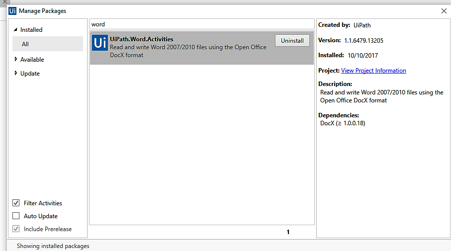


Credential management
---------------------------------------


In the Windows operating system, you can view
your network login credentials, that is, the username and password, by
using Credential Manager. With the help of UiPath Studio, you can
automate the process of creating, manipulating, and deleting credentials
using some credential activities:


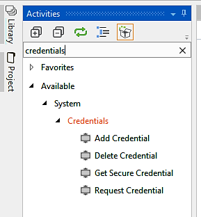


The following are credential activities:


1.  **Add Credential activity**: You can add a
    credential activity for use in your
    project. You just simply have to specify the username and the
    password.
2.  **Get Credential activity**: This activity is used to
    store the username and password for
    future use. It enables us to further check whether credentials are
    valid or not.
3.  **Request Credential activity**: This activity is used to
    display a dialog box to a user asking them about their credentials.
    It then stores the username and password
    in string variables that can be further used to log in to the
    applications.
4.  **Delete credential activity**: This activity is used to
    delete the credentials that we have
    stored.


Extensions -- Java, Chrome, Firefox, and Silverlight
----------------------------------------------------------------------


Extensions are small software programs that
can be used to modify and extend the functionality of any browser. You
can build your own extension by using web technologies such as HTML,
JavaScript, and CSS. Extensions have little or no user interface.

Java extensions are useful when you have to
automate a Java application. Without this
extension, UiPath Studio does not correctly identify the UI element of a
Java application.

Chrome and Firefox extensions are used when
you are working with the Chrome/Firefox browsers. By this, we mean that
while automating with UiPath Studio, if you are interacting with a
browser, you first have to install the extension for that browser.

Similarly, the Silverlight extension has to be installed if you want to
integrate your application using Microsoft\'s Silverlight.

Almost all extensions have a similar installation method. Once you get
familiar with the method, you can install the remaining of the
extensions on your own.

In UiPath Studio, you can find all the extensions in the
**`Setup Extensions`** menu. Click on the **`SETUP`** tab at the top of
the UiPath Studio window:


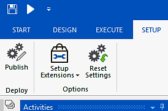


Now click on the **`Set Up Extensions`** icon and select the extension
that you want to select:


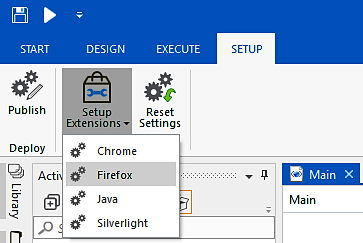


In this session, we are going to select the Firefox extension from the
drop-down list. Automatically, the Firefox browser is opened and asks
you to add UiPath. Just click on the **`Add`** button:


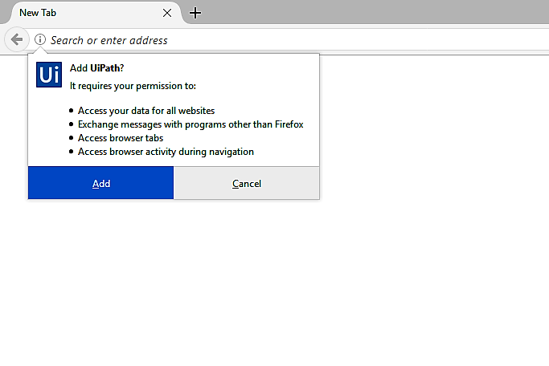


Your extension has been successfully installed. A dialog box will pop up
confirming this.

If you want to install other extensions, you just have to select the
desired extension from the drop-down list.


Summary
-------------------------


In this lab, you have learned about the role of plugins and how they
can increase the scope for automation. Over time, many new plugins will
be introduced, the inclusion of those plugins and extensions will be on
a similar line; however, the internal workings of those plugins may
vary. You have also learned that the Terminal plugin is different from
the PDF plugin. In this lab, Java, Chrome, Firefox, and Silverlight
extensions were also covered. You also learned about Mail, Web, and SAP
integrations. Credential management was a nice addition to this lab.

In the next lab, we will focus on assistant bots and event triggers.
