Lab 7. Handling User Events and Assistant Bots
-----------------------------------------------------------

In UiPath, there are two types of Robot that are used for automating any
process. One is the back office Robot, which works in the background. It
works independently, which means it does not require inputs from users
or any user interaction. The other one is the **Front Office
Robot**, which is also known as an **Assistant
Robot**.

This lab deals with front office bots.
Here, we will learn the different ways in
which events in the automation process can be triggered---by a simple
press of a key, click of the mouse, and so on. To make things clearer,
we will take examples of monitoring various events.

We will cover the following topics in this lab:

-   What are assistant bots?
-   Monitoring system event triggers
-   Monitoring image and element triggers
-   Launching assistant bots on a keyboard event

What are assistant bots?
------------------------------------------

Assistant Robots are front office Robots that require some user
interaction. In this case, the automation will run only when a certain
event or user action is triggered.

Trigger events are basically commands to tell the Robot to start its automation process.

For example, say I want some text to be typed into the Notepad
application. In particular, I want the Robot to type into the Notepad
once I click on the text area (clicking being the trigger activity in
this case) in the Notepad application.

Let us look at the following steps to understand more:

1.  **Drag and drop the Monitor events activity**: Here, we
    drag and drop a ****`Monitor events`** **activity from
    the **`Activities`** panel inside which the trigger events will
    work; otherwise it will show you an error. The **`Monitor events`**
    activity looks like this:

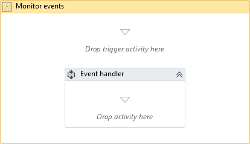

2.  **Drag and drop the trigger activity of choice**: In the
    drop trigger area, drag and drop the trigger activity that you want.

There are a lot of trigger activities shown in the **`Activities`**
panel. In this case, we will choose the
****`Click Trigger`**** activity:

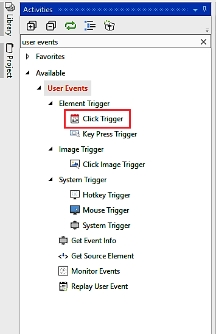

3.  **Create workflow inside the Monitor events activity**:
    Now inside the **`Event handler`** space in the
    ****`Monitor events`****activity, we have to create the
    workflow or the set of tasks we are required to do once the trigger
    activity works. In this case, we are using
    the****`Type into`****activity. Indicate the blank area
    of a Notepad window:

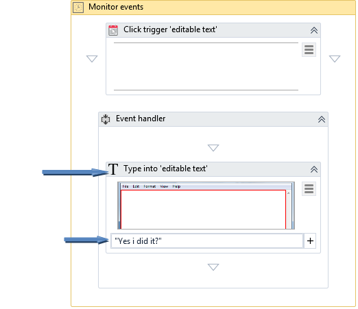

This was an overview of how assistant bots work.

Monitoring system event triggers
--------------------------------------------------

 There are three
system trigger events---**`Hotkey Trigger`**,
**`Mouse Trigger`**, and **`System Trigger`**:

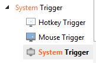

Though all three triggers are used for triggering activities, they are
used differently as explained in the following section.

### Hotkey trigger

Hotkey trigger works for shortcut keys. Suppose we want a certain workflow to work once the user presses the
[*Alt*] + [*F4*] keys or any other shortcut key.
In such a case, we will use the
**`Hotkey trigger`**:

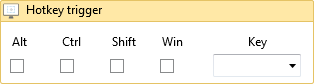

### Mouse trigger

This is used when we want to trigger events
on performing a mouse action (left-click, right-click, or middle-click)
as shown in the following screenshot:

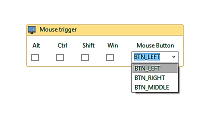

As shown in the screenshot, we can select the type of click with which
we want to trigger events. We can also use other special keys with mouse
actions as shown.

### System trigger

This is the last type of system trigger activity. A system trigger is
used to trigger events on mouse actions,
keyboard actions, or both, all of which we can select from the
**`Properties`** panel. We can also select the action to be performed,
that is, forwarding the event or blocking the event as shown in the
following screenshot:

Monitoring image and element triggers
-------------------------------------------------------

With an image trigger, the events will
occur once the user has clicked on a certain image that is indicated in
the **`Click Image Trigger`** activity.

By clicking on **`Indicate element on screen`**, we have to select an
image that will trigger the event when
clicked.

In the **`Element Trigger`**, there are two activities that come into
play. These are **`Click Trigger`** and **`Key Press``Trigger`** as
shown in the following screenshot:

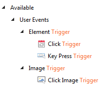

-   The ****`Click trigger`**** activity is used to trigger
    events when a user simply clicks on a UI element:

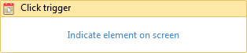

-   The ****`Key press trigger`**** activity is used when we
    need to trigger events by pressing a certain key or by selecting the
    image on the screen to trigger events:

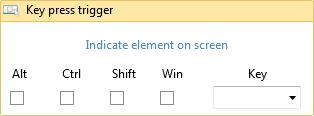

### An example of monitoring email

To make things clearer, we will monitor a send email
event through Gmail. The steps are listed as
follows:

1.  **Open the browser and browse to www.gmail.com**: To do
    this, drag and drop the **`Open browser`**activity. In the required
    field for the address, enter`www.gmail.com`:

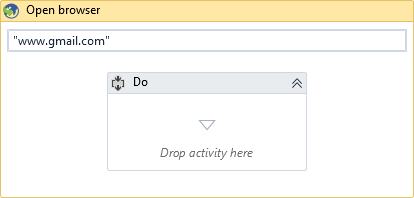

2.  **Getting username and password**: After typing in the
    address, we have to ask the user for a username and password. For
    this, we will use the ****`Input dialog`**** activity as
    shown in the following screenshot. We have dragged and dropped two
    ****`Input dialog`**** activities to ask the user for a
    username and password respectively. Until the user types in each
    dialog and presses okay, the Robot will not work:

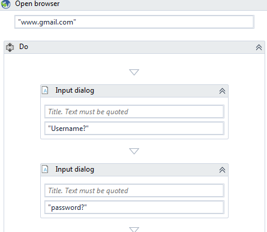

Once the user types in the **`username`** and **`password`**, we save
these details into two variables: `user` and `pass`.
You can convert their values into a variable by going to the
**`Input dialog`** property in the **`Properties`** panel. Just
right-click on the empty text box of the **`Resul`**t property and
choose **`Create``Variable`**. We have named it **`user `**as shown in
the following screenshot:

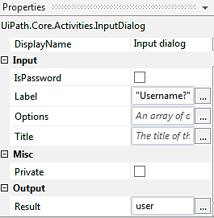

3.  **Entering a username and password**: We shall use the
    **`Type into`**activity to enter a username and password by
    indicating the respective fields for typing in the username and
    password.

Once the user enters the username and password, he needs to login which
he can either do by clicking on the login button or by pressing the
[*Enter*] key on the keyboard.  We will use the
**`Send hotkey`** activity to send the [*Enter*] key (as
shown in the following screenshot). By doing so, the login button is
clicked:

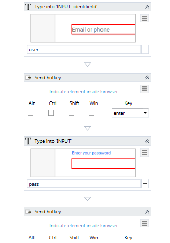

4.  **Trigger the send email event with a Hotkey trigger**:
    Our next step is to trigger the send mail event. Here, pressing the
    [*Enter*]key will be the trigger. On pressing it, the
    Robot performs the rest of the send email task. For this, we will
    use the Hotkey trigger activity. We first have to drag and drop
    the**`Monitor events`**activity as trigger activities only work
    under it:

Since we are using the **`Hotkey trigger`**, we have dropped the
**`Hotkey trigger`** activity in that area:

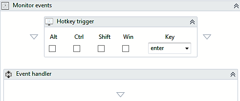

In the area for the **`Event handler`**, we need to give the sequence of
steps for sending the mail, which will involve several steps. For this,
we have created a workflow showing all the steps to be followed to send
an email. This ranges from clicking on Compose mail to clicking on the
Send button as explained in the following steps.

5.  **Ask the user for the email ID of the recipient, the subject of
    the email, and its body**: Our next step is to ask the
    user for details. We will use three Input dialogs, one for the email
    ID, one for the subject, and one for the content.

As shown in the screenshot, we have used an Input dialog to obtain the
recipient\'s email ID:

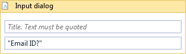

We now save the user input email ID inside a variable called
`name` (you can easily create a variable by pressing
[*Ctrl*] + [*K*] inside the **`Output`** box in
**`Properties`**):

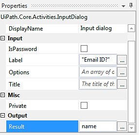

In the second **`Input dialog`**, we will ask the user to input the
subject for the email:

The output, that is, the response entered by the user, is saved as a new
variable called `Subject?` as shown in the following
screenshot:

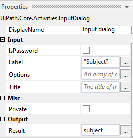

In the third input dialog, the user has to input the message/mail he or
she wants to send:

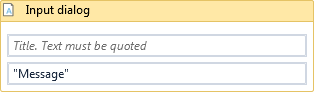

We shall store the user output as a variable called `message`:

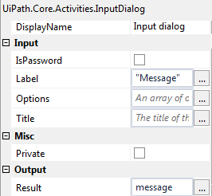

6.  **Type in the details**: Now that we have all the
    details that are required for sending the
    mail, our next step will be to type into the required fields for
    sending the email. We will use the **`T``ype Into`**activity for
    this step:

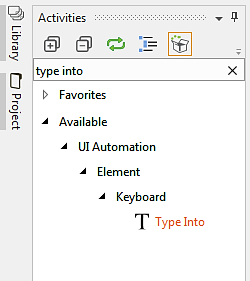

Drag and drop the **`Type into`** activity. Then, double-click on it and
indicate the area where you want to type the email ID. Since we have
saved the email ID as a variable, `name`, we enter this in the
field provided, as shown in the following screenshot:

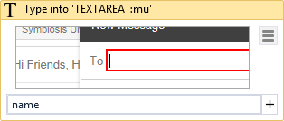

Our next requirement will be to indicate the area where we want to type
the subject of the mail. Since we have saved the subject as a
variable, `Subject`, we enter this in the field provided as
shown in the following screenshot:

Now you are required to indicate the area where you want to type the
message/mail as indicated in the screenshot. Since we have saved the
content of the mail to be sent as a variable, `message`, we
enter this in the field provided as shown in the following screenshot:

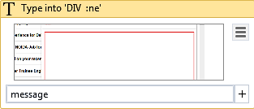

7.  **Click on Send and confirm if successfully sent**: Our
    final step is to click on the **`Send`**button so that the mail is
    sent and the process is completed. In order to click on
    the**`Send`**button, we will use the**`Click`**activity and indicate
    the**`Send`**button. Doing so enables the Robot to easily recognize
    where to click:

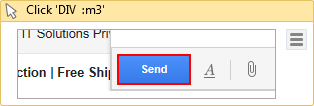

If you want, the Robot can also give a notification once the mail is
sent. For this notification we will use the
****`Message box`**** activity, which will display the
message, **`message is sent`**, as shown in the following screenshot.
When the message is displayed, and after the user has pressed **`OK`**,
the whole workflow will terminate since all
of the steps have been executed:

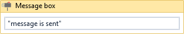

### Example of monitoring a copying event and blocking it

Let us take an example of monitoring a copying event and blocking it. In this example, we have an
Excel file from which we want the data to be
copied as soon as the user presses the [*Enter*] key:

1.  **Drag and drop the Monitor events activity and the drop trigger
    activity into it**: Drag and drop the
    ****`Monitor events`****activity. Double-click on it:

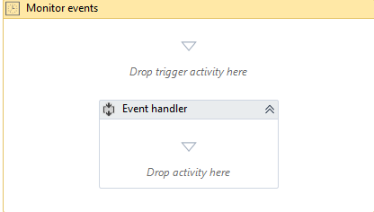

Drag and drop the **`Hotkey trigger`** activity and select the
[*Enter*] key from the drop-down list, as shown in the
screenshot:

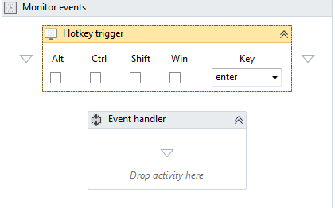

2.  **Drag and drop an Excel application scope inside the Event handler
    portion**: We are required to drop an activity under
    **`Event Handler`**. In our case, the activity is copying data from
    Excel and pasting it. When we drag and drop
    the****`Excel application scope`****activity inside
    the**`Event handler`**and double-click on it, we see that first we
    have to browse to the Excel file from which we want to copy the
    information:

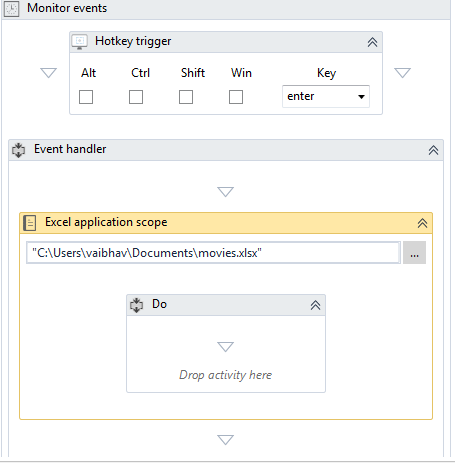

As shown in the screenshot, we have selected an Excel file whose name is
`movies`; now we want to copy this file\'s content.

3.  **Use the Read Range activity, extract the data and paste it into a
    new Excel file**: Now, inside the **`Do`**activity, drag
    and drop the****`Read Range`****activity to read all the
    data from this Excel file. We will keep
    this extracted data in a variable named`movies`, as shown
    in the screenshot:

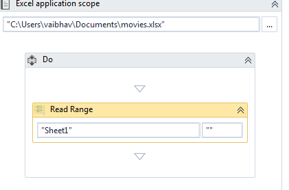

 

We have read the data from the Excel file. Next, we want to keep it in a
variable. For this, just click on the **`Read Range`** activity and go
to the **`Properties`** panel. Then create a variable by pressing
[*Ctrl*] + [*K*] and name it `movies`:

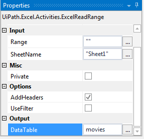

4.  **Append to another Excel file**: Now, since we have
    all the data saved, we can just drag and
    drop another Excel application scope. Then we will indicate the file
    that we want to append this data to. In the **`Do`**activity, just
    drag and drop the**`Append Range`**activity. Select the input as the
    variable we declared earlier, that is,`movies`as shown in
    the screenshot:

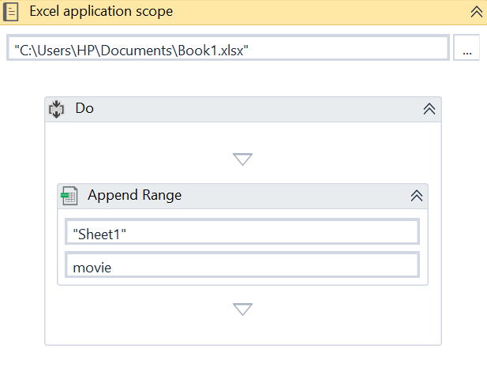

5.  **Block the triggered event**: Now, in order to block
    triggered events you can select the `EVENT_BLOCK`event as
    the event type from the properties of the trigger in
    the**`Properties`**panel as shown in the following screenshot:

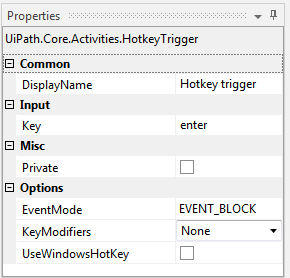

Launching an assistant bot on a keyboard event
----------------------------------------------------------------

Let us say we want our assistant bot to start automating only when we trigger an event. For example, the user wants
his Robot to open and start typing in the Notepad window when he presses
[*Alt *]+ [*W*]. This can be achieved using the
Hotkey trigger. Also, inside the Event handler, just create or record
the sequence of steps to be followed. The
detailed procedure has been explained in the following sections:

1.  **Drag and drop the Monitor events activity**: In this
    step, we will just drag and drop the
    ****`Monitor events`****activity into the workflow. When
    we double-click on it, it will look like this:

2.  **Drag the Hotkey trigger activity**: In the next step,
    we will use the **`Hotkey trigger`**activity for the user to start
    the automation process. Assign[*Alt*]+[*W*]to
    the hotkey so that, when the user presses this hotkey, the event
    will be executed:

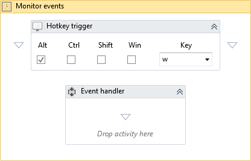

3.  **Open Notepad and type into it**: Our final step is to
    record the sequence of the steps to be performed. In this case, this
    is to open Notepad and then type into it. For that just use the help
    of the **`Desktop`**recorder. First, we double-click on the Notepad
    application in the window as shown in the screenshot. Select
    the**`ClickType`**as ****`CLICK_DOUBLE`****from
    the**`Properties`**panel:

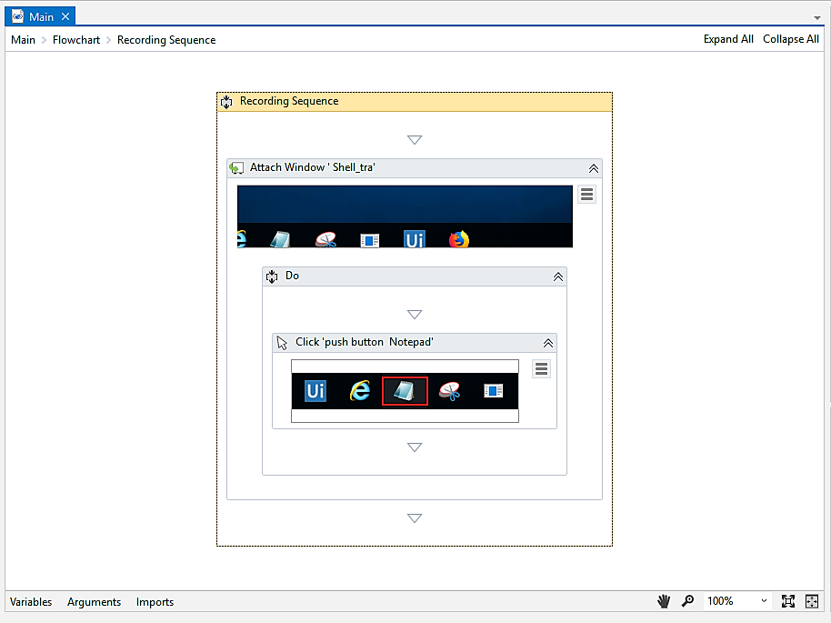

After that, we record the typing action and close the Notepad window.
Then click on **`Do not Save`** because you do not want to save your
file. The sequence is shown in the following
screenshot:

**Note:**

We have also indicated the anchor to recognize the correct button to be
clicked (in this case, the close window button\'s anchor is the maximize
button). This makes it easier for the Robot to find the UI element.

Now, on pressing [*Alt*] + [*W*] the
Robot will start executing the sequence.

Summary
-------------------------

In this lab, we learnt about the assistant bot\'s utility. We also
covered all the monitoring events that can be used to trigger actions
and also saw examples of them. Once your automation program is made,
there may still be problems that you are likely to face while executing
it. To handle such scenarios, we will learn about Exception Handling in
the following lab.

