Lab 8. Exception Handling, Debugging, and Logging
--------------------------------------------------------------

Sometimes, automation program may fail to execute. To deal with such
cases, we use exception handling activities. In this lab, we start
with the various types of exception handling method available in UiPath,
the exceptions that you may encounter, and how to deal with them. We
will also learn about logging. An important topic covered in this
lab is debugging to check whether workflows are working properly or
not and to rectify any errors.

Before we begin, let us look at the topics that will be covered in this
lab:

-   Exception handling
-   Common exceptions and ways to handle them
-   Logging and taking screenshots
-   Debugging techniques
-   Collecting crash dumps
-   Error reporting

Exception handling 
-------------------------------------

Exception handling is a way to handle exceptions for a process that the program or the procedure has failed
to execute.

For handling exceptions in a program, the best practice considered is to
use the **`Try catch`** activity.

The **`Try catch`** activity can be found in the Activities panel. By
dragging and dropping the **`Try catch`** activity into the workspace,
we can handle exceptions. For handling errors in the **`Try catch`**
block, we can divide the whole process into four parts just to make it
simpler:

-   Drag and drop the **`Try catch`** activity
-   Try block
-   Catch block
-   Finally block

Let\'s build a Try catch block to handle
exceptions, in following steps:

1.  Drag and drop the **`Try catch`** activity: Create a blank project.
    Drag and drop the **`Flowchart`**activity into the Designer panel.
    Search for the**`Try catch`**activity in the **`Activities`** panel
    and drag it into the **`Flowchart`**. Set it as the **`Start`**
    node:

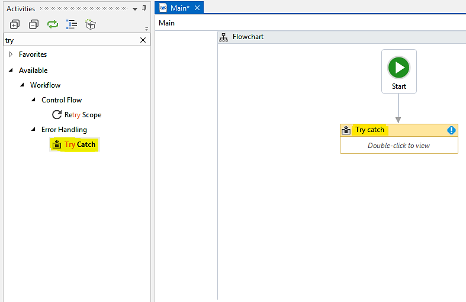

2.  **`Try`**: When we double-click on the
    ****`Try catch`** **activity, dragged and dropped inside
    the workspace, space for the**`Try`**activity appears, as shown in
    the following screenshot:

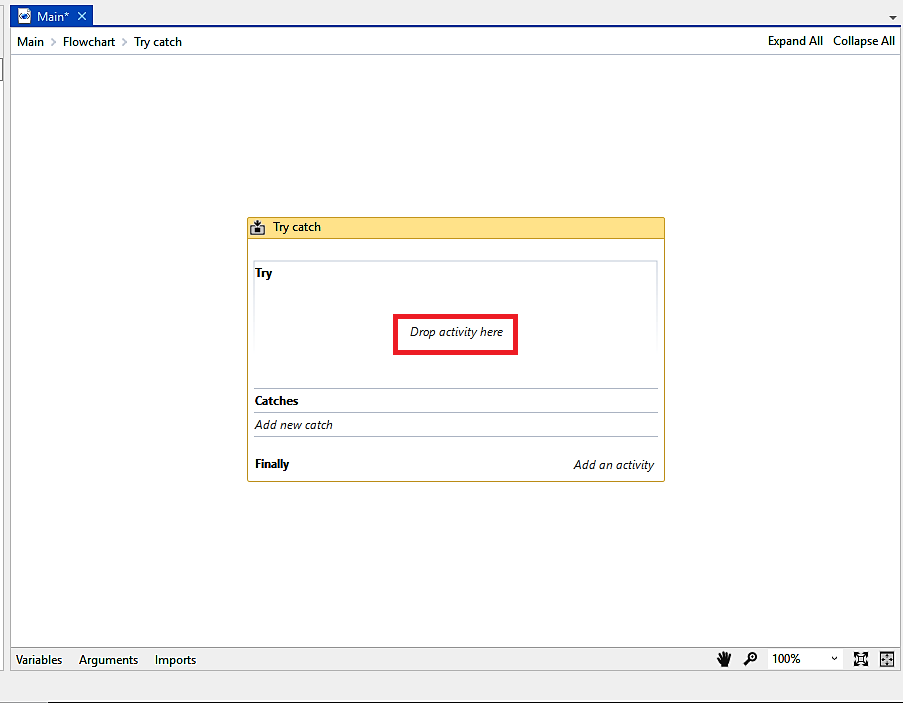

Inside the **`Try`** block, we have to drop the activity we want to
perform. Drop a **`Write line`** activity to test the working of
**`Try Catch`** block, as shown in the following screenshot:

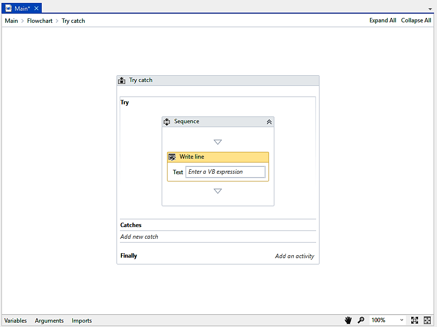

3.  **`Catches`**: Inside the **`Catches`**activity, first we have to
    click on **`Add new Catch`** and then click on **`Add Exception`**
    option, from which we have to select the type of exception. In most
    cases,**`System.Exception`** is preferred. The following screenshot
    shows the types of exception. There are many more
    exceptions which can be viewed by
    clicking on the**`Browse for Types`** option:

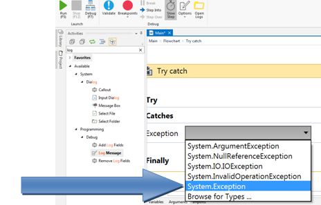

Exceptions that can be viewed when clicked on the **`Browse for Types`**
option 

Say the execution fails: for example, the **`Click`** activity is unable
to be executed because of the unavailability of a UI element. In such a
case, we can use the **`Catches`** block in order to either view the
error that has occurred or for an alternative method to be used if that
particular error occurs. As shown in the following screenshot, we will
drop the activity in the **`Catches`** block. To print a message, we use
a ****`Message box`****:

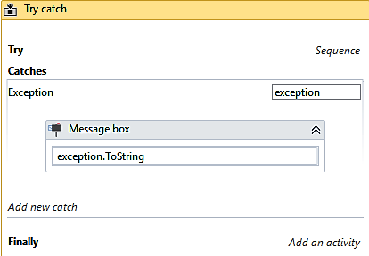

When we click on **`Add new catch`**, we are asked to select the type of
exception. We have selected **`System.Exception`**. Now inside the
exception block, we have dropped a ****`Message box`****
activity. Entering `exception.ToString` will display the error
that occurred during execution.

4.  **`Finally`**: When we have defined the exception for our sequence,
    the ****`Finally `****block will always work, regardless
    of whether the execution was successful or not. Suppose we want to
    display a message to the user notifying that the process is
    complete. To make sure that the whole**`Try catch`**activity is
    executed, we will just drop a**`Message box`**activity in the area
    provided in the**`Finally`**block, as shown in the following
    screenshot:

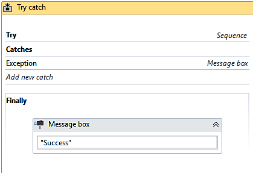

Common exceptions and ways to handle them
-----------------------------------------------------------

Implementing exception handling enables the
robot to work in every possible situation and
tackle any exception that may arise. There are some common exceptions
that we usually face while working on UiPath.

### Unavailability of UI element

When working on UiPath, especially on the web, we may
encounter this type of error. This is because
the UI element was not found due to the dynamic behavior of the web
page. To handle this exception, we have to make changes in the selector
attributes or we have to add new attributes to the selector so that the
UI element can be easily found. For example, if we have a variable which
is dynamically changing, we can use a wildcard so that it can be easily
found by the robot.  As shown in the following screenshot, we can edit
the dynamic attribute of the selector using wildcard characters (in our
case, \* ). Another way is to attach it to the live element:

                    

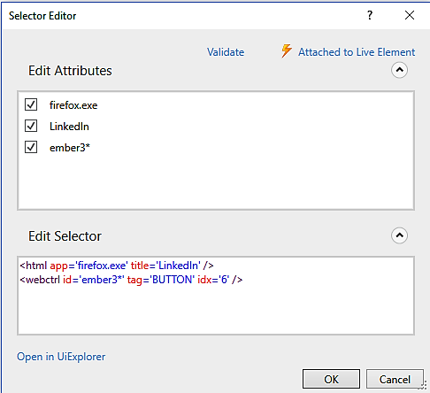

### Handling runtime exceptions 

We may encounter runtime errors while working in UiPath. To rectify
these errors, one of the best practices is to use the Try catch
activity, which can be used to handle exceptions at runtime. By keeping
an alternative inside the catch block, we can also overcome the error
which we encountered before.

So placing your sequence or workflow inside the Try catch activity will
help you handle runtime exceptions.

### Orbit reference not set to the instant of an object

This type of error usually occurs when the default value required for some variable is not provided. In that case, we
are required to give a default value to the required variable, as shown
in the following screenshot.

In the empty area indicated in the following screenshot, just type the
default value of the variable in order to overcome this error:

### Index was outside the bounds of an array. Index out of the range

This error occurs when we try to iterate
array elements by an index which is out of range. This happens when we
are not aware of the size of the array and we just randomly type the
index to access the element.

To resolve this, we must check the size of the indexes of the array or
the collective list.

### Image not found in the provided timeout

This type of exception is thrown because the image was not found. This
may be due to a change of environment, such
as resolution or theme settings. In this case, using some a selector
attribute or indicating an anchor will work well:

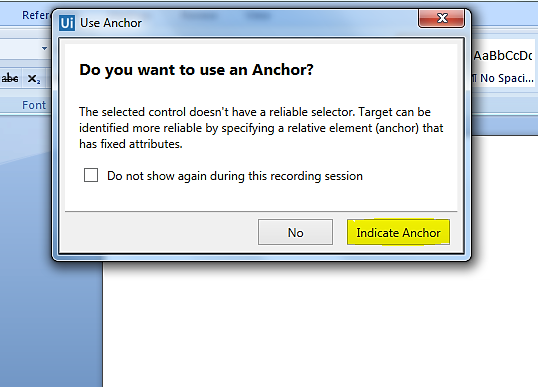

As shown in the preceding screenshot, when we cannot identify the image
properly, **`Indicate Anchor`** will help us indicate the UI element
nearby so that the recorder can identify the correct image.

### Click Generic error - cannot use UI CONTROL API on this UI node please use UI Hardware ELEMENTS method

This type of error occurs when the environment in which we are trying to use the Click activity does not support
Simulate or Send message activity (used by us to click the UI element).

Sometimes, either **`SimulateClick`** or the **`SendWindowMessages`**
may be checked. In both cases, when an exception is thrown we just have
to uncheck the appropriate box.

Logging and taking screenshots
------------------------------------------------

UiPath has a multi-process architecture that
offers to execute each workflow separately in
the executor. Executors are managed by UI robots. So, if any executor
stops working, then the entire process will not be affected.

### Client logging

Client logs basically enable a server to
record connections. These logs can be used by content providers in
various scenarios, such as to generate billing, to trace media server
usage, or to deliver suitable quality content depending on the speed of
the client\'s server.

For client logging in UiPath, we have an NLog configuration file which
makes it easy and flexible to integrate with databases, servers, or any
other NLog targets. Logging can be configured
with this `NLog.config` file. UiPath Studio, Robot, and
workflow execution generate log messages on the client side:

-   Messages which are produced by the workflow execution are logged
    with the execution logging source. Messages produced by UiPath
    Studio are logged as Studio Source and those produced by UiPath
    Robot are logged as Robot logging Source.
-   We can also access these logs from UiPath Studio. 

We can access the stored logs by clicking on**`Open Logs`** in the
**`EXECUTE`** option.

By default, these Logs are saved in
`%Local App %\Uipath\Logs`:

-   The automatic logging mechanism for all errors generated, including
    values of variables and arguments, may be enabled in
    the `UiRobot.exe` config file, which is present in
    `C:\Users\USername\AppData\Local\UiPath\app-17.1.6435`, by
    setting the Log parameter from `0` to `1` inside
    the `<Switches>` section.
-   We have two activities that can be used for logging and these are
    the Log message and **`WriteLine`** activities.

### Server logging

If you have configured the UiPath server,
then all logs generated by the execution are also sent to the server.

You can take a screenshot anytime by pressing
[*Ctrl*] + [*PrtScrn*].

Debugging techniques
--------------------------------------

There are various techniques provided by
UiPath Studio for debugging in order to check whether the workflow is
running successfully or to find out errors in order to rectify them. At
the top of the UiPath window, we can see various available methods of
debugging inside the **`EXECUTE`** block, as shown in the following
screenshot:

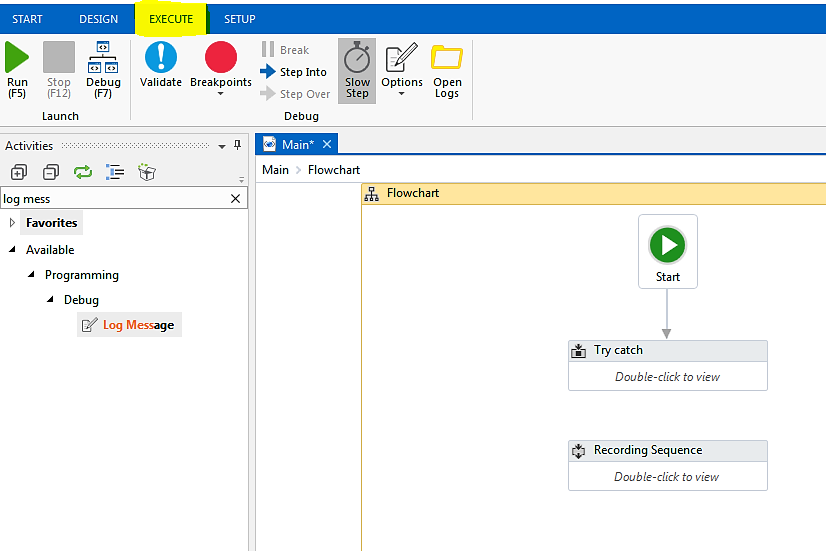

As shown in the preceding screenshot, there are various techniques for
debugging. They are:

-   Setting breakpoints
-   Slow step
-   Highlighting
-   Break

### Setting breakpoints

While debugging a workflow, we can set breakpoints in between if we want to run the program up to a specific
location. This is useful when we have to stop before an activity ends
completely. In such a case, we should use a breakpoint on the previous
activity, as shown in the following screenshot:

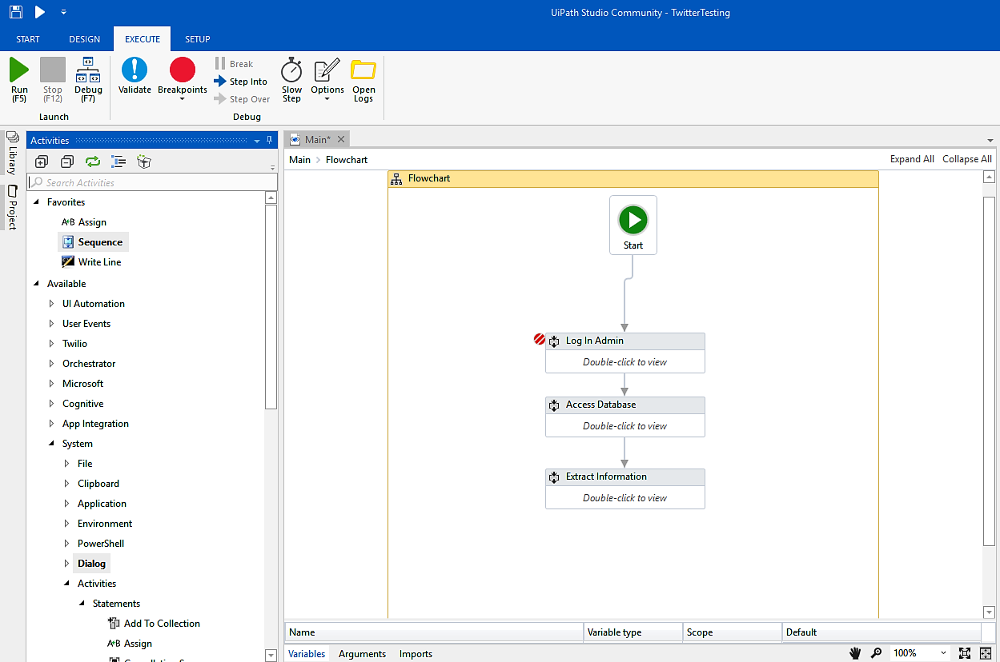

The highlighted region indicates the breakpoint since the execution
stops just after the breakpoint. In order to continue any further, we
have to click on the **`Continue`** button on the top corner indicated
by the arrow:

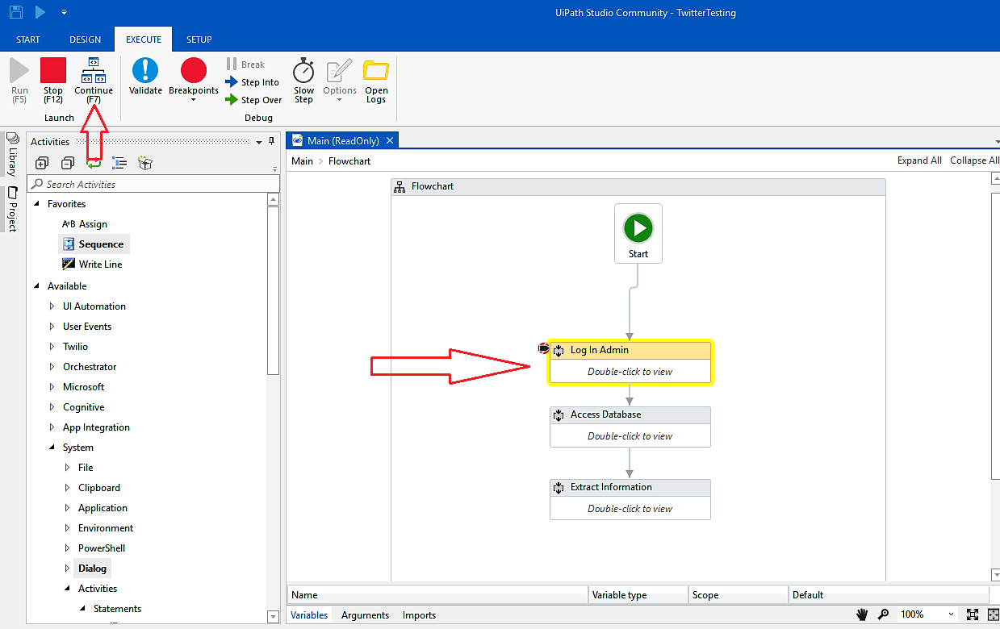

When we click on **`Step into`**, the relevant part will start to
execute; after we click on **`Step over`**, execution will jump to the
next part, and so on.

### Slow step

This is an activity in the **`EXECUTE`**block
through which we can reduce the execution speed of a particular process
or activity. This way, we can identify each and every process and keep
an eye on where to find the error. In the Output panel, all activities
or steps can be viewed.  The following screenshot shows how to use the
**`Slow step`** activity:

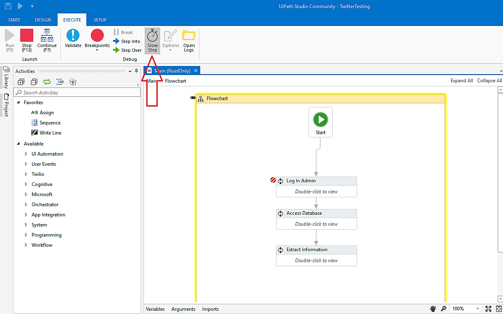

As indicated by the arrow in the preceding screenshot, when we click on
**`Slow step`** the execution time for this particular step increases.

### Highlighting

Highlighting is used to highlight the steps we have taken during
automation and to identify each and every
step in the workflow. It is very useful while debugging and its panel
can be found in the **`Options`** menu of the **`Execute`** section in
the Ribbon:

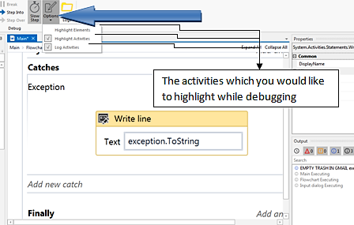

  Various activities for highlight.

### Break

The Break activity is used to break a process
at a certain point. Suppose we have a sequence performing seven
activities together and we want to break the execution at a certain
activity. For this, we can use the **`Break`** activity, as shown in the
following screenshot:

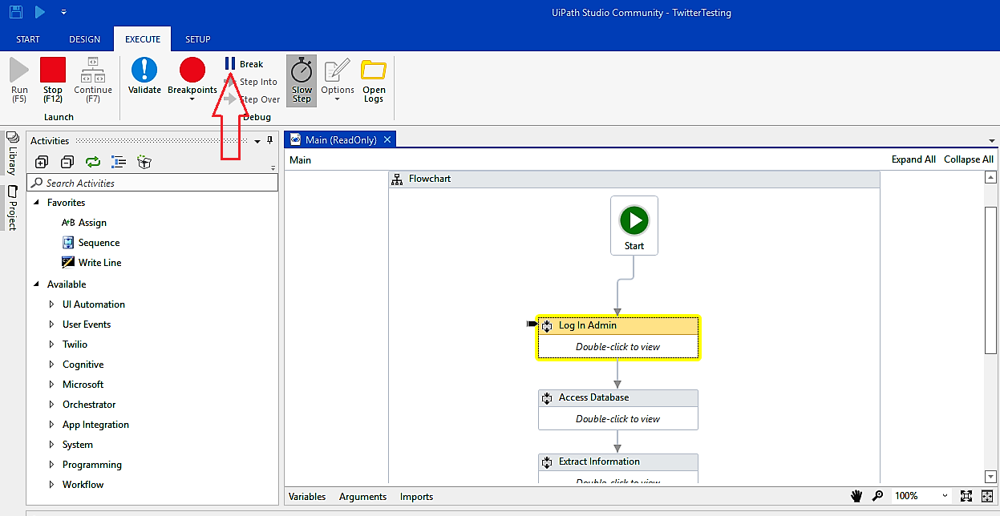

While debugging, an option for **`Break`** is available (indicated by
the arrow in the preceding screenshot). We can break at any point we
want to. If we want to continue any further, we just have to click on
**`Continue`**, as indicated by the arrow in the following screenshot:

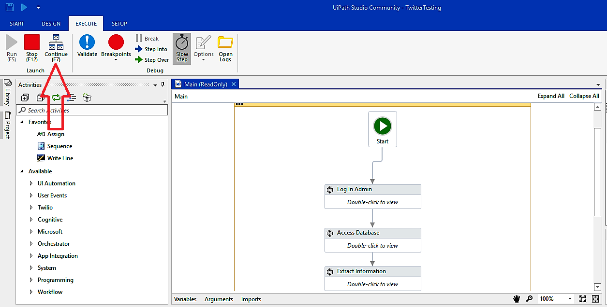

Or we can stop the execution at that point by clicking on the **`Stop`**
option.

Collecting crash dumps
----------------------------------------

Collecting crash dumps basically refers to collecting information when
your UiPath Studio crashes. We can enable and disable crash dumps. These
dumps provide us with information regarding the UiPath crash.

Memory dumps are of two types---**full dumps** and
**minidumps**. Full dumps provide
us with complete information about the encountered crash while minidumps
provide us with just the main information
regarding the crash.

When a crash is encountered, we first have to identify the
process which has crashed. Usually, a dialog
will appear on the screen indicating the nature of the crash and the
application involved. A UiPath process could crash, such as
`UiStudio.exe`, `Uiexplorer.exe`,
or `Uilauncher.exe`, or the target application you want to
automate may crash.

### Enabling crash dumps

The following are the steps to enable crash
dumps:

1.  To enable crash dumps, we first have to
    download the `EnableFullDump.erg` file for full dumps
    from <https://cdn2.hubspot.net/hubfs/416323/QuickAnswers/EnableFullDump.reg?t=1513326308120> or
    the `EnableMiniDump.erg` file from
    <https://cdn2.hubspot.net/hubfs/416323/QuickAnswers/EnableMinDump.reg?t=1513326308120>
2.  Double-click the file and click Yes. Administrator rights are needed
    to access the registry settings
3.  The dumps folder is `%TEMP%` whose complete path is like
    `C:\\users 2;username\AppData\Local\TEMP`
4.  When the application crashes, you will find the `.dmp`
    file in the `TEMP` folder. For example, if UiExplorer
    crashes then a file such as `UiExplorer.exe.7429.dmp` will
    be found in the `TEMP` folder

### Disabling crash dumps

To disable crash dumps, perform the following
steps:

1.  Download the `DisableDump.reg` file from
    <https://cdn2.hubspot.net/hubfs/416323/QuickAnswers/DisableDump.reg?t=1513326308120>.
2.  Double-click the file and click Yes to disable crash dumps,
    Administration rights are needed for this action.

Error reporting
---------------------------------

A user may encounter an error in UiPath and
want to report it. As mentioned before, there are two types of customer
for UiPath:

-   Enterprise Edition customers
-   Community Edition customers

### Enterprise Edition customers

If you are an Enterprise customer, then you can report the error to the UiPath community in a very simple
way:

1.  Just go to this
    link: [https://www.UiPath.com/contact-technical-and-activations](https://www.uipath.com/contact-technical-and-activations).
2.  You will be re-directed to a page where you have to fill out a
    simple form containing some basic details and then upload the file
    in which the error is encountered, as shown in the following
    screenshot.
3.  After uploading, just click on the **`Submit`** button. UiPath will
    respond to you with the proper solution:

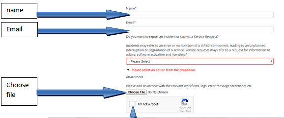

Details that need to be filled while uploading the encountered error
file

### Community Edition users

Since the Community Edition is free, UiPath does not provide support to
Community Edition users. However, all solutions to errors encountered
can be found by going to the UiPath forum. All types of errors and their
solutions are properly discussed in the forum. You can also go to the resources page and find the solution to your problem.

For this,
visit [https://forum.UiPath.com/](https://forum.uipath.com/){.ulink}:

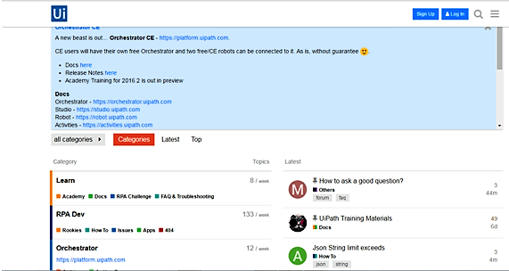

Resource page

Summary
-------------------------

In this lab, you have learned how to use exception handling
techniques and log error screenshots, and other useful information to be
used for debugging or reporting. You have also learned how to debug
code.

You have learned how to make an automation project, as well as how to
use exception handling. Your learning, however, does not end here. In
the next lab, we will refine your learning by teaching you best
practices for managing and maintaining your code.

