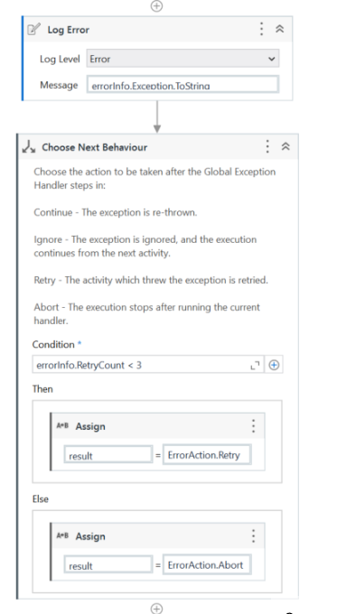

Lab 8: Exception Handling in UiPath
-----------------------------------

##### Exception handling in Uipath

Exception Handling mainly deals with handling errors with respect to
various activities in UiPath. The Error Handling activity offers four
options:

-   **Rethrow :** Rethrowing an exception If a **catch block** cannot
    handle the particular exception it has caught, you can rethrow the
    exception. The rethrow expression ( throw without
    assignment\_expression) causes the originally thrown object to be
    rethrown.
-   **Terminate workflow :** Terminate workflow is used to terminate the
    workflow the moment the task encounters an exception.
-   **Throw activity :** Throw activity is used when you want to throw
    an exception.
-   **Try Catch activity :** Try Catch activity is used when you want to
    test something and handle the exception accordingly. So, whatever
    you want to test you can put it under the try section, and then if
    any exception occurs, then it can be handled using the catch
    section.
    Apart from the try-catch, we also have a **Finally section** that
    performs the activities irrespective of whether an exception occurs
    or not.

Exception Handling in UiPath
----------------------------

Create a new process called**Exception\_Handling\_Example**\

Once the **Exception\_Handling\_Example** process opened in the UiPath
Studio, add **Open Browser activity** inside the sequence and then enter
the google URL([www.google.com](https://www.google.com/ "www")) as shown
below.

\

Next, add **Type Into activity** inside the **DO Container** of the
sequence and then click on**Indicate element inside browser** and
indicate the google search box on the browser(Make sure that the browser
has opened). Next, enter the text you want to search on the Google
search box.

\

Click on the three horizontal lines on the **Type into activity** and
select **Edit Selector.**

Paste the following snippet in the **Edit Selector Wizard** and then click on the **ok button**. 

`<webctrl tableCol='2' tableRow='1' type='password' name='invalid' />`

By creating an error scenario, we will understand how the exception
happens and then how to handle this exception. Save and run the
sequence, You will get an **Exception.**

These are very realistic scenarios in our production, we have to handle
this kind of run-time exceptions happened in our production. These
exceptions can be handled with the help of **Try Catch Block.**

Add **Try Catch activity** inside the sequence and move the **Type Into activity** inside the **Try block**. And then select the exception type
which you are facing. If the exception type which you are facing is not
present in the list then click on the **Browser for Types...** and
search for it.
\

I am clicking on **Browser for Types...** and search for
**InvalidUiElementException**and then **click on ok**

-   Add **Log Message activity** inside the **Exception block**
-   Set **Log Level to Error**
-   And then enter the Message as **Not Found Element** as shown below.
    

So, the error message will be displayed on the output screen when you
run the sequence.

So, whenever an error occurs in the **Try block** it will jump to the
**catch block** and instead of stopping the execution It will display a
Not Found Element message on the **Output pane.**

The **Finally block** is the place where you want to execute something
even if the error occurs or even if the error does not occur. Now, add
**Close tab activity** inside the **Finally block meaning** that if the
error occurs or not occurs the tab will be closed.

