Lab 9. Managing and Maintaining the Code
-----------------------------------------------------

Just creating an automation project is not enough. It is important to
have your project organized in a proper way---whether it is deciding
which layout to use, or naming your steps properly. A project can also
be reused in a new one, making it very convenient for the user. This
lab explains ways in which we can reuse projects. We will also learn
about configuration techniques and see an example. Finally, we will
learn how to integrate the TFS server.

Listed are the topics that will be covered in this lab:

-   Project organization
-   Nesting workflows
-   Reusability of workflows
-   Commenting techniques
-   Sate Machine
-   When to use Flowchart, State Machine, or Sequence
-   Using config files and examples of config files
-   Integrating the TFS server

Project organization
--------------------------------------

While working on any automation project, it
is very important to work with a proper set of rules so that the project
can be organized in an efficient way. In UiPath, the following are some
of the best practices considered while working on a project:

-    Pick an appropriate layout for each workflow
-    Break the whole process into smaller parts
-    Use exception handling
-    Make your workflow readable
-    Keep it clean

We will now elaborate on each of the best practices.

### Picking an appropriate layout for each workflow

There are various layouts available while
creating a new project. Among those layouts, we have to choose the best
option on the basis of the type of automation process we are
undertaking. All the layouts are shown in the following screenshot:

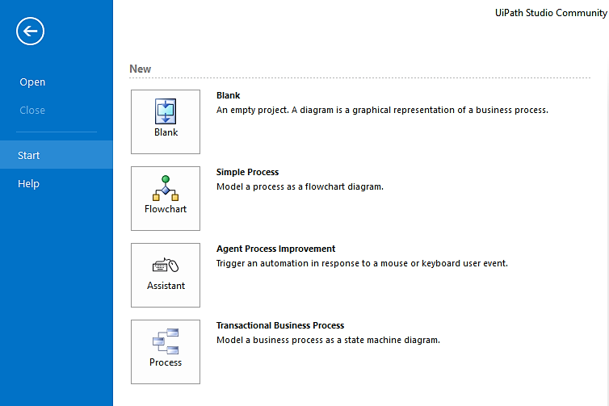

#### Blank

A Blank project is simply a blank page on
which you can create the type of layout you want. That is, you can
simply start with a Sequence activity if your workflow is in a single
order/sequence or you can use a Flowchart activity if you have a bigger
or more complex workflow to be designed. It depends on the needs of the
user or the type of automation to be undertaken. The following
screenshot shows a Blank project:

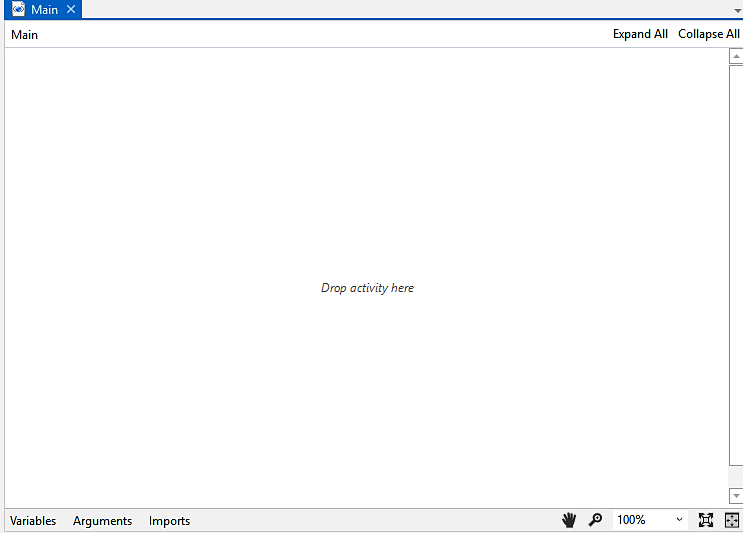

#### Simple process

The simple process is a layout that is used
to model a process as a flowchart diagram in which there is space for
user input. Inside this, we can use a sequence that processes the
required input in a further transaction process. If there is no new
input for the transaction, it will end the process; inside the
transaction process, we have to make a workflow that can be used to
automate it. This is by default a generated process that can be deleted
or changed if required. An example of a simple process has been shown in
the following screenshot:

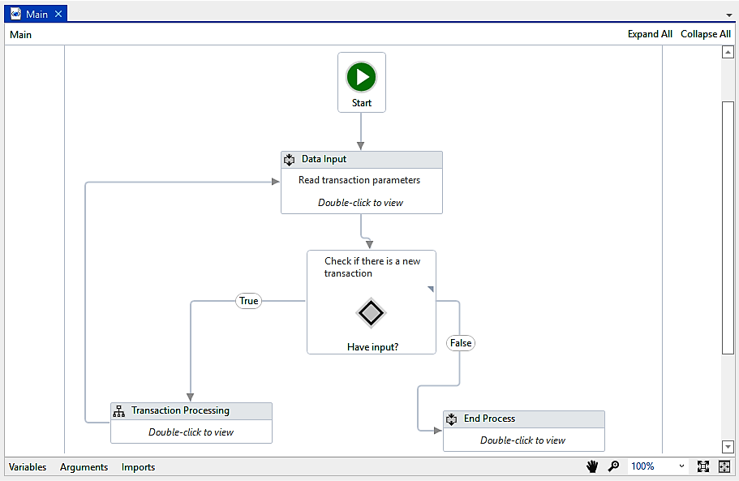

#### Agent process improvement

This triggers the automation in response to a
mouse or keyboard user event. It is basically used when the user is
automating processes that involve typing or clicking actions. A simple
layout that appears in this process is shown in the following
screenshot:

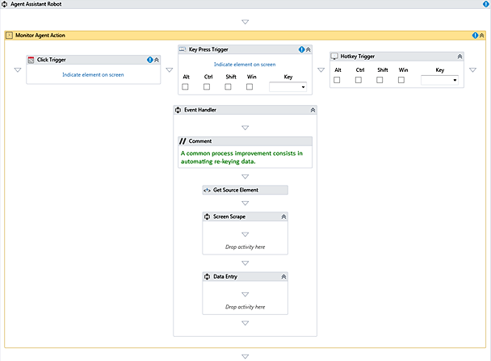

#### Transactional business process

We will use this layout if we want to model a
business process as a State Machine diagram. It is basically a demo of
how transactional business process automation works. If we want to build
a better Robot to automate such processes, it is better to use this
layout.

This layout is categorized into different states:

-   **`Init`**: In **`Init`** state, we have to configure our settings,
    credentials (if any), and initialize all the variables that are
    going to be used in this transaction. All configuration files of the
    applications (being used in this transaction), are read and taken
    into account by the robot. The **`Init`** state also invokes all the
    applications that are used in the transaction.
-   **`Get Transaction Data`**: In this state, all the transaction data
    is fetched from the **`Init`** state. If there is no transaction
    data, then it transfers the control to **`End Process`** state.
-   **`Process Transaction`**: In this State, all the transaction data
    is processed.
-   **`End Process`**: This state ensures that all the processes are
    completed and there is no transaction data available. It also closes
    all the applications that are used in the transaction:

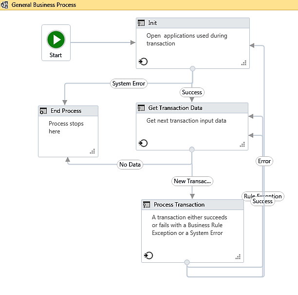

### Breaking the process into smaller parts

To build any project, we have to use various
activities. But using too many activities makes the project clumsy and
it is not readable. We have to design our project in such a way that
each independent part resides alone. We can achieve this by using
workflows. We should put each independent part of the project inside a
single workflow. We can invoke all the workflows inside the project at
the appropriate position.Dividing the project into workflows makes the
project cleaner and more maintainable. Now, if any developer wants to
debug your code, they can check the different workflows and easily
pinpoint in which workflow a particular error occurred. If the project
is not divided into workflows, it will be a nightmare for the developer
to fix any error.

Thus, breaking an automation into smaller parts enables easy debugging,
as well as the workflows across projects:

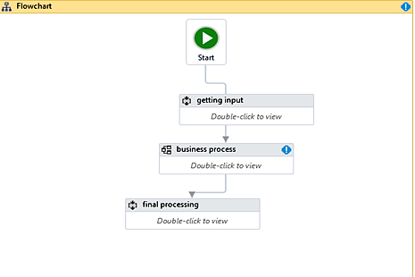

Flowchart of breakdown of automation and reusing workflows across
projects

### Using exception handling

While working on a project, it is better to
use exception handling because it reduces the risk of errors. For
instance, using the ****`Try catch`**** block can give you a
proper error message, which helps us handle exceptions. There are
various exception handling techniques that have been explained earlier
and that are very useful while working on a project. An example
featuring using the ****`Try catch`**** activity to handle
exceptions has been shown in the figure. Here, we have used the
****`Write line`**** activity to display messages in the case
of any error detected by the **`Catch`** block or the **`Finally`**
block (as highlighted in the screenshot):

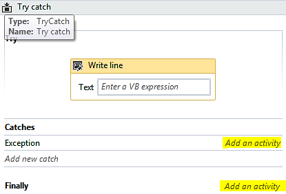

### Making your workflow readable

It is good practice to name activities on the
basis of the operations they perform to ensure that when we return to
the workflow, we can easily identify each and every step used in it.
This becomes very helpful while finding and resolving errors as it
specifies the process when showing an error during debugging. If
activities are properly named, we get to know exactly which part of the
workflow is not working. For example, we will create a workflow that
will ask the user to guess a number, on the basis of which we will
perform an addition and finally display the answer. The following
screenshot shows the proper naming of the steps involved in the process:

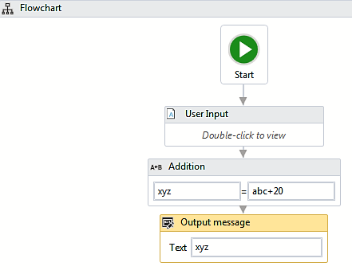

### Keeping it clean

Just as writing in a clean and understandable manner is the quality of a
good coder, the same holds true for an RPA developer. Clean code helps
us understand the whole process very easily---you and whoever is reading
it.

Nesting workflows
-----------------------------------

While working in UiPath, it is better to
divide the whole process into smaller parts and then nest these
workflows into a larger one or the **`Main`** workflow. This can be done
using the **`Invoke workflow file`** activity given in the
**`Activities`** panel. There are several steps involved in nesting a
workflow or many workflows into a single workflow.

### How to nest a workflow inside a single workflow

Say we have two workflows. In this example,
we will invoke one workflow into the other:

1.  Add an ****`Invoke workflow file`**** activity to the
    first workflow:

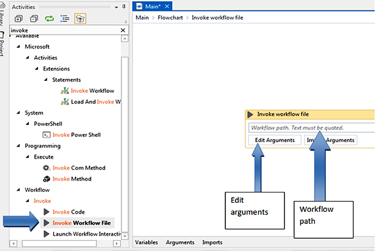

Screenshot of Invoke workflow file

2.  Click on the **`Edit Arguments`** option available.
3.  Define an argument and type it in the Invoke workflow arguments that
    appear:

Invoke workflow arguments

4.  In the **`Arguments`** panel in the second workflow, create an argument with the same name as the first workflow. You will now be
    able to use that argument as any other variable.

Reusability of workflows
------------------------------------------

Reusing workflows makes the automation process easier and better since
we can use earlier created workflows in our project that we are trying
to use for automation. There are two methods for this:

-   Invoke workflow file
-   Templates

**`Invoke workflow file`** is a good process if we have a complex
automation project. We can divide it into smaller parts. By using the
**`Invoke workflow file`** activity, we can invoke all those files in
our project and collect all these smaller parts in a single workflow.
However, if we want to invoke a previously created workflow in our
project and make changes to the latter, the former will also get
affected. Hence, it is recommended to use the **`Invoke workflow file`**
activity only when we have a complex workflow:

image to be added here

As shown in the preceding screenshot, the **`Invoke workflow file`**
activity requires the path to its associated XAML file.

### Invoke workflow file

**`Invoke workflow file`** is a good process
if we have a complex automation project. We can divide it into smaller
parts and then, by using the **`Invoke workflow``file`** activity, we
can collect all these smaller parts in a single workflow file. However,
if we want to invoke previously created workflows in our new workflow
and make changes to the new workflow, the previous workflow will also
get affected. Hence, it is recommended to use the
****`Invoke workflow file`**** activity only when we have a
complex workflow and we want to divide the process into smaller parts
and then use them together. There is another property for that, what we
need here; it\'s as follows:

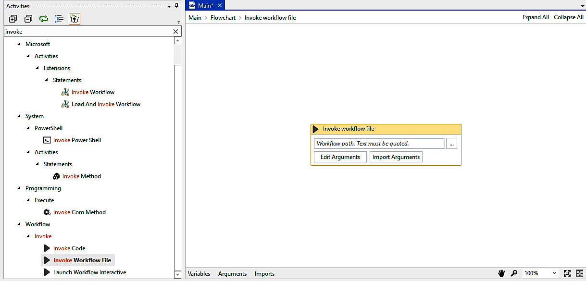

As shown in the preceding screenshot, the
****`Invoke workflow`**** activity requires a variable
expression. We can create a variable and set a timeout that is required
for the ****`Invoke workflow file`**** activity.

### Templates

Saving the workflow as a template helps you
preserve the original workflow file. So whatever modifications you made
in the template, no changes will be made in the original workflow. We
often use templates when creating small pieces of common automation that
are reusable and applicable in multiple workflows. So you can use
templates if the workflow does not change over time. The most common
example is when you create your own reusable snippets using data, data
tables, and `.xml` files.

#### Adding a workflow as a template

Follow the steps given to add a workflow as a
template, which is explained as follows:

1.  Add a new folder in the **`Library`**:

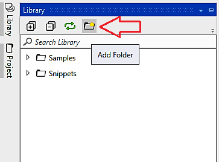

2.  After clicking on the **`Add Folder`** icon you can browse for your
    file containing the workflows. Just select folder from the list that
    contains all the workflows. Now the folder can be used anytime in
    any workflow from the **`Library`** panel.

3.  We can also remove an added file by just right-clicking on it and
    then selecting the **`Remove`** option, as shown in the following
    screenshot:

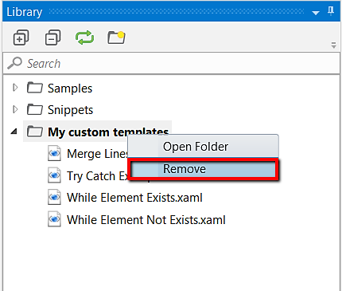

Commenting techniques
---------------------------------------

Using comments in workflows is considered a
good practice as it can give a better step-by-step notification of what
is done in the workflow. Therefore, commenting in a complex workflow is
considered to be good while debugging:

-   The package you\'ll need to use comments inside a workflow needs to
    be installed from the Package Manager functionality that is
    available in the **`Activities`** panel (the **`Manage Packages`**
    icon). You can install **`UiPath.Core.Activities`** from the
    packages; inside you will find the **`Comment`** activity in the
    **`Activities`** panel as indicated by the arrow (in this case, it
    is installed):

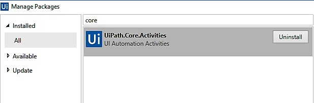

-   Once the package is installed, just drag and drop the **`Comment`**
    activity from the **`Activities`** panel and add comments in between
    the workflows wherever you want:

State Machine
-------------------------------

A State Machine uses a finite number of sets in its execution. It can go
into a state when it is triggered by an activity; it exits that state
when another activity is triggered. Another important aspect of State
Machines is transactions. They enable you to add conditions based on
which transactions jump from one state to another. These are represented
by arrows or branches between states.

There are two activities specific to State Machines. They are
**`State`** and **`Final State`**, and they are shown in the following
screenshot:

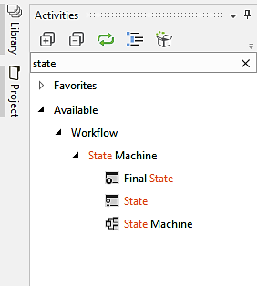

The **`State`** activity consists of three
sections---**`Entry`**, **`Exit`**, and **`Transitions`**, while
the **`FinalState`** only contains **`Entry`**. We can expand these
activities by double-clicking them to view more information and to edit
them:

-   **`FinalState`** activity: This activity contains all those
    activities that need to be processed when the state is entered:

**``**

**``**

-   **`State`** activity: Transitions contain three
    sections---**`Trigger`**, **`Condition`**, and **`Action`**, which
    enable you to add a trigger for the next state or a condition under
    which an activity is to be executed:

When to use Flowcharts, State Machines, or Sequences
----------------------------------------------------------------------

A Sequence is used only when
we have a selected a straightforward
set of instructions on how to create a
workflow. That is, we do not have to make decisions. It is preferred
when we are recording some steps in a sequential manner and we are
creating a simple workflow. One such sequence is shown in the following
screenshot:

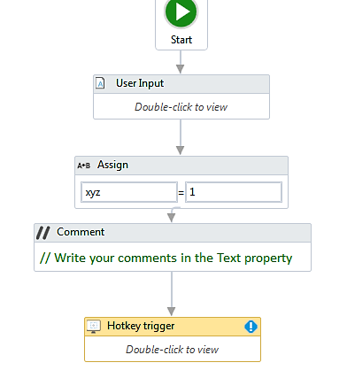

Now, when it comes to State Machines and Flowcharts, both are used for
complex processes and both work well. They work in the same manner, but
State Machines have some advantages over Flowcharts, which are listed as
follows:

-   Complex transitions are much clearer with State Machines as they
    have an inbuilt layout of the workflow.
-   Flowcharts do not inherently
    have the concept of waiting
    for something to happen. State Machines
    do (a transition will not occur until a trigger completes and the
    condition evaluates to true).
-   State Machines naturally encapsulate the action group:

Using config files and examples of a config file
------------------------------------------------------------------

When it comes to configuration, UiPath does
not have any pre-built configuration file
such as Visual Studio, but we can create one. It is considered to be one
of the best practices to keep environment settings in a config file so
that they can be easily changed by the user when required. Thus, when we
create a project, the `project.json` file that holds all the
activities is created automatically. `Project.json` can be
found in the folder where the project is saved. To access the folder, we
can just open the **`Project`**, then copy the path (as shown in the
following screenshot), and paste it into File Explorer:

Then you can see a `project.json` file in File Explorer like
the one shown in the following screenshot:

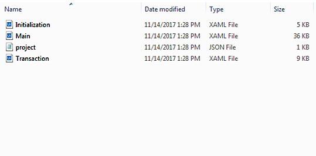

The following screenshot displays the code inside the
`project.json` file, when you open that file in Notepad:

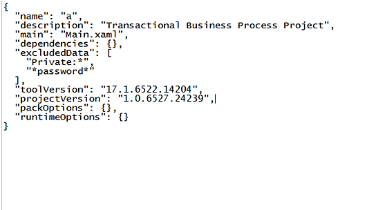

You can also store your settings with the help of a spreadsheet or
credentials. There are various parameters
contained in the `project.json`
file. They are:

-   ****`Name`**:** This is the title of the project that is
    provided when creating a project in the create New Project window:

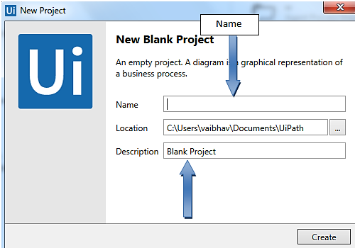

-   ****`Description`****: When creating a project, a
    description is also required. You can add the description in the
    Create New Project window, as shown in the preceding screenshot.
-   ****`Main`****: This is the entry point for the project.
    It is saved as `main.xml` by default, but you can change
    its name from the **`Project`** panel. Also, you have multiple
    workflows for a project, it is necessary to attach all these files
    to the main file with the **`Invoke Workflow File`** activity.
    Otherwise, those files will not be executed:

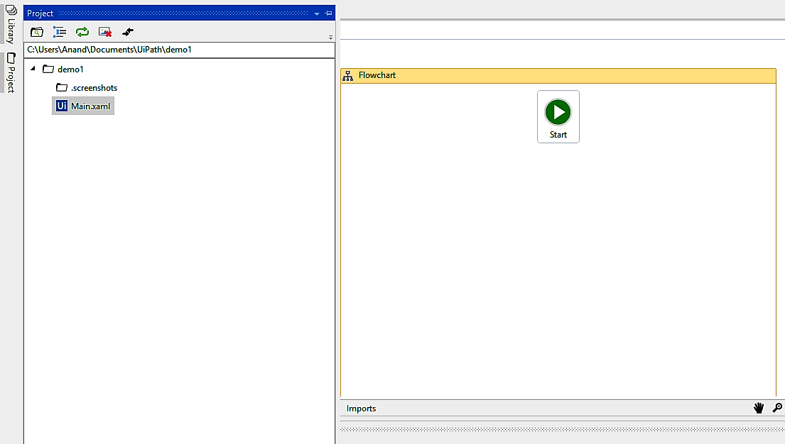

-   **Dependencies**: These are the activities packages that
    are used in a project and their versions.
-   **Excluded data**: Contains keyword that can be added to
    the name of an activity to prevent the variable and argument values
    from being logged at the verbose level.
-   **Tool version**: The version
    of Studio used to create a project.
-   **`Adding Credential`**:** **We can add particular
    settings that can be used further. For example, we can save the
    username and password to be used further, so this can be done with
    the help of the **`Add credential`** activity that can be found in
    the **`Activities`** panel, as shown in the following screenshot:

[]

**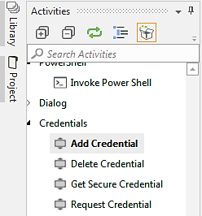**

After adding credentials, type the required values in the
**`Properties`** panel, as shown in the following screenshot:

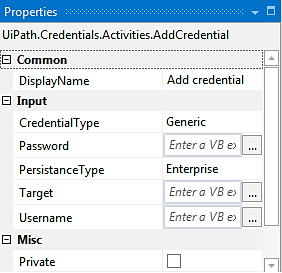

So, when the credentials are set, we can delete, secure, or request
credentials, as shown in the following steps:

1.  **`Delete Credentials`**: If we want to delete a credential then we
    can just drag and drop the
    **`Delete Credentials`**** **activity and then define the
    target for the credential:

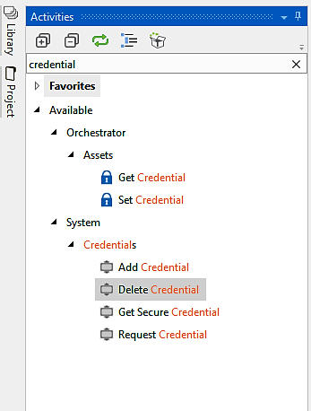

2.  **`Get Secure Credential`**: This is used to get the values, that is, the username and
    password, that were set during the
    addition of a credential. We have to set the target the same as
    before; the output will be the username and password:

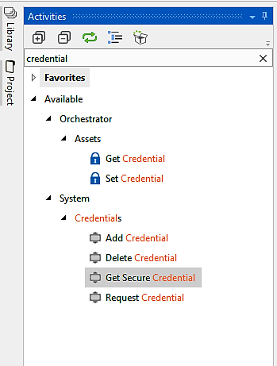

3.  **`Request Credential`**: This is a property in which the robot
    displays a message dialog asking the user for username and password and
    stores this information as a string. This can then be used in
    further processes. The user can select OK to provide credentials or
    even cancel it if they do not want to provide credentials.

Integrating a TFS server
------------------------------------------

UiPath integrates a series of actions that
allow us to have better collaboration on the project. Inside the
**`Project`** panel, by right-clicking on the file we can see a list of
properties that are included in it:

-   By clicking on the **`Get Latest Version`** option, we can get the
    latest version of the selected file from the TFS server
-   You can also rename or delete an existing file
-   To edit a Read Only workflow, you can select; **`Check Out`** for
    edit
-    To check in changes, select ****`Check In`**** from the
    menu

Summary
-------------------------

This lab covered the organization of projects, modularity
techniques, workflow nesting, and using the TFS server to maintain a
version of source code. In the final lab, you will gain insight into
how you deploy and manage your bots using the Orchestrator.
