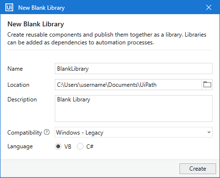

Lab 9: Creating a Basic Library
===============================

The following lab walks you through the steps of creating a
**library** in
Studio, publishing and using it in other automation projects.

Creating a library is similar to **Creating a Basic Process**.
The difference is packages are for creating reusable components to be
used in the context of other projects.

This lab gets data from an Excel spreadsheet and appends it to
another Excel file. Next, it walks you through the steps for packaging
and publishing the project to a custom feed, installing the package to
another project, and using the activity it contains.

Let’s begin.

#### Lab Solutions
Lab solution(s) are present in `Solution\Lab09` folder.

**Creating a Library**

1.  Launch Studio. In the HOME Backstage view, click **Library** to
    create a new library project. The **New Blank Library** window is
    displayed.

2.  In the New Blank Library window:
    -   Enter a name for the new project and a description that
        summaries what you are aiming to do with this automation. For
        this example, you can use the name **QuickLibrary**.\
         **Note**: The project name cannot exceed 128 characters, and
        the description cannot exceed 500 characters.
    -   Select the location where to create the project.
    -   Select **Windows - Legacy** for the **Compatibility** option and
        **VB** for **Language**.

3.  Click **Create**. The new library is opened in Studio.

 
**Note:** Copy following excel files in the folder where you project is created. These files are present in are present in `Solution\Lab09` folder.

**ProTip** You can open excel files here if you like to view them: `https://products.aspose.app/cells/viewer`

**Adding Excel Activities**

1.  In the **Activities** panel, search for the **Read Range** activity
    under System \> File \> Workbook, and drop it to the **Designer**
    panel.
    -   In the **Workbook path** field, add the path to the Excel file
        from which you want to get the data.
    -   In the **Sheet Name** field, add the name of the spreadsheet.
        For this example, the name remains the default Sheet1.
    -   In the **Range** field, add the range of cells to be read. For
        this example, leave the field empty so that all cells are read.

2.  In the **Properties** panel of the **Read Range** activity, click
    the field next to **DataTable**, then use the **Ctrl + K** keyboard
    shortcut to open the variable field, and add the name
    GetRange. The type
    DataTable variable stores data from the read cells.

3.  In the **Activities** panel, search for the **Append Range**
    activity under System \> File \> Workbook. Add it below the Read
    Range activity.
    -   In the **Workbook path**, add the path to the file where you
        want to append the copied data.
    -   In the **Sheet name**, add the name of the sheet. For this
        example, leave the default Sheet.
    -   In the **Data table** field, add the previously created variable
    
        GetRange which stores the information. Your project should look
        like in the image below.

4.  In the ribbon, click **Run File** or use **Ctrl + F6** to execute
    the workflow. The data gathered from the first Excel spreadsheet is
    appended to another. It does not replace data that already exists in
    the second spreadsheet.

 

**Packaging a Library**

To add this library as a reusable component to other automation
projects, you need to package it as a
.nupkg file by **publishing the project**.

1.  Open the library project in Studio.
2.  From the ribbon, click the **Publish** button. The **Publish Library** window opens.
    -   In the **Package properties** tab, enter a package name. In the
        **Release Notes** field, add a few details about the library.
        This is useful for tracking the changes made to the library in
        each new published version.
    -   In the **Publish options** tab, select **Publish to** \>
        **Custom**, and then, in the **Custom URL** field, add the path
        to a local folder. For example, you can create a
        myfeed folder on your Desktop.
3.  Click **Publish**. The package is now available in the local folder
    as a .nupkg file.

 

**Installing Reusable Components**

To use the package in another project, you first need to add it as a
project dependency. To get started, create a new **Process** in Studio,
as done in the **Creating a Basic Process** lab.

**Adding a Custom Feed**

1.  In the Studio ribbon, click **Manage Packages \> Settings**. The
    default and user-defined feeds are displayed.
2.  In the **User defined packages sources** container, add a name for
    your feed in the **Name** field. In the **Source** field, add the
    path to the folder where you published your library to.
3.  Click **Add**. Your new feed is added to the section.

You need to follow the above steps whenever you want to add or remove a
user-defined feed in Studio.

**Publish Output**

**Installing the Package**

1.  In the **Manage Packages** window, go to the previously added feed
    under the **All Packages** tab on the left. The list of packages
    available on the feed is displayed.
2.  Search for the package and select it. In our example, the package
    name is **QuickLibrary**.
3.  Click **Install**, then **Save**. The package is now installed in
    your project, and visible in the **Project** panel, under
    **Dependencies**.

**Adding Activities from the Library**

1.  In the **Activities** panel, search for the name of the package, in
    our case
    Quick Library.
2.  Drop the activity in the **Designer** panel.
3.  In the Studio ribbon, click **Run File** or use **Ctrl + F6** to
    execute the activity.

The advantage of reusable components is that they reduce repetition. You create them once and reuse them in other projects.

**Task**
- Add "Message Box" Activity in the Sequence and republish with new version `1.0.2`

- Update package version in the blank project and run it again.

